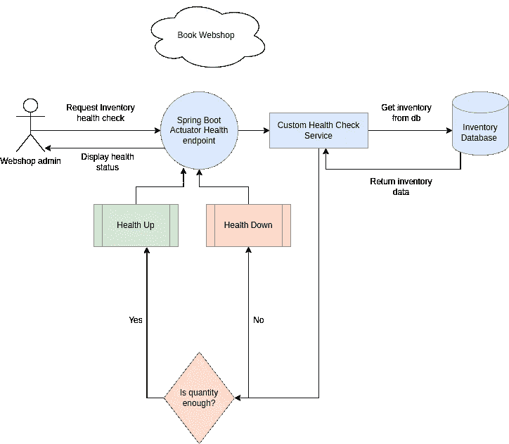
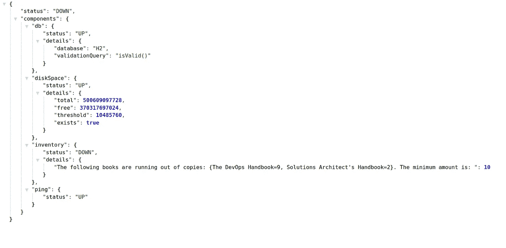
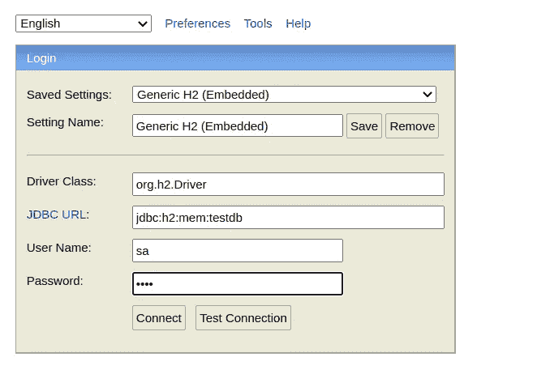
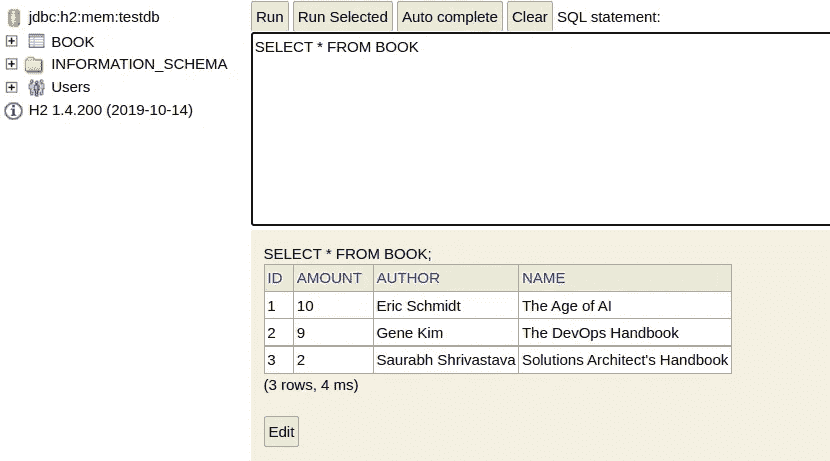
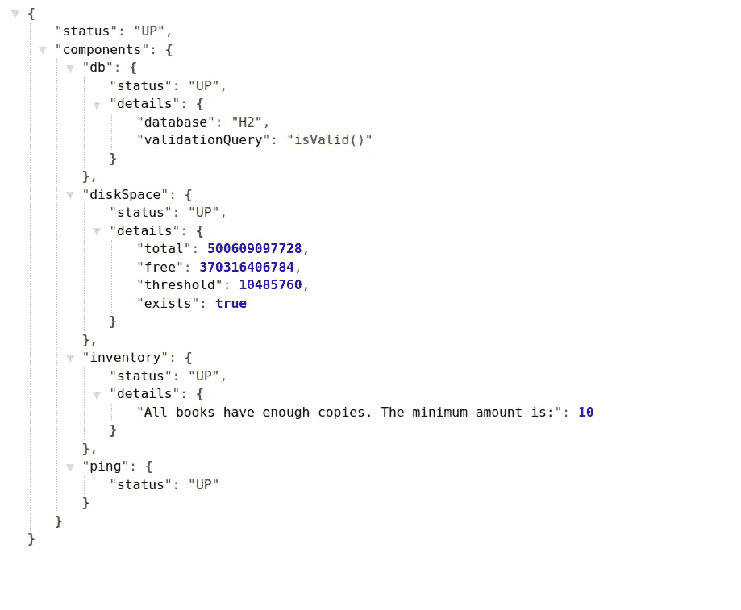

# 如何在 Spring Boot 实施定制健康监控

> 原文：<https://betterprogramming.pub/how-to-implement-custom-health-monitoring-in-spring-boot-69dd5d852707>

## 创建您的健康指标实现，以在 Spring Boot 应用程序中监控自定义数据


[国立癌症研究所](https://unsplash.com/@nci?utm_source=medium&utm_medium=referral)在 [Unsplash](https://unsplash.com?utm_source=medium&utm_medium=referral) 上拍摄的照片

如果你曾经使用过 [Spring Boot 致动器，](https://docs.spring.io/spring-boot/docs/current/actuator-api/htmlsingle/)你可能对[健康](https://docs.spring.io/spring-boot/docs/2.1.7.RELEASE/reference/html/production-ready-endpoints.html#production-ready-health)终点很熟悉。它提供有关您的应用程序状态的信息，如 ping 状态、磁盘空间配额等。

假设您想要跟踪一些特定于功能的信息。可以创建自己的健康检查实现。它将在健康端点下可见。

在本教程中，你将学习如何覆盖`[HealthIndicator](https://docs.spring.io/spring-boot/docs/current/api/org/springframework/boot/actuate/health/HealthIndicator.html)`执行器界面来显示自定义信息。您还将看到一些方便的 H2 数据库技巧，用于更高级的用法。

我们开始吧！

# 准备演示项目

想象以下场景:

你拥有一家图书网店，想知道一些书是否已经售完，以便你能提供更多。

您根据金额从数据库中检索图书数量。您在浏览器中显示健康状态。

下图说明了我们将如何构建我们的流程:



演示项目架构概述。

我将重用一个 Spring Boot [项目](https://github.com/kirshiyin89/springboot-monitoring-demo)，它是我在以前的[文章](/how-to-monitor-a-spring-boot-app-with-prometheus-and-grafana-22e2338f97fc)中创建的，用来演示如何用 Prometheus 和 Grafana 监控一个应用程序。我创建了一个新的 git 分支来添加自定义健康端点实现。

我们需要以下 Maven 依赖项:

Maven 依赖性

`application.yml`配置如下所示:

*   我们启用了健康端点，它将始终显示详细信息。如果你想限制谁可以看到这个信息，检查我的[以前的教程](/how-to-secure-custom-spring-boot-actuator-endpoints-and-add-prometheus-metrics-18bf010f56fb)。
*   我们通过添加凭证和 URL 来设置内存数据库。
*   请注意，我们还启用了 H2 控制台，因此我们可以从浏览器方便地检查和处理我们的数据。
*   我们通过设置`show-sql: true`在控制台上显示 SQL 命令。
*   我们通过使用`defer-datasource-initialization`在启动时启用数据初始化。

## 创建实体

让我们创建一个名为`Book.java`的实体类:

## 创建 JPA 存储库

添加 JPA 存储库来查询数据:

注意，我们将使用默认的 Spring JPA 操作。因此，我们将把实现留空。

## 实现 HealthIndicator 接口

现在，最激动人心的部分来了——自定义健康检查器。

创建一个实现`HealthIndicator`接口的新类:

*   `@Component`注释在 Spring Boot 注册 bean。
*   我们将书的最小份数设置为`10`。
*   我们覆盖了`health()`方法来返回一个健康实例。根据业务规则，我们返回带有自定义消息的`Health.up()`或`Health.down()`。在我们的例子中，我们让请求者知道书的副本是否足够。
*   当我们到达健康端点时，服务将从`BookRepository`中检索金额。

## 向数据库添加数据

通常，当我们创建一个实体时，Spring Boot 会创建一个空表。

但是，我们可以使用 `defer-datasource-initialization`属性自动向表中填充数据。

在`resources`文件夹下创建一个`data.sql` 。例如:

```
INSERT INTO book (id, name, author, amount) VALUES (1, 'The Age of AI', 'Eric Schmidt', 10);
INSERT INTO book (id, name, author, amount) VALUES (2, 'The DevOps Handbook', 'Gene Kim', 9);
INSERT INTO book (id, name, author, amount) VALUES (3, 'Solutions Architect''s Handbook', 'Saurabh Shrivastava', 15);
```

当我们启动应用程序时，它会自动提取并填充数据库。

## 测试项目

现在，是测试的时候了。

运行应用程序并访问[http://localhost:8080/actuator/health](http://localhost:8080/actuator/health)端点。

首先，你会看到:



健康下降

两本书不符合最低复印标准。

请注意，我们可以在“库存”下看到自定义信息

让我们改变这两本书的数量。

打开 H2 控制台，使用来自`application.yml`文件的凭证登录。



H2 登录



H2 控制台中的预订结果

更改金额:

```
update BOOK set amount = 15 where id=2;
update BOOK set amount = 15 where id=3;
```

让我们重新检查健康端点:



健康向上

太好了！信息也相应地改变了。

# 结论

这个简短的教程教你如何覆盖`HealthIndicator`致动器接口来创建你的健康检查实现。如果您想要跟踪与您的应用程序相关的特定信息，它会很有帮助。

您还学习了一些数据库技巧，比如在浏览器中启用 H2 控制台，并在启动时用数据填充数据库。

本教程的源代码可以在我的 [GitHub 资源库](https://github.com/kirshiyin89/springboot-monitoring-demo/tree/feature/monitoring-with-custom-health-endpoint)中找到。

如果你喜欢这篇文章，你可能也会喜欢我的其他相关文章:

[](/how-to-monitor-a-spring-boot-app-with-prometheus-and-grafana-22e2338f97fc) [## 如何使用 Prometheus 和 Grafana 监控 Spring Boot 应用程序

### 如何为 Spring Boot 应用程序设置监控的分步指南

better 编程. pub](/how-to-monitor-a-spring-boot-app-with-prometheus-and-grafana-22e2338f97fc) [](/how-to-secure-custom-spring-boot-actuator-endpoints-and-add-prometheus-metrics-18bf010f56fb) [## 如何保护定制 Spring Boot 执行器端点并添加普罗米修斯指标

### 提高安全性的指南

better 编程. pub](/how-to-secure-custom-spring-boot-actuator-endpoints-and-add-prometheus-metrics-18bf010f56fb) 

感谢您的阅读，祝您编码愉快！