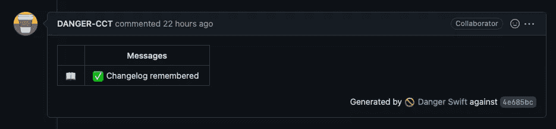

# 想要创建健壮的拉请求吗？使用 Swift 中的“危险”构建工具

> 原文：<https://betterprogramming.pub/how-to-implement-danger-in-swift-fb8ea070ceb6>

## 关注代码，让危险保持拉请求的形状


由[耐莉·安东尼娅杜](https://unsplash.com/es/@nelly13?utm_source=medium&utm_medium=referral)在 [Unsplash](https://unsplash.com?utm_source=medium&utm_medium=referral) 上拍摄的照片

我最近接了一个项目，在这个项目中，我是唯一的 iOS 应用程序开发人员，这意味着如果我发出[拉请求](https://cctplus.dev/3-ways-to-make-better-pull-request-descriptions/) (PR)，那么我就必须自己审查自己的代码。这对于代码质量来说并不理想，但是我想出了如何通过问“我如何确保我记住了最佳实践？”答案是使用[危险](https://danger.systems/)。Danger 是一个构建工具，它检查您的 PRs 是否符合您或您的团队定义的规则。

# 什么是危险？

Danger 是一个构建工具，它检查您的 pull 请求是否遵循某些规则。可以实现的规则是“使用拉请求添加变更日志条目”，或者拉请求只能有这么多变更。它通常作为 CI/CD 中的一个步骤来运行，[持续集成/持续部署](https://cctplus.dev/continuous-integration-and-continuous-deployment-for-ios-and-ipados-apps/)，这样如果一个规则被破坏，构建将会失败，并且 PR 不会被合并。

Danger 可以在本地和 CI/CD 工具中工作，如 [GitHub actions](https://github.com/features/actions) 和 [BitRise](http://bitrise.io) 。它可以在不同的远程 git 服务器上运行，如 GitHub、BitBucket、Gitlab 和 PRs 上的 comments。



PR 上的危险注释

有多种类型的危险:危险-JS，危险-Ruby 和危险-Swift。在这篇博客中，我们将讨论危险-迅捷。

# 如何设置危险-迅捷

设置危险只需要三个步骤。这些文档会更深入一点，但最终要做起来，这里是你需要的三个步骤。

# 1.局部安装危险

我建议用自制安装 Danger，如果你没有，那就弄[自制](https://brew.sh/)。

运行`brew install danger/tap/danger-swift`

这可能需要一段时间，所以要有点耐心。

# 2.创建您的危险文件

在项目的根 repo 中，添加文件`Dangerfile.swift`。在该文件中，包括以下内容:

```
import Foundation
import Dangerlet danger = Danger()let allSourceFiles = danger.git.modifiedFiles + danger.git.createdFiles
```

你做了什么？好了，您已经导入了 danger 并创建了一个保存所有 git 文件的常量。现在，如果您想查看某个文件是否被更改，那么您可以在`allSourceFiles`上使用`.contains("filename.extension)"`，然后在 pull 请求的注释中输出它是否被更改，或者如果在本地运行，则在您的终端中输出。这里有一个例子来检查`Changelog.md`是否改变了。

```
import Foundation
import Danger let danger = Danger()let allSourceFiles = danger.git.modifiedFiles + danger.git.createdFileslet changelogChanged = allSourceFiles.contains("CHANGELOG.md")if !changelogChanged {
  warn("No CHANGELOG entry added.")
}
```

*   `fail("message goes here")` —将使构建失败，并将消息放入表中
*   `message("message goes here")`——允许你在表格中输入信息
*   `markdown("#message goes here")` —将把 markdown 放在表格的底部

# 3.获取一个 GitHub API 令牌并将其从您的。zshrc 文件

这一步是可选的，但这是它处理私有回购的唯一方式。获取一个 GitHub 令牌，确保设置了查看您的回购的权限，并将`export DANGER_GITHUB_API_TOKEN='token_here'`添加到您的`.zshrc file`中。之后，您将能够在本地进行测试。您唯一需要的是一个拉请求链接。

运行`danger-swift pr {paste pr link without brackets}`，在您的终端中，您应该看到类似如下的输出:

```
$ danger-swift pr https://github.com/maeganwilson/ios-template/pull/2
$ Starting Danger PR on maeganwilson/ios-template#2 Danger: ✓ passed review, received no feedback.
```

在下一篇文章中，我将解释我是如何设置 GitHub actions 来运行 Danger，并让我自己的 Danger Bot 来发布我的 Pull 请求的。

```
**Want to Connect?**Let me know if you have any comments or questions on Twitter, [@maeganwilson_](https://twitter.com/maeganwilson_), and follow me there.
```