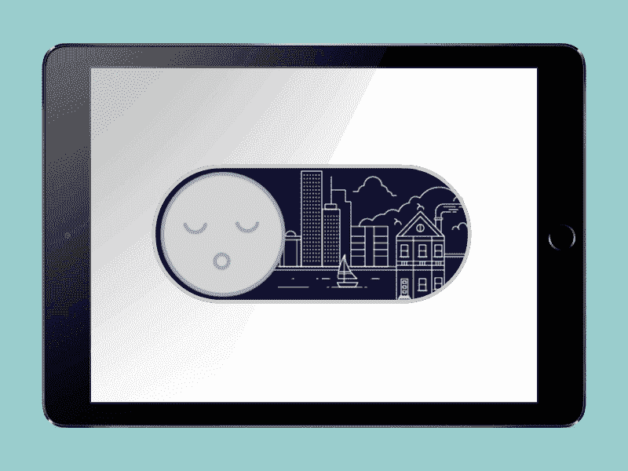
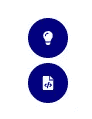
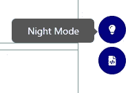
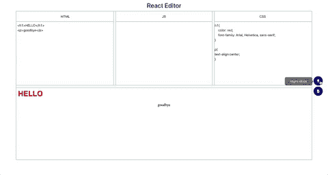

# 如何在你的 React 应用中实现黑暗模式

> 原文：<https://betterprogramming.pub/how-to-implement-dark-mode-in-your-react-app-63c1a0c5e337>

## 让用户的眼睛休息一下



在开发 React 应用程序时，我想实现一个日/夜模式功能，允许用户选择他们是否想要使用亮或暗的主题。黑暗模式在应用程序和软件设计中越来越受欢迎。除了看起来很酷之外，黑暗模式还有助于设备节能和减轻眼睛疲劳。更多关于黑暗模式背后的科学，请看【观察者】的[这篇文章](https://observer.com/2019/03/dark-mode-app-trend-psychological-effects/)。

在这篇文章中，我将展示在我的 React 应用中实现这种新的设计趋势是多么容易。我的应用程序中涉及了更多的 CSS，但是为了保持简洁，我将只提供与我的日间/夜间模式功能相关的 CSS。首先，让我提供一些背景。

我的 React 应用是一个在线文本编辑器。我的`App`组件有一个白色的背景和黑色的字体颜色。这是贯穿我的应用程序的一致的配色方案。我真的在挑战当代网页设计的极限。

下面是我的`App`组件。

```
import React, {Component} from 'react';
import './App.css';
import SizeContainer from './components/SizeContainer.js';
import {withRouter} from 'react-router-dom';
import { connect } from 'react-redux'; const App = (props) => {     
   return (      
      <div className={!props.mode ? "App" : 'night'}>        
         <h1 style={{height: 50, marginBottom: 0, padding: 5}}>
           React Editor
         </h1>        
         <SizeContainer mode={props.mode}/>      
      </div>    
   );
} const mapStateToProps = (state) => {  
   return {      
      mode: state.mode  
   };
} export default withRouter(connect(mapStateToProps) (App));
```

如你所见，我的`App`组件通过`mapStateToProps`访问`mode`道具。这个道具存储在我的 reducer 中，我选择用`connect`导出的任何组件都可以访问它。虽然 Redux 对于这个功能来说不是必需的，但我发现它确实使应用样式的过程变得更容易，同时保持了我的组件的精简和平均。有关 Redux 的更多信息，请查看[文档](https://redux.js.org/)。

下面是我的减速器:

```
export default function rootReducer(state={mode: false}, action){
   switch(action.type){      
      case "CHANGE_MODE":      
         var mode = !state.mode        
         return {...state, mode}      
      default:        
         return state    
    }   
}
```

当调用`CHANGE_MODE`时，需要做的就是获取我的减速器状态中`mode`的当前值(真/假),并赋予它与当前值相反的值。

如果`state.mode`为真，那么`!state.mode`将等于假，反之亦然。此操作不需要有效负载。既然我们已经看到了这在 reducer 中是如何处理的，那么让我们看看 actions 文件中的`CHANGE_MODE`动作。

```
export function changeMode(){  
   return {    
      type: "CHANGE_MODE"  
   }
}
```

因为没有有效负载，切换操作发生在 reducer 中，所以我们需要做的就是在我们的一个组件中调用这个函数，每当我们想要切换应用程序的主题时。这让我想到了我的下一个组件:`SizeContainer`。

因为我将从`App`向`SizeContainer`传递`props.mode`，所以`SizeContainer`中的子元素也可以访问`props.mode`。这对于一个子组件尤其重要:`Buttons`。

```
import React from 'react';
import {FaFileCode, FaLightbulb} from "react-icons/fa";
import {withRouter} from 'react-router-dom';
import { connect } from 'react-redux';
import { changeMode } from './../actions'const Buttons  = (props) => { var {mode, changeMode} = props; return(
      <div className='buttonsContainer' >
         <div>
           <div className='buttons' onClick={changeMode}>
              <FaLightbulb/>
              <span className="tooltiptext">
                 {mode ? "Day Mode" : "Night Mode"}
              </span>
            </div>
            <div className='buttons'>
               <FaFileCode/>
               <span className="tooltiptext">
                   Download Code
                </span>
            </div>
          </div>
       </div>
    )
};export default withRouter(connect(null, {changeMode}) (Buttons))
```

上面的代码将呈现下面的两个按钮——一个有灯泡图标，另一个是代码文件图标。



正如你可能猜到的，带有灯泡图标的按钮将控制黑暗模式的切换。现在不用担心第二个按钮。注意下面的线。

```
import { changeMode } from './../actions'
```

这是从我们的操作中导出的`changeMode`函数。该功能添加了灯泡按钮作为`onClick`事件。单击按钮，并执行更改模式的操作。简单，不是吗？

如果`props.mode`为真(意味着黑暗模式被激活)，灯泡按钮的工具提示将显示“白天模式”，如果为假(黑暗模式被关闭)，它将显示“夜晚模式”。



在这种情况下，黑暗模式尚未启动，因此出现了白色背景和“夜间模式”工具提示

现在我们已经设置好了 React 应用程序，让我们来看看 CSS。

```
.App {  
   text-align: center;  
   height: 100%; 
   transition: background-color 0.3s, color 0.3s;
}
```

当没有选择黑暗模式时，我们的 CSS 非常简单。由于白色是默认的背景色，黑色是 HTML 默认的字体颜色，所以我们不需要在这里指定它们。

我们需要指定的只是`App`(我们希望它占据整个页面)和`transition`的高度和宽度。

通过指定背景色和颜色过渡(都是 0.3s)，这将确保我们从白天到夜晚模式的过渡是平滑的。否则，它看起来更像是不和谐的闪光，而不是从白天到夜晚的平稳过渡。

现在我们有了默认的样式，让我们开始讨论黑暗模式 CSS。

```
.night {
  text-align: center;
  height: 100%;
  width: 100%;  
  background-color: black;
  transition: background-color 0.3s, color 0.3s;
}
```

我们声明了`.night`类名的样式，并明确声明了背景颜色和颜色，以防止 HTML 使用默认值。这个还有一个`transition: background-color 0.3s, color 0.3s;`这将确保当我们从暗背过渡到亮模式时，过渡将保持平滑。

如果您还记得本文前面的内容，我们的`App`组件的`className`是由`props.mode`的值决定的。如果`props.mode`为假，则使用`className="App"`；否则，使用`className="night"`。

上面的 CSS 满足了我们的`App`组件的主题变化，但是为了确保它将必要的样式应用到所有的子元素，我们需要添加几行代码。

```
.night h1, .night h2, .night div, .night textarea{
  background-color: black;
  color: white;
  transition: background-color 0.3s, color 0.3s;
}
```

这将对我们的`App`组件中的任何`h1`、`h2`、`p`、`div`和`textarea`元素应用背景颜色和文本颜色的更改。

这些元素包括应用程序的文本编辑器部分(`textarea`)和它们的标题(`h2`)。`h1`是应用程序本身的名称，几乎所有东西都放在它自己的或者父代的`div`容器中。

通过将`.night`放在所有这些元素的前面，我们可以在更改主题时将这些特定的子标签作为目标。

同样值得注意的是，这里我们使用了一个后代选择器，由`.night`和一个 HTML 标签之间的空格标识。这将选择属于`.night`的元素的所有子实例。我们不使用子选择器`>`，因为它只会选择元素的直接子元素。我们也不使用`+`，相邻兄弟选择器，它只会选择兄弟。关于 CSS 组合子的更多内容，请查看这篇非常棒的文章。

我们差不多完成了，但是还有一些事情需要考虑。首先，有几个元素不想改变颜色或背景色(至少现在不想)，比如海军蓝按钮。无论是暗模式还是亮模式，我都希望它们保持海军蓝和白色图标。为了确保`className`开关不会影响这些按钮，我可以添加以下 CSS。

```
.night .buttons{  background-color: navy;}
```

通过将这一行放到我的`App.css`文件中，我可以防止前面提到的 CSS 改变按钮的样式。以前，我认为这一行必须放在最初的**CSS 之后，因为 CSS 在设计上是级联的，并且使用[优先级](https://css-tricks.com/precedence-css-order-css-matters/)来确定应用于元素的样式。**

**实际上，我把这条线放在哪里并不重要。因为我们使用了一个类选择器来定位按钮，所以不会应用`.night div`样式，因为特异性级别低于`.night .buttons`。如需了解更多信息，请阅读[关于特殊性的 MDN 文档](https://developer.mozilla.org/en-US/docs/Web/CSS/Specificity)。**

**上述逻辑也适用于我的最后一个元素，我希望它独立于黑暗模式:我的输出容器。这个部分的类名为`.view`，是用户代码(由上面的三个部分组合而成)将要运行的地方，由于输出区域应该只反映用户编写的代码，我们应该确保默认样式得到执行，除非用户在 CSS 部分键入新的样式。**

```
.night .view {  background-color: white;}
```

**输出的其余部分将被插入到一个`iframe`中，它是`.view`的子节点。这意味着用户的风格将完全独立于我的应用程序的风格。只需要保留输出容器的背景色。**

**[Adam Lyth](https://medium.com/@adamlyth) 指出，虽然上述内容适用于 react 应用程序，但原生应用程序需要更多的 CSS。要实现这一点，您可以在这个媒体查询中使用 wrap 样式。**

```
@media (prefers-color-scheme: dark) {
      /*YOUR DARK STYLE HERE*/
}
```

**下面是我们的最终结果。**

****

**这就是了。只需几行额外的 CSS 和一点点道具逻辑，你的 React 应用程序就可以高效地实现黑暗模式。**

**[*在此处将您的免费媒体会员升级为付费会员*](https://matt-croak.medium.com/membership) *，每月只需 5 美元，您就可以收到各种出版物上数千名作家的无限量无广告故事。这是一个附属链接，你的会员资格的一部分帮助我为我创造的内容获得奖励。谢谢大家！***

# **参考**

**[](https://observer.com/2019/03/dark-mode-app-trend-psychological-effects/) [## 黑暗模式的阴暗面:最新的应用趋势是否正在耗尽我们屏幕上的生命？

### 应用程序和软件设计有一个新趋势，叫做黑暗模式。如果你还没看过，基本的转折是它…

observer.com](https://observer.com/2019/03/dark-mode-app-trend-psychological-effects/) [](https://redux.js.org/) [## 为 JS 应用程序还原一个可预测的状态容器

### JS 应用程序的可预测状态容器

JS Appsredux.js.org 的可预测状态容器](https://redux.js.org/) [](https://medium.com/better-programming/understanding-css-combinators-a36e013b1bed) [## 理解 CSS 组合子

### 如何使用它们，为什么

medium.com](https://medium.com/better-programming/understanding-css-combinators-a36e013b1bed)  [## CSS 中的优先级(当 CSS 的顺序很重要时)

### 在你写 CSS 的普通日子里，你可能甚至不会考虑 CSS 中的优先级。它没有出现整个赫克…

css-tricks.com](https://css-tricks.com/precedence-css-order-css-matters/) [](https://developer.mozilla.org/en-US/docs/Web/CSS/Specificity) [## 特征

### 特异性是浏览器决定哪些 CSS 属性值与某个元素和……最相关的手段

developer.mozilla.org](https://developer.mozilla.org/en-US/docs/Web/CSS/Specificity)**