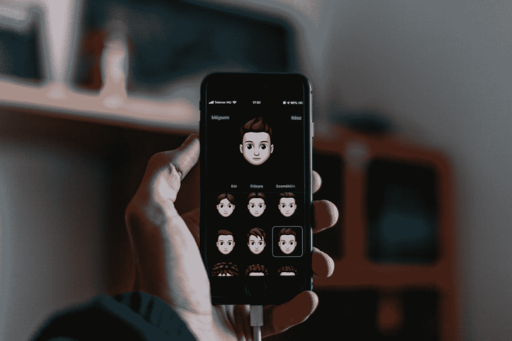
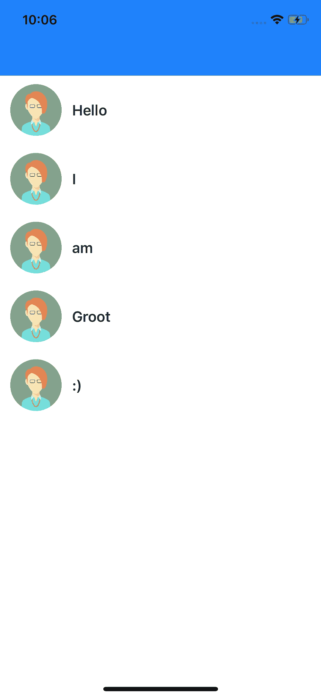
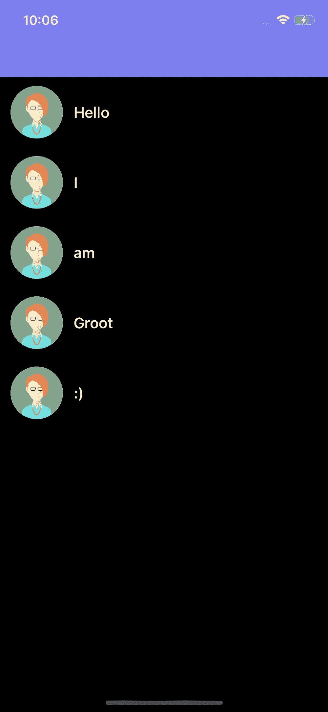
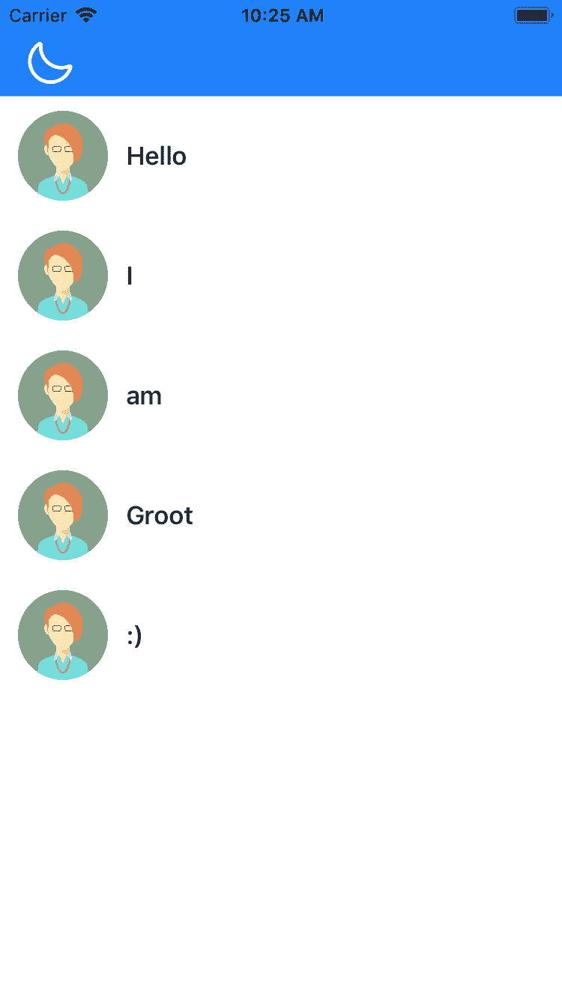
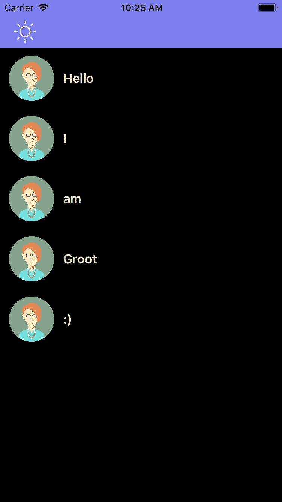

# 如何在 iOS Swift App 中实现向后兼容的黑暗模式

> 原文：<https://betterprogramming.pub/how-to-implement-dark-mode-with-backward-compatibility-in-ios-7566376e24fd>

## 使用 propertyWrapper 实现黑暗模式和多个主题



照片由 [Szabo Viktor](https://unsplash.com/@vmxhu?utm_source=medium&utm_medium=referral) 在 [Unsplash](https://unsplash.com?utm_source=medium&utm_medium=referral) 上拍摄

# 黑暗模式和 iOS

我们都知道黑暗模式很受用户欢迎。此外，我们不能忽视有机发光二极管显示器对设备电池和眼睛的好处。

iOS 13 已经提供了系统颜色 API，当我们将系统更改为黑暗模式时，它会自动更改视图颜色。但是在我的应用程序中实现它的时候，我有太多的疑问。

## 我们如何为暗模式和亮模式配置自定义颜色？

我们有这方面的彩色资产目录。我们可以为明暗模式添加颜色。

## 如果我们想添加更多的主题呢？

目前，颜色资源目录只能为深色和浅色模式添加有限的颜色。但是如果我们想增加更多的主题支持呢？想象一下，一个应用程序根据付费、免费等改变主题。

## 支持 iOS 10 版本的 app 呢？

嗯，iOS 10 不支持颜色资产目录。只有从 iOS 11 开始才支持，所以我们必须放弃这个想法，转向编程方式。

我们必须创建自己的自定义`UIColor`包装器，为不同的模式/主题提供颜色。在制作这些包装器时，我们必须确保语法与苹果的`UIColor`API 的语法相同(例如调用`UIColor.red`)。

我们可以在`propertyWrapper`的帮助下实现这一目标。

# **propertyWrapper 来拯救**

让我们用`propertyWrapper`创建一个`Theme`结构，它的变量数量等于主题支持的数量。

现在让我们创建一些颜色。我们将创建一个`UIColor`的扩展，并在`Theme`的帮助下创建一个颜色对象。看看语法和对象创建。这有许多优点:

*   语法简单
*   添加或删除主题支持的灵活性
*   类似苹果的 API 调用
*   易于维护和代码可读性
*   根据您的功能对扩展进行分组
*   向后兼容性

就是这样。现在，你可以使用与苹果相同的语法来设置 UI 组件的颜色(例如，为标签文本颜色设置颜色将是`UIColor.primaryText`)，完成后，你的应用程序将根据你设置的暗/亮模式改变其颜色。

# iOS 13 的最终结果

下面是我创建的示例应用程序的结果。查看 GitHub 上的完整项目[。](https://github.com/mukyasa/DarkModeExample)



在 iOS 13 iPhone 11 pro 中运行的示例应用程序的截图，左边是亮模式，右边是暗模式

# **老版本呢？**

我们必须做一些额外的工作来为旧设备添加主题。我们的社区有许多解决方案，我只分享一个简单的。您可以根据您的项目需求拥有自己的实现。

首先，我们将使用`addThemeChangeObserver`方法的默认实现创建一个`ThemeProtocol`，这样任何实现这个协议的对象只需调用这个方法。然后我们实现`ThemeProtocol`到`ViewController`，调用`viewDidLoad`中的`addThemeChangeObserver`，并实现`configureSubviewsColors`，在这里我们将配置所有的子视图颜色。

# **总结**

我添加了左`UIBarButton`来切换旧设备上的黑暗模式，并添加了目标`toogleDarkMode`来处理`ThemeManager`中的变化。就是这样。我们现在已经成功地为旧版本实现了它。

```
// Implement this method only for iOS version less than 13
 @objc func toogleDarkMode() {
 // Toggle Theme Logic
  ThemeManager.isDarkModeEnabled = !ThemeManager.isDarkModeEnabled
  NotificationCenter.default.post(name: NSNotification.Name(rawValue:  “themeChange”),
                                 object: nil)
 }
```

以下是旧设备的测试结果:



在 iOS 11 iPhone 8 中运行的示例应用的截图，左边是亮模式，右边是暗模式

***注意*** *:如果你不想为旧版本做这些额外的代码，你可以重置* `AppDelegate` `window.rootViewController` *。它将根据您在本地为应用程序设置的内容配置一个新的主题(深色或浅色)。*

# 感谢您的阅读。

我希望这篇文章能帮助你在应用程序中实现黑暗模式。请分享您的宝贵反馈。