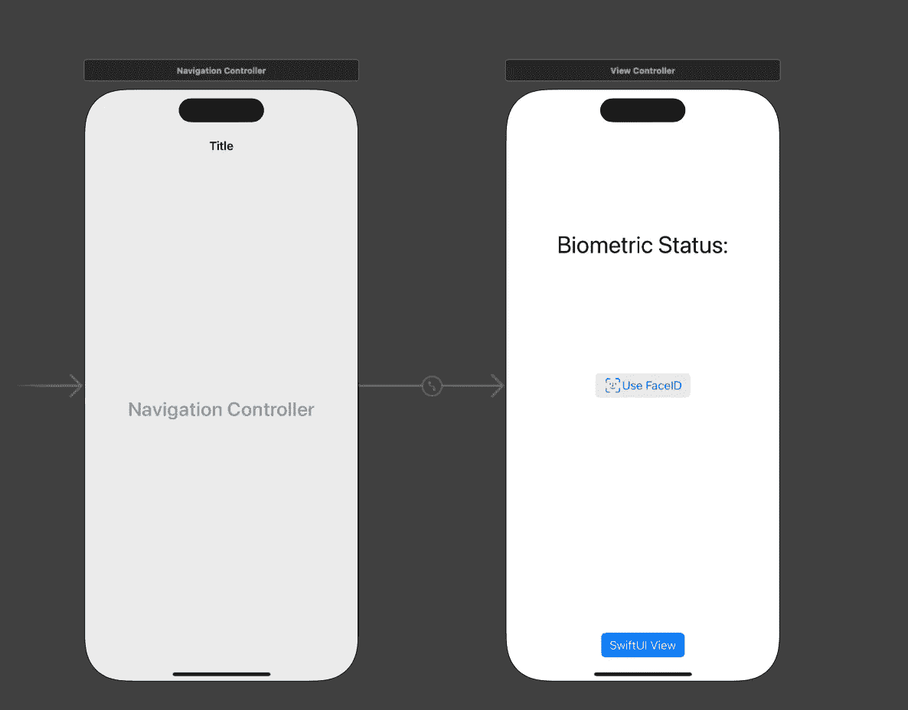
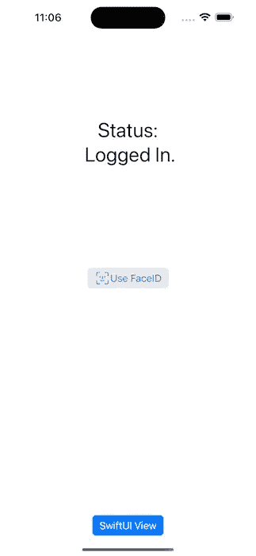

# 如何在 iOS 中实现 FaceID 或 TouchID

> 原文：<https://betterprogramming.pub/how-to-implement-faceid-or-touchid-in-ios-f3837cc2ff01>

## 使用 UIKit 和 SwiftUI 实现

[图片来自苹果](https://support.apple.com/en-gb/HT208109)

生物认证是一种新的安全步骤，减少了复杂的算法和操作过程。让我们了解一下如何在你的应用上使用 FaceID/TouchID。

# 准备的

在开始编写代码之前，您需要了解一些生物认证的基础知识。Swift 在`LocalAuthentication`框架下处理生物认证，使用`LAContext`作为类。苹果限制用户在 FaceID 上尝试三次，在 TouchID 上尝试两次，直到用户输入锁屏代码或导航回登录屏幕。您可以自定义“取消”按钮本地化和“使用密码”按钮作为后备选项。

在实现它们之前，我们需要在我们的`Info.plist`文件上添加我们的隐私— FaceID 使用许可。TouchID 不需要这种类型的权限。

# 基础

因为我将在 SwiftUI/UIKit 上展示这个例子，所以我准备了一个基本的应用程序，它带有一个名为“AuthController”的共享实用程序管理器。我把它定义为一个`ObservableObject`。我增加了两个变量。一个用于检查生物特征数据类型(如果不可用，则无)，另一个将帮助我阻止/执行生物特征数据可用性。

现在，我将添加两个名为`askBiometricAvailability`和`authenticate`的方法。

# askBiometricAvailability

通过这种方法，我将检查我们是否可以使用任何生物认证。如果用户不允许我们第一次弹出关于 FaceID 的窗口，或者从我们的应用程序菜单中关闭生物特征数据开关，它会给我们一个基于此的错误。该函数将有一个闭包来作用于它，所以我们可以在 VC 或视图中使用它。在这个函数中，我们将检查是否可以使用一个`inout`变量来访问生物认证，以 NSError 数据的形式告诉我们哪里出错了。

# 鉴定

现在，我们将添加身份验证功能。这个函数将有一个结果生成器，它将采用一个布尔成功案例或`LAError`，这是 Swift 提供给我们的。因此，我们可以把苹果给我们的每一个案例都当作一个错误。你不必操纵每一个案例，但知道苹果可能会抛出哪些诉讼是至关重要的。

我们的逻辑完成了。让我们看看我们是如何在 UIKit/SwiftUI 视图中实现这一点的。

# UIKit

我为这个项目在我的`ViewController`视图中添加了两个按钮:一个 FaceID/TouchID 按钮，一个显示 SwiftUI 视图的按钮，以及一个打印状态的标签。

在我的`ViewController`类中，我调用了我的`askBiometricAvailability`函数，如果用户不允许/关闭主题的 FaceID 切换，它将打印错误案例。我还检查了生物特征类型，并根据技术更改了按钮的文本/图像。

然后，在按钮按下时，我添加了我们的身份验证功能，这将根据其状态给出错误或成功消息。

# 斯威夫特伊

在 SwiftUI 上，我调用了同一个控制器作为一个`ObservedObject`，在其中我可以控制生物特征类型的当前状态。

这款应用已经可以使用了。您可以使用模拟器的功能→ FaceID 部分来测试您的应用程序。不要忘记首先选择已注册。

你可以点击查看这个应用的代码[。](https://github.com/egrimo/BiometricAuth)

使用给定的 API 和工具来管理生物特征认证非常简单。苹果推荐基于该设备的技术。如果用户使用 iPhone SE 2 或 iPad 10th 代应用程序，不要在按钮上显示“使用 FaceID”命名。您也可以通过在用户每次从设置返回应用程序或每次出现时检查可用性来改进此代码。

苹果还[建议](https://developer.apple.com/documentation/localauthentication/logging_a_user_into_your_app_with_face_id_or_touch_id)你需要用一个他们可以触发的按钮来通知用户 FaceID/TouchID 扫描，因为 TouchID 可以选择取消而无需任何输入。当你的应用程序激活时，它会自动扫描面部。

有什么问题吗？随便问。

祝你有愉快的一天。