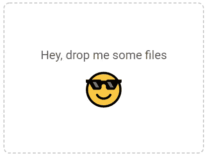
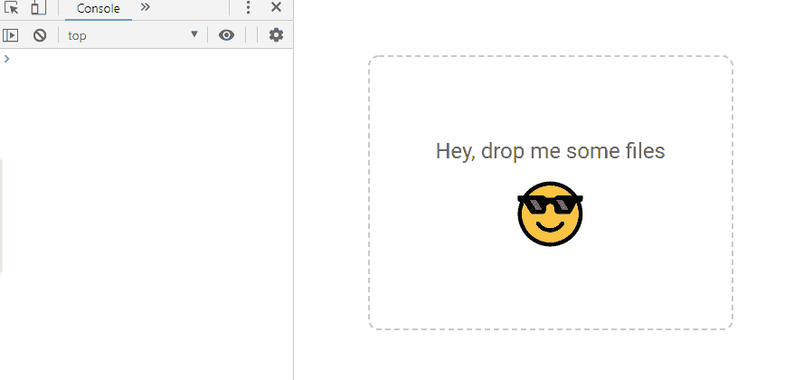

# 如何在 React 中实现文件的拖放

> 原文：<https://betterprogramming.pub/how-to-implement-files-drag-and-drop-in-react-22cf42b7a7ef>

## 创建自定义和可重复使用的区域来拖放文件

照片由 [Claudel Rheault](https://unsplash.com/@claudelrheault?utm_source=medium&utm_medium=referral) 在 [Unsplash](https://unsplash.com?utm_source=medium&utm_medium=referral) 上拍摄

嘿，极客们！

说到上传文件，我们当然可以用默认的`<input type='file'/>`轻松处理。但是我很确定大多数人会同意将你的文件拖放到网页中比在文件对话框中搜索要舒服得多。

因此，让我们弄清楚如何在 React 中轻松创建一个用于拖放文件的区域。

# 处理文件上传

首先，让我们创建一个基本的项目结构和样式。

## App.js

## FilesDragAndDrop.js

## FilesDragAndDrop.scss

这是我们目前掌握的情况。

现在，让我们添加一些逻辑。

为拖放区创建一个`ref`:

为`drop`和`dragover`事件添加监听器，并阻止它们的默认行为(打开放下的文件):

基本上，为了让事情正常工作，我们只需要检查拖放的元素是否包含文件，并将它们传递给我们的父组件。

万岁！我们的拖放组件正在工作。

现在，当我们在父组件中收到丢弃的文件时，我们可以对它们做任何我们需要的事情(例如，将它们传递给某个 API 端点)。

但是这绝对不是我们想要的拖放组件的工作方式。所以我们来做一些本质上的改进。

# 自定义内容

React 的主要最佳实践之一是组件的可重用性。

这就是为什么最好从父组件中为拖放区提供内容。我们的拖放组件将作为一个包装器，我们将能够在任何地方重用它。

因此，我们将在组件中呈现`children`道具，而不是一些硬编码的内容:

在使用组件时，我们需要将它包装在一些自定义内容周围:

# 验证文件格式并计数

像任何其他输入一样(无论是数字、日期还是文件)，我们可能需要验证输入的数据。在某些情况下，我们应该只允许上传某些文件格式。在其他情况下，我们需要限制一次可以上传的文件数量。

而在默认的`<input type="file"/>`中，我们可以使用`accept`参数验证格式，使用`multiple`参数验证文件数量。在我们的定制组件中，我们需要手动处理验证。

为了实现它，让我们给组件添加新的`count`和`formats`道具，并在`handleDrop`函数中处理它们:

就是这样！现在，我们的组件将阻止上传格式或数量不正确的文件。

# 最后但同样重要的是——UI/UX

## 叠加打开`dragover`

当用户与系统交互时，他们总是希望得到一些反馈——也就是说，当文件被拖动到拖放区域时，最好显示一个覆盖图，上面显示一条消息，确认用户正在做正确的事情。

要处理区域上的拖动，我们需要做以下事情:向状态添加一个`dragging`参数，并处理`dragenter`和`dragleave`事件(当一个被拖动的文件进入该区域时启用`dragging`，当它离开该区域时禁用):

如果启用了拖动，则在区域上方显示覆盖图:

当你实现它的时候，你可能会注意到一些错误:

这是因为一旦触发了`dragenter`事件，我们就会在内容上方显示覆盖图。因此，内容失去拖动并触发`dragleave`事件，而覆盖捕捉到拖动并触发`dragenter`事件。这导致了`dragging`标志的不断变化。

但这很容易解决。我们只需要检查事件是否是从覆盖图中触发的。如果`dragenter`事件不是从覆盖图中触发的，我们需要显示它，如果`dragleave`事件是从覆盖图中触发的，我们需要隐藏它。

为叠加添加`ref`:

然后检查事件目标是否等于覆盖图:

另外，不要忘记重置拖放上的`dragging`标志，这样它就不会影响下一个拖动文件:

## 关于成功上传或验证错误的消息

我们需要实现的最后一件事是当文件成功上传或没有通过验证时的信息消息。

让我们将`message`参数添加到我们的状态和将处理它的函数中:

在渲染过程中，如果需要，我们将检查`message`参数并显示适当的消息。

完成后，我们可以在任何需要的地方调用`showMessage`函数:

这是我们创造的。

# 结论

在你开始实现你自己的拖放之前，我想和你分享一些好消息。

我用更酷的东西为这个组件创建了 [npm 包](https://www.npmjs.com/package/@yelysei/react-files-drag-and-drop)，比如 TypeScript、点击时的文件对话窗口、文本和样式定制等等。