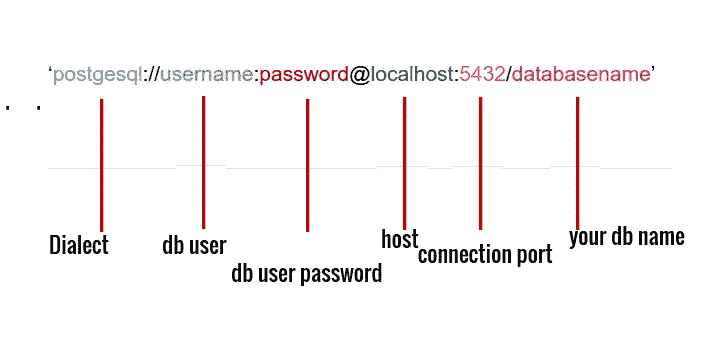
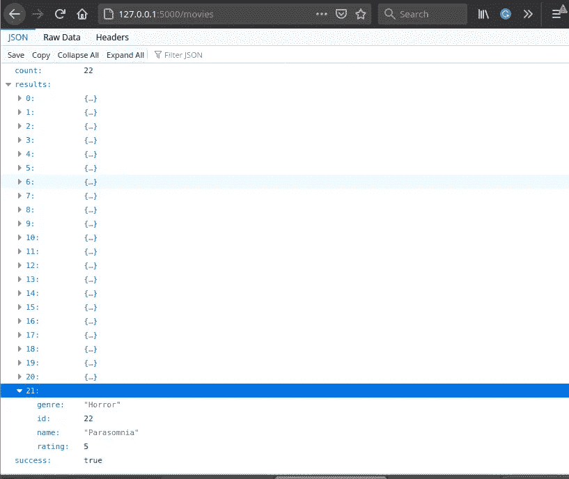
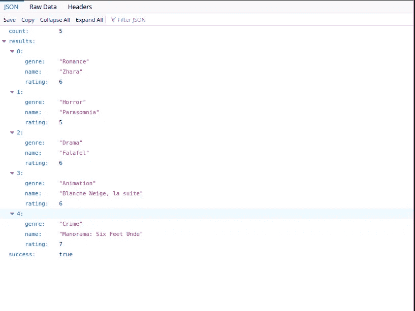
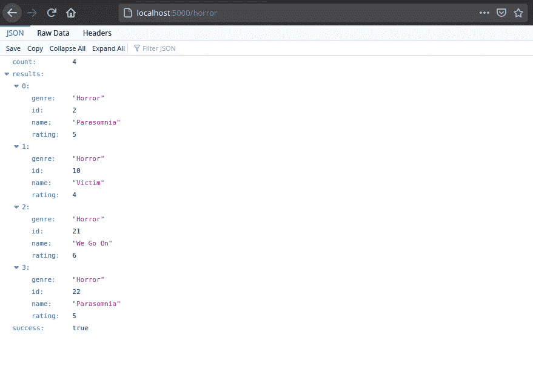
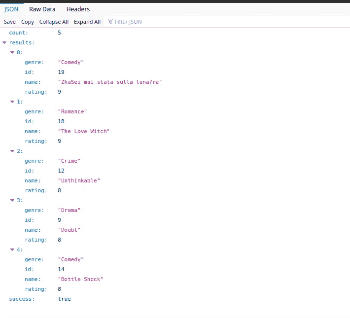

# 如何在 Flask 中实现过滤、排序和分页

> 原文：<https://betterprogramming.pub/how-to-implement-filtering-sorting-and-pagination-in-flask-c4def1ca004a>

## 构建 Python web 应用程序

由[卢克·切瑟](https://unsplash.com/@lukechesser?utm_source=unsplash&utm_medium=referral&utm_content=creditCopyText)在 [Unsplash](https://unsplash.com/s/photos/data?utm_source=unsplash&utm_medium=referral&utm_content=creditCopyText) 拍摄的照片

数据是当今世界的一个基本概念。无论你是在网上搜索还是使用你最喜欢的应用程序，你每一秒都在消耗数据。这些数据必须采用正确的格式才能有意义。在本教程中，我们将了解如何使用 Flask 微框架在 Python 中执行数据过滤、排序和分页。

# **什么是烧瓶？**

Flask 是用 [Python](https://en.wikipedia.org/wiki/Python_(programming_language)) 编写的微框架。由于它不需要特殊的工具或库，所以设置起来很简单。它没有数据库抽象层、表单验证或其他组件。Flask 的目标是保持核心简单但可扩展。

# **创建一个基本的烧瓶应用程序**

我们将从创建一个电影 API 服务器开始。API 服务器将能够执行以下操作:

*   基于搜索词从服务器检索记录
*   每页最多分页五条记录
*   根据最佳评级对电影进行分类

创建项目目录并设置虚拟环境。您必须安装了`virtualenv`。虚拟环境有助于分离项目依赖性。

激活虚拟环境。

在电影文件夹中，创建一个文件`app.py`。

# **使用 Pip** 安装烧瓶

运行以下命令安装 Flask:

如果一切顺利，您应该会看到以下内容:

我们还需要安装 Flask SQLAChemy。根据文件:

> Flask-SQLAlchemy 是对 [Flask](http://flask.pocoo.org/) 的扩展，为您的应用程序增加了对 [SQLAlchemy](https://www.sqlalchemy.org/) 的支持。它旨在通过提供有用的缺省值和额外的帮助器来简化 SQLAlchemy 与 Flask 的使用，从而更容易完成常见的任务。

接下来，让我们在 app.py 文件中配置一个基本的 flask 应用程序。首先，导入 Flask 并实例化一个 Flask app，如下图所示:

# **将应用程序连接到数据库**

首先，让我们用 pip 安装`psycopg2`。`psycopg2`是 Python 的数据库适配器，它允许我们将数据库连接到我们的程序。

下一步是向我们的应用程序添加数据库配置。但是首先，使用 PostgreSQL 创建一个本地数据库。您应该已经安装了 PostgreSQL。如果您还没有，请查看这些适用于各种平台的安装指南[。](https://www.postgresql.org/download/)

创建一个数据库。

PostgreSQL 自带一个名为`psql`的命令行客户端程序，用于登录服务器。

登录 PostgreSQL 并创建一个新数据库:

在 database musica 上创建一个具有密码权限的用户:

转到 app.py，导入顶部的`flasksqlachemy`库:

接下来，使用`SQLAchemy`类将一个数据库实例链接到我们的应用程序:

`db`允许我们为数据库创建模型类，并在数据库上执行事务。

接下来，我们通过设置一个配置变量从 flask 应用程序连接到我们的数据库。Flask 期望一个数据库 URI 作为它的配置变量。

数据库 URI 采用以下格式:

URI 数据库

# **创建数据库表**

我们的电影应用程序将定义一个保存电影信息的电影表，比如名称、类型和分级。

让我们继续创建我们的模型类:

`db.create_all()`如果我们运行 flask 应用程序，检测模型并为它们创建表格。让我们运行应用程序:

现在，转到`PostgreSQL`客户端，您应该看到已经创建了电影表:

正如您在上面看到的，已经创建了电影表，现在我们可以与数据库进行交互了。

让我们在表格中添加一些数据。您可以使用交互式 shell 提示符添加数据，如下所示:

首先启用`python3`交互式 shell 提示符，然后从 app 文件导入`db`实例和`Movie`模型。

然后继续创建一个电影实例，将其添加到`db`会话中，并提交到数据库中。

# **分页**

不建议一次发送大量数据，因为这会降低客户端的速度，因为它必须等待服务器检索所有数据。解决这个问题的最好方法是使用请求参数对数据进行分页，并且只向用户发送他们需要的信息——即成批的信息。

我们将首先检索数据库中的所有电影，然后分页并只显示几个条目。

上面的代码显示了一个简单的路径，它获取数据库中的所有电影，并以 JSON 格式显示它们。现在，如果您运行服务器并导航到[http://127 . 0 . 0 . 1:5000/movies](http://127.0.0.1:5000/movies)，您应该会看到页面总共显示了 22 部电影:

所有电影

尽管我们数据库中的电影数量并不多，但假设我们的数据库中有一千多部电影，在这种情况下，检索所有数据会降低服务器的速度，导致用户体验不佳。

解决这个问题的方法是对电影列表进行分页。幸运的是，Flask 附带了`paginate()`查询方法，我们将使用它来检索有限的电影。

分页查询的语法如下:

它从`page`返回`per_page`个项目。

让我们在 flask 应用程序中实现分页。我们希望每页只检索五个条目。

结果如下:

分页电影

# **过滤**

过滤允许用户通过传递某些查询参数只获取他们需要的信息。

假设我们想要获得数据库中所有的恐怖电影。让我们来实现它:

在上面的代码中，我们使用属性`ilike`来确保查询不区分大小写，也就是说,“horror”和“HORROR”都会给出正确的结果。

结果如下:

烧瓶中过滤器

# **排序**

排序是将查询数据整理成特定数据以便您可以更有效地分析它的过程。您可以在以下位置对数据进行排序:

*   字母顺序
*   流水号
*   如年份等类别

让我们根据高评分的电影对我们的电影进行排序。以下代码显示了五部收视率最高的电影的列表:

以下是排名前五的电影的结果:

# **结论**

本教程介绍了如何制作一个连接到 PostgreSQL 数据库的简单 Flask 应用程序。它还介绍了分页、过滤和排序的概念。我希望你喜欢它！

> 嘿，朋友，如果你想阅读更多的教程，可以考虑注册成为一名灵媒来支持我的工作。每月只需 5 美元，你就可以无限制地使用 Medium。