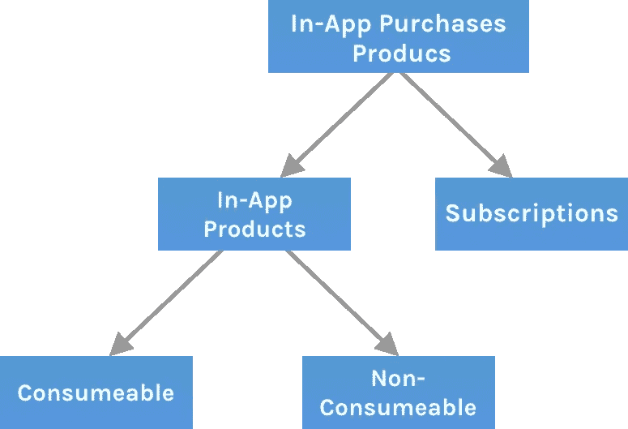
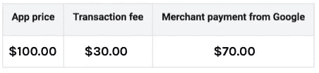
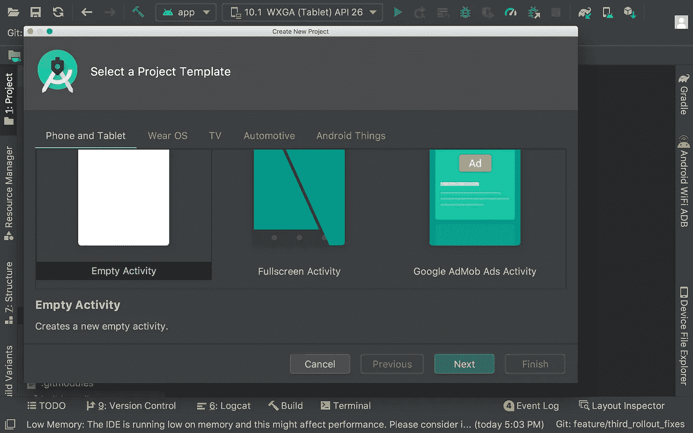
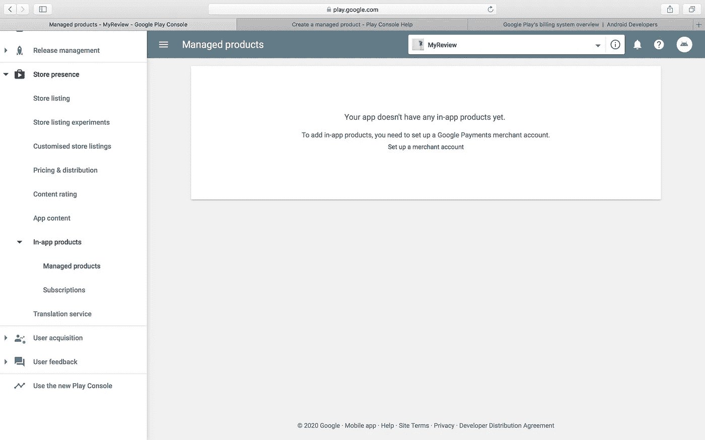
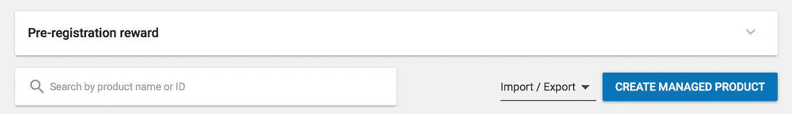
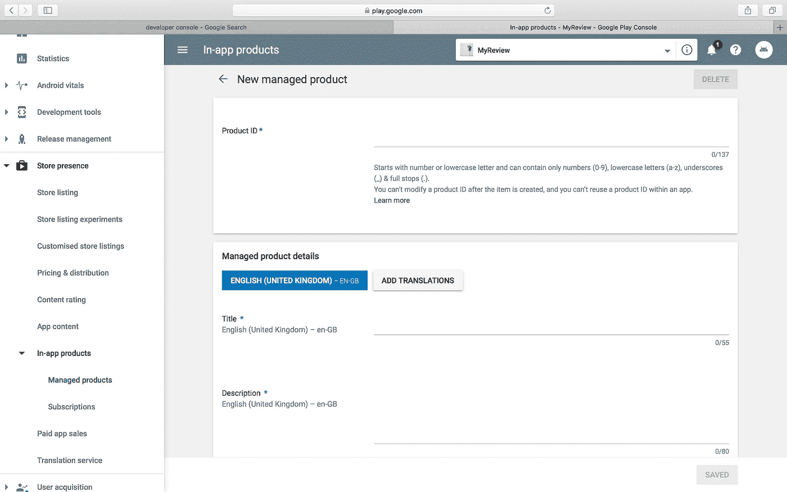
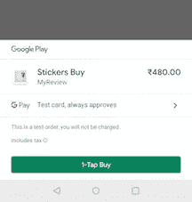
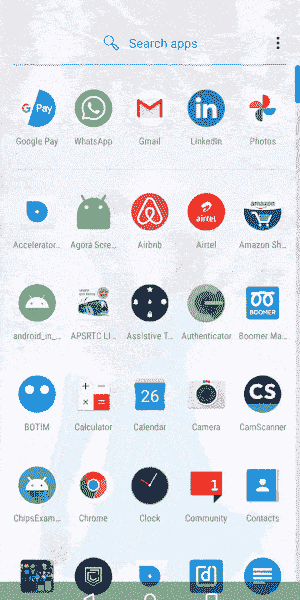

# 如何在你的 Android 应用中实现应用内购买

> 原文：<https://betterprogramming.pub/how-to-implement-in-app-purchases-in-your-android-app-7cc1f80148a4>

## 应用内购买整合完整指南


# 介绍

Google Play 应用内购买是在 Android 应用上销售数字产品或内容的最简单的解决方案。因此，许多想要销售数字商品或向用户提供高级会员资格的应用程序开发人员可以简单地使用 Google Play 应用程序内的计费流程来顺利轻松地结账。

在本文中，我们将检查在 Android 应用上实现应用内购买以及在 Google Play 控制台上创建应用内付费产品的端到端流程。

如果你想直接进入代码，这里是回购:

[](https://github.com/pavan5208/android_in_app_purchase_sample) [## pavan 5208/Android _ in _ app _ purchase _ sample

### 此时您不能执行该操作。您已使用另一个标签页或窗口登录。您已在另一个选项卡中注销，或者…

github.com](https://github.com/pavan5208/android_in_app_purchase_sample) 

我们开始吧！

# Google Play 计费系统概述

在直接进入代码之前，我们先了解一下计费系统的基本概念。要知道的一个重要的事情就是我们能卖给用户什么样的产品。Google Play 的计费系统帮助我们销售以下类型的数字内容:



那么现在让我们来了解一下其中的每一个。应用内购买主要包括两类项目:一次性产品和订阅。

## **一次性产品**

从名称本身来看，我们知道这是一次性购买，没有重复费用。一次性产品是指用户可以一次性购买的产品。同样，这个一次性产品有两个不同的类别，如上所示:

*   *可消费产品* 是用户可以重复购买以访问应用内内容的产品。例如，这可能是购买游戏中的货币，该货币将在适当的时候用完，用户可以再次购买可消耗的产品来获得货币、食物等。
*   *非消耗性产品* 是一种用户可以购买永久利益而无需反复购买的产品。主要是，我们使用这种产品为用户提供高级会员资格，用于移除广告、进入游戏中的特定级别等。

## *订阅*

从名称本身来看，我们可以理解我们正在谈论的是一次重复购买，以获得对应用程序内容的访问权限。

在用户取消订阅之前，订阅会自动续订，这意味着在用户取消订阅之前，会定期向用户收取费用，例如一个月、六个月、一年等。例如，这些订阅主要用于音乐流服务、在线杂志等情况。

# Google Play 向开发者收取的交易费用

我们需要向谷歌支付使用应用内购买的交易费。Google Play 中所有购买的交易费是用户每次交易支付价格的 30%。这意味着开发者获得 70% 的报酬，剩下的 30%归发行伙伴和运营费。

例如，如果支付 100 美元作为购买，那么开发者将获得 70 美元，而谷歌交易费将是 30 美元。



# 应用内购买的 Android 实现

让我们采取循序渐进的方法来更好地理解这一点。如果你不想经历这些步骤，而是想直接跳到代码中，这里有 [GitHub repo](https://github.com/pavan5208/android_in_app_purchase_sample) 。

让我们从编码开始！

## 1.让我们首先创建一个示例应用程序



## 2.创建项目后，让我们在应用程序级别或模块级别将计费客户端依赖项添加到 build.gradle 文件中——无论您想添加到哪里

```
dependencies {
    def billing_version = "3.0.0"//Kotlin
   implementation "com.android.billingclient:billing-ktx:$billing_version"
}
```

如果你正在使用 Kotlinm，使用上面的依赖关系，因为 KTX 模块包含 Kotlin 扩展和协程支持，这将为我们提供方便。否则，您可以添加以下内容并同步 Gradle 文件以下载您需要的依赖项

```
implementation 'com.android.billingclient:billing:$billing_version'
```

## 3.在继续下一步之前，我们需要将一款应用上传到 Play Store

添加完库后，我们需要生成一个构建并发布应用程序。它可以发布到内部测试跟踪，这限制了出于测试目的的访问。

**注意:**记住我们上传到 Play Store 的应用版本。测试的版本应该是相同的——否则，我们会遇到不相关的问题。

## 4.发布应用程序后，我们需要创建我们想要销售的产品

要创建应用内产品，请导航至:

*商店存在→应用内产品→被管理产品*

然后，我们将看到下面的页面，在这里我们可以创建我们的产品。



首先，点击“建立一个商家账户”，并填写要求基本信息的表格，如姓名、地址、电子邮件等。之后，单击“创建被管理产品”选项。



然后，它导航到产品创建页面，如下所示:



我们在创建产品 ID 时需要小心一点，因为它不能在以后被修改，并且记住它应该是唯一的 ID。填写完之后，在标题和描述中填入适当的信息。当我们启动购买流程时，这将对用户可见。



**注意:**完成产品的创建后。复制所有产品 id，并将它们保存在您的服务器上。我们需要这些产品 id，因为这些是需要提供给计费客户端以获取信息、发起购买等的产品 id。否则，如果你是无服务器的，把它们保存在一个常量文件中。

## 5.初始化计费客户端

现在一切都已经在 Google Play 上完成了，让我们回到代码库，开始处理应用内购买流程。在我们的活动中，首先让我们创建一个方法`setUpBillingClient`，我们可以在其中初始化计费客户端，如下所示:

我们使用提供的构建器模式来创建计费客户端实例。为此，我们需要提供一个`PurchasesUpdatedListener`，，在这里我们可以得到与任何购买相关的回调。基本设置完成后，我们将在后面讨论这一部分。

> **"BillingClient** 是库和应用程序代码之间通信的主要接口。它为应用内计费提供了便利的方法。我们可以为您的应用程序创建该类的一个实例，并使用它来处理应用程序内的计费操作。它为许多常见的应用内计费操作提供了同步(阻塞)和异步(非阻塞)方法。所有方法都应该从 Ui 线程调用，所有异步回调也将在 Ui 线程上返回”“ [Android 开发者文档](https://developer.android.com/reference/com/android/billingclient/api/BillingClient)

## 6.在计费客户端实例上启动连接

一旦创建了客户端实例，我们需要在创建的实例上启动一个连接:

一旦我们在`onBillingSetupFinished`中收到回调，我们可以使用`billingResult.responseCode`来检查连接是否建立成功。然后，我们可以继续启动购买流程或查询我们的产品等。

## 7.让我们查询一下现有的产品

我们需要创建一个`SkuDetailsParams` 实例来启动对 SKU 详细信息的查询。我们需要将 SKU 列表及其类型设置为`SkuDetailsParams`。

可能的 SKU 类型是应用内产品和订阅，如上所述。

一旦`SkuDetailsParams`准备就绪，我们需要在创建的计费客户端实例上调用`querySkuDetailsAsync`方法。

一旦获取了项目，我们就可以更新并在屏幕上显示它们。因为我们只有一个单元，所以让我们创建一个简单的 XML 文件来显示细节。

## 8.创建用户界面以显示 SKU 的详细信息

让我们创建 XML 文件，用标题和描述字段向用户显示信息。添加一个按钮，这样当用户点击时，我们可以开始购买流程。

## 9.根据“QueryPurchases”的结果更新 UI

通过使用扩展，尝试自己编写更好的代码。

## 10.点击购买按钮，启动购买流程

因为我们已经获取了 SKU 的详细信息，所以我们可以启动计费流程。

## 11.让我们在' purchaseUpdateListener '中处理购买结果

如果`billingResult`的响应代码是 OK，例如`0` ，那么购买就成功了，我们需要处理消耗品和非消耗品购买的流程(这在上面的被管理产品一节中讨论过)。

## 12.处理消耗品和非消耗品的购买—然后授予用户使用特定功能的权限

对于非消耗品购买，我们需要通过计费客户端确认购买。然而，对于消耗品的购买，我们需要通过调用计费客户端上的`consumeAsync`来消费它们。

以下是输出:



# 应用内购买的安全问题

应用内购买会有很多安全问题。常见的问题是中间人攻击。所以我们需要采取一些小的安全措施。

如果您有一个服务器，将 purchase 实例中可用的购买令牌发送到服务器，在服务器端，使用 Google Developers 提供的 API 来验证该令牌，验证购买，然后授予用户访问权限。

让我们在我即将发表的关于应用内购买的高级处理的文章中讨论更多的安全漏洞和算法。

# 摘要

以上就是全部内容，希望你已经了解了一些关于应用内产品的知识。使用您帐户中简单的应用程序内集成，从世界各地将金额存入您的帐户，而无需支付网关带来的麻烦。通过添加电子邮件注册为授权测试员，这样您就可以免费测试应用程序。

所有这些建议都不能放在一篇文章中，所以让我们看看如何处理基本错误代码，如何详细测试应用内购买，更好的模块管理，重试策略等。在我即将发表的文章中。

# 参考

*   [安卓开发者:应用内购买设置](https://developer.android.com/google/play/billing/getting-ready)
*   [CodeLabs:应用内购买](https://codelabs.developers.google.com/codelabs/play-billing-scalable-kotlin/index.html?index=..%2F..index#0)