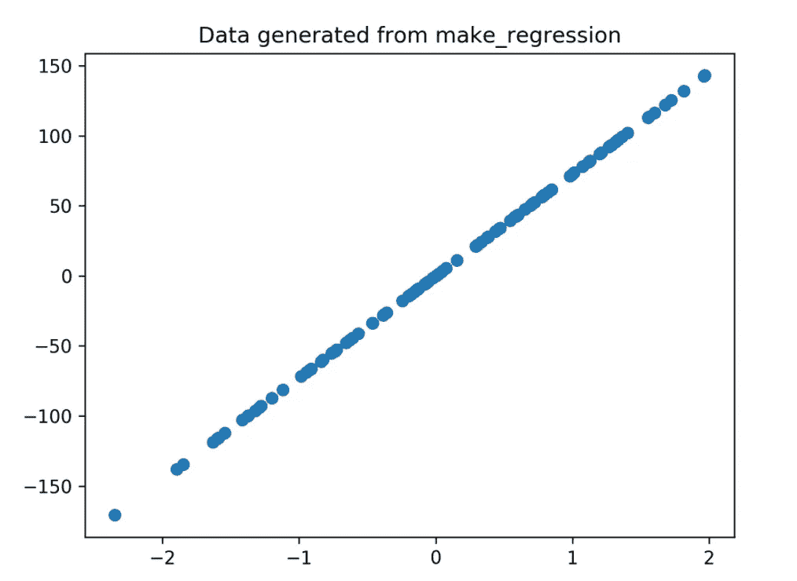
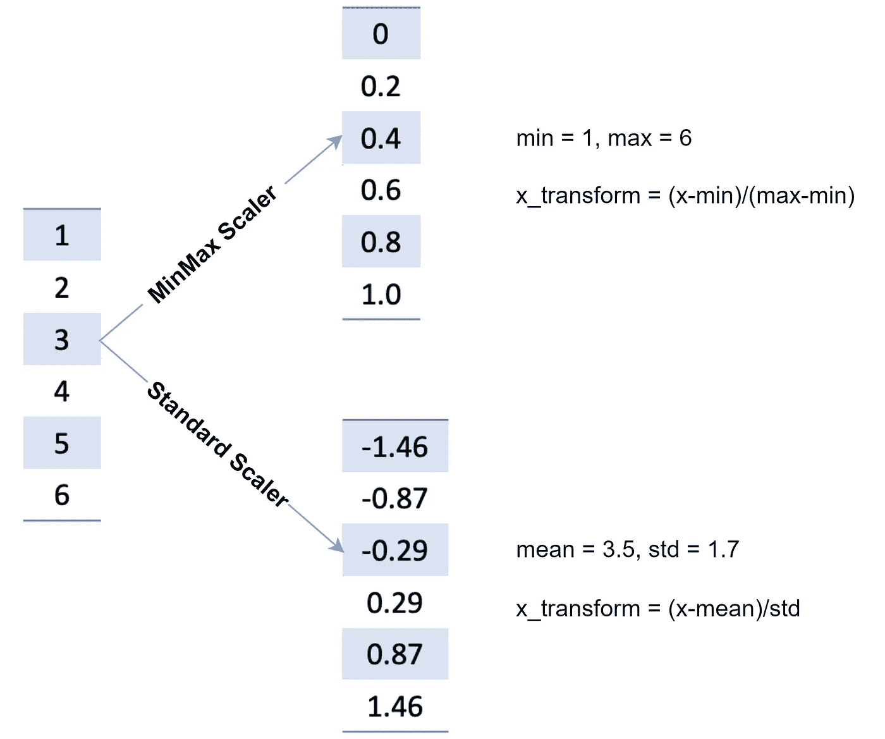
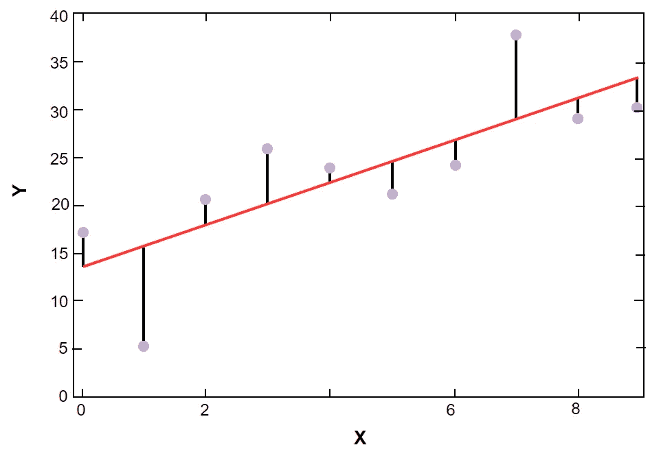

# 如何在 Scikit-learn 中实现线性回归

> 原文：<https://betterprogramming.pub/how-to-implement-linear-regression-in-scikit-learn-e459f6f6a3eb>

## 立即开始使用 Scikit-了解


图片来源:作者

机器学习正迅速成为就业市场上最受欢迎的技能。具体来说，雇主正在寻找在最流行的 ML Python 库 [scikit-learn](https://scikit-learn.org/stable/index.html) 方面有经验的候选人。Scikit-learn 是 Python 的一个库，为机器学习开发者提供了许多无监督和有监督的学习算法。

今天，我们将探索这个令人敬畏的库，并向您展示如何实现它的核心功能。最后，我们将结合我们所学的知识来实现您自己的线性回归算法。

以下是我们今天要讲的内容:

*   [什么是 Scikit-Learn？](#e323)
*   [sci kit 入门-学习](#e7bf)
*   [数据集和导入. sklearn](#e6e7`)
*   [生成合成回归数据](#19e2)
*   [用 Matplotlib 绘制数据](#eafb)
*   [数据预处理](#5998)
*   [Scikit-learn 线性回归:实现算法](#2a0f)
*   [包装和后续步骤](#7259)

# 什么是 Scikit-Learn？

Scikit-learn(简称 sklearn)是一个免费开源的 Python 机器学习库。它旨在与 SciPy 和 NumPy 库合作，并简化 Python 中的数据科学技术，内置对流行的分类、回归和聚类机器学习算法的支持。

Sklearn 是许多 ML 工具无缝协作的统一点。它还为数据科学家提供了导入、预处理、绘制和预测数据的一站式工具包。

这个项目是由 David Cournapeau 在 2007 年 Google 代码之夏期间发起的，这个库在过去的十年中在受欢迎程度和功能上都有所增长。Scikit-learn 现在是 Github 上最受欢迎的机器学习库。

Scikit-learn 提供工具用于:

*   **回归**，包括线性回归和逻辑回归
*   **分类**，包括 K-最近邻
*   **型号选择**
*   **聚类**，包括 K-Means 和 K-Means++
*   **预处理**，包括最小-最大归一化

## scikit-Learn 的优势

开发者和机器学习工程师使用 Sklearn 是因为:

*   很好学，也很好用。
*   它是免费和开源的。
*   在机器学习，甚至深度学习的各个方面和算法上都有帮助。
*   它的功能非常强大。
*   详细的文档和活跃的社区。
*   这是使用最广泛的机器学习工具包。

## 与 scikit-learn 一起使用的库

Scikit-learn 是一个扩展现有 SciPy 堆栈(有时称为 NumPy 堆栈)功能的工具包。下面，我们概述 Scikit-learn 如何使用 SciPy 堆栈中的每个库进行数据分析。

*   **NumPy** :高级线性代数和 NumPy 数组运算。
*   **SciPy** :包含优化、线性代数和其他基本数据科学功能的模块。
*   **Matplotlib** :二维或三维可视化和数据绘图。
*   **IPython** :增加控制台交互性。
*   符号计算和计算机代数。
*   **Pandas** :数据操作和分析，主要通过数据框和表格。

# Scikit 入门-学习

今天，我将向您展示如何用 scikit learn 实现您自己的线性回归算法。在我们开始之前，您需要一些基础知识:

*   ML 和数据科学的目的。
*   机器学习算法彼此有何不同。
*   线性代数，它与 ML 的关系。

## 导入 sci kit-学习

首先，您需要安装 scikit-learn。我们将为此使用 pip，但是如果您愿意，您也可以使用 conda。

为了让 scikit-learn 正确工作，您需要一个 64 位版本的 Python 3，以及 NumPy 和 SciPy 库。对于可视化数据绘图，您还需要 matplotlib。

要安装 Scikit-learn，请在 Python 3 中输入以下代码行:

```
pip install -U scikit-learn
```

然后，要验证安装，请输入:

```
python -m pip show scikit-learn # displays which version and where sklearn is installed
python -m pip freeze # displays all packages installed in virtualenv
python -c "import sklearn; sklearn.show_versions()"
```

***Linux 用户*** *:在上面几行*`*pip*`*`*python*`*后面加上*`*3*`*`*pip3*`*`*python3*`*。****

**现在，要安装 NumPy、SciPy 和 matplotlib，请输入:**

```
**pip install -U numpy
pip install -U scipy
pip install -U matplotlib**
```

**正如我们之前所做的那样，我们将使用以下信息来确认每个组件的安装:**

```
**python -m pip show numpy
python -m pip show scipy
python -m pip show matplotlib**
```

**现在您已经准备好开始使用 Scikit-learn 了！让我们通过导入数据集来开始我们的教程。**

# **数据集和导入. sklearn**

**所有机器学习项目的起点都是导入数据集。Scikit-learn 包括三个有用的选项来获取数据进行练习。**

**首先，该库包含著名的数据集，如`iris`分类数据集或`Boston housing price`回归数据集，如果你想在经典集上练习的话。你也可以使用 scikit-learn 的预定义函数直接从互联网上下载真实世界的数据集，比如`20 newsgroups`。最后，您可以使用 Scikit-learn 的数据生成器简单地生成一个随机数据集来匹配某个模式。**

**这些选项中的每一个都要求您导入`datasets`模块:**

```
**import sklearn.datasets as datasets**
```

**首先，我们将导入`iris`分类集，看看它是如何存储在 sklearn 中的。**

```
**iris = datasets.load_iris()**
```

**`iris`数据集作为一个类似字典的对象导入，其中包含所有必需的数据和元数据。数据存储在`n_samples` * `n_features`的 2D 数组`data`域中。**

**我们可以通过使用`DESCR`、`shape`和`_names`函数来获得数据及其格式的描述。如果我们打印这些函数的结果，我们将发现使用`iris`集合所需的所有信息。**

*****目标与特点*** *:***

***所有的 ML 算法都试图增加自己对某个变量的理解，称为* ***目标变量*** *。然后，算法试图揭示目标变量和其他传递的* ***特征变量*** *之间的看不见的关系。***

```
**import sklearn.datasets as datasetsiris = datasets.load_iris()print("iris dataset is {}".format(iris.DESCR))print("iris data size is {}".format(iris.data.shape))print("iris target size is {}".format(iris.target.shape))print("iris data has {} features, the feature names are {}".format(iris.data.shape[1], iris.feature_names))print("iris data has {} samples, the target label names {}".format(iris.data.shape[1], iris.target_names))**
```

# **生成综合回归数据**

**如果不想使用任何内置数据集，可以生成自己的数据来匹配所选的分布。下面，我们将看到如何使用`matplotlib`生成回归数据并绘制它。**

**首先，使用以下命令导入`matplotlib`:**

```
**import matplotlib.pyplot as plt**
```

**现在，我们将生成一个包含一个要素和一个信息要素的简单回归数据集。**

```
**X, y = datasets.make_regression(n_features=1, n_informative=1)**
```

**这会生成我们的数据集，并将其保存到 2D 数据集对象`x, y`。改变`make_regression`功能的参数将改变生成数据的特征。这里，我们将`features`和`informative`参数从默认的`10`改为`1`。其他流行的参数包括控制样本数量的`samples`和控制跟踪多少目标变量的`targets`。**

*****信息性与非信息性特征:*****

***一个* ***信息特征*** *是为 ML 算法提供有用的、可应用的信息的特征。这些是用于在回归分析算法中形成趋势的数据点。不提供信息的特征被认为是无用的。***

# **使用 Matplotlib 绘制数据**

**我们现在将通过输入以下内容来绘制此图:**

```
**fig, axe = plt.subplots(dpi = 300)
axe.scatter(X, y, marker='o')
axe.set_title("Data generated from make_regression")
fig.savefig("output/img.png")
plt.close(fig)**
```

*   ****第 1 行**将绘图元组变量解包为单独的变量`fig`和`axe`。这允许我们保存图形并操作这些单独的属性。**
*   ****第 2 行**使用我们生成的数据集对象`x,y`生成散点图。`marker`参数决定了将使用什么样的视觉来标记每个数据点，在本例中是一个点(`o`)。**
*   **第三行设定了我们生成的情节的标题。**
*   ****第 4 和第 5 行**然后将图形保存到一个`.png`图像文件并关闭当前图形。**

****

**生成的回归图**

# **数据预处理**

**大多数 ML 工程师都认为数据预处理是项目过程中最重要的步骤之一。**

**没有完美的数据集。可能存在无关的数据点、报告错误和任何数量的干扰算法预测的问题。为了防止这种情况，工作数据科学家在数据进入 ML 算法之前花了很多时间对其进行清理、标准化和缩放。**

**在这个阶段，您将使用的最常见的函数类型是标准化函数，即`MinMax`和`Standard`函数。这是因为数据中的要素的范围会有所不同。然而，几乎所有的最大似然算法都使用欧氏距离来度量两个数据点之间的距离。缩放标准化功能允许算法通过缩放集合中的所有点以适合相同的范围来适当地测量距离。**

**两者都要求您首先导入`sklearn.preprocessing`和`numpy`:**

```
**import sklearn.preprocessing as preprocessing
import numpy as np**
```

# **最小最大值**

**`MinMax`将每个图形的范围缩小到 0 到 1 之间。**

```
**​​
import sklearn.preprocessing as preprocessing

minmax = preprocessing.MinMaxScaler()
# X is a matrix with float type
minmax.fit(X)
X_minmax = minmax.transform(X)**
```

*   ****第 3 行**创建一个`MinMaxScaler`名为`minmax`。**
*   ****第 5 行**将原始缩放矩阵与缩放器相匹配。**
*   ****第 6 行**转换原始矩阵以匹配拟合矩阵`X`。**

**下面是我们`MinMaxScalar`的一个实例:**

```
**import sklearn.preprocessing as preprocessingimport numpy as npX = np.random.randint(2, 10, size=(4, 2))X2 = np.random.randint(100, 10000, size=(4, 2))X = np.concatenate((X, X2), axis=1)print("The original matrix")print(X)#### min-max scalerminmax = preprocessing.MinMaxScaler()minmax.fit(X)X_minmax = minmax.transform(X)print("The transform data using min-max scaler")print(X_minmax)**
```

**首先，我们使用 Numpy `randint`创建一个大小为四行两列的矩阵，其数量从 2 到 10 不等。**

**然后，我们创建另一个同样大小的矩阵，其数量从 100 到 1000 不等。这两个指标被连接成一个。**

**从第 8 行的输出中，您可以看到不同列的数字范围有很大的不同。**

**然后，我们应用最小-最大缩放器来缩小和标准化特征之间的范围。**

# **标准**

**如果您的数据遵循标准偏差，您可以使用`StandardScaler`来代替。该定标器将传递的数据集与标准偏差一起拟合为标准标度:**

```
**import sklearn.preprocessing as preprocessing

std = preprocessing.StandardScaler()
# X is a matrix
std.fit(X)
X_std = std.transform(X)**
```

**如上所述，我们首先在第三行创建缩放器，在第五行拟合当前矩阵，最后在第六行转换原始矩阵。**

**让我们看看这如何扩展我们上面的例子:**

```
**import sklearn.preprocessing as preprocessingimport numpy as npX = np.random.randint(2, 10, size=(4, 2))X2 = np.random.randint(100, 10000, size=(4, 2))X = np.concatenate((X, X2), axis=1)print("The original matrix")print(X) std = preprocessing.StandardScaler()std.fit(X)X_std = std.transform(X)print("The transform data using Standard scaler")print(X_std)**
```

****

**缩放方法比较**

# **Scikit-learn 线性回归:实现算法**

**现在，我们将使用*波士顿房价*样本数据实现线性回归机器学习算法。与所有 ML 算法一样，我们将从导入数据集开始，然后使用历史数据训练我们的算法。**

**线性回归是真实企业经常使用的预测模型。线性回归试图预测标量响应和相关解释变量之间的关系，以产出具有现实意义的价值，如产品销售或住房价格。当您拥有以前的一致数据的日志，并且希望预测如果模式继续下去接下来会发生什么时，最好使用此模型。**

**从数学的角度来看，线性回归就是对数据进行拟合，使每个数据点与预测值之间的残差之和最小。换句话说，我们正在最小化数据和估计模型之间的差异。**

**如下图，红线是我们求解的模型，蓝点是原始数据，点与红线的距离是残差。我们的目标是最小化残差的和。**

****

**残差、数据与预测的和**

# **如何实现线性回归**

```
**import sklearn.datasets as datasetsfrom sklearn.model_selection import train_test_splitfrom sklearn.linear_model import LinearRegressionimport sklearn.metrics as metricshouse = datasets.load_boston()print("The data shape of house is {}".format(house.data.shape))print("The number of feature in this data set is {}".format(house.data.shape[1]))train_x, test_x, train_y, test_y = train_test_split(house.data, house.target, test_size=0.2, random_state=42)print("The first five samples {}".format(train_x[:5]))print("The first five targets {}".format(train_y[:5]))print("The number of samples in train set is {}".format(train_x.shape[0]))print("The number of samples in test set is {}".format(test_x.shape[0]))lr = LinearRegression()lr.fit(train_x, train_y) pred_y = lr.predict(test_x)print("The first five prediction {}".format(pred_y[:5]))print("The real first five labels {}".format(test_y[:5])) mse = metrics.mean_squared_error(test_y, pred_y)print("Mean Squared Error {}".format(mse))**
```

*   **在**第 6 行**，我们通过调用`load_boston`加载数据集。**
*   **在**第 12 行**，我们将数据集分成两部分:训练集(80%)和测试集(20%)。**
*   **在**第 23 行**，创建一个线性回归模型，并对其进行训练(在 sklearn 中，训练等于拟合)。**
*   **在**第 29 行**，我们调用`mean_squared_error`来评估该模型的性能。**

# **总结和后续步骤**

**您刚刚迈出了掌握 Scikit-Learn 的第一步。今天，我们讨论了 Sklearn 的用途，如何导入或生成样本数据，如何缩放我们的数据，以及如何实现流行的线性回归算法。**

**随着您继续您的 Scikit-learn 之旅，下面是接下来要学习的一些算法和主题:**

*   **支持向量机**
*   **随机森林**
*   **朴素贝叶斯模型**
*   **无监督学习**
*   **深度学习**
*   **逻辑回归**

***快乐学习！***