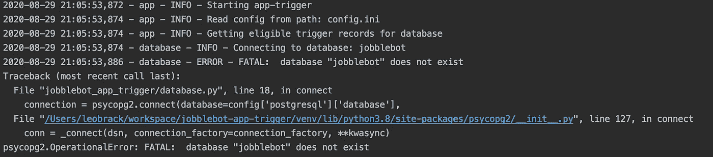
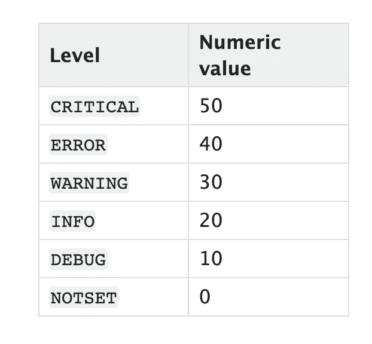

# 如何在 Python 应用程序中实现日志记录

> 原文：<https://betterprogramming.pub/how-to-implement-logging-in-your-python-application-1730315003c4>

## 实现日志记录的实用指南


Emile Perron 在 [Unsplash](https://unsplash.com?utm_source=medium&utm_medium=referral) 上拍摄的照片。

最近，我开始构建一个 Python 应用程序来查询 PostgreSQL 数据库，处理数据，并将后续的触发事件推送到 Kafka 队列。然而，在处理有趣的方面之前，我知道我需要把基础做好。任何应用程序的基础之一就是日志记录！

在本文中，我将解释 Python 中日志记录的一些关键特性，更重要的是，演示如何在我的应用程序中实现一个日志记录器。



连接到 PostgreSQL 时的错误日志示例—来自作者的图片。

# 打印(为什么不呢？)

要解决的第一个问题是:为什么不直接使用`print()`？很容易走捷径，在代码中添加`print`语句。我们都写过类似这样的代码:

```
print("Getting some docs...")
docs = getDocs()
print("Doc count %s", len(docs))
print("Finished")
```

一般来说，这对于小脚本或者在开发或调试过程中需要快速而简单的东西是很好的。然而，`print()`对于较大的应用程序来说并不是一个可行的日志解决方案——尤其是如果您计划将您的代码推广到生产环境中。

让我们来谈谈应该避免使用`print`的几个原因。首先，它只给你登陆`stdout`的选项。如果您正在记录大量数据，这将是一个问题。实际上，您希望将日志写在一个易于保存、备份和日后查询的地方。另一个原因是`print`语句在运行时不可配置。要打开/关闭特定的日志，您需要每次都修改您的代码。这意味着每当您需要打开调试日志记录时，都要将您的代码重新部署到生产环境中！除此之外，包含有价值的信息和上下文也更加困难，比如行号和日志消息生成的时间。

我可以继续，但希望你已经被说服了！

# 进入 Python 的日志模块

幸运的是，日志的重要性并不是一个新现象。Python 附带了一个现成的日志记录解决方案，作为 Python 标准库的一部分。使用`print`解决了前面提到的所有问题。例如:

*   自动向日志添加上下文，如行号和时间戳。
*   通过向应用程序传递一个配置文件，可以在运行时更新我们的日志。
*   很容易定制日志严重性，并为不同的环境配置不同的日志记录级别

让我们尝试一下，并设置一个非常基本的记录器:

运行该程序会得到:

```
INFO:__main__:Getting some docs...
INFO:__main__:Doc count 2
INFO:__main__:Finished
```

很简单！

这里，我们从 Python 标准库中导入了日志模块。然后我们更新了默认的基本日志级别来记录`INFO`消息。接下来，`logger = logging.getLogger(__name__)`实例化我们的日志记录实例。最后，我们通过调用`logger.info("")`将一个事件传递给日志级别为`INFO`的日志记录器。

乍一看，这个输出可能与使用`print()`非常相似。接下来，我们将扩展我们的示例日志记录器，以展示 Python 标准日志记录模块提供的一些更强大的特性。

## 日志级别

我们可以配置输出日志的严重性，过滤掉不重要的日志。该模块定义了整个频谱中的五个常数，使得区分消息变得容易。下表给出了日志记录级别的数值:



来自 [Python 文档](https://docs.python.org/3/library/logging.html#logging-levels)的日志级别。

重要的是不要用大量的消息淹没你的日志。为了获得简洁的日志，我们应该小心地为每个事件定义正确的日志级别:

```
logger.critical("Really bad event")
logger.error("An error")
logger.warning("An unexpected event")
logger.info("Used for tracking normal application flow")
logger.debug("Log data or variables for developing")
```

我倾向于使用调试级别来记录在应用程序中传递的数据。下面是在负责向 Kafka 发送事件的几行代码中使用三种不同日志级别的示例:

## 格式化日志

Python 日志模块的默认格式化程序不提供大量细节。幸运的是，很容易配置日志格式来添加我们需要的所有上下文，以生成非常有用的日志消息。

例如，我们在这里向日志消息添加了时间戳和日志级别:

```
formatter = logging.Formatter('%(asctime)s - %(levelname)s - %(message)s')
```

最佳实践是在日志中添加尽可能多的上下文。这可以通过向日志消息的元数据中添加结构化数据来轻松实现。例如，您可能已经扩展了您的应用程序，以便与多个工作人员一起运行。在这种情况下，在您进行调试时，知道哪个 worker 正在记录每个事件可能很重要，因此让我们向日志元数据添加一个 worker ID 上下文:

```
# Create the log formatterformatter = logging.Formatter('%(asctime)s - %(worker)s %(levelname)s - %(message)s')
handler.setFormatter(formatter)logger.info('Querying database for docs...', extra={'worker': 
'id_1'})
```

输出变成:

```
2020-09-02 22:06:18,170 - id_1 - INFO - Querying database for docs...
```

## 日志处理程序

既然我们已经有了来自应用程序代码各处的格式完美的日志，我们需要考虑这些日志的最终位置。默认情况下，日志被写到`stdout`，但是 Python 的日志模块为我们提供了将日志推到其他位置的功能。例如，将日志保存到磁盘上的`example.log`文件:

```
# create a file handler
handler = logging.FileHandler('example.log')
handler.setLevel(logging.INFO)
```

有几种类型的处理程序可以使用。有关完整列表，参见处理程序的[文档。还可以为不同的用例定义定制的日志处理程序。例如，](https://docs.python.org/3/library/logging.handlers.html#module-logging.handlers)[这个库](https://pypi.org/project/slacker-log-handler/)定义了一个日志处理器，用于将日志推送到 Slack！

总结一下。我们已经设置了 Python 标准日志模块，并将其配置为使用定制的日志格式记录到不同的位置。您可以在下面找到示例记录器的最终代码:

# 履行

到目前为止，您应该对 Python 日志模块的一些关键特性有了很好的了解。这很好，但是您应该如何实现所有这些不同的配置并管理应用程序文件中日志模块的导入呢？这是很多导游经常忽略的一点。以下是我决定如何处理它。

首先，我决定将所有日志配置提取到一个名为`logging.ini`的配置文件中。你可以在[官方文档](https://docs.python.org/3/library/logging.config.html#configuration-file-format)中找到所有你需要的关于如何格式化日志文件的信息，所以我不会在这里一一赘述。目前我的`logging.ini`超级基础。当应用程序停止开发并准备部署时，我将扩展日志记录配置以处理不同的环境，在磁盘上循环日志，并向 Slack 通道发送警报。

从代码的角度来看，这确实简化了实现，因为设置日志处理程序和格式化程序所需的样板文件要少得多。上面，我们有 15 行代码设置了一个格式化程序和一个处理程序。很容易想象，随着用例越来越复杂，这个数字会变得更大。现在，所有的复杂性都被抽象到配置文件中了。结果是:要实现你的记录器，你只需要在你的应用程序中增加两行代码！

```
import logging.configlogging.config.fileConfig(fname='logger.ini')
```

相当整洁！但是这段代码应该放在哪里呢？

我的应用程序以一个`__main__.py`作为入口点。我决定在这个文件中实现我的日志记录器，以便不影响包含在`app.py`中的主要功能。下面的`__main__.py`将处理读取配置文件并将配置应用到您的记录器:

最后，我们需要通过发射一些日志来利用我们的创造！但是这些消息不会由`__main__`函数生成，那么我们应该如何处理将我们的日志程序传递给应用程序中的其他文件和函数呢？

这又变得微不足道了。要在另一个文件中使用 logger，我们只需要导入日志模块并实例化它。它将自动继承我们在`__main__`中传递给它的配置。例如，要开始在`app.py`中记录消息:

上面的调试信息将根据从`logging.ini`读取的日志配置进行处理。对于应用程序中的其他 Python 文件也是如此，只要你在顶层使用`import logging`。是的，真的就这么简单！

总的来说，您不仅看到了使 Python 的日志模块成为您军械库中一个令人敬畏的工具的一些特性，而且还看到了它是如何容易实现的。

感谢您的阅读。我希望这个指南对你有用。伐木快乐！