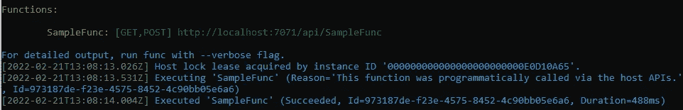

# 如何实现微软？Azure 中的 Identity.Web 函数 V4 和。网络 6

> 原文：<https://betterprogramming.pub/how-to-implement-microsoft-identity-web-in-azure-functions-v4-and-net-6-7e6ef97b2926>

## 获取 Microsoft 时遇到问题。Identity.Web 致力于最新的 Azure 功能 V4？这本指南是给你的！


照片由[布雷特·乔丹](https://unsplash.com/@brett_jordan?utm_source=medium&utm_medium=referral)在 [Unsplash](https://unsplash.com?utm_source=medium&utm_medium=referral) 拍摄

我最近决定将我的无服务器 Azure Functions 应用程序从。网芯 3.1 到最新。NET 6。

和一样。NET Core 3.1，我也遇到过很多麻烦，在 Azure Functions 中实现`Microsoft.Identity.Web`包。经过几个小时的研究，我找到了一种方法，最终让它工作，并为您节省一些麻烦，我为您创建了这个指南。

# 什么是微软。身份网？

Microsoft Identity Web 身份验证库通过在后台使用 Microsoft identity platform，在您的 Web APIs 上添加了身份验证和授权支持。有了这个库，您可以添加一个身份验证中间件，并使用微软身份验证库(MSAL)。(参见[微软文档](https://docs.microsoft.com/en-us/azure/active-directory/develop/microsoft-identity-web))

在 Azure Functions 上，你将能够针对你的 Azure Active Directory (AAD)认证和授权请求。

# 实施过程中的问题

经过一番研究，我偶然发现了这个文档，关于如何用 Azure 函数实现 Microsoft Identity Web:

[](https://github.com/AzureAD/microsoft-identity-web/wiki/Azure-Functions) [## azure Functions AzureAD/微软-身份-网络维基

### 此时您不能执行该操作。您已使用另一个标签页或窗口登录。您已在另一个选项卡中注销，或者…

github.com](https://github.com/AzureAD/microsoft-identity-web/wiki/Azure-Functions) 

如果您继续下去，并以这种方式实现它，请将所有引用更改为最新的。NET 6 和 Azure Functions v4，你会面临第一个问题。最新的微软。Identity.Web(到目前为止:`V1.23.0`)与 Azure 功能仍然存在一些兼容性问题。您将收到以下异常:

```
System.Private.CoreLib: Exception while executing function: SampleFunc. Microsoft.Identity.Web: Could not load file or assembly 'Microsoft.IdentityModel.Tokens, Version=6.15.1.0.
```

所以我继续研究，直到我在这里找到了一个有前途的向导:

[](https://dev.to/425show/securing-a-net-azure-function-with-azure-ad-31da) [## 使用 Azure AD 保护. NET Azure 功能

### 上周社区里有人问我要一个展示如何用 Azure AD 保护 Azure 功能的示例…

开发到](https://dev.to/425show/securing-a-net-azure-function-with-azure-ad-31da) 

在这里，克里斯特斯·马茨卡斯建议，你需要使用旧版本的微软。让你的 Azure 函数 v4 与它一起工作。`V1.5.1`确切地说。说到做到，我把我的包版本降级到这个版本，错误就没有了。不要忘记在降级软件包后重新构建您的解决方案！

好吧，至少这个错误消失了，本地调试会话显示了一个有希望的结果:



成功地在本地执行认证功能。

大多数导游都在这里结束了，但是之后还是会有很多麻烦。我想在 Azure 上而不是在本地使用该功能。那么，当它在云上运行时，会发生什么呢？好吧，如果你去了`LogStream`，你会面对这条信息:

```
Unable to fetch the host status of your function app. To use log streaming, please make sure your function host is running.
```

如果您导航到`Functions`，您将看到以下消息:

```
Azure Functions runtime is unreachable
```

现在你没有任何线索，可能会出什么差错，甚至`Diagnose and solve problems`在这里也帮不了你。这非常令人沮丧，因为甚至没有一条异常消息告诉你出了什么问题…

解决方案是一些扩展方法，它们增加了云上的 Azure Functions 运行时所需的依赖性，但不是本地的。在接下来的指南中，我会告诉你该怎么做。

# 让它工作！

## **准备你的项目**

要建立一个函数项目，你需要最新版本的 Azure 函数核心工具。

1.  添加[微软。identity . web . project templates](https://www.nuget.org/packages/Microsoft.Identity.Web.ProjectTemplates/)添加到您的 dotnet CLI。
2.  使用以下内容创建新项目:

```
dotnet new func2 --auth SingleOrg
```

3.替换您的。包含以下内容的 csproj 文件:

如上所述，确保这里引用的是“神奇的”包版本`1.5.1`。重新生成项目以应用更改。

4.在您的`appsettings.json`文件中插入您的域名、TenantId 和 ClientId。

(感谢[克里斯特斯·马茨卡斯](https://dev.to/christosmatskas)的这些步骤！)

**【2022 年 3 月 7 日更新】:**

如果您在 Azure 函数上遇到以下错误消息:

```
Could not load file or assembly 'Microsoft.IdentityModel.Logging, Version=6.15.0.0, Culture=neutral'. The system cannot find the file specified.
```

只需在您的`<PropertyGroup>`属性之间添加`<_FunctionsSkipCleanOutput>true</_FunctionsSkipCleanOutput>`。csproj 文件。

## 添加所需的依赖项

棘手的部分来了。我们需要添加本地没有的依赖项，但是，我们在云中的 Azure Functions 运行时中有它们。我在 github 的一个问题上找到了以下答案:

[](https://github.com/AzureAD/microsoft-identity-web/issues/916#issuecomment-785512851) [## [Bug] Azure 功能在门户问题# 916 AzureAD/Microsoft-identity-web 中出现“损坏”

### 您使用的是哪个版本的 Microsoft Identity Web？请注意，要获得帮助，您需要运行最新版本。哪里…

github.com](https://github.com/AzureAD/microsoft-identity-web/issues/916#issuecomment-785512851) 

我们需要为身份验证和授权添加以下扩展方法:

**authenticationstartupextensions . cs:**

**authorizationstartupextensions . cs:**

添加扩展方法后，我们需要在我们的`Startup.cs`中使用它们:

这样，Azure Functions 运行时所需的所有依赖项都被再次添加，它可以成功地部署到云中。

(感谢[韦恩·亚当斯](https://github.com/Valks)的这个解决方案！)

## 查看结果

1.  导航至`Functions` → `SampleFunc` → `Code+Test`，点击`Test/Run`。
2.  添加表头:`Authorization` = `Bearer <your-access-token>`。
3.  并点击`Run`。

您现在应该得到一个成功的身份验证响应，如下所示:


成功认证

日志还应该指示成功的执行:

```
2022-02-21T14:18:44.706 [Information] Executing 'SampleFunc' (Reason='This function was programmatically called via the host APIs.'2022-02-21T14:18:44.707 [Information] Executing Authentication Request...2022-02-21T14:18:44.707 [Information] Authentication Success: True.2022-02-21T14:18:44.707 [Information] Executed 'SampleFunc' (Succeeded, Duration=1ms)
```

希望在不久的将来会有一个更新，这样会更容易实现。如果发生这种情况，我会在这里发布更新。

代码可以在我的 Github 上找到:

[](https://github.com/TobiStr/Azure.Functions.Identity.Web) [## GitHub - TobiStr/Azure。Functions.Identity.Web:如何在 Azure 上实现微软身份网…

### 如何在 Azure Functions v4 上实现 Microsoft Identity Web？身份。网络…

github.com](https://github.com/TobiStr/Azure.Functions.Identity.Web) 

无论如何，感谢你的阅读，我希望我能让你在这个话题上少受些挫折！