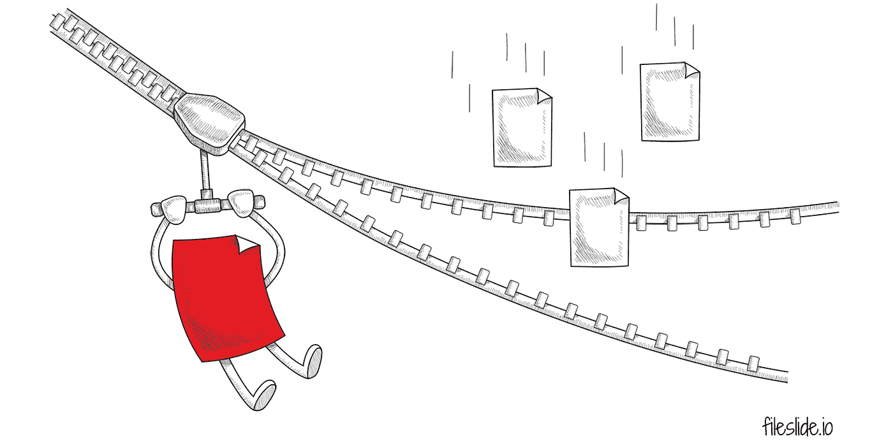
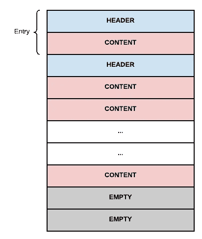
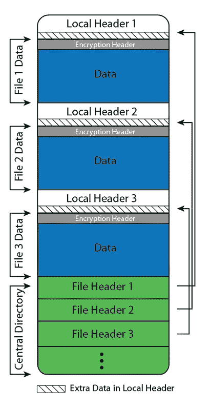

# 如何在 Ruby Web Apps 中实现多文件下载

> 原文：<https://betterprogramming.pub/how-to-implement-multi-file-downloads-in-ruby-web-apps-a7a6090f3ab5>

## 实时流式下载 tar 和 zip 文件



图片来源:作者

我在威尔康奈尔医学院的第一个挑战是开发一个文件分发门户，允许基因组测序实验室通过网络向合作者分发大数据文件。一个核心需求是一个选择列表功能，这样用户可以创建文件集，从浏览器上一次性下载。

HTTP 很久以前就不具备从一次浏览器点击中下载多个文件的能力，但这是大多数基于 web 的文件服务的必备功能。更具体地说，这种限制是由于底层 TCP 将所有传输视为单个文件或流，导致 [*行首阻塞*](https://abhishekvrshny.medium.com/head-of-line-hol-blocking-in-http-1-and-http-2-50b24e9e3372) *。* HTTP/3 [承诺在多路复用和多文件下载方面有更大的灵活性](https://www.smashingmagazine.com/2021/08/http3-core-concepts-part1)，因为它位于 QUIC 协议之上，但浏览器文件下载的广泛采用和新标准仍需一段时间。

向浏览器扩展和下载管理器软件提供文件 URL 列表始终是一个选项，但这是一个硬推销，尤其是对于一次性访问者来说不方便，他们不想安装新软件只是为了下载一组数据。我们最好的解决方法是将文件存档(如 tar 或 zip)到一个文件中供下载，这仍然是 Google Drive、MS SharePoint 和所有大公司使用的方法。

问题就变成了:先存档后下载，还是通过流式下载即时存档？归档到一个临时文件，然后从磁盘提供静态文件，这很有吸引力，因为它实现起来既熟悉又简单。然而，真正的挑战是在归档文件创建之后实现所有的东西，例如:用户要等多久，当下载准备好了，你如何通知他们？您将文件保留多长时间以供下载？如果文件在归档文件创建后、下载完成前发生了变化，该怎么办？只有在考虑了所有这些因素之后，流式传输才成为明显的赢家。


# 使用 Ruby Rack 套接字劫持流式传输 Tar 文件

与 zip 文件相比，下载 tar 文件对用户的技术能力要求稍高一些——tar 文件提取已经被 OSX 本地支持了一段时间，但直到最近才被 Windows 支持，对于普通网络用户来说，tar 文件不像 zip 文件那样普遍或熟悉。如果您的用户更专业，就像我的生物信息学数据分发门户一样，tar 通常是首选格式。

tar 和 zip 格式的主要区别在于 tar 没有被压缩，这使得 tar 文件的结构相对简单，如下所述。tar 文件中的每个*条目*都有一个包含元数据和一个或多个文件数据内容块的头。这种未压缩的顺序结构简化了流式传输，因为每个文件都可以从磁盘上读取并作为新条目附加，无需任何特殊处理。



来自 [Jackrabbit Oak docs](https://jackrabbit.apache.org/oak/docs/index.html) 的 Apache 软件基金会

例如，当在生物信息学中处理大数据时，任何可以通过压缩显著减小大小的(基于文本的)文件(例如 gzip)通常已经被压缩，并作为压缩文件四处传播。因此，提取大型未压缩 tar 文件在速度上的提升远远超过压缩已压缩文件在大小上的任何微小提升。

当谈到选择堆栈时，Ruby 是我的第一选择，只是因为其他遗留集成应用程序是用 Rails 编写的，并且由于 tar 文件的这种未压缩的顺序结构，流式传输变得非常简单。

Rack 是 Rails 背后的底层接口，提供基本的、最基本的 HTTP 交互。Rack 的一个鲜为人知的特性是[套接字劫持 API](https://old.blog.phusion.nl/2013/01/23/the-new-rack-socket-hijacking-api) ，它允许从 Ruby IO 流直接写入套接字。现在，通过将下面几行代码添加到`config.ru`中，我们有了一个 tar 流解决方案。

根据您的用例，如果您使用反向代理，您可能需要花一些时间来微调应用服务器工作内存和 Nginx/Apache 缓冲区。在我们的例子中，我们正在传输非常大的文件(100GB 以上),并成功地使用 Linux [Pipe Viewer](http://www.ivarch.com/programs/pv.shtml) 实用程序来限制 tar 输出速度并为并发下载提供更多带宽。我们的 tar 命令看起来更像这样:

```
tar --to-stdout -c #{env['tar_path']} | pv -q -L #{env['pv_limit']}
```


来源:[辛纳特拉](http://sinatrarb.com/)

# 使用 Ruby Sinatra 流式传输 Zip 文件

*TL；DR: Zip streaming 只是稍微有些棘手，请查看*[*Zip _ tricks*](https://github.com/WeTransfer/zip_tricks)*库示例或我们的*[*FileSlide Streamer*](https://github.com/whitebrick/fileslide-streamer)*微服务。*

最近，我正在开发一个更通用、更大规模的数据分发 SaaS，我们再次需要一个多文件下载功能，但这一次，因为我们的用户不太懂技术，我们必须交付 zip 文件，而不是 tar 文件。

我的第一个想法是，肯定有某种服务可以为我们处理这个问题，我们传递几个 URIs，然后它会返回一个 zip。整整一个上午在网上搜索没有结果——我发现了许多文件上传和转换/转码服务，如 FileStack，它们可以在文件上传后压缩文件，但它们按带宽收费，所以这就像用大锤砸坚果一样。

我还想也许有某种方法可以使用云备份服务，如 Backblaze，将选择的文件备份到 zip 文件中并提取链接，但从我收集的信息来看，只能压缩整个图像，而不是任意选择的文件。

放弃寻找一个插入式服务，我的下一个攻击计划是尝试找出大玩家使用的栈和库，并希望其中一个是开源的。没有特别搜索 Ruby，我很快看到了一个精彩的演示，作者是 Julik 塔哈诺夫，他为 T21 we transfer 提供了一个压缩流解决方案，每天压缩数百万个文件。

WeTransfer 有一个整洁的开源库，名为 [zip_tricks](https://github.com/WeTransfer/zip_tricks) ，可以处理他们所有的动态压缩，对我来说很方便，它是用 Ruby 编写的。

凭借 Julik 的演示、`zip_tricks`库以及我在 Rack tar 流方面的经验，我着手构建一个 zip 流微服务。我计划了一个有限的功能集——解析请求、验证参数、返回有用的错误、获取文件和调用 web hooks——足以让我不想在 Rack 中做所有的事情，但还不足以证明一个成熟的 Rails 应用程序的合理性。这是鲁比·辛纳特拉作为一个很好的中间者插话(或演唱)的地方。

在使用 Sinatra 示例和 zip_tricks 文档几天之后，我就是无法让我的代码交付压缩的字节流——它总是返回空文件或无休止的响应。截止日期很快就要到了，所以我求助于[旺达·希伦](https://github.com/WJWH)的专家，他最终为我们的 [FileSlide Streamer](https://github.com/whitebrick/fileslide-streamer) 应用做了所有繁重的工作。

在查看代码之前，有必要了解一下 zip 文件的基本结构。同样，我们有一组连续的条目，每个条目都有一个标题和内容数据，但此外，我们在文件的末尾有一个*中央目录*，应用程序可以扫描该目录以快速显示归档的内容，而不必读取整个文件。



来自[维基共享资源](https://commons.wikimedia.org/wiki/File:ZIP_File_Format.png)的约翰·亚米奇

因为中央目录位于文件的末尾，所以我们仍然可以按顺序传输数据，只需跟踪每个文件的元数据，最后写入中央目录。然而，与 tar 的另一个主要区别是，这种格式需要几个[本地头](https://users.cs.jmu.edu/buchhofp/forensics/formats/pkzip.html)，它们需要按顺序编写，但是预先计算起来有点复杂。首先,`CRC-32`字段是未压缩文件的校验和，所以这里唯一的问题是，对于大文件，这可能需要一些时间来计算，我们不希望流在开始之前等待太久。其次，`Compressed size`字段用于记录压缩文件的大小，这里的挑战是我们需要在写 zip 流之前知道这个*。*

在典型的 zip 创建场景中，库将在关闭文件之前写入压缩文件、计算大小、倒带并更新文件头。任何形式的倒带显然都不适用于流应用程序，这就是 zip_tricks 做一些非常聪明的处理的地方，它写出一个假的归档文件来估计大小，并在不倒带的情况下组装流。

因此，有了`zip_tricks`和下面列出的几行代码，我们就可以在 Sinatra 上运行一个基本的 zip 流媒体应用程序。

关于库如何与 Rack 交互的更深入的解释，请看 Wander 的[帖子](https://wjwh.eu/posts/2020-11-01-ruby-streaming-http.html)。

# 范围请求和恢复压缩流

大多数现代浏览器通过在头部发出 [HTTP 范围请求](https://developer.mozilla.org/en-US/docs/Web/HTTP/Range_requests)来支持下载恢复，例如`Range: bytes=256–1023`。当从磁盘提供静态文件时，只需打开文件并读取相应的字节范围。然而，当流式传输文件时，我们需要从头开始传输，丢弃到范围的开始处(同时保持客户端等待)，然后处理剩余的长度。

随着高速互联网的普及，恢复流的唯一真实的使用情况是如果 zip 非常大(千兆字节),因此由几个大文件或大量较小文件组成。无论哪种方式，重新构建一个大的 zip 文件只是为了丢弃它的一部分是低效的，并且会导致浏览器在等待特定范围时超时。除此之外，我们的微服务没有将文件放在磁盘上，而是必须从远程服务器获取它们，这使得等待时间问题变得更加严重。

为了解决这个问题，Wander 实现了一个[方法](https://github.com/whitebrick/fileslide-streamer/blob/3a99c4ff7de5783bf0f81f1ac7735c557567dfbd/lib/zip_streamer.rb#L225),用占位符对象模拟文件，以使流尽可能快地移动，这个例子突出了 Sinatra 的优点——您可以直接访问请求和响应，以处理和调整到您自己的用例。

无论是压缩还是去皮，文件存档仍然是允许用户一次点击下载多个文件的最佳选择，目前看来，它将继续存在。Ruby Rack 为直接从操作系统流式传输做了很好的设置，像 [zip_tricks](https://github.com/WeTransfer/zip_tricks) 这样的开源库让流式传输 zip 文件变得轻而易举。要在野外看到它，请查看我们在 GitHub 上的 [FileSlide Streamer](http://github.com/whitebrick/fileslide-streamer) 微服务。