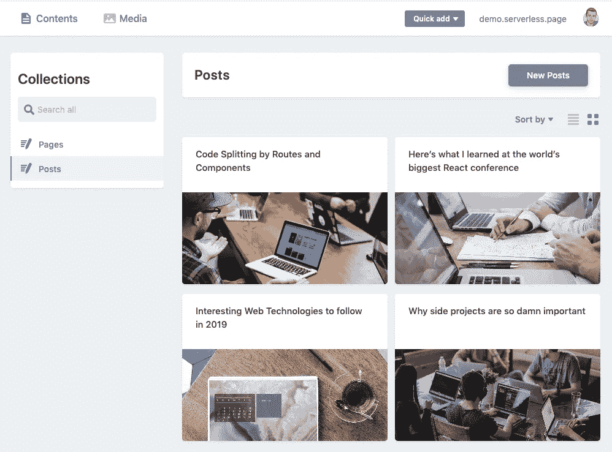
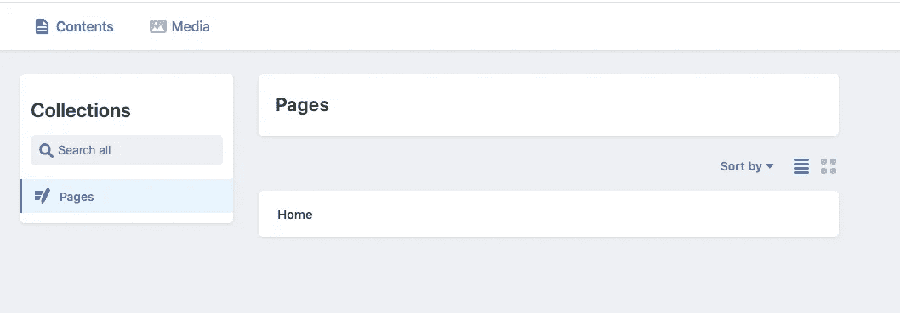

# 如何用 Next.js 实现 Netlify CMS

> 原文：<https://betterprogramming.pub/how-to-implement-netlify-cms-with-next-js-4b8721bdec45>

## *通过基于 Git 的免费 CMS 管理 Next.js 应用的内容*



用 Next.js 和 Netlify CMS 管理博客。作者照片。

如果你正在开始一个新的 React 项目，你可能会考虑 [Next.js](https://nextjs.org/) 和 [Netlify CMS](https://www.netlifycms.org/) 。在本文中，我们将看看为什么这将是一个很好的选择，并通过使用这些技术建立一个新项目的过程。

# 为什么是 Next.js？

正如我在[上一篇文章](https://medium.com/better-programming/how-to-set-up-next-js-with-typescript-5f912766c88)中所说:

> “当您使用 React 启动一个新项目时，有许多重要的细节需要考虑。你的代码必须使用像 webpack 这样的捆绑器捆绑，并使用像 Babel 这样的编译器转换。
> 
> Create React App 是一个很好的工具，可以帮你处理这个问题，并给你一个很好的开端，但是代码分割、性能预渲染、SEO 或服务器端渲染呢？
> 
> 要构建一个完整的 React 应用程序，你需要的不仅仅是 CRA 提供给你的。通过使用 Next.js，您可以节省一些时间，这是一个 React 框架，为所有这些问题提供了一个解决方案。"

如果你想了解更多关于 CRA vs. Next.js 的信息，请查看[Stack choices:Create React App vs next . js](https://codeburst.io/stack-choices-create-react-app-vs-next-js-f0f3c4db7083)。

# 为什么选择 Netlify CMS？

Netlify CMS 是一个基于 Git 的开源内容管理系统。它基于客户端 JavaScript，直接在 Git 中处理内容更新。因为所有内容都存储在 Git 存储库中，所以不需要在服务器上托管任何东西。它是完全免费的，非常适合与 Next.js 结合来构建可通过良好的用户界面管理的登录页面或博客。

# 我们开始吧

让我们开始用一些基本的文本来构建我们的登录页面，以便熟悉 Netlify CMS。你可以在 GitHub 上找到这部分教程[的源代码，或者查看](https://github.com/jakeprins/nextjs-netlify-cms) [serverless.page](http://serverless.page/) 获得完整的样板文件，其中也包括认证和计费等功能。

## 设置您的项目

您可以从使用`npx create-next-app`创建一个新的 Next.js 项目开始。在这个例子中，我们将使用 TypeScript。你可以跟随[这篇教程](https://medium.com/better-programming/how-to-set-up-next-js-with-typescript-5f912766c88)学习如何用 Typescript 设置 Next.js。

# 对我们的内容使用降价文件

Netlify CMS 使用 markdown 文件，这是管理登录页面或博客内容的一个很好的方式。让我们首先创建一个 markdown 文件，其中包含一些我们希望在主屏幕上显示的数据。

制作一个`content`目录来保存我们所有的降价文件。接下来，创建一个`pages`目录和一个名为`content/pages/home.md`的 markdown 文件。这个文件将保存我们想要在主页上显示的数据。让我们首先为登录页面的“hero”部分添加标题、描述和图像:

```
---hero_title: Build a SaaS faster with Reacthero_description: Serverless SaaS is aiming to be the perfect starting point for your next React app to build full-stack SaaS applications. Visit serverless.page for more info.---
```

接下来，我们需要告诉 webpack 如何加载 markdown 文件。让我们用`frontmatter-markdown-loader`来说明这一点。首先将该包作为开发依赖项安装:

```
yarn add frontmatter-markdown-loader -D
```

接下来，在项目的根目录下创建一个新的`next.config.js`文件，内容如下:

## 创建主页

酷，现在让我们添加一些代码到索引页面，使它成为我们的主页。

在`pages/index.tsx`中，添加以下内容:

让我们来看看这是怎么回事。最重要的部分是导出的`getStaticProps`函数。如果从页面中导出一个名为`getStaticProps`的`async`函数，Next.js 将在构建时使用`getStaticProps`返回的 props 预渲染这个页面。

在我们的页面上，我们导入名为`home.md`的 markdown 文件，并将其作为`content` prop 传递给组件。我们的主页现在可以使用 markdown 文件的`hero_title`和`hero_description`属性。

让我们试一试，看看它是否有效:

```
yarn dev
```

你应该会看到你的神奇英雄部分，准备好与你即将到来的 CMS 风格和管理。

# 实施 Netlify CMS

有不同的方法可以将 Netlify CMS 添加到您的项目中。我们将使用官方的 npm 包:

```
yarn add netlify-cms-app
```

## 添加配置

在初始化 CMS 之前，我们需要创建一个配置文件。在项目的根目录下创建一个`cms`目录，并将以下配置粘贴到您的`cms/config.js`中:

Netlify CMS 在如何处理身份验证方面有不同的选项。我们将使用这个配置文件来告诉 Netlify CMS 我们想要使用 GitHub 来完成这个任务。对于存储在 GitHub 上的存储库，`github`后端允许 CMS 用户用他们的 GitHub 帐户直接登录。请注意，所有用户都必须拥有对其内容存储库的推送访问权限，这样才能工作。

如果您还没有这样做，现在是时候[在 GitHub](https://github.com/new) 上创建您的存储库，将您的 repo 的名称添加到配置文件中，并将您的代码推送到 GitHub。去吧，我等着。

很好，但是在我们继续之前，让我们看看我们配置中最重要的设置:`collections`。这决定了 UI 中的内容类型和编辑器字段如何在存储库中生成文件和内容。

在`collections`中，我们创建了一个`pages`集合，其中有一些用于`home`页面的设置。目前，我们只添加了`hero_title`和`hero_description`字段。您可以设置哪个[小部件](https://www.netlifycms.org/docs/widgets/#header)用于给定的属性。

您可以在文档中了解所有其他配置选项[。](https://www.netlifycms.org/docs/configuration-options)

## 初始化 CMS

接下来，让我们为 CMS 创建一个管理页面。将以下代码添加到`pages/admin.tsx`:

现在您应该能够导航到[http://localhost:3000/admin](https://localhost:4202/)并看到一个 GitHub 登录按钮。点击按钮，看看你漂亮的新 CMS！



第一眼看到你全新的 CMS。

## 尝试一下

酷，现在试试吧！选择“主页”，您将看到编辑页面。您可以编辑`hero_title`和`hero_description`属性并点击`publish`按钮。当您发布时，Netlify CMS 会向您的存储库提交您刚才所做的更改。您可以在发布一些更改后查看最后一次提交。

现在，您所要做的就是`git pull`在本地获取这些更改，并导航回 [http://localhost:3000/](http://localhost:3000/) 。您将看到主页包含您的更改。太棒了。

# 添加图像

大多数英雄部分包含一个漂亮的形象。让我们使用`image`小部件向我们的英雄部分添加一个图像。转到您的`cms/config.js`文件，并将以下对象添加到`fields`数组中:

```
{
  label: 'Hero Image',
  name: 'hero_image',
  widget: 'image'
}
```

接下来，我们可以简单地将一幅图像添加到我们的`public/img`文件夹中，并将其添加到我们的`home.md`文件夹中，但是为了演示 Netlify CMS 是如何工作的，我们将使用 CMS 来完成这项工作。

首先，我们需要上传一个图像到我们的集成媒体库。在 CMS 的仪表板上，单击顶部导航栏中的“媒体”链接，并上传图像。之后，导航到主页的编辑屏幕。

您现在应该会看到添加的`hero_image`字段，其中有一个按钮说:“选择一个图像。”现在，您可以选择上传的图像并发布更改。

太好了，我们现在应该有一个新的承诺，我们的回购与新的变化。如果我们的应用程序已经在生产中，我们可以实时看到这些变化，但是因为我们想在本地看到这些变化，我们需要首先从 GitHub 中提取它们。

运行完`git pull`之后，实际上只剩下一件事要做了，那就是将图像添加到我们的主页:

```
......
```

现在，运行`yarn dev`，进入 [http://localhost:3000/](http://localhost:3000/) 查看你添加的镜像！

# 结论

Netlify CMS 是一个非常有用的库，可以添加到 Next.js 应用程序中。这只是一个客户端 React 应用程序，它使用 Git 将内容存储在您自己的存储库中。这有一些好处:您不需要单独托管您的 CMS，它完全适合您的 Git 工作流。这对于管理登录页面或博客文章的内容非常有用。

如果你正在寻找一个完整的样板文件，请查看 [serverless.page](http://serverless.page/) 。

# 后续步骤

我们在本教程中已经介绍了很多，但是我们只看到了 Netlify CMS 在 Next.js 应用程序中如何工作的基础知识。我们能做的还有很多！敬请关注后续文章，继续我们的工作:

*   博客
*   更多用于管理内容的小部件
*   样式和 CMS 预览
*   使用附加配置设置进行自定义

在 GitHub 上查看本教程[的源代码。](https://github.com/jakeprins/nextjs-netlify-cms)

感谢阅读！