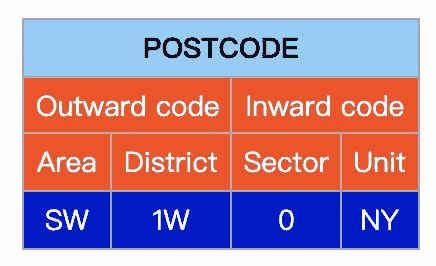
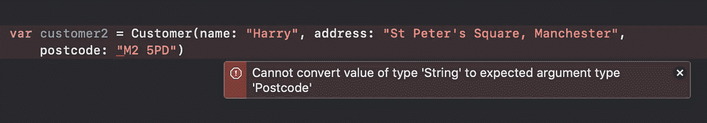

# 如何在 Swift 中实现@propertyWrapper、WrappedValue 和 ProjectedValue

> 原文：<https://betterprogramming.pub/how-to-implement-propertywrapper-wrappedvalue-and-projectedvalue-in-swift-c7aa89b0979e>

## 在 Swift 中使用@propertywrapper 编写干净的代码


照片由[克里斯蒂安·休姆](https://unsplash.com/@christinhumephoto?utm_source=medium&utm_medium=referral)在 [Unsplash](https://unsplash.com?utm_source=medium&utm_medium=referral) 上拍摄

> "属性包装在管理属性存储方式的代码和定义属性的代码之间添加了一层隔离层。"— [Swift 文档](https://docs.swift.org/swift-book/LanguageGuide/Properties.html)

它将额外的逻辑封装到属性中，并限制对可用属性值的访问。

`@propertyWrapper`在 Swift 5.1 中引入 Swift。现在，您可以实现一个包装器，并以更自然的方式使用包装的属性，而不会注意到包装层，就像它是一个普通的属性一样。让我们看看如何使用这个新语法。

假设您正在创建一个代表每个客户数据的`Customer` 类型。

```
struct Customer { 
    var name: String
    var address: String 
    var postcode: String
}
```

但是您希望对邮政编码的格式添加一些约束，因为有效的邮政编码必须符合特定的格式。

例如，它应该是数字和大写字母的组合，在外向代码和内向代码之间有一个空格。



如果输入的邮政编码有效，该值将分配给`postcode`；否则，`postcode`的值将是一串“无效的邮政编码”

为了封装这个逻辑，您决定创建一个属性包装器。

# 老办法

在引入`@propertyWrapper`之前，你必须创建一个类型`Postcode`来包装这个逻辑。`Customer`的属性`postcode`将是一个`Postcode`对象而不是一个`String`。

输入邮政编码的验证将在`Postcode`内处理。computed 属性`value`将是唯一的接口，通过它可以在这个结构之外访问邮政编码值。

当用一个`String`值初始化一个`Postcode`实例时，输入值将被存储在私有属性`inputValue`中。

每当调用`value`时，它都会验证并返回邮政编码值。

使用这个包装器，您必须通过`customer.postcode.value`访问邮政编码值。

# 新方法:@propertyWrapper

现在，我们能够以更优雅的方式包装价值。

首先是在定义类型`Postcode`时，在`struct`之前添加语法`@propertyWrapper`。

在这种类型中，您必须定义一个名为`wrappedValue`的计算属性来包装值**。**

如果您创建了一个接受参数来初始化`wrapperValue`的初始化器，请记住使用`wrappedValue`作为您的初始化参数的名称。否则，当您初始化`Customer`实例时，您可能会遇到此错误*“*无法将类型为“String”的值转换为预期的参数类型“Postcode”。



在结构`Customer`中，您可以通过在属性之前添加包装器的名称(本例中为`@Postcode`)作为属性，将包装器应用于属性`postcode`。

当您初始化`Customer`实例并访问其`postcode`属性时，您可以像它是一个普通的`String`对象一样进行操作。

# 预计价值

除了包装的值之外，属性包装器还可以通过定义名为`projectedValue`的属性来公开附加信息。有一个预测值是可选的。

在这个例子中，有时您想知道无效邮政编码的原始值。在这种情况下，您可以利用预测值。

滚动回到`@propertyWrapper struct Postcode`的定义。您可以找到这行代码:

```
var projectedValue: String? = nil
```

如果邮政编码的值无效，其原始输入值将分配给`projectedValue`。

投影值的名称是以$符号开头的包装值的名称。在本例中，您可以通过`customer.$postcode`访问预测值。

# 参考

[](https://docs.swift.org/swift-book/LanguageGuide/Properties.html) [## 属性-Swift 编程语言(Swift 5.5)

### 属性将值与特定的类、结构或枚举相关联。存储的属性存储常量和…

docs.swift.org](https://docs.swift.org/swift-book/LanguageGuide/Properties.html) [](https://www.swiftbysundell.com/articles/property-wrappers-in-swift/) [## Swift | Sundell Swift 中的财产包装

### 当处理代表某种状态的属性时，通常会有某种关联的逻辑…

www.swiftbysundell.com](https://www.swiftbysundell.com/articles/property-wrappers-in-swift/) [](https://www.toptal.com/swift/wrappers-swift-properties) [## Swift 中的财产包装

### 简单地说，属性包装器是一种通用结构，它封装了对属性的读写访问，并且…

www.toptal.com](https://www.toptal.com/swift/wrappers-swift-properties) [](https://nshipster.com/nspredicate/) [## n 重定向

### NSPredicate 是一个基础类，它指定应该如何提取或过滤数据。它的查询语言是…

nshipster.com](https://nshipster.com/nspredicate/)