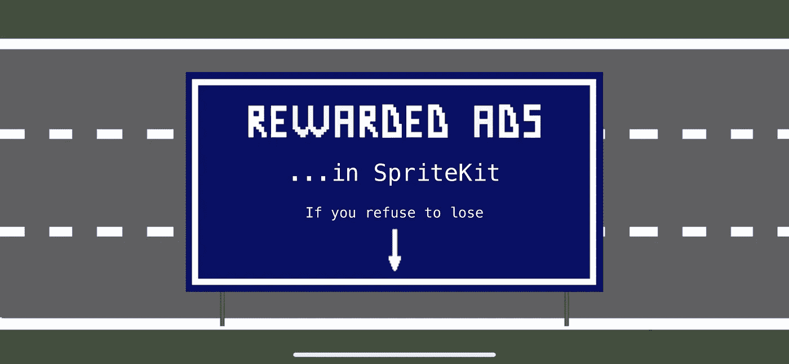
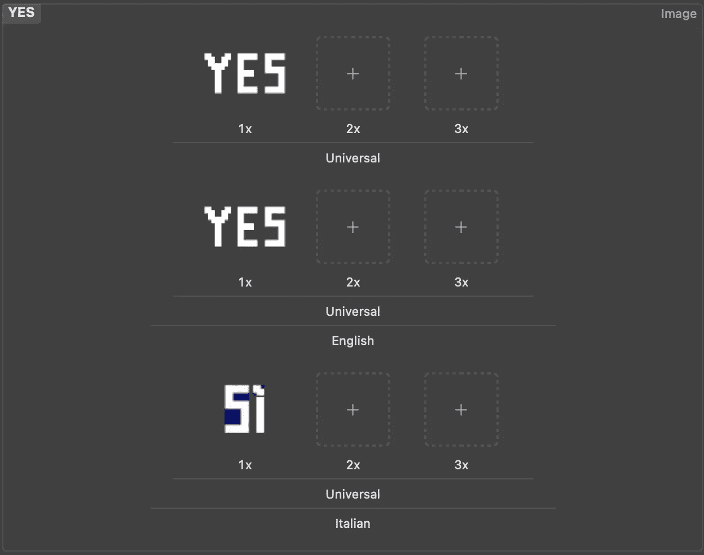
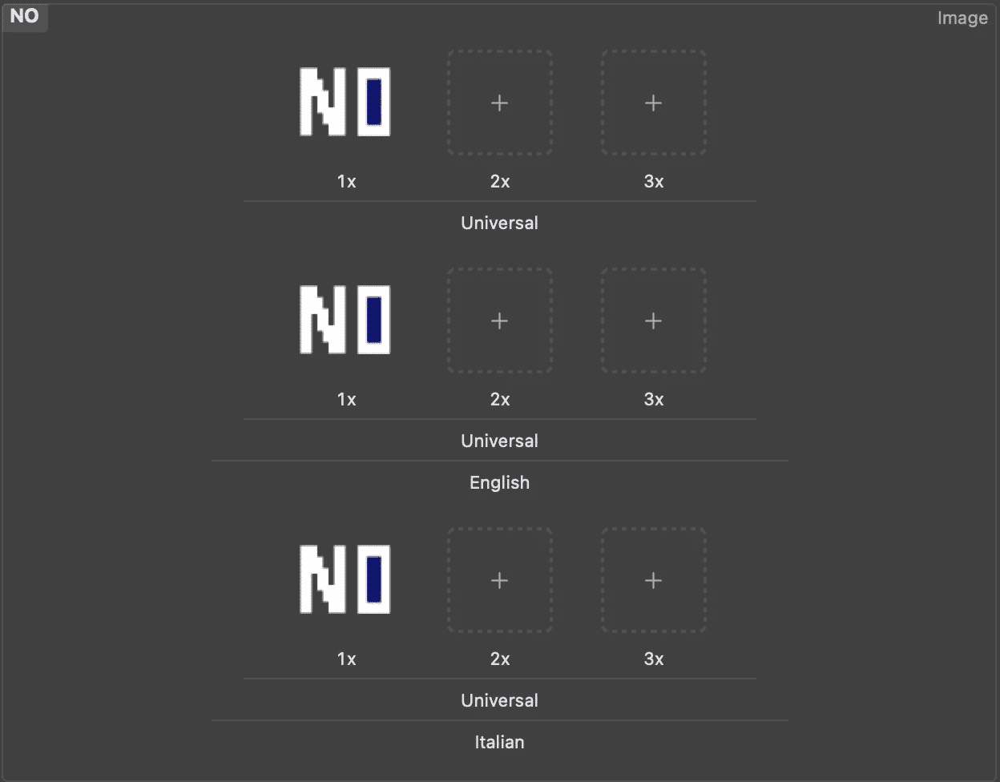
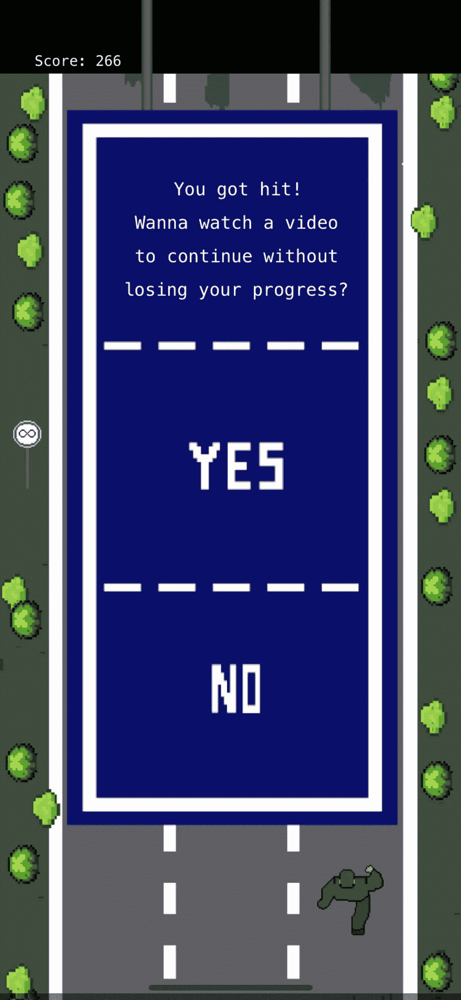
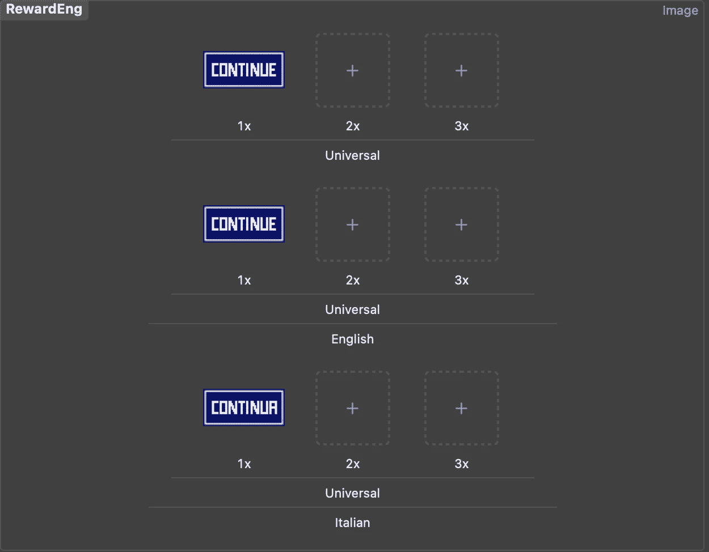
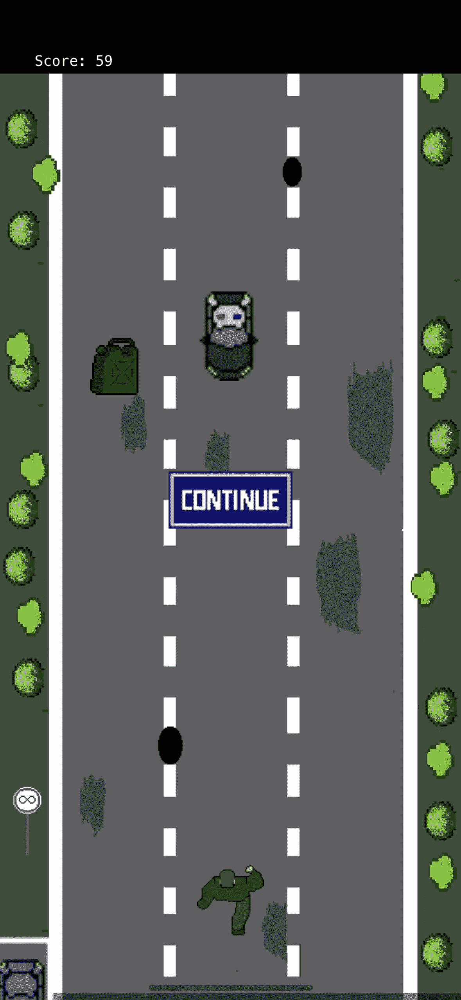

# 如何在 SpriteKit 游戏中实现 Google 奖励广告

> 原文：<https://betterprogramming.pub/how-to-implement-rewarded-ads-in-your-game-made-in-spritekit-1d104534d843>

## 将您的应用货币化



作者图片

事情是这样的:你已经成功开发并发布了你的 iOS 手机游戏，现在你想赚点钱。从你的游戏中赚钱的最简单的方法是什么(除非你是一个超级著名的开发者，有一群忠诚的客户，他们愿意为你游戏中的额外功能付费)？广告。哪些广告对你来说更有利可图，对一个用户来说不那么讨厌？奖励广告在用户观看后提供额外的功能，比如额外的硬币，或者在我们的情况下，在被杀死后继续玩而不丢失你的进度的机会。

在本文中，我将一步一步地解释如何在一个用 SpriteKit 制作的游戏中实现奖励广告(和一些边界)。我想你已经有了一个开发好的游戏，但是我将向你展示如何在一个真实的项目中这样做，*中轴*。

# 关于游戏

*中轴*是我和我的同事路易吉·卢卡·科莱塔在苹果开发者学院开发的一款无尽的跑步者街机游戏。

在这个游戏中，你沿着高速公路跑，收集煤气罐，躲避汽车和卡车。跑的时间越长，收集的油箱越多，分数越高。

如果你被汽车或卡车撞了，你就输了，新游戏的分数让你从零开始。考虑到我们游戏中实现的排行榜，你几乎不希望这种情况发生！

[](https://youtube.com/shorts/pLCATT6T7MA?feature=share) [## 中轴

### 编辑描述

youtube.com](https://youtube.com/shorts/pLCATT6T7MA?feature=share) 

这里有一个[到 App Store](https://apps.apple.com/it/app/median-axis/id1617251103?l=en) 的链接，你可以在那里下载游戏并享受它…在这里[你可以找到产品页面、团队信息和隐私政策。](https://www.notion.so/Median-Axis-664c8be4409f47249111f6c04f483b9b)

# AdMob:第一步

在官方 [Google AdMob 指南](https://developers.google.com/admob/ios/quick-start)中非常清楚地描述了在 iOS 应用中实现 AdMob。这篇文章解释了在 SKScene 内部用 SpriteKit 创建的 iOS 游戏中实现广告的特性，以及为显示广告创建定制的边界。

## **先决条件**

1.  按照[官方指南](https://support.google.com/admob/answer/7356219?utm_source=developers.google.com&utm_medium=referral&visit_id=638063717918329050-1143239393&rd=1)创建一个 AdMob 账户
2.  按照[官方指南](https://support.google.com/admob/answer/9989980?utm_source=developers.google.com&utm_medium=referral&visit_id=638063717918329050-1143239393&rd=1)注册你的游戏
3.  导入并初始化移动广告 SDK，并按照上述[指南](https://developers.google.com/admob/ios/quick-start)更新您的应用程序的`Info.plist`

> 关于进口，我同意指南并强烈推荐你使用可可豆。

完成这些步骤后，就可以开始实施打赏广告了。

# 奖励广告实施

创建一个单独的 Swift 文件包含奖励广告的所有信息和功能会更方便，所以在项目内部，创建一个名为`RewardedAdHelper`的新 Swift 文件。

首先，你需要`import GoogleMobileAds`。

```
//RewardedAdHelper.swift

import GoogleMobileAds
```

然后创建一个类`RewardedAdHelper`。它应该从`NSobject` 类继承并符合`GADFullScreenContentDelegate`协议(能够全屏显示广告)。

```
//RewardedAdHelper.swift

import GoogleMobileAds

class RewardedAdHelper : NSObject, GADFullScreenContentDelegate {

}
```

在这个新创建的类的花括号内，提供`GADRewardedAd` 对象作为参数。看起来是这样的:

```
//RewardedAdHelper.swift

import GoogleMobileAds

class RewardedAdHelper : NSObject, GADFullScreenContentDelegate {
   private var rewardedAd : GADRewardedAd?
}
```

然后，仍然在类内部，添加函数`loadRewardedAd()`。它从源加载广告。

```
//RewardedAdHelper.swift

import GoogleMobileAds

class RewardedAdHelper : NSObject, GADFullScreenContentDelegate {

  //...

  func loadRewardedAd() {
       let request = GADRequest()

       //1
       GADRewardedAd.load(withAdUnitID: "ca-app-pub-3940256099942544/1712485313", request: request) { [self] ad, error in
           if let error = error {
               print("Failed to load reward ad with error: \(error.localizedDescription)")
               return
           }

           rewardedAd = ad
           rewardedAd?.fullScreenContentDelegate = self
       }
   }
}
```

> *1。注意用* `*GADRewardedAd.load(withAdUnitID: ...)*` *的线。在本文中，我使用 Google AdMob 提供的 iOS 奖励广告的测试广告单元 ID(你也可以在这里找到它*[](https://developers.google.com/admob/ios/rewarded)**)。在发布你的游戏之前，别忘了改成你自己的广告单元 ID(你可以在这里* *阅读如何找到* [*)。*](https://support.google.com/admob/answer/7356431)*

*在`loadRewardedAd()`之后添加这三个功能:*

```
*//RewardedAdHelper.swift

import GoogleMobileAds

class RewardedAdHelper : NSObject, GADFullScreenContentDelegate {

  //...

 func loadRewardedAd() {
   //...
  }

  //1
   /// Tells the delegate that the ad failed to present full screen content.
   func ad(_ ad: GADFullScreenPresentingAd, didFailToPresentFullScreenContentWithError error: Error) {
     print("Ad did fail to present full screen content.")
   }

   //2
  /// Tells the delegate that the ad will present full screen content.
   func adWillPresentFullScreenContent(_ ad: GADFullScreenPresentingAd) {
     print("Ad will present full screen content.")
   }

  //3
   /// Tells the delegate that the ad dismissed full screen content.
   func adDidDismissFullScreenContent(_ ad: GADFullScreenPresentingAd) {
       loadRewardedAd()
   }
}*
```

1.  *这个函数告诉代理广告不能全屏显示。*
2.  *这个函数告诉代理，广告将呈现全屏内容。*
3.  *这个函数告诉代理广告放弃了全屏内容。*

*最后，在第三个函数之后，添加`showRewardedAd()`函数。稍后，它应该在您想要显示广告的条件之后被调用。*

```
*//RewardedAdHelper.swift

import GoogleMobileAds

class RewardedAdHelper : NSObject, GADFullScreenContentDelegate {

  //...

  func showRewardedAd(viewController: UIViewController) {
       if rewardedAd != nil {
           rewardedAd!.present(fromRootViewController: viewController, userDidEarnRewardHandler: {
               let reward = self.rewardedAd!.adReward
               print("\(reward.amount) \(reward.type)")
           })
       } else {
           print("RewardedAd wasn't ready")
      }
   }
}*
```

*这个文件的代码应该是这样的:*

```
*//RewardedAdHelper.swift

import GoogleMobileAds

class RewardedAdHelper : NSObject, GADFullScreenContentDelegate  {
   private var rewardedAd : GADRewardedAd?

   func loadRewardedAd() {
       let request = GADRequest()
       GADRewardedAd.load(withAdUnitID: "ca-app-pub-3940256099942544/1712485313", request: request) { [self] ad, error in
           if let error = error {
               print("Failed to load reward ad with error: \(error.localizedDescription)")
               return
           }

           rewardedAd = ad
           rewardedAd?.fullScreenContentDelegate = self
       }
   }

   /// Tells the delegate that the ad failed to present full screen content.
   func ad(_ ad: GADFullScreenPresentingAd, didFailToPresentFullScreenContentWithError error: Error) {
     print("Ad did fail to present full screen content.")
   }

   /// Tells the delegate that the ad will present full screen content.
   func adWillPresentFullScreenContent(_ ad: GADFullScreenPresentingAd) {
     print("Ad will present full screen content.")
   }

   /// Tells the delegate that the ad dismissed full screen content.
   func adDidDismissFullScreenContent(_ ad: GADFullScreenPresentingAd) {
       loadRewardedAd()
   }

   func showRewardedAd(viewController: UIViewController) {
       if rewardedAd != nil {
           rewardedAd!.present(fromRootViewController: viewController, userDidEarnRewardHandler: {
               let reward = self.rewardedAd!.adReward
               print("\(reward.amount) \(reward.type)")
           })
       } else {
           print("RewardedAd wasn't ready")
       }
   }
}*
```

# *问题屏幕(仅限用户界面)*

*现在，只要我们已经完成了广告的基础，让我们切换到一些 UI(这是不可避免的，你知道)。*

*首先，礼貌的做法是询问用户是否愿意在被击中后继续观看广告而不失去分数。所以我们需要创建一个有一个问题和两个按钮的问题窗口。*

*如果你有自己的方法在 SpriteKit 中创建屏幕和窗口，你可以跳过这一部分，直接进入**奖励广告实现(续)**。但是请记住，这个问题屏幕上的按钮名称将在项目中使用。*

*在项目中创建一个新的 Swift 文件，并将其命名为`QuestionScreen`。*

*首先你需要`import SpriteKit`。该命令可以帮助您做到这一点:*

```
*//QuestionScreen.swift

import SpriteKit*
```

*然后创建一个类`QuestionScreen`，它应该继承自类`SKSpriteNode`。*

```
*//QuestionScreen.swift

import SpriteKit

class QuestionScreen: SKSpriteNode {

}*
```

> *`SKSpriteNode` *是屏幕上的图形元素，可以从图像或纯色初始化。SpriteKit 增加了使用函数显示图像的功能。**

*在这个类中，添加初始化器和必需的初始化器:*

```
*//QuestionScreen.swift

import SpriteKit

class QuestionScreen: SKSpriteNode {

  init() {

 }

  required init?(coder aDecoder: NSCoder) {
          fatalError("init(coder:) has not been implemented")
      }
}*
```

*在初始值设定项中，添加以下代码:*

```
*//QuestionScreen.swift

import SpriteKit

class QuestionScreen: SKSpriteNode {

 init() {

    //1
        let texture = SKTexture(imageNamed: "PauseScr")

        super.init(texture: texture, color: .clear, size: texture.size())
        self.position = CGPoint(x: 212, y: 530)
        self.zPosition = 200
        self.name = "questionScreen"

    //2
        let yesButton = SKSpriteNode(imageNamed: "YES")
       yesButton.name = "YesBtn"
        self.addChild(yesButton)
       yesButton.zPosition = 240
       yesButton.position = CGPoint(x: 0, y: (((-size.height)/3.5)/1.7) + 75)

        let littleButtonsSize = CGSize(width: yesButton.size.height, height: yesButton.size.height)

    //3
        let noButton = SKSpriteNode(imageNamed: "NO")
       noButton.size = littleButtonsSize
        // Name the start node for touch detection:
       noButton.name = "NoBtn"
       noButton.position = CGPoint(x: yesButton.position.x, y: (((-size.height)/3.5)/1.7) - 125)
       noButton.zPosition = 240

        self.addChild(noButton)

    //4
       let gotHitText = NSLocalizedString("GotHit", comment: "Got Hit 1")
       let gotHit = SKLabelNode(fontNamed: "Menlo")
       gotHit.text = gotHitText
       gotHit.horizontalAlignmentMode = .center
       gotHit.fontSize = 16
       gotHit.position = CGPoint(x: 0, y: 190)
       gotHit.zPosition = 220

       addChild(gotHit)

       let reward1Text = NSLocalizedString("WatchVideo", comment: "Watch Video")
       let reward1 = SKLabelNode(fontNamed: "Menlo")
       reward1.text = reward1Text
       reward1.horizontalAlignmentMode = .center
       reward1.fontSize = 16
       reward1.position = CGPoint(x: 0, y: 160)
       reward1.zPosition = 220

       addChild(reward1)

       let reward2Text = NSLocalizedString("ToContinue", comment: "To Continue2")
       let reward2 = SKLabelNode(fontNamed: "Menlo")
       reward2.text = reward2Text
       reward2.horizontalAlignmentMode = .center
       reward2.fontSize = 16
       reward2.position = CGPoint(x: 0, y: 130)
       reward2.zPosition = 220

       addChild(reward2)

       let reward3Text = NSLocalizedString("YourProgress", comment: "Your Progress")
       let reward3 = SKLabelNode(fontNamed: "Menlo")
       reward3.text = reward3Text
       reward3.horizontalAlignmentMode = .center
       reward3.fontSize = 16
       reward3.position = CGPoint(x: 0, y: 100)
       reward3.zPosition = 220

       addChild(reward3)
    }

   //...
}*
```

1.  *屏幕的背景、大小和位置。*
2.  *按钮是的，它的大小和位置。*
3.  *按钮编号、大小和位置。*
4.  *四行信息和问题，它们的大小和位置。*

> *如果你在游戏中实现了本地化，请注意下面的步骤，因为文本和按钮图像都应该本地化。*

*只要我们的游戏本地化为两种语言，英语和意大利语，我们就不会直接将问题的文本写成简单的`String`，而是从`Localizable.strings` 文件中取出。*

*这些字符串应该这样保存在该文件中；请注意，我们将它们分成了几行，以便在英语和意大利语版本中组织它们在屏幕上的位置:*

```
*//Localizable.strings(en)

"GotHit" = "You got hit!";
"WatchVideo" = "Wanna watch a video";
"ToContinue" = "to continue without";
"YourProgress" = "losing your progress?";*
```

```
*//Localizable.strings(it)

"GotHit" = "Incidente!";
"WatchVideo" = "Vuoi guardare un video";
"ToContinue" = "per continuare senza";
"YourProgress" = "perdere il tuo progresso?";*
```

*至于“是”和“否”按钮，它们是图像，请确保在资产中启用本地化，以便它们看起来像这样:*

**

*本地化的“是”按钮*

**

**其实对于无按钮来说，没有太大的区别**

# *有奖广告实施(续)*

*我们已经完成了准备工作。现在我们可以移动到`GameScene`，在那里发生的行动！*

*你可以为你的项目取一个不同的名字，但是这是游戏的发展方向。*

*在`GameScene`中，首先，你需要将`import GoogleMobileAds`放在文件的顶部。*

```
*//GameScene.swift

import GoogleMobileAds
//...*
```

*然后，在`GameScene` 类中，创建`private var rewardAdHelper = RewardedAdHelper()`。这将是`RewardedAdHelper`的一个实例，所以我们将能够很容易地调用它的函数。*

```
*//GameScene.swift

//...

class GameScene: SKScene {
 private var rewardAdHelper = RewardedAdHelper()
//...
}*
```

*找到`override func didMove()` ，在它的花括号内，添加`rewardAdHelper.loadRewardedAd()`。这将在你从`StartScene`移动到`GameScene`时加载广告，因为在显示之前，它必须先被加载。*

```
*//GameScene.swift

//...

class GameScene: SKScene {
 //...

 override func didMove(to view: SKView) {
  rewardAdHelper.loadRewardedAd()

  //all the rest code of your game
 }
}*
```

*现在，还记得我们之前创造的`QuestionScreen`吗？我们需要一个函数在`GameScene`中显示它。*

*在`GameScene`中声明的其他变量中，添加这个变量:`private var questionScreen = QuestionScreen()`。这是之前创建的`QuestionScreen`的一个实例。*

```
*//GameScene.swift

//...

class GameScene: SKScene {
 //...
 private var questionScreen = QuestionScreen()
}*
```

*然后，仍然在`GameScene`类内部，创建一个函数`showQuestion()` 来显示这个问题屏幕:*

```
*//GameScene.swift

//...

class GameScene: SKScene {

//...

override func didMove(to view: SKView) {
 //...
}

func showQuestion() {
      self.run(SKAction.wait(forDuration: 0.0001)){
         self.pauseChilds(isPaused: true)
      }
      paws = true
      questionScreen.zPosition = 120
      if self.childNode(withName: "questionScreen") == nil {
         self.addChild(questionScreen)
      }
   }
}*
```

*`pauseChilds`和`paws`此处停止`GameScene`中物体的移动，并控制是否暂停。*

*我的意思是，当你在“是”和“否”之间做出选择时，你不希望玩家被移动的汽车撞到，对吗？*

*这也有助于我们将分数保持在当前点，这样如果用户决定观看奖励广告，尽管玩家被击中，分数也不会变为零。*

*我们终于完成了准备工作。让我们开始行动吧！*

*让我们定义广告应该在哪个事件之后显示。从逻辑上来说，用户选择了“是”之后(“T20”是，我希望观看一个广告继续播放，而不会在被击中后失去我的分数“)。但是为了让用户选择“是”或“否”，我们需要在用户被汽车或卡车撞了之后立即显示问题屏幕。*

1.  *找到杀死你的玩家(或者让他们输)并触发游戏场景的功能。在我们的例子中，这个函数叫做`func playerHit(car: SKSpriteNode)`。在里面，评论揭示游戏结束场景的函数(在我们的例子中是`showGameOver()`)，我们以后会用到它。*
2.  *仍在该函数内时，调用`showQuestion()`函数。*

```
*//GameScene.swift

//...

class GameScene: SKScene {

//...

override func didMove(to view: SKView) {
 //...
}

 //...

 func playerHit(car: SKSpriteNode){
  //showGameOver()
  showQuestion()
 }
}*
```

*因此，一旦玩家被车撞了，窗口就会显示关于广告的问题。*

*如果你有几个事件或功能，使玩家输了，并揭示了游戏超过现场，不要忘记重复步骤 1 和 2。在我们的例子中，我们在函数`func playerHit(truck: SKSpriteNode)`中重复它们，因为汽车和卡车都能杀死玩家。*

```
*//GameScene.swift

//...

class GameScene: SKScene {

//...

override func didMove(to view: SKView) {
 //...
}

 //...

 func playerHit(truck: SKSpriteNode){
  //showGameOver()
  showQuestion()
 }
}*
```

**

**行动上的问题画面**

*当您还在游戏场景中时，找到函数`touchesBegan`，它定义了每个被触摸的按钮的动作，并在其中添加以下条件:*

```
*//GameScene.swift

//...

class GameScene: SKScene {

   //...

   override func didMove(to view: SKView) {
    //...
   }

   override func touchesBegan(_ touches: Set<UITouch>, with event: UIEvent?) {

   if nodeTouched.name == "YesBtn" {
            // show reward ad, then reveal game with saved score
            rewardAdHelper.showRewardedAd(viewController: self.view!.window!.rootViewController!)
            questionScreen.removeFromParent()
            backgroundMusicPlayer.volume = 0.0
            self.run(SKAction.wait(forDuration: 2.0)){
               self.addRewardButton()
            }   
       }
    }
}*
```

*这里我们调用显示来自`RewardAdHelper`的广告的函数。记得把问题屏幕去掉(我们得到了我们的答案，我们不再需要它了)，把背景音乐的音量调为零(*我的意思是，你不希望它和广告里的音乐搞混吧？*)。*

> **注意我们到底如何调用* `*showRewardedAd()*` *函数。如你所知，在* `*RewardedAdHelper*` *中它被定义为* `*func showRewardedAd(viewController: UIViewController)*`*

*我们这里有个小问题。我们的`GameScene`不是`UIViewController`，只是`SKScene`。这就是为什么，为了能够调用`showRewardedAd` 函数，作为它的参数，我们必须使用这个超长的`(viewController: self.view!.window!.rootViewController!)`*

*   *`view`是当前呈现场景的视图。它继承自`SKView`，一个呈现`SpriteKit`场景的视图子类。如果场景当前不存在，该属性保持`nil`。就我们所呈现的场景而言，我们强制展开`view`。*
*   *`window`是接收方的窗口对象。*
*   *`rootViewController`继承自`UIViewController`类。*

*现在，这个`addRewardButton()`功能是什么？让用户在看完广告后决定何时继续播放就好了(如果他们刚从公交车上走出来怎么办？)所以，我们再加一个按钮，让我们继续游戏。*

*回到声明所有函数的地方，在其中一些函数之间，添加`addRewardButton()`:*

```
*//GameScene.swift

//...

class GameScene: SKScene {

   //...

   override func didMove(to view: SKView) {
    //...
   }
   //...
  func addRewardButton(){
     let rewardButton = SKSpriteNode(imageNamed: "RewardEng")
        // Name the start node for touch detection:
        rewardButton.name = "RewardBtn"
        rewardButton.zPosition = 200
        rewardButton.position = CGPoint(x: frame.midX, y: frame.midY)
        rewardButton.setScale(1.5)

        addChild(rewardButton)
     }
}*
```

*这个函数创建一个按钮，让用户继续播放，并设置它的位置、大小等。现在，只要用户关闭广告窗口，他们就会看到这个按钮(希望他们也会按下它)。*

**

*确保此按钮已针对您使用的所有语言进行了本地化！*

**

**这是奖励按钮的显示方式**

*用户不想看广告怎么办？*

*在函数`touchesBegan`中，在前面带有“YesBtn”的 if 语句的右花括号后，添加新的 if 语句:*

```
*//GameScene.swift

//...

class GameScene: SKScene {

   //...

   override func didMove(to view: SKView) {
    //...
   }

   override func touchesBegan(_ touches: Set<UITouch>, with event: UIEvent?) {

    if nodeTouched.name == "YesBtn" {
       //...
     } else if nodeTouched.name == "NoBtn" {
              //show game over scene
              showGameOver()  
           }
     }
}*
```

*在这里，我们打开游戏场景。*

*现在，如果用户观看了广告，我们需要让他们继续玩下去。在前一个 if 语句的右花括号后，添加以下 if 语句:*

```
*//GameScene.swift

//...

class GameScene: SKScene {

   //...

   override func didMove(to view: SKView) {
    //...
   }

   override func touchesBegan(_ touches: Set<UITouch>, with event: UIEvent?) {
     if nodeTouched.name == "YesBtn" {
       //...
     } else if nodeTouched.name == "NoBtn" {
              //...  
           } else if nodeTouched.name == "RewardBtn" {
              run(buttonSound)
              nodeTouched.removeFromParent()
              backgroundMusicPlayer.play()

              backgroundMusicPlayer.volume = 1.0

              self.pauseChilds(isPaused: false)
              self.paws = false
      }
   }
}*
```

*在这里，我们解除所有游戏对象的暂停，将背景音乐恢复到正常音量，并移除按下的按钮，这样就不会影响游戏内容。*

*满意的用户继续玩，他们的分数没有变为零。太好了！*

# *Ads 数量限制:实施*

*理论上，我们可以就此打住，在 App Store 上发布更新。但是如果用户注意到，不管他们是否死亡，他们仍然可以继续玩，而不会有任何后果，这将部分扼杀游戏的精神——毕竟，它的目的之一是躲避汽车！*

*让我们把可能的广告观看量限制在三个( *santa trinità* )。*

*为此，仍然在`GameScene`中，在其他变量中，声明这一个:`var rewardsWatched = 0`*

```
*//  GameScene.swift

class GameScene: SKScene {
 //...
 **var rewardsWatched = 0**
 //...
}*
```

*然后，在 if 语句`else if nodeTouched.name == "RewardBtn"` 中添加这一行:`rewardsWatched += 1`*

```
*//GameScene.swift

//...

class GameScene: SKScene {

   //...

   override func didMove(to view: SKView) {
    //...
   }

   override func touchesBegan(_ touches: Set<UITouch>, with event: UIEvent?) {
    //...
   else if nodeTouched.name == "RewardBtn" {
         //...
       rewardsWatched += 1
      }
   }
}*
```

*所以，每次用户看完广告后按下奖励按钮，我们就知道又看了一个广告。*

*返回到`func playerHit(car: SKSpriteNode)`(或者你游戏中触发玩家失败的任何功能)，取消之前注释的`showGameOver()`，并将其嵌入 if 语句`if rewardsWatched > 2`。然后将`showQuestion()`功能嵌入`else if rewardsWatched <= 2`:*

```
*//GameScene.swift

//...

class GameScene: SKScene {

//...

override func didMove(to view: SKView) {
 //...
}

 //...

  func playerHit(car: SKSpriteNode){
   if rewardsWatched > 2 {
   showGameOver()
  } else if rewardsWatched <= 2 {
   showQuestion()
  } 
 }
}*
```

*如果你有更多触发玩家失败的功能，不要忘记在它们里面重复这些动作。在我们这里是`func playerHit(truck: SKSpriteNode)`。*

```
*//GameScene.swift

//...

class GameScene: SKScene {

  //...

  override func didMove(to view: SKView) {
   //...
  }

   //...

    func playerHit(truck: SKSpriteNode){
       if rewardsWatched > 2 {
       showGameOver()
      } else if rewardsWatched <= 2 {
       showQuestion()
     }

   }
}*
```

*现在，在玩家选择观看广告三次后，他们将只能在第四次被击中后看到游戏结束的场景。*

# *广告时间限制:实施*

*看起来我们可以在这里冷静下来，但如果你测试这个游戏，你会注意到，在你按下游戏场景上的“重启”或“退出”然后点击屏幕玩游戏后，你再次有机会在被击中后观看广告。这仍然有点损害游戏的精神。毕竟，我们想让这个有回报的广告成为给用户的一份难得的礼物。*

*为了解决这个问题，我们可以每六个小时显示一次奖励广告。*

*为此，我们需要保存用户在`UserDefaults`中第三次观看广告的时间，然后在这一时刻之后计算六个小时。*

*转到功能`touchesBegan`。在`RewardBtn`的 if 语句中，添加以下条件:*

```
*//GameScene.swift

//...

class GameScene: SKScene {

   //...

   override func didMove(to view: SKView) {
    //...
   }

   override func touchesBegan(_ touches: Set<UITouch>, with event: UIEvent?) {
    //...
   else if nodeTouched.name == "RewardBtn" {
           //...
     if rewardsWatched == 2 {
                 UserDefaults.standard.set(Date.now, forKey: "lastRevive")
        }
      }
   }
}*
```

*`Date.now`定义当前时刻，我们把它连接到用户第二次看完广告后按下奖励按钮继续播放的时刻。之后，我们将这个特殊的时刻保存在`UserDefaults`中，这样即使你退出游戏、关掉手机等，游戏也会记住它。*

*现在我们需要计算从这个保存的时刻开始的时间间隔，并检查是否已经过了六个小时。为此，请转到类的顶部，在那里声明了所有属性，并添加此属性:*

*`let lastRevive = UserDefaults.standard.object(forKey: "lastRevive") as? Date`*

```
*//GameScene.swift

//...

class GameScene: SKScene {
 //...
 **let lastRevive = UserDefaults.standard.object(forKey: "lastRevive") as? Date** //...
}*
```

*正如你所看到的，这个属性有相同的键，`lastRevive`和当用户点击奖励按钮时我们保存在`UserDefaults`中的键。我们还需要将其定义为`Date`，以便能够从这一点开始计算时间间隔。*

*如您所见，我们在这里使`lastRevive`成为可选的，因为这个对象属于类型`Any`，它可以表示任何类型的实例。如果你试图简单地定义它`as Date`，XCode 会给你以下错误”*

*“*‘有吗？’不能转换为“日期””**

*要解决这个问题，您可以强制解开`as! Date`，但是在这种情况下，当您从主菜单场景进入游戏场景时，游戏将会崩溃，因为在游戏开始时，键`lastRevive`的对象还不存在。只有在用户第二次按下奖励按钮后才会出现，所以当你试图强行解包时会有`nil`。为了避免崩溃，最好将其定义为可选类型。*

*然而，要进一步使用这个属性，我们必须打开它。如果我们在玩家撞上汽车时打开它(这是我们检查用户是否可以观看奖励广告的地方)，我们会因为同样的原因再次崩溃:键`lastRevive`的对象还没有被创建和保存。*

*为了避免这种情况，让我们在`lastRevive`之后创建一个布尔值`var checkingTime = false`:*

```
*//GameScene.swift

//...

class GameScene: SKScene {
 //...
 let lastRevive = UserDefaults.standard.object(forKey: "lastRevive") as? Date
 **var checkingTime = false**
 //...
}*
```

*如果该布尔值为假，则还没有六小时倒计时，所以没有什么可检查的，用户可以观看广告。*

*现在转到`didMove`函数，在里面添加这个条件:*

```
*//GameScene.swift

//...

class GameScene: SKScene {

   //...

   override func didMove(to view: SKView) {
       if lastRevive == nil {
              checkingTime = false
           } else if lastRevive != nil {
              if Date.now.timeIntervalSince(lastRevive!) < 21600 {
                 checkingTime = true
              } else if Date.now.timeIntervalSince(lastRevive!) > 21600 {
                 checkingTime = false
              }
          }
     //...
   }

    //...
}*
```

*这里，我们检查`lastRevive`是否已经定义并保存。如果没有，我们不检查时间间隔，游戏继续进行，并有机会观看广告。*

*如果它已经被定义并保存(在用户第二次按下奖励按钮之后)，我们可以强制打开它，并检查从它被保存在`UserDefaults`中的时刻到当前时间是否已经过了`21600`秒(正好 6 小时)。如果经过的秒数小于`21600`(六小时)，布尔`checkingTime`变为真。否则，它又变成假的。*

*现在转到使玩家失败的函数(在我们的例子中是`func playerHit(car: SKSpriteNode)`)并修改第一个 if 语句，使其看起来像这样:`if checkingTime == true || rewardsWatched > 2`。*

```
*//GameScene.swift

//...

class GameScene: SKScene {

//...

override func didMove(to view: SKView) {
 //...
}

 //...

  func playerHit(car: SKSpriteNode){
   **if checkingTime == true || rewardsWatched > 2** {
   showGameOver()
  } else if rewardsWatched <= 2 {
   showQuestion()
  }

 }
}*
```

*每次玩家被车撞了，我们都会检查自上次观看广告以来的六个小时的时间间隔是否还在过去，或者用户是否已经观看了两个以上的奖励广告。如果这些条件中至少有一个为真，游戏结束场景将立即出现。*

*对任何其他使玩家失败的功能重复此步骤(在我们的例子中为`func playerHit(truck: SKSpriteNode)`)。*

```
*//GameScene.swift

//...

class GameScene: SKScene {

  //...

  override func didMove(to view: SKView) {
   //...
  }

   //...

      func playerHit(truck: SKSpriteNode){
       **if checkingTime == true || rewardsWatched > 2** {
       showGameOver()
      } else if rewardsWatched <= 2 {
       showQuestion()
     }
   }
}*
```

*这就是了！现在，用户将能够连续观看广告并获得奖励(即，在被击中后继续玩而不失去他们的分数)仅三次，并且将仅在自第三次起的六个小时后再次获得该礼物。*

*如果你想 100%确定一切都按你计划的那样运行，你可以减少秒数，比如 120(两分钟)，然后检查广告是否会在这个时间间隔后再次出现。*

*现在你可以在 App Store 上发布你的更新，然后到处都是垃圾邮件，垃圾邮件，垃圾邮件，所以观看奖励广告会给你带来一些钱*

*…但那是另一个故事了。*

*如果您对更好地实现所描述的方法有任何建议，请随时告诉我。*

# *资源*

1.  **谷歌 AdMob 指南:*[https://developers.google.com/admob/ios/quick-start](https://developers.google.com/admob/ios/quick-start)*
2.  **在 AdMob 指南中设置 app:*[https://support.google.com/admob/answer/9989980?UTM _ source = developers . Google . com&UTM _ medium = referral&visit _ id = 638063717918329050-1143239393&rd = 1](https://support.google.com/admob/answer/9989980?utm_source=developers.google.com&utm_medium=referral&visit_id=638063717918329050-1143239393&rd=1)*
3.  **有奖广告指南:*【https://developers.google.com/admob/ios/rewarded *
4.  *找到你的应用 id 和广告单元 id 指南:[https://support.google.com/admob/answer/7356431](https://support.google.com/admob/answer/7356431)*
5.  **中轴:产品页面和团队信息:*[https://oasis-record-e98 . orgion . site/Median-Axis-664 c8 be 4409 f 47249111 f 6 c 04 f 483 b 9 b](https://oasis-record-e98.notion.site/Median-Axis-664c8be4409f47249111f6c04f483b9b)*