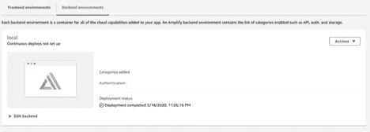
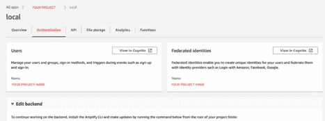
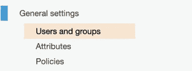
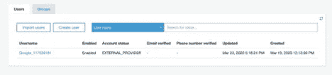
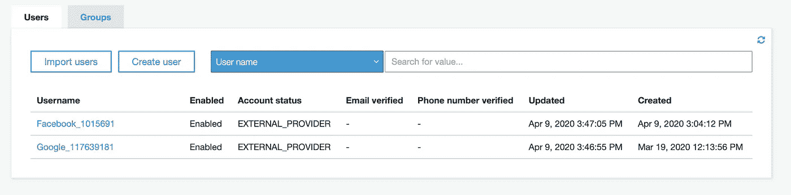

# 如何用 SwiftUI 和 AWS Amplify 实现登录(第 2 部分)

> 原文：<https://betterprogramming.pub/how-to-implement-sign-in-with-swiftui-and-aws-amplify-part-2-4a7b20bfe8cc>

## 与脸书一起登录

[天一马](https://unsplash.com/@tma?utm_source=medium&utm_medium=referral)在 [Unsplash](https://unsplash.com?utm_source=medium&utm_medium=referral) 上拍照

# 检查您的用户

在开始准备我们的脸书登录之前，我希望你按照本教程第一部分的[来设置你的 AWS Amplify 项目。设置是最难的(也是最长的)部分。相比之下，使用脸书添加登录将非常简单。](https://medium.com/better-programming/sign-in-with-aws-amplify-and-swiftui-978b01a5cf10)

如果到目前为止您已经完成了所有工作，并且成功地测试了与 Google 的登录，那么您应该能够在 AWS 控制台上查看用户的详细信息。

首先，进入 [AWS 放大控制台](https://console.aws.amazon.com/amplify)。单击您的项目，并转到“后端环境”选项卡。您应该看到身份验证类别:

用于您项目的 AWS 放大器控制台

如果您单击身份验证链接，您应该会看到以下选项卡:

AWS Amplify 控制台中的“身份验证”选项卡

现在您已经知道如何检查身份验证是否配置正确，您可以转到 [AWS Cognito 控制台](https://console.aws.amazon.com/cognito)。直接访问或点击用户旁边的“在 Cognito 中查看”按钮。您将被要求选择您的项目。接下来，单击常规设置下的“用户和组”:

AWS 认知设置

如果您在第 1 部分中测试了使用 Google 登录，您应该在列表中看到您的 Google 用户:

AWS Cognito 中的用户列表

如果你点击用户，你应该会看到你要求他们提供的详细信息:姓名、电子邮件和图片 URL。

现在，您已经知道在哪里检查您的用户信息，让我们进入下一部分，实现与脸书登录。

# 将脸书登录添加到您的项目中

如果你已经在你的项目上实现了使用谷歌登录，那么添加使用脸书登录只是将`identityProvider` 的字符串从`“Google”`改为`“Facebook”`的问题。由于大部分代码都是相同的，我们可以重构初始方法`signInWithGoogle`，用适当的`String` `“Google”`调用方法`signInWithIdentityProvider`。对于方法`signInWithFacebook`，我们将做同样的事情，传递`String` `“Facebook”`。您可以检查以下方法:

使用多个身份提供商登录

或者，在`ContentView.swift`中，您可以在点击按钮时调用`signInVC.signInWithIdentityProvider(with: "Google")`，这是您喜欢的。

你可能已经注意到了第`if provider == "Facebook"…`行。这是因为脸书的图片 URL 嵌入在我们需要解码的对象中，所以我们添加了这个小验证。要解码图片网址，可以查看下面的代码:

解析脸书图片 URL 的方法

当然，不要忘记添加一个按钮，用脸书登录并调用你的新方法。检查下面更新的`ContentView.swift`:

带有新的“用脸书按钮登录”的内容视图

现在，你可以再次运行你的应用程序，并按下新的`Button`以登录脸书。您应该会在屏幕上看到更改，还会在 Xcode 控制台上看到用户信息。

如果我们返回到 [AWS Cognito 控制台](https://console.aws.amazon.com/cognito)并查看用户列表，您可以看到您的新脸书用户:

脸书用户新登录的用户列表

就是这样。现在您的项目中有两个身份提供者了！

如果你想看看整个项目，请查看 [GitHub Repo](https://github.com/rolisanchez/swiftui-amplify-demo) 。