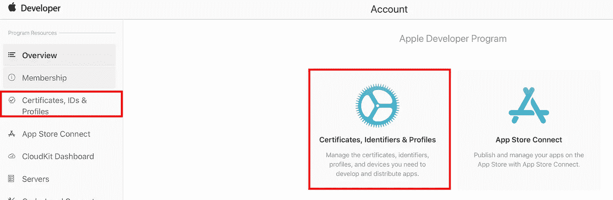
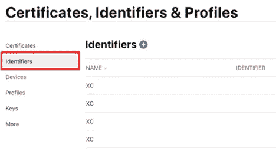
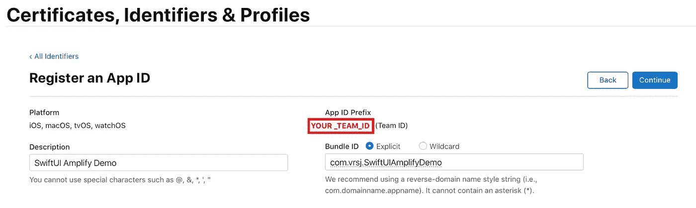
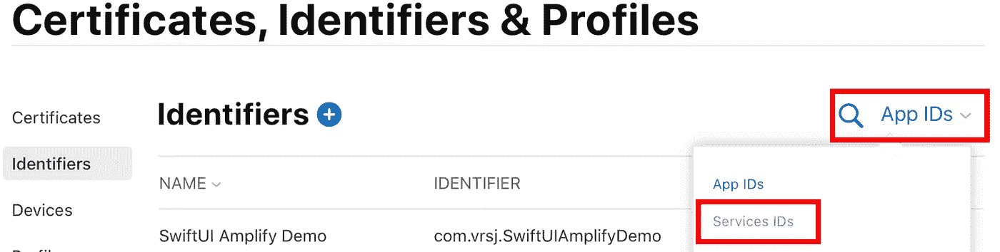
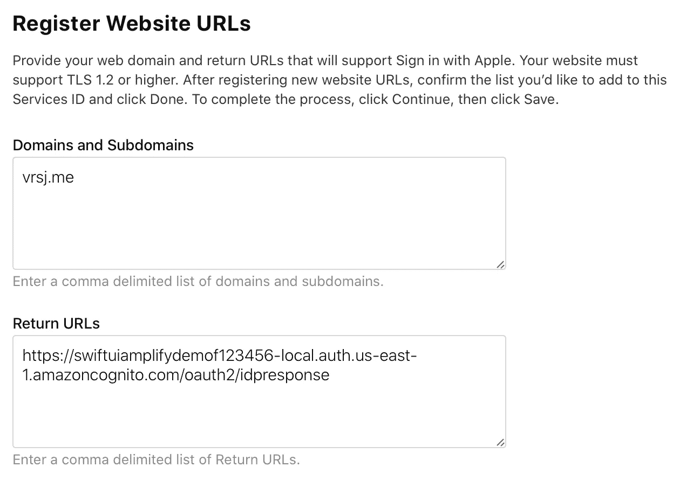
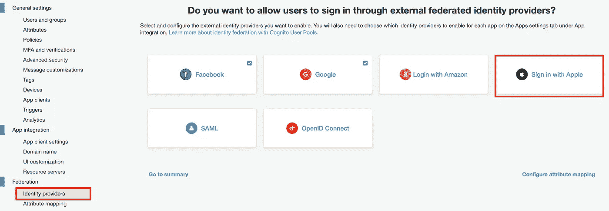
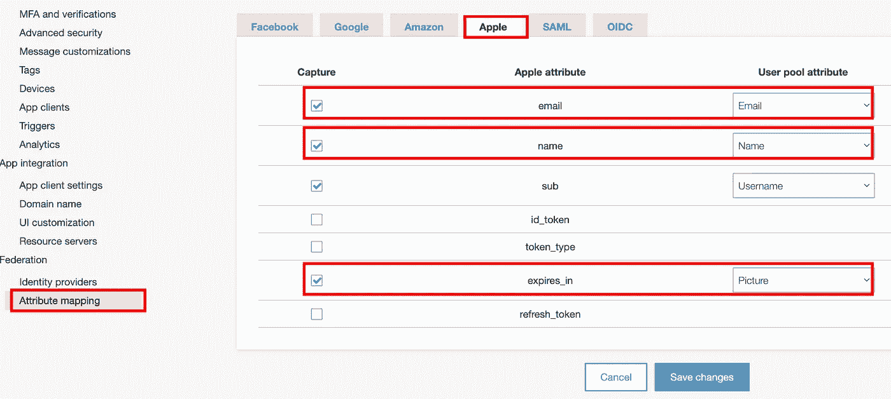
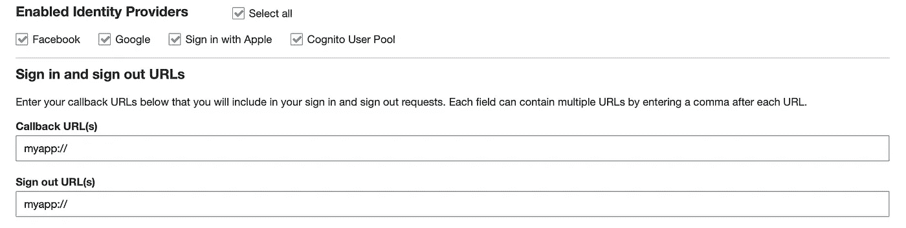
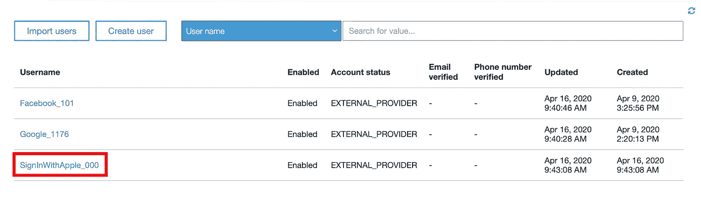

# 如何用 SwiftUI 和 AWS Amplify 实现登录(第 3 部分)

> 原文：<https://betterprogramming.pub/how-to-implement-sign-in-with-swiftui-and-aws-amplify-part-3-de994e218ed7>

## 登录 Apple


由 [Unsplash](https://unsplash.com?utm_source=medium&utm_medium=referral) 上的[émile Perron](https://unsplash.com/@emilep?utm_source=medium&utm_medium=referral)拍摄的照片

# App Store 审核指南

根据[更新的资源和登录苹果的指南](https://developer.apple.com/news/?id=03042020d):

> 使用第三方或社交登录服务(如脸书登录、谷歌登录、Twitter 登录、LinkedIn 登录、亚马逊登录或微信登录)来设置或验证用户的主帐户的应用程序也必须提供苹果登录作为等效选项

所有提交到 App Store 的新应用和应用更新必须在 2020 年 4 月 30 日之前遵循这些准则。你可以在这里看到其余的复习指南[。](https://developer.apple.com/app-store/review/guidelines/#sign-in-with-apple)

放心吧！在本文中，我们将探讨如何使用 AWS Amplify 添加 Apple 登录，以便您可以将其添加到您的应用程序中。

如果你没有用 AWS Amplify 设置你的项目，你可以检查[第 1 部分](https://medium.com/better-programming/sign-in-with-aws-amplify-and-swiftui-978b01a5cf10)。如果您想添加脸书登录，您也可以检查[第 2 部分](https://medium.com/better-programming/how-to-implement-sign-in-with-swiftui-and-aws-amplify-part-2-4a7b20bfe8cc)

# 在 Apple 的开发者门户中设置标识符和密钥

为了设置带 AWS 的苹果登录服务，我按照本教程[进行了操作](https://aws.amazon.com/blogs/security/how-to-set-up-sign-in-with-apple-for-amazon-cognito/)。我将在这里介绍主要步骤，但是如果您愿意，可以随意查看该教程并跳过这一部分。

首先，进入[苹果开发者门户](https://developer.apple.com)，用你的账户登录。在主页上，转到“证书、id&配置文件”，单击下图中的任何链接:



苹果开发者门户

在左侧导航栏上，选择“标识符”您应该会看到下面的屏幕:



证书、标识符和配置文件

在“标识符”页面上，选择+图标。在那里，选择“应用程序 id”在“注册应用 ID”页面上，在描述文本框中提供描述，并提供您的项目的捆绑包 ID。在“应用 ID 前缀”下，记下“团队 ID”值，如下图所示:



注册应用程序 ID

向下滚动，在“功能”下，选择“使用 Apple 登录”现在选择“继续”，检查配置，然后选择“注册”现在，在右侧的标识符页面上，选择“应用 id”，然后选择“服务 id”，如下图所示:



注册服务 id

选择+图标，并在“注册新标识符”页面上，选择“服务 id”

在“Register a Services ID”页面上，输入描述，并在“Identifier”下输入您的应用的捆绑包 ID，前面加上您的团队 ID，格式如下:`YOUR_TEAM_ID.com.YOUR_ORGANIZATION.YOUR_PROJECT_NAME`。

现在，点击您最近创建的服务 ID，并选择“使用 Apple 登录”复选框来启用该服务。然后，选择`Configure`。在这里，选择您之前创建的应用 ID。在 Web domain 下，您可以放置应用程序的 Web 域。对于返回 URL，输入您在配置您的 Amplify 项目(`https://<your domain>/oauth2/idpresponse`)时获得的`Authorized Redirect URI`，如下图所示:



注册用于登录 Apple 的 URL

查看信息后，按继续。在左侧导航栏上，选择按键，然后选择+图标。在“注册新密钥”页面上，输入密钥名称，然后选择“登录 Apple”旁边的复选框。点击配置，然后选择您之前创建的应用 ID。现在单击继续，查看信息，然后选择注册。

在您被重定向到的页面上，记下密钥 ID 并下载包含私钥的`.p8 file`。

现在我们已经完成了苹果开发者端的设置，让我们回到 AWS 控制台。

# 在 AWS Cognito 用户池中设置使用 Apple Identity Provider 登录

首先进入 [AWS Cognito 控制台](https://console.aws.amazon.com/cognito)，选择“管理用户池”，然后选择您将用于登录 Apple 的用户池。



添加新的身份提供者

在这里，提供您之前配置的`Apple Services ID`、您获得的团队 ID 以及您随私钥一起提供的密钥 ID。(您可以提供文件或文件中的内容。)在所需的范围上，选择电子邮件和名称复选框或任何您想要的范围。


*身份所需的信息【提供者*

现在在左边的标签，选择“属性映射”标签，然后选择“苹果”标签。在这里，选择“电子邮件”和“名称”的复选框，并在“用户池属性”下，选择它们的匹配属性。

如果您在设置 Amplify 项目时将`picture`设置为必填属性，当您点击保存更改时会收到一条错误消息:

> "属性映射缺少必需的属性[图片]"

使用 Apple 登录不提供图片，因此我们可以在这里做一个变通，将您不使用的任何剩余 Apple 属性映射到`picture`用户池属性。当然，这是*而不是*一个图片 URL，所以我们需要记住这一点，并在用户登录苹果时忽略我们 Swift 代码中的这个字段。最后，映射应该大致如下所示:



属性映射

将 Apple 属性映射到您的用户池属性时要小心。苹果非常关心隐私，所以他们只会在用户第一次登录你的应用时提供一次像`email`这样的属性。所以如果你没有在苹果属性中映射`email`，你以后就不能得到它了！

最后，在左侧选项卡上，转到“应用程序客户端设置”在“已启用的身份提供商”上，点击您正在使用的应用程序客户端的“使用 Apple 登录”旁边的复选框。



启用的身份提供者

现在让我们回去写一些代码。

# 将登录 Apple 添加到您的 SwiftUI 项目

如果你重构了你的代码，只将`Provider`作为`String`传递，如[第 2 部分](https://medium.com/better-programming/how-to-implement-sign-in-with-swiftui-and-aws-amplify-part-2-4a7b20bfe8cc)所示，这部分就足够简单了。

只需调用方法`signInWithIdentityProvider`，传递`String` `"SignInWithApple"`。记得检查提供者是否是`SignInWithApple`，由于苹果不提供，忽略图片。如果您在设置 Amplify 项目时不需要图片，您就不需要担心这个问题以及上面提到的图片映射。

将使用 Apple 登录添加到我们的项目

现在您需要添加一个按钮来调用这个新方法。在`ContentView.swift`上，添加以下内容:

```
Button(action: { signInVC.signInWithApple()}) { Text("Sign In with Apple")}
```

如果您运行您的应用程序并按下这个新的`Button`，您应该能够成功登录并在 Xcode 控制台上看到用户信息。

如果我们返回到 [AWS Cognito 控制台](https://console.aws.amazon.com/cognito)并查看用户列表，您可以看到您的新 Apple 用户:



Apple 用户新登录的用户列表

如果你遵循了这三个部分，现在你可以登录谷歌、脸书和苹果了！

如果你想看看整个项目，请查看 [GitHub Repo](https://github.com/rolisanchez/swiftui-amplify-demo) 。