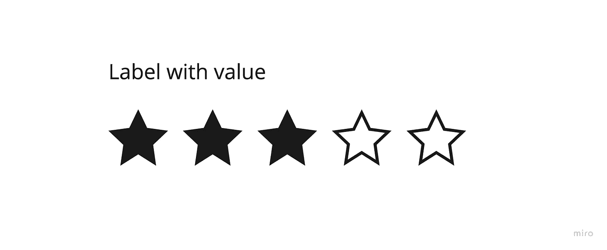
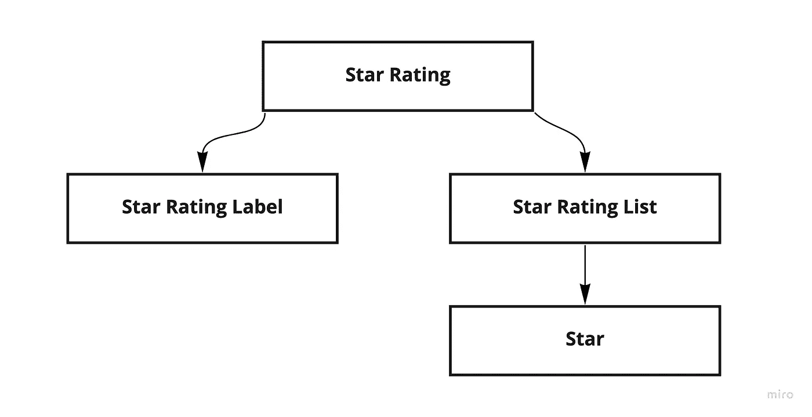

# 如何用 React.js 实现星级 Widget 并优化

> 原文：<https://betterprogramming.pub/how-to-implement-star-rating-widget-with-react-js-and-optimize-it-e3625f3104f>

## 从头到尾设计它


作者图片

在这篇文章中，我想讨论你在前端职位面试中可能遇到的问题——实现星级评定小部件。

在过去的五个月里，我参加了 15 次现场面试，收到了来自谷歌、Roku、微软和其他公司的邀请。

您应该阐明需求，并在大约 45-50 分钟内实现该小部件。

# 要求

让我们从小部件的需求开始。

*   用动态计数显示星星
*   用户可以选择评级
*   允许以只读模式显示其他用户的评级而不进行编辑
*   更改小部件的标签
*   改变空和满状态的开始颜色
*   扩展设置和悬停事件
*   设置星星的大小

## 实体模型



星级模型

## 组件架构



star widget 的组件架构

## 组件实现

让我们从开始评级组件的道具开始。有了这些道具，我们就可以配置滑块了。

在`Star Rating`组件中，我们需要实现以下内容:

*   根据客户需求扩展设置和悬停功能
*   在`Context`中提供小工具的所有配置
*   渲染`Label`和`StarsList`

我们将在组件的本地状态中保存当前评级和悬停值。为了避免道具和钻孔的计数，我建议使用`Context`来提供配置和当前的小部件状态。

`setRatingFn`和`setHoverFn`用自定义函数扩展事件并提供当前值。在只读模式下，这些方法被禁用。

星级组件

对于标签，我们有一个带有自定义文本的默认函数。如果用户想要使用自定义文本，我们允许他们这样做，并在呈现的`StarRatingLabel`组件中使用该方法。

星级标签组件

`StarsList`配置中`Star`组件的组件渲染计数。默认值是五。

星星列表组件

每个`Star`组件都知道自己的值，我们可以使用该值来设置等级或显示悬停时的变化。使用 SVG 可以控制图标的颜色、大小和形状。如果你想提供使用其他图标的可能性，用户可以在配置中设置自定义 SVG。此外，SVG 允许在不损失图像质量的情况下改变尺寸。

星形组件

另一种方法是使用自定义字体，为小部件提供不同的图标。

## 最佳化

正如您在`Star`组件中看到的，每次创建内联函数时，我们都可以避免这种情况。

让我们改变我们的`Star`组件代码。需要为星号添加带有值的数据属性，并调用没有内联函数的`onClick`、`onMouseEnter`和`onMouseLeave`方法。

星形组件优化

在`Star Rating`组件中改变了两种方法:`setRatingFn`和`setHoverFn`。在这里，我们可以从数据属性中获取值并使用它。

对于`OnmouseLeave`事件，我们需要将悬停状态设置为空。我们可以通过键入或创建一个单独的方法并调用它来处理这个问题。

星级组件优化

另一种方法是使用单选按钮并从中获取值。

# 结论

现在你知道了如何创建一个自定义的星级小工具，以及你可以向面试官澄清哪些要求。

你能在 [GitHub](https://github.com/yantsishko/star-widget-from-scratch-reactjs) 上看到的所有代码。

您可以阅读的其他文章:

*   [使用 React.js 和优化实现图像和文本滑块](/implementing-image-and-text-slider-with-react-js-and-optimizations-7a16af998548)

```
**Want to Read More About Front-End Interviews??**Here's [my blog](https://t.me/front_end_interview)
```

祝你面试好运！