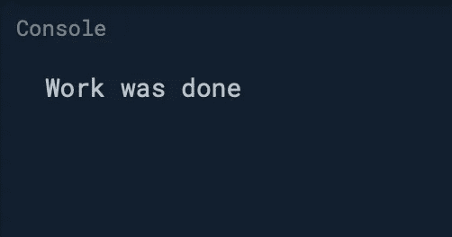

# 如何在 Dart 中实现委托设计模式

> 原文：<https://betterprogramming.pub/how-to-implement-the-delegation-design-pattern-in-dart-d782de77c886>

## 了解 Dart 中的 mixins 以及它们与 Swift 协议的比较

照片由[🇻🇪·何塞·g·奥尔特加·卡斯特罗·🇲🇽](https://unsplash.com/@j0rt?utm_source=medium&utm_medium=referral)在 [Unsplash](https://unsplash.com?utm_source=medium&utm_medium=referral) 上拍摄

在这个简短的教程中，我们将用两种语言实现委托设计模式:Dart 和 Swift。在这个过程中，我们将学习 Dart 中的 a `mixin`是什么，并将最终实现与 Swift 版本进行比较。

允许我们向 Dart 类添加功能，并在不同的类层次结构中重用它们的代码。

源代码可以在文章的底部找到。

# 我们开始吧

比方说我们有两个班，一个是`Manager`，另一个是`Worker`。`Manager`的职责是向`Worker`发送命令，执行某项工作。完成这项工作后，`Worker`类将结果发送回`Manager`。

让我们创建我们的第一个`mixin` — `WorkerDelegate`:

为了简单起见，它只包含一个方法`onWorkDone`，这个方法`Worker`将在任务完成时触发。让我们创建`Manager`类并实现`WorkerDelegate`方法:

现在让我们继续讨论`Worker`类:

我们可以看到，一旦运行了`doWork()`方法，就会触发委托的`onWorkDone()`方法。

为了使用我们创建的类，我们将它写在`main()`函数中:

结果，我们看到控制台中打印出以下内容:

我们已经实现了委托设计模式。现在，worker 不知道它的委托是谁，它所做的只是执行它的任务并触发委托的方法`onWorkDone()`，该方法在一个特定的委托中被单独处理。

以下是 Swift 中相同功能的实现(在 Xcode 游乐场中运行):

我们可以看到 Dart 和 Swift 中设计模式的实现是相似的。

# 资源

Dart 版本的完整源代码可从 GitHub 上的[获得。](https://gist.github.com/zafarivaev/b444f060628a3ac7b63c21f8e62cec50)

# 包扎

想了解更多关于 Dart 和 Flutter 的知识？请随意查看我的其他相关作品:

 [## 在 Flutter 中创建跨平台的选项卡式应用程序

### 使用 MaterialApp、AppBar 和 BottomNavigationBar 小部件

medium.com](https://medium.com/better-programming/create-a-cross-platform-tabbed-app-in-flutter-c728ca5e30f6)  [## Flutter 中的' copyWith()'操作是什么？

### 通过一些修改重用现有的小部件

medium.com](https://medium.com/better-programming/what-is-the-copywith-operation-in-flutter-2567e4d924bf)  [## Flutter 中的导航仪是什么？

### 如何促进跨平台应用内部的流动

medium.com](https://medium.com/better-programming/what-is-the-navigator-in-flutter-640e864892e2) 

感谢阅读！