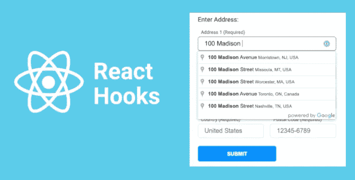
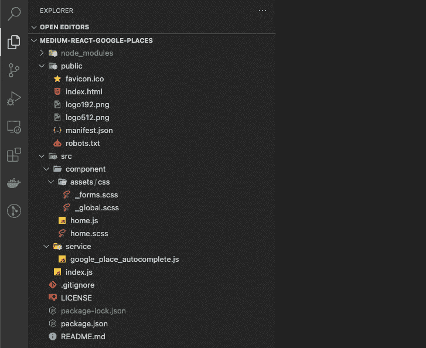
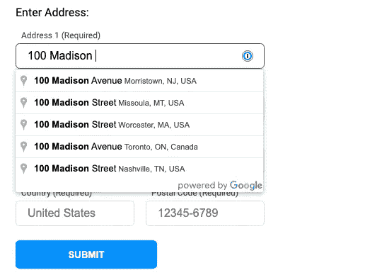

# 在 React Hooks 中实现 Google Place 自动完成小部件

> 原文：<https://betterprogramming.pub/how-to-implement-the-google-place-autocomplete-widget-in-react-hooks-4394a7a4e3b0>

## 使用 Google Place 自动完成小部件表单的简单示例

自从我写了一篇如何做的文章以来，已经一年多了。在那段时间里，我启动了一个新的软件公司，我们一直在开发一个名为 [AnotherSelf](https://anotherself.com) 的新档案应用程序和一个名为 [AnotherHire](https://anotherhire.com) 的求职应用程序。这两个集成的应用程序都构建在 Node 和 React 之上。我想开始分享我们在这些应用程序中构建的一些东西，我认为其他人会发现这些东西很有用。

本文将向您展示如何将 Google Place Autocomplete 小部件合并到使用 React Hooks 构建的地址表单中。这个例子将把 Autocomplete 放入它自己的服务中，该服务可以在整个应用程序中的多个地址表单上重用。

一如既往，有不止一种方法来剥这只猫的皮。我在这里展示的是我是如何完成我需要做的事情的。请根据您的代码编写风格进行调整。

我们开始吧！

# 获取谷歌地图 API 密钥

为了使用 Google Place Autocomplete 小部件，您需要一个 Google Maps API 密钥。这意味着你需要前往谷歌云控制台，创建一个帐户，并为谷歌地图平台设置凭证。在 Google Maps Javascript API 中，您需要启用 Places API 服务。

你可以点击[这个链接](https://developers.google.com/maps/documentation/javascript/places-autocomplete)来访问谷歌云控制台上的说明，它会带你完成这项工作。

在 Google Cloud 控制台中对这个 API 键进行限制是很重要的，这样它就只能在您发布到本地主机的站点的域中工作。

一旦你完成了，你将需要谷歌地图 API 密匙来继续。

**注意**:当您启用 Places API 服务时，会提示您启用计费。这是因为您可以通过此服务请求收费的数据组件。然而，我们将在本例中使用的数据来自**基本数据**类别，该类别(根据[当前使用和计费政策](https://developers.google.com/maps/documentation/places/web-service/usage-and-billing))不产生费用。

# 示例代码

所有示例代码都可以在下面的 GitHub 资源库中找到。请随意下载并以任何方式使用此代码，无需注明出处:

*   示例应用程序代码:[medium-react-Google-places](https://github.com/crmcmullen/medium-react-google-places)

一旦您克隆了这个库，您将需要导航到项目并运行`npm install`来安装必要的项目库。完成后，您应该有一个如下所示的项目文件夹:

图 1: VSCode 项目文件夹结构

# 将您的谷歌地图 API 添加到 Index.html

打开`public/index.html`文件，修改加载 Google Maps API 的行，以包含您在上面的 Google Cloud 控制台中创建的 API 键。

示例 1:将您的 Google API 密钥添加到 index.html

用您创建的 Google API 键替换文本`[YOUR-GOOGLE-API-KEY]`。

一旦完成，你应该可以用`npm start`启动应用程序，它将会工作。

现在让我们检查一下代码中发生了什么。

# Google Place 自动完成服务

打开文件`service/google_place_autocomplete.js`。

该服务可以在任何有地址表单的页面上使用，您可以在该页面上提供自动完成小部件。它提供了两个功能:

*   `initAutocomplete`
*   `getFullAddress`

`initAutoComplete` —从应用程序主页上的`useEffect`调用一次该功能。它将 Google Maps Places Autocomplete 小部件绑定到作为第一个参数传入的 HTML input 元素；`input`。

示例 2:初始化地点自动完成小部件

请注意，在本例中，我们使用`componentRestrictions`参数将预测结果限制在美国和加拿大。这可以完全删除或扩展到包括其他国家。

注意:`fields`参数是*要考虑的最关键的*。强烈建议将自动完成限制在这些字段中，因为这是小部件所必需的。如果您没有将预测限制在特定的字段，place 小部件将返回一个地点的所有字段，包括可收费类别中的字段！注意你要求 API 返回什么。

这样，当您开始在表单的这个输入字段中键入内容时，Autocomplete 小部件将自动显示在您的输入字段下，预测将随着您的继续键入而调整(见图 2)。

图 2:运行中的自动完成小部件

这个小部件的美妙之处在于它处理所有的 UI 呈现以及会话令牌处理。显示的是您可能在许多网站上见过的标准地点预测小部件。

谷歌控制台的自动完成小部件页面上有一些说明，会告诉你如果你真的觉得不满意，该如何设计呈现的用户界面。您甚至可以完全放弃这个小部件，直接调用 Autocomplete 服务并在您自己的 UI 中呈现。

在`initAutoComplete`函数中发生的最后一件事是在小部件上启动一个监听器(参见示例 3 ),当从显示的预测中选择一个地址时就会触发这个监听器。

示例 3:添加一个用于选择地点的监听器

它将使用所选地址的 ID 调用内部小部件函数`place_changed`，并将该地址传递给第二个传递的参数中提供的回调函数；`callback`。

`getFullAddress` —该函数由`initAutoComplete`中建立的监听器中提供的回调函数调用。

它接收选定的地点，解析所有的地址组件，并在 JSON 对象中返回它们，然后可以使用该对象填充页面上的地址表单。

# 应用程序主页

打开文件`component/home.js`。

示例 4:为 Place 小部件创建一个引用

Place Autocomplete 小部件需要绑定到 HTML input 元素，以便在键入时提供预测。在这个例子中，我用一个`useRef()`将它绑定到表单上的 address1 字段(主要街道地址)。

我还为我们的 Google Place 自动完成服务定义了一个常量(如上所述)。

`handleAddressSelect()` —在初始化 Google Place 自动完成服务时，此函数作为`callback`函数传入。每当从微件中显示的预测中选择一个地点时，都会调用此函数。

示例 5:处理选定的地址

它通过传入选定的位置来调用 Google Autocomplete 服务中的`getFullAddress`函数，并接收回一个包含所有已解析地址组件的 JSON 对象。然后，它用这些地址组件的值填充相关表单字段的值。

`useEffect()` —最后，一旦页面加载完毕，`useEffect`函数运行并用`initAutoComplete`初始化 Google Place Autocomplete 小部件，并将其绑定到我们用`address1ref`创建的 HTML 输入元素的引用。

示例 6:将输入元素绑定到小部件

当从小部件的预测列表中选择一个地点时，它还会将`handleAddressSelect`作为监听器回调函数传入。

# 摘要

就是这样！这是一个非常简单的演示例子，演示了如何在 React Hooks 地址表单中实现最流行的 Google Maps 服务之一。

我希望这篇文章和支持代码对您的项目有所帮助。