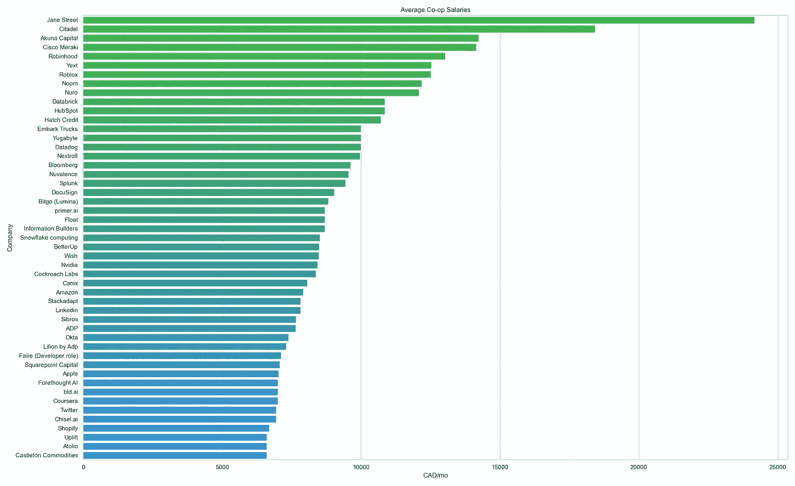
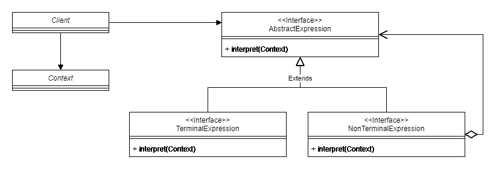

# 如何在 Python 中实现杂乱数据的解释器设计模式

> 原文：<https://betterprogramming.pub/how-to-implement-the-interpreter-pattern-for-messy-data-in-python-594a54a74ebb>

## 帮助您从数据中获取更多价值的深度指南

本文描述了如何实现解释器设计模式来读取杂乱的数据。



图一。公司 coop 工资的前 25%

图 1 显示了滑铁卢大学学生报告的前 25%公司的平均 coop 工资。在本文中，我将向您展示如何一步一步地得到这个图表。

# 解释器模式可以阅读语法

通常用于评估“32 * 5 + 23”等数学文本。这种模式的用处在于它如何用一组相对简单的规则执行任意的操作组合。



图二。解释器设计模式

解释器设计模式如图 2 所示。它从维护上下文引用的客户端开始，例如，字符串“32 * 5 + 23”。

设计模式的主体是`AbstractExpression`，它声明这种类型的所有对象都应该有一个解释(上下文)功能。

从`AbstractExpression`继承/扩展的类有两种主要类型:

*   `TerminalExpression`，又名`LiteralExpression`
*   `NonTerminalExpression`，其中可能包含对`AbstractExpression` s 的引用

我们的实现将在后面描述。

## 为合作基金分析手工报告的薪资数据

根据红迪网上一个针对滑铁卢大学学生的大讨论，我们的目标是根据报道的薪水对公司进行排名。

> 文末源代码！

该数据包含 2021 年[春季](https://www.reddit.com/r/uwaterloo/comments/n4dse2/waterlooworks_spring_2021_megathread/)和 2021 年[秋季](https://www.reddit.com/r/uwaterloo/comments/pkgmxh/waterlooworks_fall_2021_megathread/)的报告工资。

下面是一个数据示例:

```
1password: 25/h (1st coop), 32/hr (3rd coop), 42/hr (5th coop?)
Accedo: 24/hr (3rd coop)
⁠Achievers inc: 20-25/hr
⁠ADP: less than 44/hr
AGF: 18.50/hr
Akuna Capital: 65 USD/hour + return flight + corporate housing
Amazon: $7912/mo + 1875 USD/mo stipend + relocation(?)
AMD: 27/hr
American Express: 34.5/hr
⁠Apple: (34/hr + 1300-1500 stipend/month) (37/hr + 1350 stipend for 3A term)
Arctic Wolf: 20% above coop average, 23/hr (1st coop), 34/hr (4th coop)
Athos: 5000 USD/mo
Atolio: 34/hr (3rd coop), 38/hr (5th coop), 42/hr (6th coop)
⁠Autodesk: 24-30/hr
...
```

问题是使用了许多不同的格式。以下是其中的一些:

*   x/小时
*   X/mo
*   美元 X/月
*   x/小时(第一次合作)、Y/小时(第三次合作)、Z/小时(第五次合作)
*   等等。

## 我们希望使用 CAD/mo 来比较薪资排名

为了比较工资，我们需要使用相同的单位，在本例中，我们将每月的工资转换为加元(CAD)。

我们使用以下假设来简化问题:

*   我们取范围值的平均值(例如，20–25/小时→22.5/小时)
*   我们取不同合作期限工资的平均值(“34/小时(第三次合作)、38/小时(第五次合作)、42/小时(第六次合作)”→38/小时)
*   合作社平均收入为 30.0 加元/小时

## 定义抽象表达式

为了解决这个问题，我们首先将`AbstractExpression`定义如下:

```
# expressions.py

class AbstractExpression(object):
    def __init__(self):
        '''
        Returns None.

        __init__: None -> None
        '''
        pass
    def interpret(self):
        '''
        Returns the value of the expression.

        interpret: AbstractExpression -> float
        '''
        return 0
    def __repr__(self):
        '''
        Returns the string representation of the evaluated.

        __repr__: AbstractExpression -> str
        '''
        return str(self.interpret())
```

注意，我们让`interpret()`成为一个返回浮点值的零参数函数。我们假设在创建对象时存储了必要的上下文。这在下一节中可以看到。

## TerminalExpression 通常指的是一个计算出来的数字

我们将其定义如下:

```
# expressions.py

class LiteralExpression(AbstractExpression):
    def __init__(self, string):
        '''
        Returns None.

        __init__: str -> None
        '''
        self.string = string
    def interpret(self):
        '''
        Returns the value of the expression.

        interpret: LiteralExpression -> float
        '''
        return float(self.string)

# Example:
LiteralExpression("32").interpret() # This returns the value 32
```

# 让我们定义一个 AddExpression

现在我们已经有了基本情况，`LiteralExpression`，让我们为我们的解释语言添加一个简单的加法操作:

```
# expressions.py

class AddExpression(AbstractExpression):
    def __init__(self, left, right):
        '''
        Returns None.

        __init__: AddExpression -> None
        '''
        self.left = left
        self.right = right
    def interpret(self):
        '''
        Returns the value of the expression.

        interpret: AddExpression -> float
        '''
        return self.left.interpret() + self.right.interpret()

# Example:
AddExpression(LiteralExpression("5"), LiteralExpression("6")) # Returns 11
```

添加操作需要创建两个`AbstractExpression`对象。如果我们用两个`LiteralExpression`来初始化`5`和`6`，那么我们从`interpret()`得到的结果是 11。

最棒的是，这两个输入对象不一定是`LiteralExpression` s，它们可以是其他复合表达式，比如`MultiplyExpression`或更多的`AddExpression`。

## 现在我们需要一个减法表达式

几乎与`AddExpression`完全一样，但我们在`interpret()`中执行减法。

```
# expressions.py

class SubtractExpression(AbstractExpression):
    def __init__(self, left, right):
        '''
        Returns None.

        __init__: AbstractExpression AbstractExpression -> None
        '''
        self.left = left
        self.right = right
    def interpret(self):
        '''
        Returns the value of the expression.

        interpret: SubtractExpression -> float
        '''
        return self.left.interpret() - self.right.interpret()
```

## 我们还需要定义 MultiplyExpression

```
# expressions.py

class MultiplyExpression(AbstractExpression):
    def __init__(self, left, right):
        '''
        Returns None.

        __init__: AbstractExpression AbstractExpression -> None
        '''
        self.left = left
        self.right = right
    def interpret(self):
        '''
        Returns the value of the expression.

        interpret: MultiplyExpression -> float
        '''
        return self.left.interpret() * self.right.interpret()
```

现在，在我们的例子中，我们不需要除法表达式，但现在创建它应该是微不足道的。

## 我们还定义了一些其他的表达式

```
# expressions.py

class PercentAboveExpression(AbstractExpression):
    '''
    X% above Y --> (Y) * (1 + X)
    '''
    def __init__(self, left, right):
        '''
        Returns None.

        __init__: AbstractExpression AbstractExpression -> None
        '''
        self.left = left
        self.right = right
    def interpret(self):
        '''
        Returns the value of the expression.

        interpret: PercentAboveExpression -> float
        '''
        return (self.right.interpret()) * \
            (1 + self.left.interpret() / 100.0)
```

```
# expressions.py

class AverageExpression(AbstractExpression):
    def __init__(self, array):
        '''
        Returns None.

        __init__: (list AbstractExpression) -> None
        '''
        self.array = array
    def interpret(self):
        '''
        Returns the value of the expression.

        interpret: AverageExpression -> float
        '''
        sums = list(filter(
            lambda x: x != 0, [x.interpret() for x in self.array]
        ))
        return sum(sums) / len(sums) if (len(sums) > 0) else 0
```

在我们的例子中，我们需要定义两个附加的表达式:

*   `PercentAboveExpression`，计算文本，如“高于合作平均值 20%”
*   `AverageExpression`，计算“20–25/小时”和“34/小时(第三次合作)、38/小时(第五次合作)、42/小时(第六次合作)”的平均值

## 添加解析器

既然我们已经定义了`AbstractExpression`及其实现，我们需要编写一个函数将输入字符串转换成`Expression`对象。

为此，我们利用了问题的一些性质。也就是说，我们的目标是:

1.  删除不必要的文本
2.  将短语`/year`、`/yr`和`/y`的变体转换为相同的值
3.  解释短语，将其转换成正确的表达方式

我们首先在一个`constants.py`文件中定义以下常量:

```
# contants.py

PER_HOUR = 1

PER_HR_TO_PER_MO = 40 * 4.34524     # 40 hrs a week, 4.34524 wks a month
PER_MO_TO_PER_HR = (                # working hours in a month
    1 / PER_HR_TO_PER_MO
)             

PER_YEAR_TO_PER_HR = (              # working hours in a year
    1 / (12 * PER_HR_TO_PER_MO)
)    
PER_WEEK_TO_PER_HR = 1 / 40         # working hours in a week
STIPEND_TO_PER_HR = (               # 4-month co-op
    1 / 4 / PER_HR_TO_PER_MO
)       

COOP_AVERAGE = {
    "2021": {
        "F": "30.0",
        "S": "30.0"
    }
}

CURRENCY_CONVERTER = {
    "CAD": 1,
    "USD": 1.26,
    "¥": 0.01094
}

INPUT_FOLDER = "inputs"
OUTPUT_FOLDER = "outputs"
```

然后，我们定义文本清理函数`remove_articles(string)`和`remove_symbols(string)`

```
# helpers.py

def removeSymbols(string):
    '''
    Returns a string with all symbols removed.

    remove_symbols: Str -> Str
    '''
    string = string.replace("$", "")
    string = string.replace("\"", "")
    string = string.replace("~", "")
    return string
```

然后我们创建一个名为`convert_currency(string)`的函数来转换货币

```
# helpers.py

def convert_currency(string):
    '''
    Returns a string with all currencies converted to CAD.

    convert_currency: Str -> Str
    '''
    # For each key in CURRENCY_CONVERTER, replace with value
    for key in CURRENCY_CONVERTER:
        lowered_key = key.lower()
        uppered_key = key.upper()
        # Special case for yen
        if lowered_key == "¥":
            string = string.replace(
                lowered_key, 
                f"{CURRENCY_CONVERTER[uppered_key]} * "
            )
        else:
            string = string.replace(
                lowered_key, 
                CURRENCY_CONVERTER[uppered_key]
            )
    return string
```

我们还定义了一个函数来将变量转换为公共值`fix_variations(string)`

```
# helpers.py

def fix_variations(string):    
    '''
    Returns a string with all variations such as 
    /year, /yr /y replaced with multiplications with numbers.

    fix_variations: Str -> Str
    '''
    # /yr
    string = string.replace("/year", f" * {PER_YEAR_TO_PER_HR}")
    string = string.replace("/yr", f" * {PER_YEAR_TO_PER_HR}")
    string = string.replace("/y", f" * {PER_YEAR_TO_PER_HR}")
    string = string.replace("annual", f" * {PER_YEAR_TO_PER_HR}")
    string = string.replace("/annum", f" * {PER_YEAR_TO_PER_HR}")
    string = string.replace("/a", f" * {PER_YEAR_TO_PER_HR}")

    # If X/hr regex (convert to /mo)
    string = string.replace("/hour", f" * {PER_HOUR}")
    string = string.replace("/hr", f" * {PER_HOUR}")
    string = string.replace("/h", f" * {PER_HOUR}")

    # Else if X/mo
    string = string.replace("stipend/month", f" * {PER_MO_TO_PER_HR}")
    string = string.replace("/month", f" * {PER_MO_TO_PER_HR}")
    string = string.replace("/mo", f" * {PER_MO_TO_PER_HR}")

    # Else if X/week or X/wk
    string = string.replace("/week", f" * {PER_WEEK_TO_PER_HR}")
    string = string.replace("/wk", f" * {PER_WEEK_TO_PER_HR}")
    string = string.replace("/w", f" * {PER_WEEK_TO_PER_HR}")

    # Else other cases
    string = string.replace("relocation", f" * {STIPEND_TO_PER_HR}")
    string = string.replace("stipend", f" * {STIPEND_TO_PER_HR}")
    string = string.replace("signing bonus", f" * {STIPEND_TO_PER_HR}")
    string = string.replace("bonus", f" * {STIPEND_TO_PER_HR}")

    string = string.replace("s", "")

    # Handle thousands
    string = string.replace("k", " * 1000")
    return string
```

这些辅助函数可以用正则表达式更简洁地完成，但为了便于阅读，它们是这样编码的。

我们还需要一个函数来获取给定期限和年份的 coop 平均值。看起来是这样的:

```
# helpers.py

def get_coop_average(term, year):
    '''
    Returns the average coop salary for a given term 
    and year as a float in CAD PER HOUR units.

    get_coop_average: Str Str -> Float
    '''
    return COOP_AVERAGE[str(year)][str(term)]
```

现在，我们可以用它来创建递归函数`parse_expression(string)`

```
#salary_parser.py

import re
from expressions import AbstractExpression, AddExpression, \
    SubtractExpression, PercentAboveExpression, AverageExpression, \
    MultiplyExpression, LiteralExpression
from helpers import remove_symbols

def parse_expression(string):
    '''
    Returns an AbstractExpression representing the given string.

    Requires:
        - string is a valid salary expression

    parse_expression: Str -> AbstractExpression
    '''
    string = string.strip()
    # Remove symbols
    string = remove_symbols(string)

    if (string == ""): return AbstractExpression() # FIXME

    # parse any parenthesis if any
    result = re.search(r"(\(.*?\)|\(.*$)", string)
    if (result):
        resultString = result.string[result.start()+1:result.end()-1]
        value = parse_expression(resultString).interpret()
        string = string[:result.start()] + " or " + \
            str(value) + " " + string[result.end():]
        return parse_expression(string)

    result = re.search(r"(\[.*?\]|\[.*$)", string)
    if (result):
        string = string[:result.start()] + string[result.end():]
        return parse_expression(string)

    if ("," in string or " or " in string):
        return AverageExpression([
            parse_expression(s) for s 
            in re.split(r",| or ", string)
        ])

    if ("every add" in string): return AbstractExpression()

    if ("% above" in string):
        parts = string.split("% above")
        leftString = parts[0]
        rightString = parts[1]
        return PercentAboveExpression(
            parse_expression(leftString), 
            parse_expression(rightString)
        )

    if ("+" in string):
        parts = string.split("+")
        leftString = parts[0]
        rightString = "+".join(parts[1:])
        return AddExpression(
            parse_expression(leftString), 
            parse_expression(rightString)
        )

    if ("above" in string):
        parts = string.split("above")
        leftString = parts[0]
        rightString = "above".join(parts[1:])
        return AddExpression(
            parse_expression(leftString), 
            parse_expression(rightString)
        )

    if ("below" in string):
        parts = string.split("below")
        leftString = parts[0]
        rightString = "below".join(parts[1:])
        return SubtractExpression(
            parse_expression(rightString), 
            parse_expression(leftString)
        )

    if ("*" in string):
        parts = string.split("*")
        leftString = parts[0]
        rightString = "*".join(parts[1:])
        return MultiplyExpression(
            parse_expression(leftString), 
            parse_expression(rightString)
        )

    if ("to" in string):
        parts = string.split("to")
        leftString = parts[0]
        rightString = "to".join(parts[1:])
        return AverageExpression([
            parse_expression(leftString), 
            parse_expression(rightString)
        ])

    if (" " in string):
        return AverageExpression([
            parse_expression(s) for s 
            in string.split(" ")
        ])

    if (string.replace('.','',1).isdigit()):
        return LiteralExpression(string)

    return AbstractExpression()
```

`parse_expession(string)`函数中的操作顺序对于确保乘法在计算结果时“首先”发生非常重要。

在上面的代码中，我们使用了如下关键字:

*   `% above`创造出一个`PercentAboveExpression`
*   `+`创造出一个`AddExpression`
*   `below`为一个`SubtractExpression`
*   `*`为一个`MultiplyExpression`

这个函数的返回值是一个表达式对象，我们可以`interpret()`。

最后，为了解析文本中的行，我们有如下所示的主代码:

```
# main.py

import argparse
import os
import re
import json
import pandas as pd
from constants import PER_HR_TO_PER_MO, INPUT_FOLDER, OUTPUT_FOLDER
from helpers import get_coop_average, remove_articles, fix_variations
from salary_parser import parse_expression
from plotter import plot    

def main(filename, term, year):
    '''
    Returns None.
    Reads the file in path and gets the average salary for
    each company in the file for the given term and year.
    The function then saves this data to a csv file.
    Also saves a bar chart for the company salaries.

    Effects:
        - Reads the file in path
        - Writes to {OUTPUT_FOLDER}/output.csv and 
        {OUTPUT_FOLDER}/output_top_25_percent.csv
        - Writes to {OUTPUT_FOLDER}/output.png and 
        {OUTPUT_FOLDER}/output_top_25_percent.png

    Requires:
        - term is F, W, or S

    main: Str Str Str -> None
    '''
    companies = {}

    path = os.path.join(INPUT_FOLDER, filename)

    # Ensure input folder is created
    if not os.path.exists(INPUT_FOLDER):
        os.makedirs(INPUT_FOLDER)

    # Perform the analysis
    with open(path, 'r',  encoding="utf8") as f:
        lines = f.readlines()
        for line in lines:
            if (len(line.strip()) == 0): continue
            line_parts = line.split(": ")
            company = line_parts[0]
            # Word joiner character removal
            company = company.replace("\u2060", "") 

            salary_string = line_parts[1].replace("\n", "")
            salary_string = re.sub(
                r"(\d),(\d{3})",r"\g<1>\g<2>", 
                salary_string
            )  
            salary_string = salary_string.lower()    
            salaries = []

            salary_string_part = salary_string

            salary_string_part = remove_articles(salary_string_part)

            salary_string_part = fix_variations(salary_string_part)

            salary_string_part.replace(
                "coop average", 
                get_coop_average(term, year)
            )

            salary = parse_expression(salary_string_part).interpret()
            if (salary != 0): salaries.append(salary)

            average = (
                sum(salaries) / len(salaries) \
                if (len(salaries) > 0) else 0
            )
            average = average * PER_HR_TO_PER_MO

            companies[company] = {"CAD/mo": average}

    pd.options.display.float_format = "{:,.0f}".format

    df = pd.read_json(
        json.dumps(
            companies, indent=4, sort_keys=True
        ), 
        orient='index'
    )
    df = df.sort_values(by=['CAD/mo'], ascending=False)
    df = df['CAD/mo'].apply(lambda x: int(x))

    # Ensure output folder is created
    if not os.path.exists(OUTPUT_FOLDER):
        os.makedirs(OUTPUT_FOLDER)

    # Save the results
    output_path = os.path.join(OUTPUT_FOLDER, "output.csv")
    df.to_csv(output_path, index_label="Company")

    output_path_top_25 = os.path.join(
        OUTPUT_FOLDER, 
        "output_top_25_percent.csv"
    )
    df25 = df.head(int(df.count() * 0.25))
    df25.to_csv(output_path_top_25, index_label="Company")

    # Plot the graph
    plot(df, "output.png")
    plot(df25, "output_top_25_percent.png")

if __name__ == '__main__':
    parser = argparse.ArgumentParser()
    parser.add_argument(
        'filename', 
        type=str, 
        help="File name of input file from input folder"
    )
    parser.add_argument('term', type=str, help="Term (F/W/S)")
    parser.add_argument('year', type=str, help="Year (e.g. 2021)")
    args = parser.parse_args()
    main(args.filename, args.term, args.year)
```

在上面的代码中，我们获得了每个公司每小时的平均值，将其转换为每月，然后将其存储在 Pandas 数据帧中。然后我们将数据框导出到两个 CSV 文件中，一个是`output.csv`中排名公司的完整列表，另一个是`output_top_25_percent.csv`中排名前 25%的公司。

## 现在来一个可视化！

最后，我们使用以下代码绘制一个可视化图形:

```
# plotter.py

import os
import pandas as pd
import seaborn as sns
import matplotlib.pyplot as plt
from constants import OUTPUT_FOLDER

def plot(df, output_filename):
    '''
    Returns None.
    Plots the data in the dataframe df.
    Saves the output to {OUTPUT_FOLDER}/{output_filename}

    Effects:
        - Writes to {OUTPUT_FOLDER}/{output_filename}

    Requires: 
        - df is a dataframe with two columns: Company and CAD/mo

    plot: DataFrame Str -> None
    '''
    print(df.reset_index())
    # Plot the data
    sns.set(style="whitegrid")
    fig, ax = plt.subplots(figsize=(20, 0.25 * len(df)))
    g = sns.barplot(
        data=df.reset_index(), y="index", x="CAD/mo", 
        ax=ax, palette="blend:limegreen,dodgerblue"
    )
    g.set_title("Average Co-op Salaries")
    g.set_xlabel("CAD/mo")
    g.set_ylabel("Company")

    fig.tight_layout()

    path = os.path.join(OUTPUT_FOLDER, output_filename)
    fig.savefig(path)
```

## 在哪里可以找到更多的设计模式

这只是展示面向对象编程能力的众多设计模式之一。我还在另一篇文章中展示了如何实现 [Memento 模式。如果你想学习更多关于设计模式的知识，我强烈推荐 Erich Gamma 等人(四人帮)的书*Design Patterns:Elements of Reusable Object-Oriented Software*。我甚至称之为编程的圣经。](https://medium.com/swlh/how-to-implement-the-memento-design-pattern-for-reactjs-1eb6b76c39c0)

# GitHub 知识库

请随意查看这里的源代码:[https://github.com/justinsj/interpreter-coop-salaries](https://github.com/justinsj/interpreter-coop-salaries)

如果你喜欢这篇文章或者从中有所收获，请继续关注！

如果你也有任何建议，请在 LinkedIn[上的评论或消息中告诉我！](https://www.linkedin.com/in/justin-sj/)