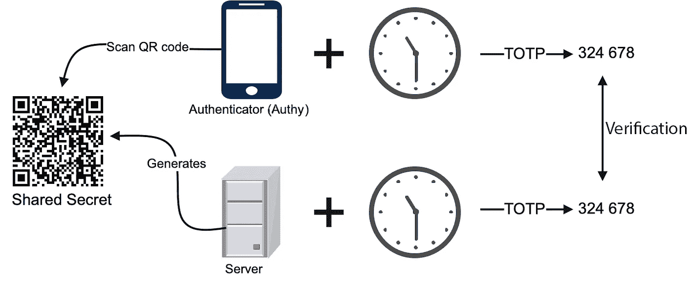
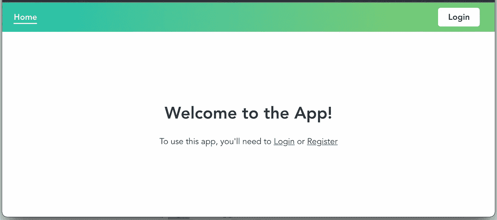
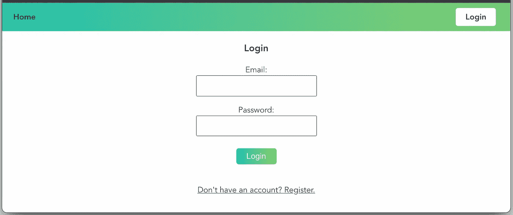
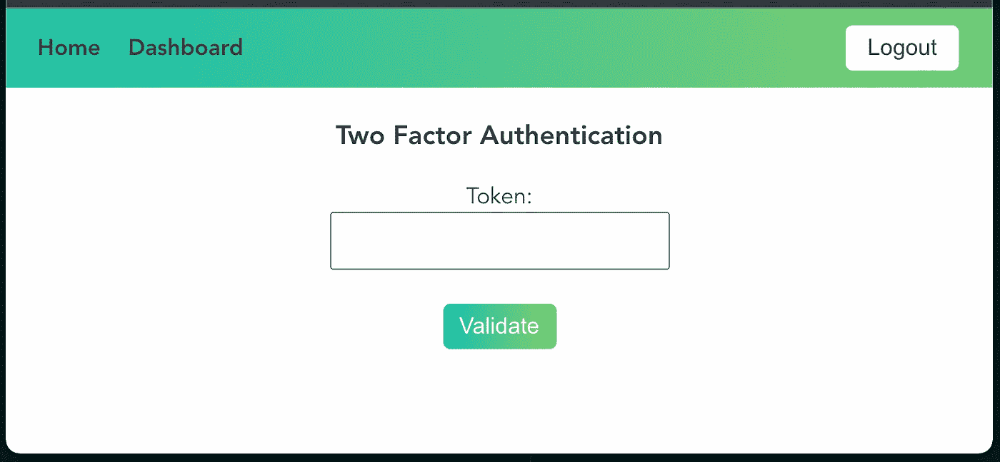
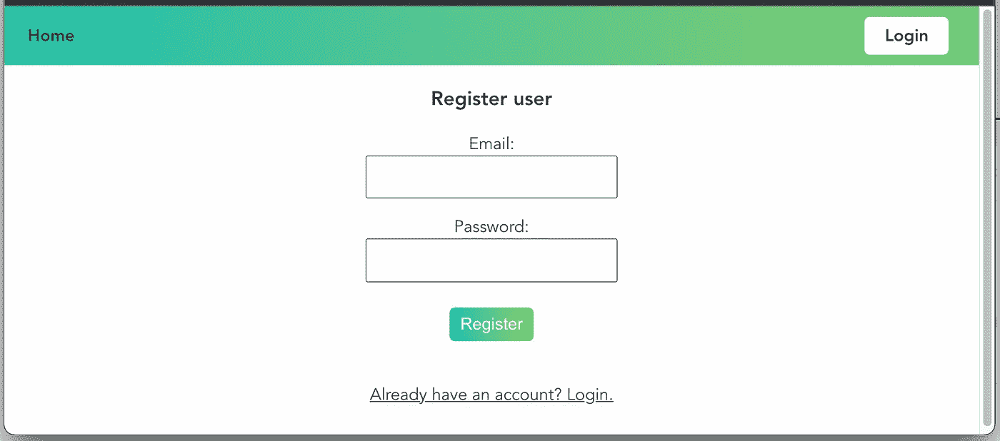
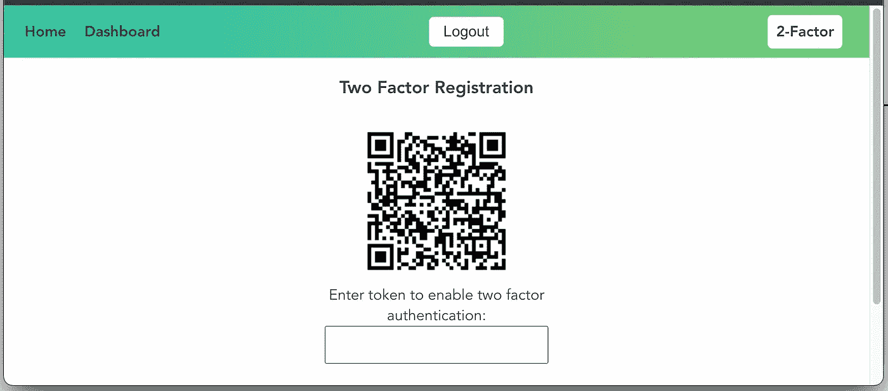

# 如何使用 Node.js 和 Vue 3 实现双因素认证

> 原文：<https://betterprogramming.pub/how-to-implement-two-factor-authentication-using-node-js-and-vue-3-1029745e06fd>

## 使用基于时间的一次性密码(TOTP)

摩根·豪斯尔在 [Unsplash](https://unsplash.com?utm_source=medium&utm_medium=referral) 上的照片

上周，我们的产品负责人问我们，在我们的系统中添加双因素身份认证需要什么。我们使用 Azure Active Directory，这意味着通过 Azure 门户配置一个额外的策略。这就是我们启用双因素身份认证所需做的全部工作。

由产品负责人的问题引发，我认为也是时候在我的边项目中添加双因素身份验证了。我想使用添加双因素身份验证的常见方式，即基于时间的一次性密码。

本文描述了我如何使用 Node.js 和 Vue.js 在我的侧项目中实现双因素身份验证。

你可以在[这个 GitHub 库](https://github.com/PatrickKalkman/twofactorauth)里找到后端和前端的完整源代码。

# 双因素认证

双因素或多因素身份认证(MFA)正在成为 IT 系统事实上的标准。你可能已经使用了几个 MFA 账户，比如 Google，GitHub，或者 Apple。如果没有，您应该启用它！

多因素身份认证是一个过程，在此过程中，用户必须在登录事件期间提供多种形式的身份证明。这可能是手机代码或指纹扫描。

通过要求用户提供额外的标识，您可以提高系统的安全性。攻击者获得或复制这种其他标识变得更加困难。

双因子和多因子的区别在于双因子总是使用两种形式的标识。多因素身份认证可能涉及两个或三个因素。在本文中，我们将实现双因素身份验证。

# 基于时间的一次性密码(TOTP)

基于时间的一次性密码(TOTP)是双因素身份验证的常用方式。它使用基于当前时间生成令牌的算法。最近的一项研究表明，TOTP 是对用户最友好的双因素认证技术之一。下图显示了 TOTP 的过程。

TOTP 之流，作者形象

它从服务器生成一个 32 个字符的随机密码开始。前端将这个秘密转换成二维码，并显示在网页上。用户使用 Authy 或 Google Authenticator 等认证器应用程序，通过扫描二维码来添加帐户。作为响应，服务器存储用户的秘密。

用户登录后，网站会显示一个字段，用户必须在其中输入由 Authenticator 应用程序生成的令牌。authenticator 应用程序使用存储的密码和当前时间来创建令牌。在将其发送到服务器之后，服务器使用保存的秘密和当前时间生成令牌。然后，它验证来自用户的令牌和生成的令牌是否匹配。

# 我的副业

我这边的项目由 Node.js 后端和 Vue 3 前端组成。该项目是闭源的，但是本文的演示应用程序实现了相同的解决方案。

## 后端 REST API

后端包含一个使用 Node.js 和 Fastify 实现的 REST API。REST API 包含两个控制器，一个用户控制器和一个客户控制器。用户控制器可公开访问，负责注册和验证用户。客户控制器受到保护，并包含一个检索客户列表的操作。

## 前端 Vue web 应用程序

前端由五个不同的屏幕组成。它使用 Vuex 状态管理库来全局存储应用程序的数据。基于 promise 的 HTTP 客户端 Axios 用于与后端通信。

在我们深入研究双因素身份验证的实现之前，让我们先看看我是如何实现第一层身份验证的。

## 使用 JWT 的标准身份验证

我使用电子邮件和密码实现了第一层身份验证。当用户登录并成功通过身份验证后，用户控制器会生成一个 JSON web 令牌(JWT)。后端将 JWT 返回给前端。前端应该在每个后续 HTTP 请求的报头中包含 JWT 令牌。

我们将用户数据后端存储到一个名为 [LocallyDB](http://boutglay.com/locallydb/) 的基于文件的 JSON 数据库中。

认证的第一层

在使用 [bcryptjs](https://www.npmjs.com/package/bcryptjs) 存储密码之前，后端会对密码进行哈希处理。在第三行，登录操作从数据库中检索用户。然后在第 5 行，如果用户存在，它使用`bcrypt.compareSync`将散列与给定的密码进行比较。

如果成功，登录操作将通过使用配置的密码对用户对象进行签名来创建 JWT。然后，它返回一个包含生成的 JWT 令牌的新用户对象。

# 添加双因素身份认证，后端

用户通过身份验证后，他们可以启用双因素身份验证。它由两个独立的步骤组成，每个步骤使用不同的控制器动作来实现。

## 步骤 1，生成密码和 QR 码

第一步做两件事。首先，它创建共享的 TOTP 秘密，其次，它从该秘密生成一个 QR 码。后端将 QR 码和秘密返回给前端。

启用双因素身份认证的第 1 步

我们使用 [speakeasy](https://www.npmjs.com/package/speakeasy) 来生成共享秘密，如您在第 4 行所见。它返回一个具有以下四个属性的秘密对象:`secret.ascii`、`secret.hex`、`secret.base32`和`secret.otpauth_url`。每个属性包含相同的值，但形式不同。

最后一个属性`secret.otpauth_url`用于生成二维码。二维码库生成第 5 行的二维码。它使用包含 QR 码的 png 图像的 base64 编码字符串。后端将 QR 码和秘密对象返回给前端。

见下面的例子。

启用双因素身份验证步骤 1 后，响应返回到前端。

## 步骤 2，验证令牌并启用双因素身份认证

也许你会问为什么会有步骤 2？第 1 步不足以启用双因素身份认证吗？你是对的。

我们使用步骤 2 来确保验证者应用程序和后端使用相同的秘密。在第 2 步中，我们让用户输入 authenticator 应用程序生成的令牌，并用后端生成的令牌对其进行验证。如果两者相同，我们启用双因素身份验证，并将秘密和用户信息一起存储在数据库中。通过这种方式，我们可以肯定双因素身份认证是有效的。

下面您可以看到步骤 2 的实现。在第 9 行，我们使用 speakeasy 库来验证从 authenticator 应用程序生成的令牌。我们没有将步骤 1 中生成的秘密存储在后端。前端提供生成的秘密，正如您在第 7 行中看到的。

启用双因素身份认证的步骤 2

## 使用双因素身份验证登录

当用户想要登录并启用双因素身份认证时，用户必须在验证用户名和密码后输入 TOTP 令牌。前端显示一个输入令牌的字段，并在后端调用验证令牌 API 方法。

首先，`validateToken`方法验证 JWT 令牌并提取电子邮件地址。然后，我们使用这个电子邮件地址从数据库中检索用户。这包括 TOTP 的秘密。

然后，给定的令牌和秘密被提供给`speakeasy`的`verify`方法以验证令牌。我们将验证的结果返回给前端。

登录时验证 TOTP 令牌

现在让我们看看如何从前端调用这些步骤。

# 添加双因素身份认证，前端

Vue 3 前端由以下五个 Vue 组件组成。我们将研究每个组件，看看它们是如何实现的。

*   主页
*   注册
*   注册
*   启用双因素身份验证
*   显示受保护数据的仪表板

## 主页

这是应用程序的主屏幕。它显示了一个带有登录按钮的导航栏。屏幕中央的消息包含两个链接，一个用于登录屏幕，另一个用于注册新用户屏幕。

应用程序的主屏幕，图片由作者提供

## 登录用户

在此屏幕上，用户可以登录到网站，然后访问受保护的仪表板。

应用程序的登录屏幕，图片由作者提供

如果应用程序成功地对用户进行了身份验证，并且用户启用了双因素身份验证，则屏幕会显示一个字段来输入 TOTP 令牌。见下文。

双因素认证屏幕，图片由作者提供

登录组件处理标准登录和令牌验证。它包含两个表单，一个用于正常登录，另一个用于输入 TOTP 令牌。见下文。视图模板显示了依赖于`showTwoFactorPanel`布尔字段的登录表单或验证令牌表单。

当按钮被按下时，登录表单执行`login`方法，验证令牌表单执行`validateToken`方法。这两种方法都向 Vuex 存储发送消息。Vuex 存储然后调用该方法，并与后端进行通信。下面您会看到 validateToken 方法，它是`LoginUser.vue`组件的一部分。

您可以在第二行看到，它将`validateToken`消息发送到 Vuex 商店。我们将 API 调用的结果保存在存储中。然后`validateToken`方法从第 7 行的存储中读取结果。如果令牌正确，应用程序将导航到仪表板。

LoginUser 组件的登录方法

如果我们考虑在商店中实现`validateToken`方法，我们使用 Axios 来调用后端。使用`SET_TWOFACTOR_LOGIN`变异将验证令牌 API 调用提交给存储。

存储区中的 validateToken 方法

## 仪表盘

一旦用户通过身份验证，应用程序就会显示仪表板。仪表板是显示客户列表的受保护资源。

仪表板，显示客户列表的受保护资源，作者图片

仪表板组件使用 Vuex 存储来检索和存储客户。在客户从后端返回后，他们被分配到客户的组件阵列。使用`CustomerCard`组件呈现每个客户。请参见下面的 Vue 仪表板组件。

仪表板组件

## 注册用户

在`RegisterUser`屏幕上，用户可以创建一个新帐户来访问网站上的受保护资源。

注册用户屏幕，图片由作者提供

## 双因素注册

用户登录后，按下导航栏上的**双因素**按钮，即可启用双因素认证。屏幕上显示了一个二维码，可以通过 Authy 等认证应用程序扫描。

当你按下双因素按钮，前端指示后端生成 TOTP 秘密。后端将秘密转换成二维码，二维码作为图像发回前端。

启用双因素身份认证屏幕，图片由作者提供

`TwoFactorRegistration`组件包含一个显示二维码的 Vue 模板。这是第 4 行的图像字段。图像标签被绑定到组件的 qr 字段。qr 字段由后端返回的 png 图像字符串填充。

显示 QR 码的验证令牌模板

# 关于实现的说明

虽然本文和演示项目展示了使用基于时间的一次性密码的双因素身份验证的完整实现，但是在将它用于生产应用程序之前，有一些事情需要注意。

该解决方案将未加密的 TOTP 秘密存储在与用户凭证相同的位置。这不是一个好的做法。您应该加密 TOTP 机密，并将密钥保存在不同的服务器上。

后端不会验证所有传入的请求参数。在后端使用之前，最好在真实的生产环境中验证所有传入的参数。

# 结论

本文描述了使用 Node.js 服务器和 Vue.js 客户端的双因素身份验证的实现。该解决方案使用基于时间的一次性密码来创建第二层身份验证。

Node.js 后端使用 Fastify 创建一个 REST API，使用`easyspeak`作为执行双因素身份验证的库。前端使用 Axios 与后端通信。它使用 Vuex 状态管理库存储应用程序的全局状态。

我希望这表明实现双因素身份验证是可行的，并且可以很容易地扩展。你需要特别小心，以确保你在一个单独的位置存储 TOTP 的秘密。如果您没有将机密和用户凭证放在同一个地方，这将会有所帮助。

你可以在 [GitHub](https://github.com/PatrickKalkman/twofactorauth) 上找到客户端和服务器的实现。

感谢阅读，记住永远不要停止学习！