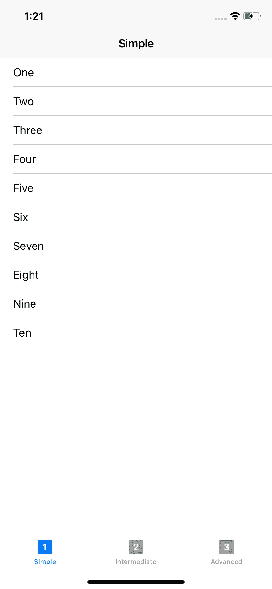
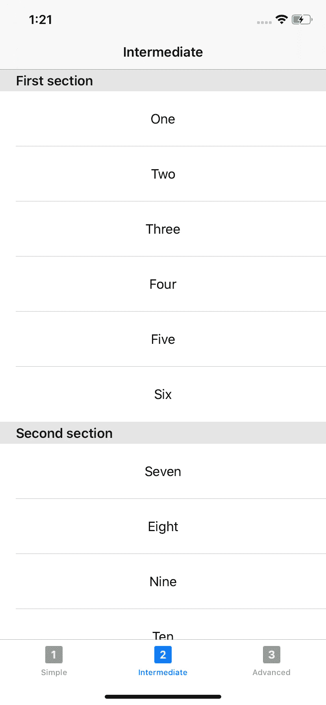
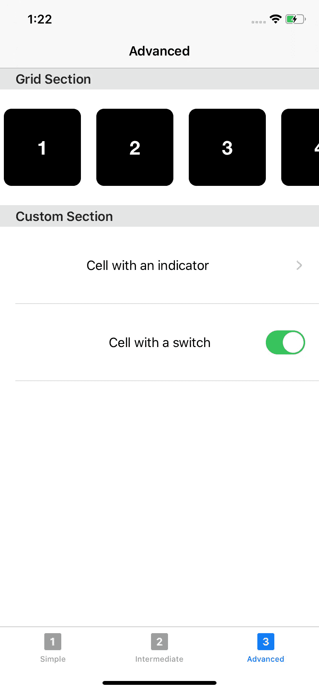
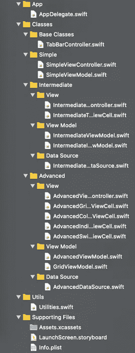

# 如何用 RxDataSources 实现 UITableView 和 UICollectionView

> 原文：<https://betterprogramming.pub/how-to-implement-uitableview-and-uicollectionview-with-rxdatasources-1afcd68729bf>

## 以及为什么您再也不会直接使用 UITableViewDataSource

在本文中，我将通过一个同时实现了`UITableView`和`UICollectionView`的应用程序的例子向您展示 [RxDataSources](https://github.com/RxSwiftCommunity/RxDataSources) 的强大功能。

该项目的源代码可在 GitHub 上获得[。](https://github.com/zafarivaev/RxDataSources-Demo)

# 演示应用程序

该应用程序有一个`UITabBarController`，其中包含三个视图控制器:`SimpleViewController`、`IntermediateViewController`和`AdvancedViewController`。

每个屏幕对应于实现的难度。

# 项目结构

该应用程序遵循 MVVM 架构。我们有三个主文件夹:`App`、`Classes`、`Utils`和`Supporting Files`。

在`App`文件夹中，我们有`AppDelegate.swift`负责将`UITabBarController`设置为`window`的`rootViewController`。

在`Classes`文件夹中，我们有所有的视图控制器和视图模型。

`Utils`包含`Utilities.swift`文件，该文件提供了一个帮助器方法，用于从特定的单元格获取重用标识符。

`Supporting files`包含我们在本教程中不会用到的文件。

清楚这一点后，让我们开始一个接一个地学习简单、中级和高级实现。

# 简单的

显示带有简单数据源的基本`UITableView`。

## SimpleViewController.swift

这里我们布局一个`tableView`，参考一个`SimpleViewModel`获取数据。

让我们仔细看看如何实现`tableView`数据绑定:

我们所要做的就是访问`viewModel`的 items 属性并将其绑定到`tableView`。结果，我们只用几行代码就完成了`tableView`的设置！

## **SimpleViewModel.swift**

这就是`items`属性的样子。它只是`[String]`的一个`Observable`，值从“1”数到“10”:

# 中间的

显示带有集管的分段`UITableView`。

## **intermediated data source . swift**

首先，因为我们想要使用区段，我们必须为`tableView`定义我们的定制数据源:

这里需要记住的关键点是:

*   `TableViewItem`代表一个特定的单元格。
*   `TableViewSection`代表一段。当定义我们的自定义部分时，我们必须符合`SectionModelType`。
*   我们定义了`IntermediateDataSource`结构，在这里我们为`tableView`创建并返回一个`dataSource`。

完成这些后，我们只用 10 行代码就成功实现了`cellForRow(at: )`和`titleForHeaderInSection`！

## **intermediateviewmodel . swift**

这里，我们定义了`items`和`dataSource`供`tableView`使用:

## **intermediateviewcontroller . swift**

现在我们准备好显示`tableView`。我们所需要做的就是简单地将`viewModel`的`items`属性绑定到`tableView`，将`dataSource`作为参数传入:

# 先进的

显示一个自定义的`UITableView`。第一部分有一个带有嵌入式`UICollectionView`的`UITableViewCell`。第二部分包含一个带有显示指示器的单元格和另一个带有开关的单元格。

## **advanced data source . swift**

enum 描述了我们将要使用的细胞模型。

`AdvancedTableViewSection`定义了两个部分:`GridSection`(内部将有一个`UICollectionView`)和`CustomSection`(将包含一个带指示灯的单元格和一个带开关的单元格):

注意，我们根据显示在`tableView`中的截面类型为截面定义了一个`header`。

## **advanced viewmodel . swift**

我们定义`items`和一个`dataSource`供`tableView`使用:

## **advancedviewcontroller . swift**

最后，我们准备使用定义好的`dataSource`和`items`:

## **advancedgridtableviewcell . swift**

为了在单元格内有一个网格，我们创建了一个`collectionView`。它与数据绑定，类似于我们在本文的*简单*部分所做的:

## **advancedindicatortableviewcell . swift**

代表一个带有居中标签和显示指示器的简单单元格(在`AdvancedDataSource.swift`中设置):

## **advancedswitchtableviewcell . swift**

显示居中的标签和一个`switch`，有自己的`viewModel`来表示其`isOn`属性:

设置好之后，我们用相对较少的代码创建了一个不平凡的`UITableView`！

# 包扎

注意，我们没有在代码的任何地方使用`tableView.dataSource = self`。我们还大大缩短了代码，使其看起来整洁清晰。

为了探索你还能用 RxDataSources 库做些什么，我建议你看看它的官方 GitHub repo。

感谢您的阅读！