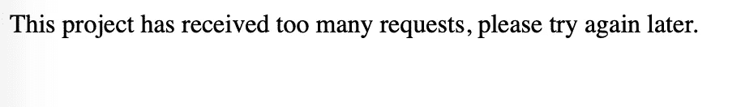
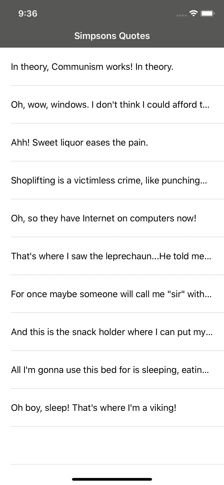
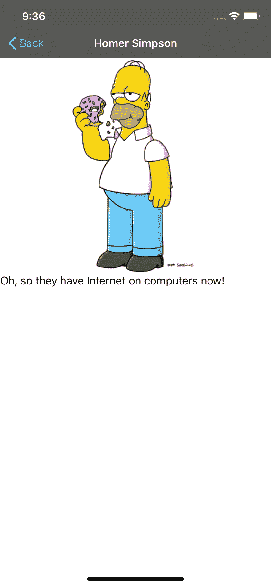
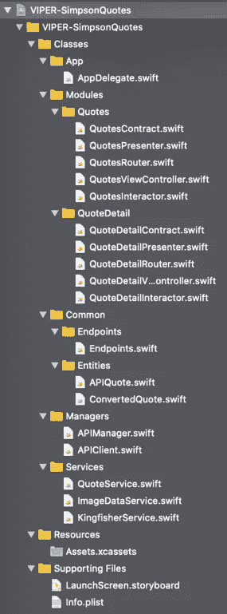

# 在 Swift 5 中实施 VIPER 架构

> 原文：<https://betterprogramming.pub/how-to-implement-viper-architecture-in-your-ios-app-rest-api-and-kingfisher-f494a0891c43>

## 利用单一责任原则

照片由 [Alex wong](https://unsplash.com/@killerfvith?utm_source=medium&utm_medium=referral) 在 [Unsplash](https://unsplash.com?utm_source=medium&utm_medium=referral) 上拍摄

在本教程中，我们将学习如何在 Swift 5 中实现 VIPER 架构模式。

我已经创建了一个演示应用程序，使用[辛普森引用 API](https://thesimpsonsquoteapi.glitch.me) 从“辛普森一家”中获取引用、字符和图像 URL。

使用[翠鸟](https://github.com/onevcat/Kingfisher)获得实际图像。

对于代码生成，我创建了自己的 [VIPER Xcode 模板](https://github.com/zafarivaev/VIPER-Template)。

该项目的源代码可在[这里](https://github.com/zafarivaev/VIPER-Demo-App)获得。

**注意** : [辛普森引用 API](https://thesimpsonsquoteapi.glitch.me) 是在免费平台上发布的，所以如果过于频繁地使用网络请求，有可能会出现 400 错误。尽量不要发送垃圾请求，否则您将不得不等待一段时间，直到 API 再次可用:

# 辛普森一家语录

# 项目结构

项目的根分为三个文件夹:类、资源和支持文件。Resources 文件夹包含`Assets.xcassets`、*、*，Supporting Files 文件夹包含`LaunchScreen.storyboard`和`Info.plist`。

如你所见，在课堂上，我们有以下文件夹:

*   **App** 包含`AppDelegate.swift`
*   **模块**有两个定义的模块:报价和报价明细
*   **公共**包含 REST API 端点和实体【又名*模型*在 MV(X)中】
*   **管理器**包含了帮助我们使用 REST API 的类
*   **服务**包含 QuoteService(从 REST API 检索报价实体)、ImageDataService(将数据转换成 UIImages)和 KingfisherService(使用来自报价实体的图像 URL 获取图像数据)

# 让我们定义一个 VIPER 模块

一个典型的毒蛇模块由五个组件组成:`View`、`Interactor`、`Presenter`、`Entity`和`Router`。下面是对每个组件功能的简短描述:

*   `View` 是被动的，自己做不了多少事。它唯一的职责是向演示者发送事件消息并显示 UI 元素。
*   `Interactor` 是独立于 UIKit 的组件，执行所有的业务逻辑。例如，在我们的应用程序中，它使用服务与 REST API 通信，以便从 URL 获取图像数据。
*   `Presenter`也是独立于 UIKit 的。它接收来自视图的消息，并决定是将消息发送给交互器还是路由器。它还接收来自交互器的数据，并为视图准备以合适的格式显示。
*   `Entity`是交互器使用的简单模型
*   在我们的应用程序中，`Router`、**、**负责创建特定的模块，并从一个模块导航到另一个模块

# 到我们的应用程序:报价模块

首先，我们应该根据 VIPER 组件之间的交互来定义契约(在我们的例子中是五个协议)。

## **报价合同网**

*   **查看输入** ( `ViewToPresenterQuotesProtocol` ) **:** 演示者应符合该协议。演示者从视图接收消息，并告诉交互者应该做什么。

*   **视图输出**(`PresenterToViewQuotesProtocol`)**:**View controller 应符合该协议。视图接收来自演示者的操作结果，并根据其逻辑进行相应的操作:

*   **交互器输入** ( `PresenterToInteractorQuotesProtocol`):交互器应符合该协议。下面是工作流程:在视图中，我们通知演示者发生了一些事件(例如，`viewDidLoad`)。展示者按照它的顺序，告诉交互者它应该执行某个任务(例如`loadQuotes`)。任务完成后，交互器将结果转发回 presenter。

*   **交互器输出** ( `InteractorToPresenterQuotesProtocol`):演示者应遵守该协议。在交互器完成其任务后，在交互器输入中调用这些方法(如上所示)。在从交互器接收到一个任务后，呈现器以视图可显示的格式准备接收到的数据，并向它发送消息。上面的视图输出显示了视图在这些结果方法(`onFetchQuotesSuccess`、`onFetchQuotesFailure`)中做了什么。

*   **路由器输入** ( `PresenterToRouterQuotesProtocol`):路由器符合该协议。路由器创建引用模块并配置依赖关系。它等待来自演示者的命令以导航到另一个屏幕，将所选报价作为参数传递:

# 报价详细模块

在 QuoteDetail 中，工作流程是相同的。

## **工作流程**

1.  视图告诉演示者它已经被加载了:

2.演示者告诉交互者获取图像数据:

3.交互器使用 KingfisherService 从报价的 URL 加载图像，并将结果发送回演示者:

4.presenter 从 interactor 接收结果，将数据准备为正确的可显示格式，并将结果发送给视图:

5.最后，视图从 presenter 获取结果，并显示/更新其 UI 元素:

# **包装**

你可能已经注意到 VIPER 是如何明确划分其五个核心组件之间的职责的:`View`、`Interactor`、`Presenter`、`Entity`和`Router`。事实上，VIPER 是基于单一责任原则(S from SOLID)。

如果你对其他的建筑模式感兴趣，可以看看我的一些相关作品:

 [## 新 MVC:单一责任原则和委托

### 苹果的模型视图控制器，终于做对了

medium.com](https://medium.com/better-programming/this-is-how-you-implement-mvc-architecture-in-2020-b39d65b4212f)  [## 反应式 MVVM 和协调模式做对了

### 使用 Swift 5、RxSwift 和 RxDataSources

medium.com](https://medium.com/better-programming/reactive-mvvm-and-the-coordinator-pattern-done-right-88248baf8ca5)  [## 在 Swift 5 中实施模型-视图-演示者架构

### 使用领域数据库作为业务逻辑层

medium.com](https://medium.com/better-programming/implement-a-model-view-presenter-architecture-in-swift-5-dfa21bbb8e0b)  [## 在 Swift 5 中实施面向服务的架构

### 为什么只用 MVC/MVVM/蝰蛇还不够

medium.com](https://medium.com/better-programming/implement-a-service-oriented-architecture-in-swift-5-fc70b8117616) 

非常感谢您的阅读！