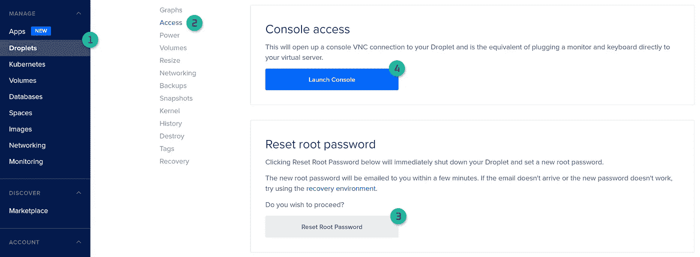

# 如何用 GlusterFS 和 Kubernetes 实现分布式文件系统

> 原文：<https://betterprogramming.pub/how-to-implement-your-distributed-filesystem-with-glusterfs-and-kubernetes-83ee7f5f834f>

## 了解使用 GlusterFS 的优势，以及它如何帮助实现高度可伸缩的分布式文件系统


[滕玉红](https://unsplash.com/@live_for_photo?utm_source=medium&utm_medium=referral)在 [Unsplash](https://unsplash.com?utm_source=medium&utm_medium=referral) 上的照片

# 介绍

对于任何遇到过任何类型的容器编排平台(最常见的是 Kubernetes)的人来说，众所周知，管理存储是一件非常痛苦的事情。不是因为底层组件的复杂性或数量，而是因为这种平台架构的动态特性。

在分布式集群中运行时，Kubernetes 可以以各种方式操作容器和 pods 创建、销毁、复制、自动缩放等。作为维护人员，您通常不知道它们将放在哪个物理(或虚拟)机器上。因此，要访问持久性存储，必须使用某种外部数据供应服务。

Kubernetes 有持久卷的概念，可以用[多种方式](https://kubernetes.io/docs/concepts/storage/volumes/#types-of-volumes)实现。现在最简单常用的当然是[](https://kubernetes.io/docs/concepts/storage/volumes/#nfs)****。**您需要做的就是安装[舵图](https://github.com/helm/charts/tree/master/stable/nfs-server-provisioner)并在任何卷声明中使用创建的[存储类](https://kubernetes.io/docs/concepts/storage/storage-classes/#:~:text=A%20StorageClass%20provides,other%20storage%20systems)。但是尽管如此简单和容易上手，不幸的是，这种实践并不像有时需要的那样有效和灵活。**

**我面临的关键限制是无法为不同名称空间中的 pod 提供共享存储。尽管我可以忽略逻辑分离并合并名称空间，但这个问题加上糟糕的伸缩效率是找到替代物的决定性因素。**

**当搜索一个[分布式或集群式文件系统](https://yourserveradmin.com/network-file-systems/)时，选择最终归结为几个选项。今天，最出色的当然是 [GlusterFS](https://www.gluster.org/) 和 [CephFS](https://ceph.io/) 。但是，我不建议仅仅根据这篇文章做出选择。自己做研究。因为除了这些，还有很多其他选项如 [GFS 2](https://access.redhat.com/documentation/en-us/red_hat_enterprise_linux/6/html-single/global_file_system_2/index) ， [Lustre](https://www.lustre.org) ， [MinIO](https://min.io) **，** [MooseFS](https://moosefs.com) ，以及 [more](https://en.wikipedia.org/wiki/Comparison_of_distributed_file_systems) 等。我还推荐看看 [Rook](https://rook.io/) ，它本身实际上并不是一个 DFS，而是旨在扩展 Kubernetes 存储管理潜力的[云原生](https://www.cncf.io/announcements/2020/10/07/cloud-native-computing-foundation-announces-rook-graduation/)存储协调器。**

**GlusterFS 和 CephFS 都是开源的软件定义存储(SDN)系统，分别提供分布式、高度可扩展和高度可用的块和对象存储。与专有解决方案相比，两者都有一定的优势。随着存储大小的增加，它们之间的真正区别开始显现出来。Gluster 在更高的规模上表现良好，可以在短时间内从 TB 级增长到 Pb 级。另一方面，由于其存储格式，Ceph 提供了用户更频繁访问的更有效的短期存储。**

****

**GlusterFS 新旧标志**

# **挖掘建筑**

**Gluster 文件系统解决方案在更高的抽象层次上由三个主要组件组成:**

*   **Gluster *服务器*由 [DaemonSet](https://kubernetes.io/docs/concepts/workloads/controllers/daemonset/) 作为存储块安装在 K8s 节点上**
*   **Gluster *客户端*直接安装在物理机器上，并通过 TCP/IP 和 socket direct 等协议连接到服务器**
*   ***管理 API* 用于抽象出低级卷操作**

**公平地说，最后一个(API)不是必需的，因为您可以创建专用的端点，并使用它们自己手动创建持久卷。**

**但是，我觉得这样会让使用的过程更加复杂。相比之下，management API 提供了一个自动化的界面，可以在 K8s StorageClass 的帮助下创建、调整和删除 PV。因此，您只需要关心一次部署和配置。如果你问我，我说这是一个更有吸引力和优雅的方式。**

**这就是为什么在本教程中我们将使用[**heke ti**](https://github.com/heketi/heketi)**——基于 RESTful 的卷管理框架主要用 Go 编写，这使得使用 GlusterFS 变得轻而易举。****

# ****指令****

****在我们开始之前，值得一提的是，我将以一种更具体的方式来描述数字海洋的托管 Kubernetes，因为它是我选择的云基础设施提供商。当然，有些部分是所有提供者共有的——事实上，大多数都是如此。因此，如果你正在使用某些东西，比如 GKE 的[或亚马逊 EKS 的](https://cloud.google.com/kubernetes-engine)[，我们完全欢迎你留下来。
好了，如果所有这些都解决了，让我们最终开始吧！](https://aws.amazon.com/eks/?whats-new-cards.sort-by=item.additionalFields.postDateTime&whats-new-cards.sort-order=desc&eks-blogs.sort-by=item.additionalFields.createdDate&eks-blogs.sort-order=desc)****

# ****访问节点的地面操作系统****

****为了首先部署 GlusterFS，您需要创建一个磁盘设备分区，因为它的低级性质使 Gluster 不能在预先存在的文件系统上工作，需要一个完全原始的磁盘设备或其分区。****

****DigitalOcean K8s 节点运行在 Debian 10 (Buster)操作系统之上，在此之前，您需要访问它。由于 K8s 节点也是 DO 的[droplet](https://www.digitalocean.com/products/droplets/)(管理的 VPS 的代号)你可以从 droplet 管理控制台的专用选项卡中完成。****

********

****获取液滴访问程序—作者插图****

****一旦你进入，准备复制和粘贴(或者手动输入，如果你真的想的话)大量的命令，因为考虑到 DO web 控制台的极端用户友好性，这有时会相当令人沮丧。****

# ****创建一个全新的磁盘分区****

****我们将使用 [GRML](https://grml.org/) 可引导实时系统来缩小现有的磁盘分区。通过`apt-get`实用程序安装:****

```
**$ apt-get install grml-rescueboot**
```

****以及将引导映像从官方来源下载到引导目录中。我使用了当时最新的版本。然后设置它:****

```
**$ cd /boot/grml$ wget [http://download.grml.org/grml64-small_2020.06.iso](http://download.grml.org/grml64-small_2020.06.iso)$ update-grub**
```

****现在，在重启系统之前，我建议使用`[lsblk](https://linux.die.net/man/8/lsblk)`工具检查可用的磁盘设备。您的输出可能与此相同，但仍然值得检查:****

```
**$ lsblk**NAME   MAJ:MIN RM   SIZE RO TYPE MOUNTPOINT**
vda    254:0    0    80G  0 disk 
├─vda1 254:1    0  79.9G  0 part /
└─vda2 254:2    0     2M  0 part 
vdb    254:16   0   446K  0 disk**
```

****这意味着你有一个主磁盘设备(`vda` **)** ，它已经被分成了两个分区。当然，你会对更大的(`vda1`)感兴趣，因为`vda2`的大小只够存储 BIOS。在接下来的步骤中，您将首先收缩`vda1`以从`vda`设备中安全地切割一个新的分区。****

****一旦你得到了一个分区图，通过键入`reboot`重启你的系统。快速启动时，选择以下选项:****

*   ****`Grml Rescue System`****
*   ****`grml64-small — advance options`****
*   ****`grml64-small — copy Grml to RAM`****

****然后，您将出现在 Grml 控制台中，在这里您可以选择更改键盘布局。如果默认用户对您来说没问题，只需点击`Return` *。*****

****使用`[resize2fs](https://manpages.debian.org/buster/e2fsprogs/resize2fs.8.en.html)`缩小现有文件系统:****

```
**$ fsck.ext4 -f /dev/vda1$ resize2fs -M /dev/vda1**
```

****然后使用`[parted](http://manpages.debian.org/cgi-bin/man.cgi?query=parted&apropos=0&sektion=0&manpath=Debian+8+jessie&format=html&locale=en)`调整其大小并创建一个新的:****

```
**$ parted /dev/vda$ resizepart 1 30G *# shrink* ***vda1*** *to* ***30 Gb***$ mkpart gluster 30001 100% *# create* ***vda3*** *where* ***vda1*** *ends*$ set 3 lvm on *# optionally setup logical volumes*$ print *# verify results*$ quit**
```

****在我的例子中，我创建了一个大小为 50Gb 的新分区，因此我将现有部分的大小调整为 30 Gb。如果你想要不同的东西，自己算算。您可以随时使用`[fdisk](https://manpages.debian.org/buster/fdisk/fdisk.8.en.html)`实用程序再次检查:****

```
**$ fdisk -l /dev/vdaDevice      Start    End        Sectors   Size  Type       
/dev/vda1   6144     62920671   62914528  50G   Linux filesystem       /dev/vda2   2048     6143       4096      2M    BIOS boot       
/dev/vda3   62920672 1667770111 104857546 30G   Linux filesystem**
```

****完成后，通过键入`reboot` *重新启动系统。*****

# ****通过符号链接链接存储设备****

****下一个重要步骤是设置一个符号链接(`symlink`)来将新创建的分区标识为 GlusterFS 存储设备。不建议使用设备名，如`/dev/vda3`，因为该名称可能会在系统重新启动时改变。为此，您可以选择使用系统生成的符号链接或手动创建自己的符号链接。****

****要获得预先存在的符号链接，只需使用:****

```
**$ ls -altr /dev/disk/* | grep <device>**
```

****对`/dev/vda3`来说，那将是`/dev/disk/by-path/pci-0000:00:06.0-part3`。****

****手动方式有点困难，但是您可以指定任何自定义名称。对我来说是`/dev/disk/gluster-disk`。为了实现这一点，您需要首先使用指定源设备的`[udevadm](https://linux.die.net/man/8/udevadm)`实用程序获得一些设备的属性:****

```
**$ udevadm info --root --name=/dev/vda3**P: /devices/pci0000:00/0000:00:06.0/virtio3/block/vda/vda3**
N: vda3
E: DEVNAME=/dev/vda3
E: DEVPATH=/devices/pci0000:00/0000:00:06.0/virtio3/block/vda/vda3
**E: DEVTYPE=partition**
E: MAJOR=254
E: MINOR=3
**E: SUBSYSTEM=block**
E: TAGS=:systemd:
E: USEC_INITIALIZED=1942797
...**
```

****需要突出显示的属性来形成符号链接规则，如下所示:****

```
**ENV{DEVTYPE}=="**partition**", ENV{SUBSYSTEM}=="**block**", ENV{DEVPATH}=="**/devices/pci0000:00/0000:00:06.0/virtio3/block/vda/vda3**" SYMLINK+="*disk/gluster-disk*"**
```

****然后必须在`[nano](https://manpages.debian.org/stretch/nano/nano.1.en.html)`或`[vi](https://man7.org/linux/man-pages/man1/vi.1p.html)`实用程序的帮助下将其写入自定义规则文件:****

```
**$ nano /lib/udev/rules.d/10-custom-icp.rules**
```

****最后，重新加载`udev`规则来创建符号链接并验证结果:****

```
**$ udevadm control --reload-rules
$ udevadm trigger --type=devices --action=change$ ls -ltr /dev/disk/gluster-*lrwxrwxrwx 1 root root 7 Oct 21 16:20 /dev/disk/gluster-disk -> ../vda3**
```

# ****设置 Gluster 客户端****

****最后，您可以安装到目前为止整个游戏中最重要的部分，当然是— [Gluster Native Client](https://docs.gluster.org/en/latest/Administrator%20Guide/Setting%20Up%20Clients/) 。就在你配置好`[dm_thin_pool](https://access.redhat.com/documentation/en-us/red_hat_gluster_storage/3.3/html/container-native_storage_for_openshift_container_platform/ch06s02)`内核模块之后。没有什么可烦恼的，因为它实际上很简单:****

```
**$ modprobe dm_thin_pool$ echo dm_thin_pool | tee -a /etc/modulesdm_thin_pool # verify output**
```

****现在，我们可以开始安装客户端了。但是在您继续之前，我必须警告您，强烈建议 Gluster 客户端版本尽可能接近服务器版本*。在这篇文章发表的时候，最新的基于容器的版本是 7.1。因此，我将继续设置一个完全相同版本的客户端。*****

****首先，给`apt`添加 GPG 键:****

```
**$ wget -O - [*https://download.gluster.org/pub/gluster/glusterfs*](https://download.gluster.org/pub/gluster/glusterfs/)*/7/rsa.pub* | apt-key add - # install certificate**
```

****然后根据需要添加[信号源](https://download.gluster.org/pub/gluster/glusterfs/7/LATEST/Debian/):****

```
**$ echo deb [arch=amd64] [https://download.gluster.org/pub/gluster/glusterfs](https://download.gluster.org/pub/gluster/glusterfs/)/7/7.1/Debian/buster/amd64/apt buster main > /etc/apt/sources.list.d/gluster.list**
```

****更新软件包列表并安装`glusterfs-client`:****

```
**$ apt-get update$ apt-get install glusterfs-client$ /usr/sbin/glusterfs --versionglusterfs 7.1**
```

****最后一个命令输出将验证结果。****

*****就这样！*你现在可以关闭这个笨拙的控制台，最终回到你那令人敬畏的终端。当然，这是指一个存储节点是否足以满足您所需的基础架构，但这是值得怀疑的。否则，您应该对每个其他节点重复同样的操作，直到您满意或厌倦为止。我做了三次后两者都得到了。****

# ****部署 Gluster 服务器和 Heketi API****

****至此，最难的部分结束了。剩下的工作就是配置和部署最后两个组件——g luster 服务器和 Heketi API。显然，在前面的步骤中完成了所有的工作之后，你应该得到某种简单、直接的方式来完成工作。还有什么比使用预配置的[舵图](https://helm.sh/)更简单的呢？****

****这甚至有一些选项:****

*   ****[IBM 官方图表](https://artifacthub.io/packages/helm/ibm-charts/ibm-glusterfs)直接来自 [ArtifactHub](https://helm.sh/blog/helm-hub-moving-to-artifact-hub/)****
*   ****[曾经存在的](https://github.com/AcalephStorage/charts/tree/glusterfs/incubator/glusterfs) [Helm 孵化器](https://github.com/helm/charts)图的 AcalephStorage 完成叉****

****虽然这看起来是一个显而易见的选择，但是值得注意的是，第二个解决方案实际上对于理解和部署都要简单得多。所以我再次强烈建议你自己做研究。或者，你也可以看看我自己的组合解决方案，这是我做的开源项目的一部分。****

****所有这些解决方案的共同点是，它们都使用 Heketi 作为管理 API，因此它们都需要使用预定义的存储节点[拓扑配置](https://docs.openshift.com/container-platform/3.5/install_config/storage_examples/containerized_heketi_with_dedicated_gluster.html)进行处理。虽然这听起来有点难以置信，但这个过程实际上就是执行一个命令并记下几个 IP 地址。它看起来是这样的:****

****Heketi API 的存储集群拓扑示例配置****

****基本上，您需要的只是每个节点的内部 IP、名称和您在上一步中创建的存储设备名称。如果您严格按照说明操作，那么设备名称将是`/dev/disk/gluster-disk`。****

****要得到拼图的剩余部分，只需键入以下命令:****

```
**$ kubectl get nodes -o wideNAME                  STATUS   AGE   VERSION   INTERNAL-IP kicksware-k8s-3pkt4   Ready    38h   v1.18.8   10.114.0.5    kicksware-k8s-3pkt8   Ready    38h   v1.18.8   10.114.0.3    kicksware-k8s-3pktw   Ready    38h   v1.18.8   10.114.0.4**
```

****节点的名称是`node.hostname.manage`，内部 IP 对应于`node.hostname.storage`。只需将它放入`values.yaml`文件，并在执行您选择的舵表部署时使用它。****

****此外，根据所选择的方法(除 IBM 之外的所有方法)，您可能需要将 Heketi 服务的 cluster-IP 手动输入到存储类配置和升级图表中:****

```
**$ kubectl get services -lrelease=*<RELEASE_NAME>*NAME             TYPE        CLUSTER-IP       PORT(S)    AGE
gluster-heketi   ClusterIP   10.245.189.193   8080/TCP   1m**
```

****一旦有了存储类，只要在需要存储配置时将它放入每个`PersistentVolumeClaim`，就像这样:****

****GlusterFS PersistentVolumeClaim 示例配置****

****我不是告诉过你，到最后，那会是小菜一碟！现在终于到了。干得好！****

****还有一件事，如果你运行 [RBAC 的](https://kubernetes.io/docs/reference/access-authn-authz/rbac/) Kubernetes，请确保为 Heketi 应用程序提供一个正确的[角色绑定](https://kubernetes.io/docs/reference/access-authn-authz/rbac/#rolebinding-and-clusterrolebinding)。否则，它将无法加载拓扑，您将会得到这个奇怪的错误消息:****

```
**Unable to create node: New Node doesn't have glusterd running**
```

****虽然这可能是由某种 Gluster 客户端安装问题引起的，但很可能 Heketi 没有足够的权限访问节点和 pods K8s 本机 API。****

# ****最后的想法****

****由于其高度动态、几乎短暂的性质，Kubernetes 存储管理范例有时会令人困惑甚至不知所措。默认情况下，大多数部署的服务都是无状态的。然而，现实世界的生产场景通常要求它们是[有状态的](https://www.xenonstack.com/insights/stateful-and-stateless-applications/#:~:text=Stateful%20application%20remembers,the%20checkout%20page)，即拥有某种外部存储。对此，Kubernetes 本身提供了一些解决方案:[临时选项](https://kubernetes.io/docs/concepts/storage/ephemeral-volumes/#types-of-ephemeral-volumes)、[持久卷](https://kubernetesbyexample.com/pv/#:~:text=A%20persistent%20volume%20(PV)%20is,a%20distributed%20filesystem%20like%20Ceph.)、持久卷声明、[存储类](https://kubernetes.io/docs/concepts/storage/storage-classes/#:~:text=A%20StorageClass%20provides,other%20storage%20systems)或[状态集](https://kubernetes.io/docs/concepts/workloads/controllers/statefulset/)。****

****此外，存储资源调配因静态和动态方式而异。静态模式要求管理员提前考虑和配置 PV，这与 Kubernetes 将资源(CPU、内存和存储)视为动态授权的思维方式有些冲突。因此，一种被认为更合适、更优雅的动态方式是将存储管理职责委托给 K8s 引擎，这是通过`StorageClass` es 完成的。****

****`StorageClass`将管理分布式存储的复杂流程抽象化，使之变得像在 YAML 配置上写几行字一样简单。然而，`StorageClass`范式最初必须使用一些外部服务来实现。虽然其中一些也很容易上手，但有些选项需要先完成复杂的部署过程。****

****本文致力于揭示 GlusterFS 部署的细节和缺陷，提供了一套完整的说明，说明如何在 Kubernetes 托管环境上使用预期的规范进行部署。****

****作为作者，真的希望对你有用。因为在我探索这个伟大的工具的时候，没有这样的资源，我不得不花费大量的时间来解决一些当地的问题。****

****不过，作为一名开发人员，我为我们的社区以任何人都可以遵循的方式提供如此多的帮助和支持而感到非常自豪。所以，这是我为这一运动所做的努力。****

****感谢你的关注。快乐的离婚！****