# 如何将电子表格中的数据导入 Firebase

> 原文：<https://betterprogramming.pub/how-to-import-data-from-a-spreadsheet-into-firebase-cec55119910>

## 将 CSV 数据导入 Google 云存储的分步指南


米卡·鲍梅斯特在 [Unsplash](https://unsplash.com?utm_source=medium&utm_medium=referral) 上拍摄的照片。

数据库通常有由数据输入操作员收集的数据。让数据输入操作员使用大家都知道的工具(例如谷歌电子表格)总是比给他们一个个性化的方法将数据注入你的数据库更快。这样，它可以帮助他们更快地完成他们的工作，并给你空间来修改数据，并最大限度地减少在你的网站上编写个性化表单所需的工作量。

出于许多其他原因，您可能会将 Excel 表中的数据放在有问题的数据之前。在本文中，我将介绍如何根据数据类型以两种方式将这些数据导入 Firebase。这些方法可以更容易地应用于由 Microsoft Excel 或任何类似工具创建的工作表。

第一种方法用于一次性导入，而第二种方法用于实时数据。

# 方法 1:对于一次性数据

当您不需要任何类型的同步时，此方法用于简单的数据传输。

## **准备你的电子表格**

1.  第一行包含数据库关键字。
2.  第一个键应该设置为“id”
3.  对于键，确保它们没有像句点(.)、美元符号($)、括号([或])、散列/磅符号(#)或正斜杠(/)，因为 Firebase 使用 URL 中的密钥来遵循 UTF-8 协议。

4.删除多余的行，因为它们会作为空值添加到数据库中，不必要地使数据库变得更大。

5.将文件导出为 CSV 文件(文件>下载>)。csv)。

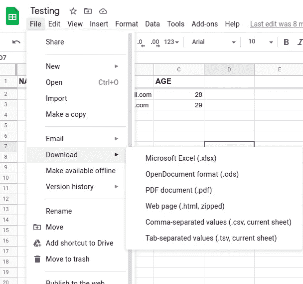

## **CSV 转 JSON**

1.  使用任何 CSV 到 JSON 的网络转换网站。我用的是[https://csvjson.com/](https://csvjson.com/csv2json)。
2.  一旦有了 JSON 文件，就进入 Firebase 控制台的实时数据库。
3.  点击右上角的三个点(“…”)，然后选择“导入 JSON”

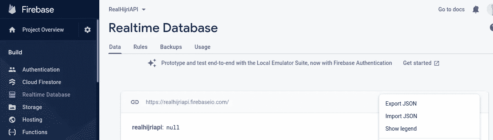

4.选择您的文件位置，然后单击“导入”

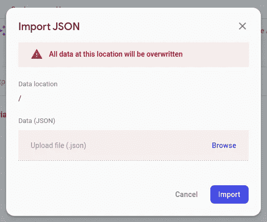

就是这样！您已经在 Firestore 中准备好了数据。如果您想要实时数据同步，请选择以下方法。

# 方法 2:对于实时数据

如果您希望您的数据在电子表格更新时与电子表格同步，那么这种方法适合您。首先要做的是按照以下步骤将你的工作表放到谷歌电子表格中:

1.  转到[https://drive.google.com/](https://drive.google.com/)。
2.  点击新建>文件上传。
3.  选择您要上传的 Excel 文件。

就是这样——谷歌电子表格非常容易使用。

现在是解释如何导入数据的时候了。

## **准备好你的火力基地**

1.  如果你还没有创建一个 Firebase 项目，去 https://console.firebase.google.com/[创建你的项目。然后导航到构建>实时数据库来启用您的 Firebase 数据库。如果您已经有一个数据库，只需打开它的页面。](https://console.firebase.google.com/)
2.  编辑 Firebase 中的安全规则。将您的读写权限更改为 true，然后发布。*注意:记得以后要严格权限。*

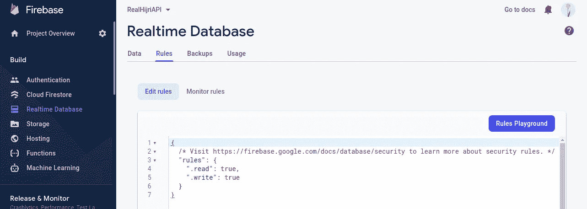

3.复制数据库 URL。你以后会需要它的。从数据选项卡中获取。

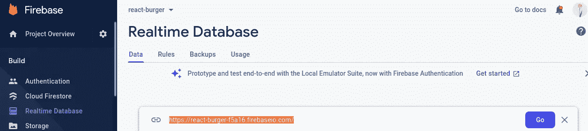

## **准备您的电子表格**

1.  第一行包含数据库关键字。
2.  第一个键应该设置为“id”
3.  对于键，确保它们没有像句点(.)、美元符号($)、括号([或])、散列/磅符号(#)或正斜杠(/)，因为 Firebase 使用 URL 中的键。

4.从地址栏获取您的电子表格 ID。

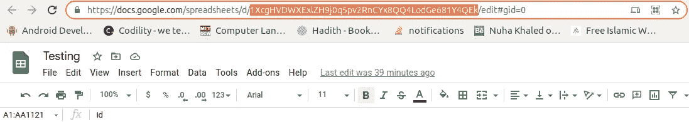

## **写剧本**

1.  打开您的电子表格。
2.  从菜单栏中，选择工具>脚本编辑器。

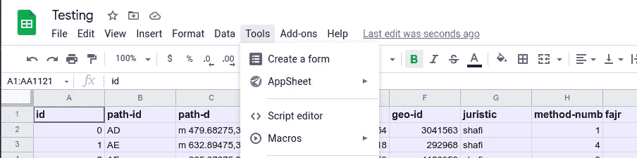

3.将为您的脚本编辑器打开一个新窗口。从菜单中，选择“资源”>“库”。

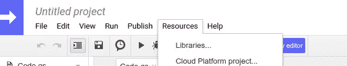

4.首先会要求您更改脚本的名称。

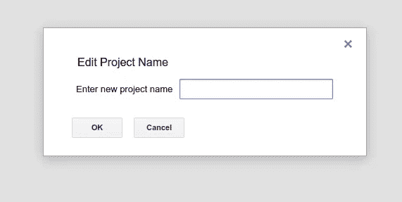

5.然后，您将看到一个弹出窗口，选择 Firebase 库。用这个键找到它:myep 8 zeet 1 ylvdxs 7 uyg 9 pldocoke 7–2l。我是从 [Firebase 的脚本示例](https://sites.google.com/site/scriptsexamples/new-connectors-to-google-services/firebase)中得到的。

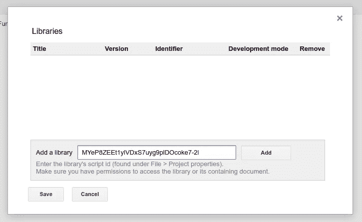

6.选择最新的可用版本。我选的是 30(目前最新版本)。

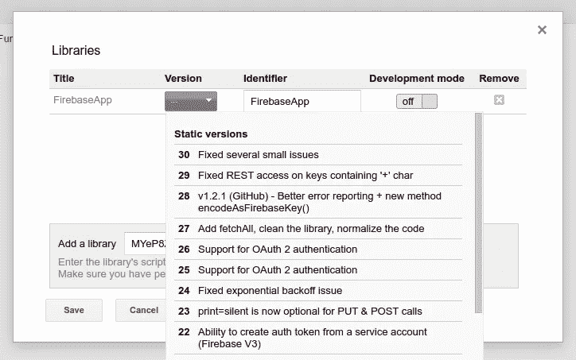

7.然后点击“保存”现在你可以在你的脚本中使用这个库了。

8.编辑`spreadsheetID`和`firebaseUrl`的值后，复制粘贴以下代码:

9.下面的代码将电子表格数据转换成 JSON，因为 Firebase 是一个 JSON 存储。要在导入数据前详细说明如何处理数据，编辑`for`循环细节。别忘了用你的网址替换我的电子表格 ID 和 Firebase 数据库。

10.通过点击运行按钮或从菜单栏运行代码:运行>运行函数>`writeDataToFirebase`。

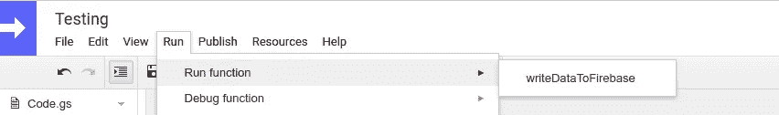

11.将出现一个授权弹出窗口。查看权限，然后选择您的驱动器帐户。

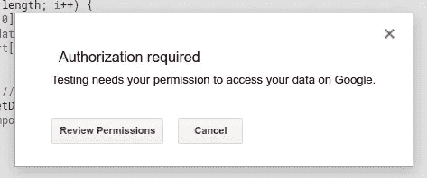

12.之后，您可能会看到这样的屏幕。选择“高级”

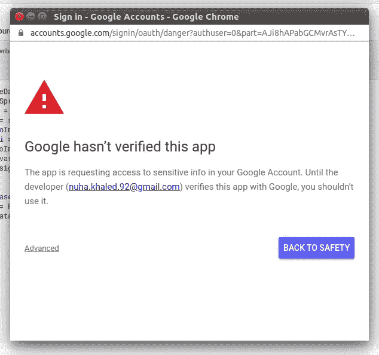

13.然后选择“转到测试(不安全)”

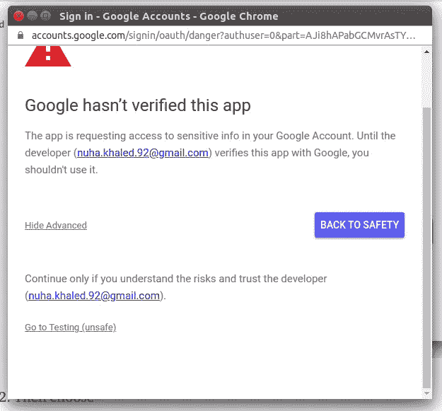

14.允许，就这样！

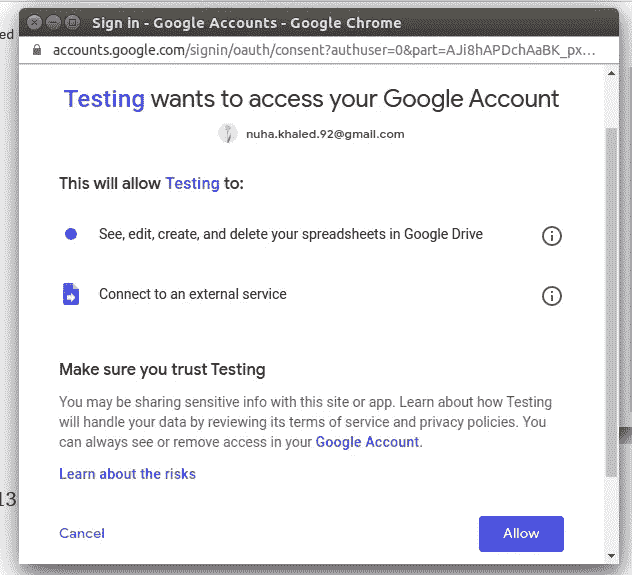

15.现在您的数据已经导入到数据库中，打开控制台进行检查。

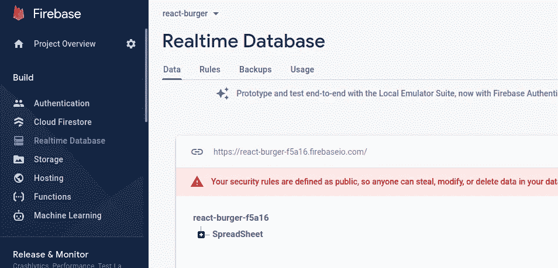

16.再次更改您的数据库权限，使写入可以是假的，然后发布。

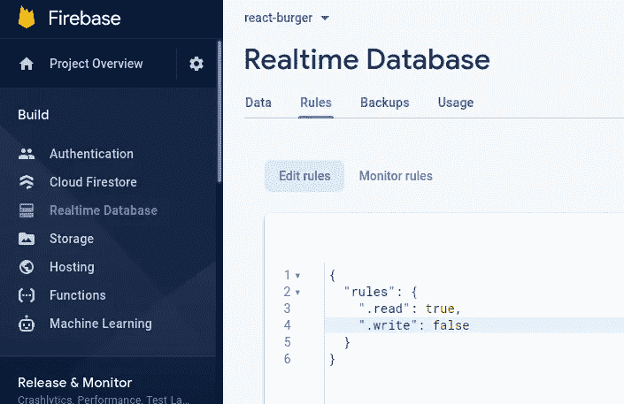

17.获取您的数据库机密以供使用。在 Firebase 控制台中，转到项目设置>>服务帐户>>数据库机密。

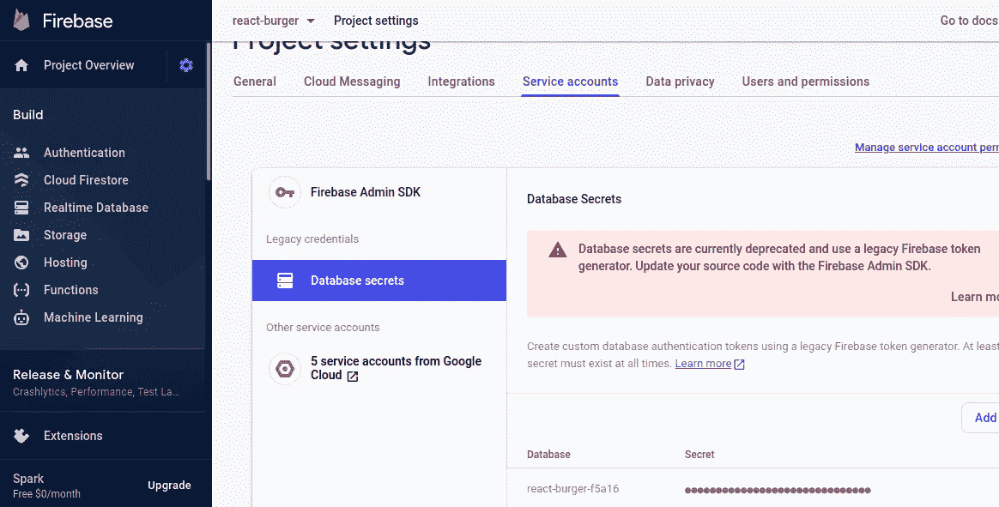

18.编辑您的代码，以便您可以在调用`FirebaseApp.getDatabaseByUrl()`时使用该密码:

```
var base = FirebaseApp.getDatabaseByUrl(firebaseUrl, secret);
```

19.到目前为止，您只导入了一次数据，以便在数据发生变化时将数据同步到 Firebase。添加这段代码。通过从菜单中选择“编辑”>“所有触发器”,您可以随意检查添加到脚本中的触发器。

20.然后从菜单栏选择运行>运行功能> `createSpreadSheetEditTrigger`运行`createSpreadsheetEditTrigger`。

21.您可能会再次被要求授权。遵循前面的步骤。

# 结论

就这样——你完成了。我试图用一个非常清晰的分步指南来解释如何做到这一点。如果你遇到了任何错误，欢迎在评论区问我。

如果你喜欢这篇文章，是时候看看我的其他文章了。

[](https://nuhakhaled.medium.com/how-to-edit-real-time-data-in-firebase-when-blocked-by-read-only-mode-35fcbbaa91a7) [## 当被只读模式阻塞时，如何在 Firebase 中编辑实时数据库

### “在数据查看器中激活只读和非实时模式以提高浏览器性能”的修复

nuhakhaled.medium.com](https://nuhakhaled.medium.com/how-to-edit-real-time-data-in-firebase-when-blocked-by-read-only-mode-35fcbbaa91a7) [](https://medium.com/the-post-grad-survival-guide/how-to-write-a-stellar-upwork-cover-letter-and-get-that-job-6c452e63243) [## 如何写一封出色的求职信并得到那份工作

### 为什么你的升级提案没有得到回应

medium.com](https://medium.com/the-post-grad-survival-guide/how-to-write-a-stellar-upwork-cover-letter-and-get-that-job-6c452e63243) [](/11-reasons-to-build-a-chrome-extension-c6e27bb73a72) [## 构建 Chrome 扩展的 11 个理由

### 开发 Chrome 扩展可以帮助你建立你的网络开发生涯

better 编程. pub](/11-reasons-to-build-a-chrome-extension-c6e27bb73a72)