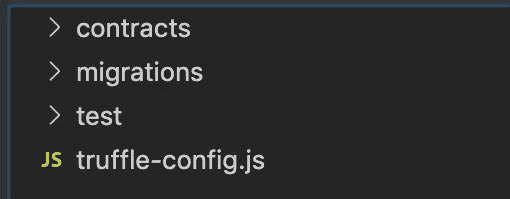

# 如何在 Solidity 中导入外部智能合同和库

> 原文：<https://betterprogramming.pub/how-to-import-external-smart-contracts-and-libraries-in-solidity-5670a59ff53a>

## 如何将外部代码导入智能合约的分步指南


图片由 [WorldSpectrum](https://pixabay.com/users/WorldSpectrum-7691421/?utm_source=link-attribution&utm_medium=referral&utm_campaign=image&utm_content=3424785) 来自 [Pixabay](https://pixabay.com/?utm_source=link-attribution&utm_medium=referral&utm_campaign=image&utm_content=3424785)

# 从哪里开始

在智能合约开发的世界中入门可能会让人不知所措。通常有很多*假设的*知识在任何地方都没有得到很好的解释。例如，将外部合同和库导入智能合同。

您可能确切地知道契约是做什么的，并且您的契约使用它会更好，但是实际导入它的语义是一个障碍。

在早期，我记得将库代码复制并粘贴到我的`.sol`文件中是一种变通方法。

本文解释了如何将任何外部协定或库导入到您的智能协定中。

# 从混音开始

你在智能合约开发中采取的第一步很可能使用 [Remix online IDE](https://remix.ethereum.org/) 。这是一个非常棒的工具，可以快速方便地访问 [Solidity](https://solidity.readthedocs.io/en/v0.6.6/) 编译器，这样你就可以尽快地学习这门语言。

一旦你对使用 Solidity 有了信心，你就会自然而然地想在本地环境中，在桌面 IDE 中进行开发。将代码放在项目目录中，在本地运行，允许快速开发，并允许使用版本控制和开源。

这就是松露套房的用武之地。

> "世界一流的开发环境，适用于区块链 DApps(分散式应用程序)和智能合同."—[Trufflesuite.com](http://trufflesuite.com)

它把你所有的代码放在一个地方，不需要太多的配置，而且学习一些基本的工作是非常简单的。

下次你要创建一个包含智能合约的新项目时，从 Truffle 开始。让我们开始吧…

# 入门指南

## 结节

Truffle 运行在 Node.js 上，所以如果你还没有安装它，[访问他们的网站，按照安装说明进行操作](https://nodejs.org/en/)。

## 松露

通过运行以下命令，使用节点程序包管理器(npm)安装 Truffle:

```
npm install -g truffle
```

## 文字编辑器

确保您安装了最新的文本编辑器。我用的是 [VS 代码](https://code.visualstudio.com/)。

一旦所有东西都安装好了，导航到您喜欢的工作区，创建一个新的目录，我们的 Truffle 项目将驻留在其中，然后初始化一个 Truffle 项目:

```
mkdir my-project
cd my-project/
truffle init
```

在文本编辑器中打开新的项目目录。您的文件夹结构应该如图 1 所示。应该有三个子目录:`contract/`、`migrations/`、`test/`；还有一档:`truffle-config.js`。



图 1:文件夹结构

*   `contract/`是我们存储 Solidity 智能合同代码的地方。Truffle 知道在这里寻找`.sol`文件来编译并迁移到区块链。
*   `migrations/`是我们的迁移逻辑所在。在这里，我们可以描述部署我们的合同时所需的步骤，以便正确地部署它们。
*   `test/`我们将在这里编写我们的智能合约，以确保它们按预期运行。
*   `truffle-config.js`包含关于网络、编译器、文件位置和其他自定义配置的信息，让 Truffle 框架知道我们的东西在哪里。现在不要担心这个文件。

# 安装和导入

[OpenZeppelin](https://openzeppelin.com/contracts/) 是以太坊智能合约的[黄金标准可重用存储库。在这个项目中，我们将把契约 repo 作为一个依赖项来安装，然后导入 Ownable 契约，这样我们就可以限制对某些功能的访问。](https://medium.com/better-programming/smart-contracts-dont-reinvent-the-wheel-63cee4370d19)

您可能以前见过或使用过类似的模式。当契约初始化时，`msg.sender`地址存储在一个状态变量中，指示契约的所有者。使用自定义修饰符`_onlyOwner`，某些函数通过要求`msg.sender`等于所有者来限制访问。

在存储库根目录中，运行:

```
npm install @openzeppelin/contracts --save
```

完成后，您应该会在根目录下看到一个名为`node_modules/`的新文件夹(如果您在了解这一切之前使用过 Node 或 npm)。

在`node_modules`内部，npm 已经下载了 OpenZeppelin/contracts repo，其中包含了 OpenZeppelin 必须提供的所有合同和库。花一点时间浏览一下正在出售的商品。

我们将使用 Ownable 契约，从项目根来看，它位于`@openzeppelin-solidity/contracts/access/Ownable.sol`中。

在`contracts/`文件夹中，创建一个导入`Ownable`合同的新实体文件。我打算把我的名字叫做`TestContract.sol`。

第一件事是声明 Solidity 编译器版本，我们使用的是`0.6.0`；然后我们需要使用找到的路径导入`Ownable`契约；最后，我们需要声明契约，它从`Ownable`开始延伸。

图 2 显示了我们完成所有这些后的框架契约。

图 2: TestContract.sol

信不信由你，差不多就是这样！

在这个契约中编写新的函数时，我们可以在`public`、`private`、`internal`或`external`修饰符后添加`onlyOwner`修饰符，声明该函数只能由所有者运行。

这里有一个简单的例子:

```
// This function has no restrictions on who can call it
function noRestrictions() public { ... }// This function is restricted only to the owner. Anyone else
// who tries to call it will result in a reverted transaction
function restrictedFunction() public onlyOwner { ... }
```

要确保在添加了新的受限函数后契约能够编译，请运行:

```
truffle compile
```

如果一切顺利的话，你可以开始着手[将你的合同迁移到本地区块链](https://medium.com/swlh/develop-test-and-deploy-your-first-ethereum-smart-contract-with-truffle-14e8956d69fc)，[编写测试](https://medium.com/better-programming/how-to-test-ethereum-smart-contracts-35abc8fa199d)，以及[部署到公共测试网](https://medium.com/swlh/develop-test-and-deploy-your-first-ethereum-smart-contract-with-truffle-14e8956d69fc)！

# 进一步阅读

如果你对区块链开发感兴趣，我会写一些教程、演练、提示以及如何开始和建立投资组合的技巧。查看以下资源:

[](https://medium.com/blockcentric/blockchain-development-resources-b44b752f3248) [## 区块链开发资源马上跟进

### 学习区块链、以太坊和 DApp 开发的资源列表

medium.com](https://medium.com/blockcentric/blockchain-development-resources-b44b752f3248)