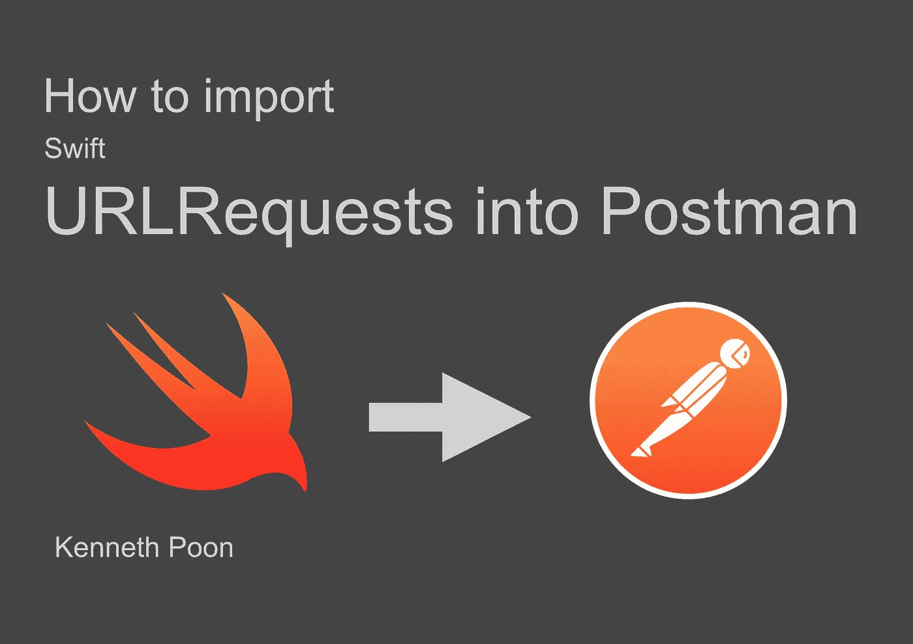
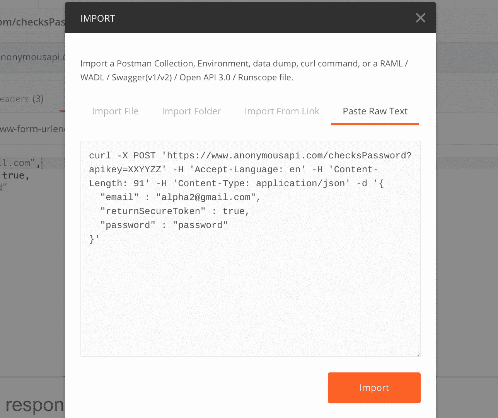
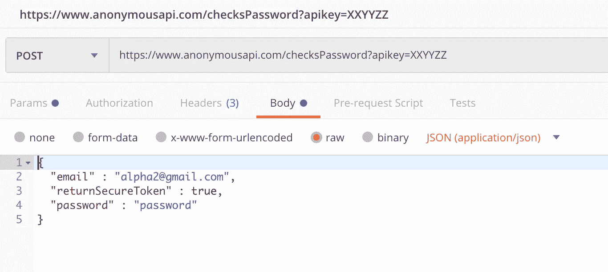
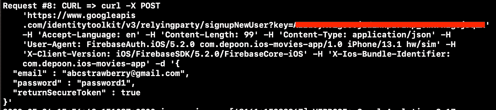
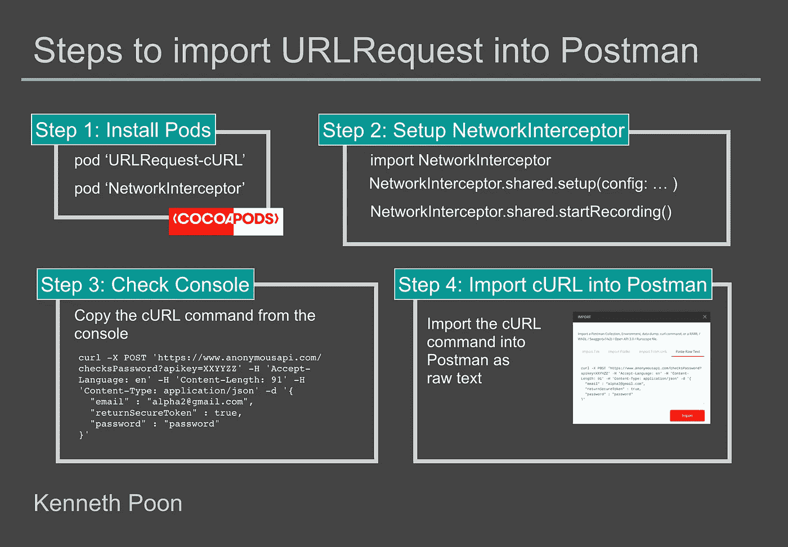

# 如何将 Swift URLRequests 导入 Postman

> 原文：<https://betterprogramming.pub/how-to-import-swift-urlrequests-into-postman-ef6c65c20834>

## 连接流行的 API 测试客户端和 Swift 的本地 URLRequest



如何将 Swift URLRequests 导入 Postman

Postman 是一个创建和启动 API 请求的简单工具。在这篇文章中，我将分享我们如何从我们的 iOS 应用程序中捕获 Swift URLRequests，并将它们导入 Postman。这项技术将有助于在开发过程中在团队成员之间共享请求。作为奖励，我还将展示如何拦截 Firebase HTTP 请求。

在你的`Podfile`里，加上`pod 'URLRequest-cURL'`。

[](https://github.com/depoon/URLRequest-cURL) [## depoon/URLRequest-cURL

### 创建 cURL 命令字符串的 URLRequest 扩展 URLRequest-cURL 可通过 CocoaPods 获得。

github.com](https://github.com/depoon/URLRequest-cURL) 

这是一个 cocoapod 库，试图重新设计用于构建`URLRequest`对象的组件。

用法非常简单。调用 getter 变量`cURL`(通过扩展应用)获取`String`中格式化的`cURL`命令:

```
// let request = URLRequest()
print(request.cURL)
```

下面是一个关于`String`值的例子。不要惊讶地看到附加到您的请求的额外标题。尝试在 Xcode 控制台上打印 cURL 命令:

```
curl -X POST 'https://www.anonymousapi.com/checksPassword?apikey=XXYYZZ' -H 'Accept-Language: en' -H 'Content-Length: 91' -H 'Content-Type: application/json' -d '{
  "email" : "alpha2@gmail.com",
  "returnSecureToken" : true,
  "password" : "password"
}'
```

您可以将`cURL`命令作为原始文本导入 Postman:



在 Postman 中导入 cURL 请求

导入后，您可以在 Postman 中查看所有的头和有效负载体值。这对试图调试 API 问题的开发人员非常有用。



在邮递员中检查请求有效负载

然而，只有当我们能够在源代码中获得`URLRequest`的实例时，上面的场景才有效。对于依赖于第三方库发出的 API 请求的项目，我们将需要另一个库在`URProtocol`级别拦截请求。

# Podfile: pod 网络拦截器

[](https://github.com/depoon/NetworkInterceptor) [## depoon/网络拦截器

### 这个简单的框架演示了我们如何在 iOS 应用程序中拦截 URLRequest。这个框架允许你检查细节…

github.com](https://github.com/depoon/NetworkInterceptor) 

这个库使用`URLRequest-cURL` pod 作为依赖库。NetworkInterceptor 创建一个定制的 URLProtocol 并确定其优先级，目的是拦截和检查 iOS 应用程序发出的请求。您只需注册一个`RequestSniffer`对象并启动设置:

## 让我们试一试

在本例的[中，我们将使用 Firebase 认证在我们的应用程序中注册新用户。](https://github.com/depoon/ios-movies-app)

## 1.设置网络拦截器

在 Podfile 中使用以下 pod:

*   `pod 'NetworkInterceptor'`
*   `pod 'Firebase/Auth'`

## 2.设置网络拦截器

按照上面的方法设置`NetworkInterceptor`代码。

## 3.使用这些凭据通过 FirebaseAuth 创建一个新用户

*   电子邮件:`abcstrawberry@gmail.com`
*   密码:`password1`

```
import FirebaseAuthAuth.auth().createUser(withEmail: email, password: password) { [weak self] (authResult, error) in //implement post registration logic
}
```

## 4.检查 cURL 命令的控制台



cURL 命令出现在 XCode 控制台中

用于`create user` API 请求的`cURL`命令出现在 Xcode 控制台中。你可以简单地复制它，并导入到邮差。注意，API 根据`Content-Length`头值检查有效负载。如果您使用不同的电子邮件/密码值，您需要修改`Content-Length`值。



将 URLRequest 导入 Postman 的步骤

# 我以前在哪里见过这个 NetworkInterceptor 库？

NetworkInterceptor 在我之前的一篇文章中有所介绍。

它是为了拦截 SSL 固定的 HTTPS 请求而创建的。然而，我很快发现它是调试 API 相关问题的一个非常有用的工具。事实上，我的许多队友和少数读者都说它在开发过程中给了他们很大的帮助。

# 有什么我可以帮忙改进的吗？

是的。我当前的一个问题是为 Firebase Analytics 事件日志请求生成`cURL`命令。了解 Firebase Analytics 的确切`cURL`将允许我为 XCUITest 构建一个模拟服务器。请随意在 GitHub 上创建一个拉取请求[来帮助我。](https://github.com/depoon/URLRequest-cURL)

# 结论

这篇文章的灵感来自我的好朋友 Rizwan Ahmed 的《哦，我的雨燕》。在他的作品中，他展示了任何人如何使用 Postman 创建示例 URLSession Swift 代码。他的文章和我的文章都展示了在 iOS 开发中使用 Postman 的不同方式。

请随意将`NetworkInterceptor`和`URLRequest-cURL`放到您的 iOS Xcode 项目中，如果有帮助，请告诉我。感谢阅读。