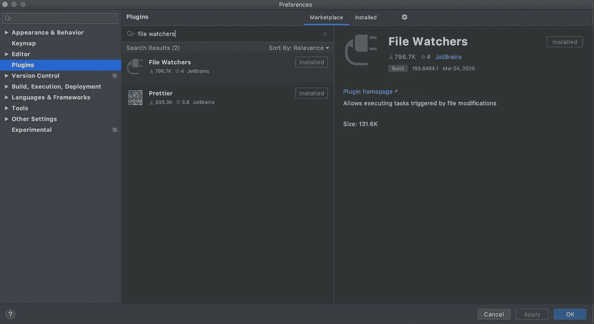
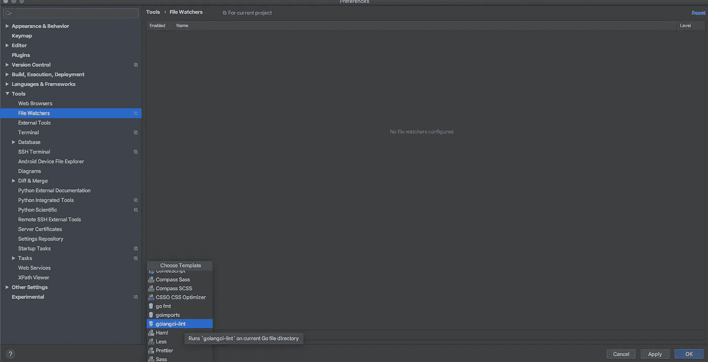
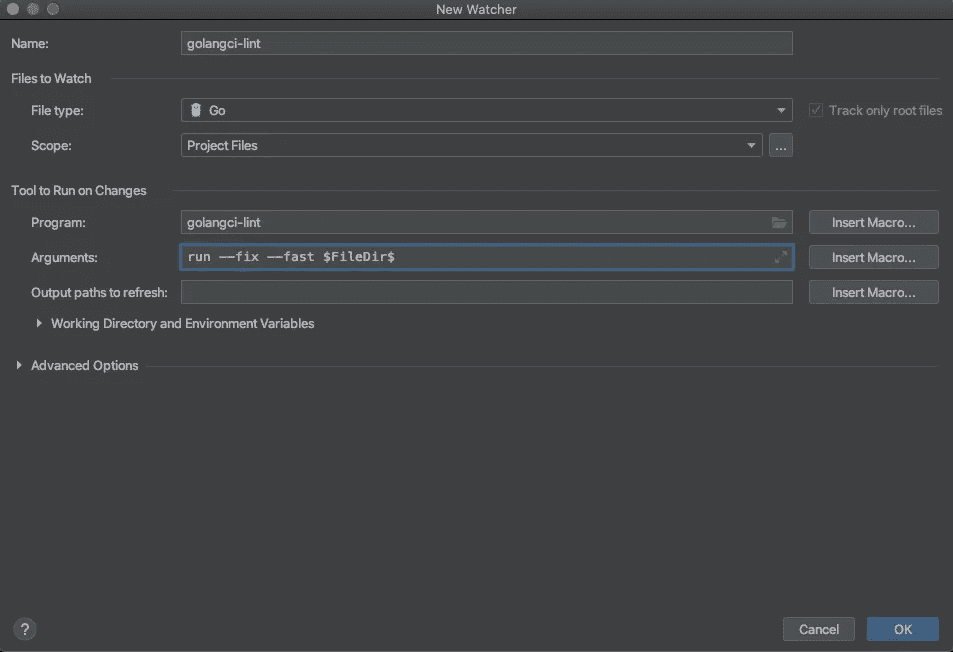
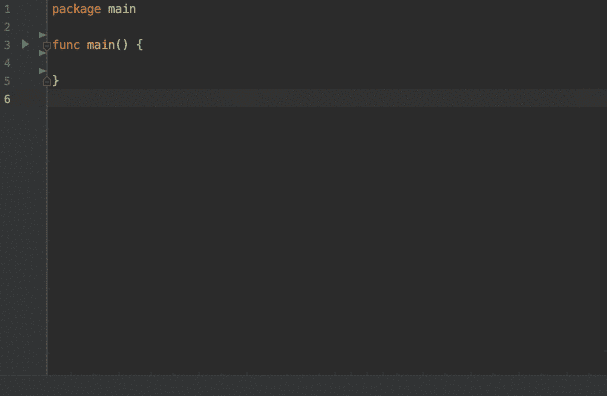
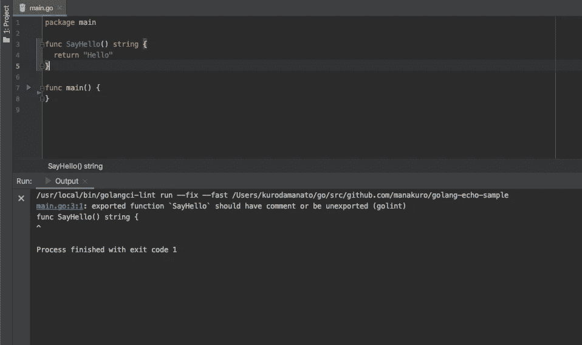
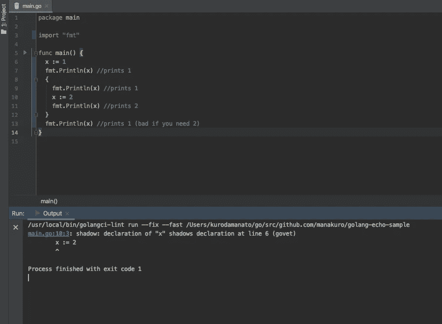
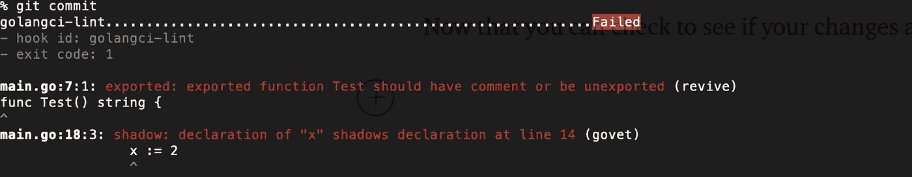

# 如何通过 Go 中的自动检查来提高代码质量

> 原文：<https://betterprogramming.pub/how-to-improve-code-quality-with-an-automatic-check-in-go-d18a5eb85f09>

## 用 GoLand(或 IntelliJ IDEA)在 Go 项目中进行静态代码分析的简单方法


图片来源: [GolangCI-Lint](https://github.com/golangci/golangci-lint)

这篇文章将带您了解如何使用 [GoLand](https://www.jetbrains.com/go/) (或 [IntelliJ IDEA](https://www.jetbrains.com/ja-jp/idea/) )项目建立自动化代码检查。

Go 中有一堆 linter 工具:

*   `[gofmt](https://golang.org/cmd/gofmt/)`
*   `[gofumpt](https://github.com/mvdan/gofumpt)`
*   `[goimports](https://godoc.org/golang.org/x/tools/cmd/goimports)`
*   `[unindent](https://github.com/mvdan/unindent)`
*   `[errcheck](https://github.com/kisielk/errcheck)`
*   `[go vet](https://golang.org/cmd/vet/)`

这些都是格式化和检查代码的好工具。如果你想看看其他棉绒，你可以在 [Awesome Go 棉绒](https://github.com/golangci/awesome-go-linters)看到它们。

要快速使用这些插件，您可以使用 [GolangCI-Lint](https://github.com/golangci/golangci-lint) ，这是一个 linters 聚合器，允许您在一个设置中拥有多个 linters。

# 属国

这一部分的依赖关系如下:

*   去 1.16.9
*   golangci-lint 1.42.1

# 安装文件监视器

首先，我们将安装[文件监视器](https://plugins.jetbrains.com/plugin/7177-file-watchers)。文件观察者是一个插件，允许你在改变或保存文件时自动运行一个命令。这用于在 IDE 中运行 linters。

转到插件，搜索文件监视器，并安装它:



文件观察者

# 安装 GolangCI-Lint

为了安装 GolangCI-Lint，我们将运行 [Brew](https://github.com/golangci/golangci-lint#macos) 。

```
brew install golangci/tap/golangci-lint
brew upgrade golangci/tap/golangci-lint
```

确保版本:

```
golangci-lint versiongolangci-lint has version 1.42.1
```

接下来，在 GoLand 中启用 GolangCI-Lint。进入工具>文件观察器>+ > golangci-lint:



戈兰奇-林特

按如下方式填写，然后单击确定:



戈兰奇-林特

arguments 部分需要是`run --fix --fast $FileDir$`。

之后，将`.golangci.yml`添加到您的项目中:

```
# .golangci.ymllinters:
  disable-all: trueissues:
  exclude-use-default: false
```

`.golangci.yml`是一个配置文件，它允许您只在文件中配置特定于 linters 的选项，而不是在命令行中。默认情况下，GolangCI-Lint 从当前工作目录的以下路径中搜索它:

*   `.golangci.yml`
*   `.golangci.toml`
*   `.golangci.json`

因此，通过在这个文件中添加选项，您可以轻松地启用 linters 特性。

**注意:**默认情况下，GolangCI-Lint 启用这些 linters。

```
govet
errcheck
staticcheck
unused
gosimple
structcheck
varcheck
ineffassign
deadcode
typecheck
```

如果想禁用它们，添加`linters: disable-all: true`。

# “黄金进口”

接下来，我们将启用`goimports`。`goimports`修复导入行，添加缺失的行或删除未引用的行，它还以与`gofmt`相同的风格格式化代码。

再来补充一下`.golangci.yml`:

```
# .golangci.ymllinters:
  disable-all: true
 **enable:
    - goimports**issues:
  exclude-use-default: false
```

让我们来测试一下:



“黄金进口”

看起来效果不错。当您移除`fmt.Println()`时，`goimports`会自动删除导入，因为没有引用。

# ' golint '(已弃用)

`golint`是 Go 源代码的 linter 工具，与`gofmt`不同。`gofmt`自动格式化代码，但是`golint`关心编码风格——所以它只是打印出一个警告。

既然`golint`是[的复制品](https://github.com/golangci/golangci-lint/issues/1892)，那么我们也可以使用 [revive](https://github.com/mgechev/revive) ，它是 Go 的一个更快的处理器，运行与`golint`相同的规则。

添加到`.golangci.yml`:

```
linters:
  disable-all: true
  enable:
    - goimports
 **- revive**issues:
  exclude-use-default: false
```

并将[推荐配置](https://github.com/mgechev/revive#recommended-configuration)添加到`.golangci.yml`:

```
linters:
  disable-all: true
  enable:
    - goimports
    - reviveissues:
  exclude-use-default: false**linters-settings:
  revive:rules:
      - name: blank-imports
      - name: context-as-argument
      - name: context-keys-type
      - name: dot-imports
      - name: error-return
      - name: error-strings
      - name: error-naming
      - name: exported
      - name: if-return
      - name: increment-decrement
      - name: var-naming
      - name: var-declaration
      - name: package-comments
      - name: range
      - name: receiver-naming
      - name: time-naming
      - name: unexported-return
      - name: indent-error-flow
      - name: errorf
      - name: empty-block
      - name: superfluous-else
      - name: unused-parameter
      - name: unreachable-code
      - name: redefines-builtin-id**
```

如果你想禁用规则，像这样添加`disable: true`:

```
linters-settings:
  revive:rules:
      - name: blank-imports
      - name: context-as-argument
      - name: context-keys-type
 **disabled: true**      - name: ...
```

让我们来测试一下:



“复活”

当你创建函数时，`revive`会自动警告你没有关于它的注释。

# govet

`govet`检查可疑的构造代码，例如`Printf`中变量的隐藏和错误的参数调用。

再来补充一下`.golangci.yml`:

```
# .golangci.ymllinters:
  disable-all: true
  enable:
    - goimports
    - golint
 **- govet**issues:
  exclude-use-default: false
```

如果您想检查代码中变量的隐藏，添加`linters-settings`:

```
linters:
  disable-all: true
  enable:
    - goimports
    - golint
    - govet**linters-settings:
  govet:
    check-shadowing: true**issues:
  exclude-use-default: false
```

如果你不确定变量的隐藏，你可以查看“ [50 个 Go 阴影:新 Golang 开发者的陷阱、陷阱和常见错误](http://devs.cloudimmunity.com/gotchas-and-common-mistakes-in-go-golang/index.html#vars_shadow)”中的“意外变量隐藏”部分，这对 Go 新手非常有用。

让我们来测试一下:



变量的阴影

看起来不错。`govet`会警告你有可能导致运行时不必要错误的可疑代码。您可以在启动它之前编辑它并避免错误。

# 预提交

如果你在一个团队中工作，并且想要在提交之前通过运行 linter 来保持代码库的整洁，你可以使用[预提交](https://pre-commit.com/)来运行钩子。

所以让我们先安装预提交:

```
brew install pre-commit
```

然后像这样创建一个`.pre-commit-config.yaml`:

```
repos:
  - repo: https://github.com/golangci/golangci-lint
    rev: v1.42.1
    hooks:
      - id: golangci-lint
```

并运行`pre-commit install`以便设置 git 钩子脚本。

```
pre-commit install
```

既然您可以在提交之前检查您的更改是否有效。



# 创建安装文件

最后，为了让您的项目快速启动，让我们创建一个设置文件来简化上述过程。

像这样创建`Makefile`:

```
# Set up tools
.PHONY: install
install:
   brew install pre-commit
   pre-commit --version
   pre-commit install
   go install github.com/golangci/golangci-lint/cmd/golangci-lint@v1.42.1
```

并运行命令:

```
make install
```

# 结论

就是这样！你可以在 GolangCI-Lint [这里](https://github.com/golangci/golangci-lint#supported-linters)看到支持的 linters，也可以在这里找到示例配置文件[。](https://github.com/golangci/golangci-lint/blob/master/.golangci.example.yml)

我们已经介绍了如何通过在 IDE 中使用 GolangCI-Lint 自动检查和格式化来改进代码。正如我所说，Go 中有很多有用的 linter，此外，您可以创建自己的自定义 linter，并在 GolangCI-Lint 中启用它们。

我希望这对你有所帮助。