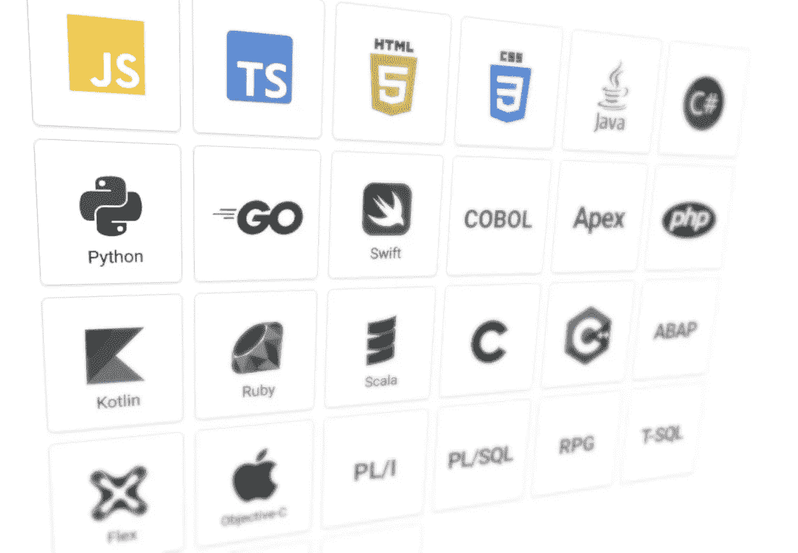
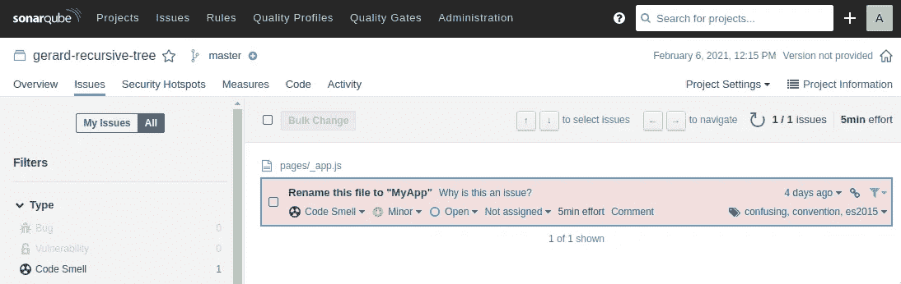
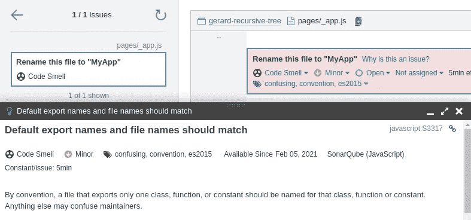
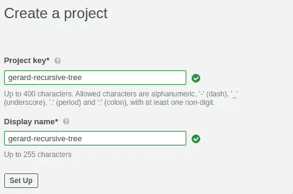
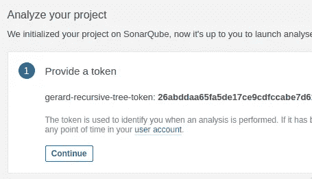
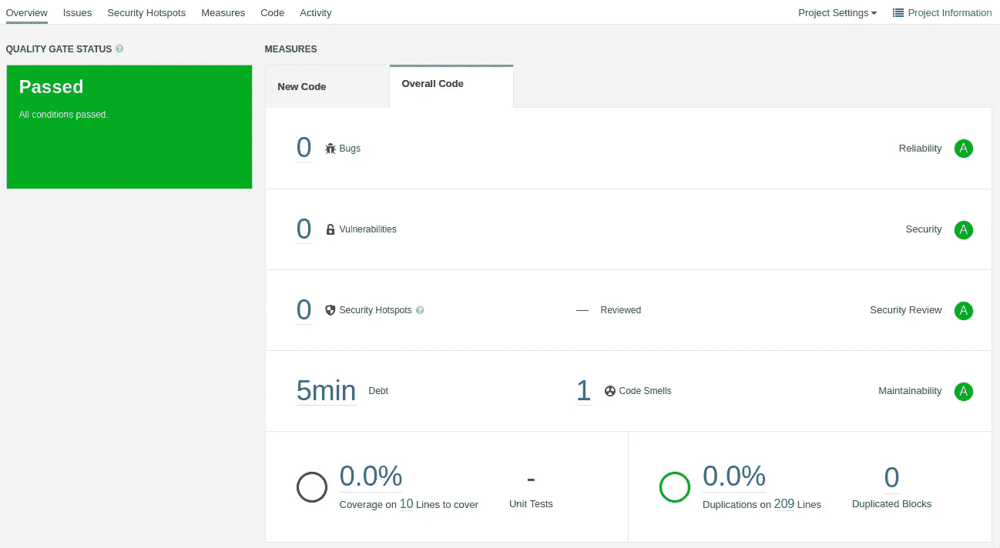

# 如何用 SonarQube 提高代码质量

> 原文：<https://betterprogramming.pub/how-to-improve-code-quality-with-sonarqube-465744eb66db>

## 在本地机器上安装和使用 SonarQube 的教程



图片来自 [SonarQube](https://www.sonarqube.org/features/multi-languages/) (作者涂改)。

*免责声明:我目前主要活跃在 JavaScript 和 React 领域，所以本文将使用该领域的术语。然而，我有非常广泛的背景，强烈推荐您继续阅读，即使您正在使用其他语言和框架。SonarQube 支持* [*多种语言*](https://www.sonarqube.org/features/multi-languages/) *。*

包括你我在内的许多开发人员都写出了完美的代码——至少我们有时是这么认为的。我们中的一些人已经在我们的 ide 中使用了静态代码分析工具，比如 ESLint，这表明在我们写代码的时候，我们的代码的某些部分可以被改进。你应该继续这样做。

但是今天，我将介绍一个提高代码质量的工具，它将这个过程带到了一个新的层次:[sonar cube](https://www.sonarqube.org/)。我们将:

*   解释一下 SonarQube 是什么？
*   在本地机器上安装 SonarQube。
*   扫描您的项目文件。
*   在 SonarQube 中分析你的项目。

在本文中，我们将看看免费的开源社区版。顺便说一句，我和 SonarQube 没有任何关系。我只是相信这是一个不可思议的工具，并乐意分享我的相关知识。

我们开始吧！

# SonarQube 是什么？

> “SonarQube 是 SonarSource 开发的一个开源平台，用于持续检查代码质量，通过静态分析代码来执行自动审查。”— [维基百科](https://en.wikipedia.org/wiki/SonarQube)

换句话说，它不执行你的代码。它只是照原样看着它。但是请相信我，我说它做得非常好。有一个很好的理由，他们有一个非常令人印象深刻的[客户列表](https://www.sonarsource.com/customers/)，并且它是一个非常流行的(如果不是最流行的)静态代码分析工具。

在扫描您的代码之后(我们将在后面看到)，它会生成一个报告。您可以在浏览器的 SonarQube GUI 中查看报告，所有报告的问题都是“交互式票证”，您可以将其分配给其他用户，为其编写评论，打开或关闭等。



SonarQube GUI 中报告的问题。

当查看某个问题的详细视图时，它会立即显示相关代码:


我们问题的详细观点。

SonarQube 还提供了一个“为什么这是一个问题？”点击相关链接时的功能:



您可能会认为，在编写代码时，ESLint 等流行工具就能做到这一点。我不确定 ESLint 是否做了和 T2 完全一样的事情。我的直觉告诉我，SonarQube 在更广泛的主题上提供了更高的质量，例如代码味道、错误和安全漏洞。

通过使用 sonar cube，您还将获得一份关于代码质量、安全性和总体`Quality Gate Status`的有机报告(这是一个布尔值，表明 sonar cube 是否认为您的应用程序可以交付生产)。如果您在管道中包含一个所谓的声纳扫描，那么您的报告将随着每个提交或拉取请求而更新。该报告支持版本控制，每个版本都反映了特定的提交(或合并，等等)。)在您的项目中。

这不仅仅是一份报告。它是一个有机的“活的”数据集，持续监控你的项目并通知它的所有者(你？)关于其质量现状。它允许您在这个状态下与项目的其他成员协作。问题可以被分配和讨论，这极大地刺激了合作。

在我看来，这是与 ESLint 等工具的最大区别:SonarQube 可以用作协作工具，而 ESLint 是“每个开发人员独立完成的”

# 安装 SonarQube(社区版)

安装 SonarQube 服务器(一个 Java 应用程序)非常简单。您可以:

*   下载一个 ZIP 文件并在本地运行。
*   或者在 Docker 容器中运行 SonarQube。

最简单的方法是运行 Docker 容器(关于下载 ZIP 文件并在本地运行的细节可以在文档中找到[)。](https://docs.sonarqube.org/latest/setup/install-server/)

在执行这个命令之前，确保您已经在本地安装了[Docker](https://docs.docker.com/engine/install/):

请注意，这确实会启动 SonarQube，但是一旦终止容器，您将丢失所有数据。使用上面的命令玩一会儿，如果你选择继续使用 SonarQube，我建议关闭这个容器并设置数据卷。这些目录位于您的本地机器上，如果您关闭或升级 Docker 容器，它们将被持久化。该文档提供了进行此操作的简单步骤。

但是对于本文来说，用上面的命令启动 SonarQube 就足够了。

一旦您让 Docker 完成了它的工作，您的安装就准备好了，您可以开始使用它。通过访问`[http://localhost:9000](http://localhost:9000.)` [在浏览器中打开 GUI。](http://localhost:9000.)

# 创建新项目

使用默认凭证(`admin` : `admin`)登录并创建一个新项目:



第一步:命名你的项目。



步骤 2:为您的项目生成一个令牌。

跟踪项目密钥和令牌，因为我们稍后会用到它们。

# 第一次扫描您的项目

现在我们可以用一个叫做`sonar-scanner`的 CLI 工具来扫描我们的代码。有许多方法可以做到这一点，您可以在文档中的[相关页面](https://docs.sonarqube.org/latest/analysis/scan/sonarscanner/)找到更多详细信息。

我选择下载可执行文件并将其位置添加到我的全局路径变量中。现在在我的机器上的任何地方都可以使用`sonar-scanner`命令:

```
PATH=$PATH:/opt/sonar-scanner-4.5.0.2216-linux/bin
```

在代码项目的根文件夹中，创建一个名为`sonar-project.properties`的文件，内容如下:

第一行包含我们在 GUI 中创建 SonarQube 项目时提供的项目密钥。

现在，扫描你的文件！在项目的根目录中，运行以下命令:

```
sonar-scanner -Dsonar.login=[PROJECT TOKEN]
```

没有空格的`-Dsonar.login`不是拼写错误。令牌应该是我们在创建新项目时生成的令牌的值。

扫描仪将运行几秒钟，完成后，您可以在浏览器的 GUI 中分析报告。如果您的项目包含高质量的代码，概述可能如下所示:



质量关状态“通过”

如果您的代码包含 bug、漏洞、安全热点、代码气味或重复行，报告看起来会有所不同。GUI 非常直观，所以我将跳过对所有细节的解释。

# 附加注释

设置和使用 SonarQube 的其他一些想法:

*   测试覆盖:如果你的代码没有被测试覆盖，SonarQube 会抱怨。这很可能(也很有希望)是您想要的，但是如果您不测试您的代码，它很快就会成为某些项目的烦恼。您可以通过在您的`sonar-project.properties`文件中或者在 GUI 中的`Project Settings` > `General Settings` > `Analysis Scope`下为设置`sonar.coverage.exclusions`设置一个 glob 值来禁止计算某些文件或目录的代码覆盖率。使用值`**/*.*`将其完全禁用。
*   SonarLint:如果你想在编写代码时和发布代码之前即时检测潜在的问题(类似于 ESLint)，你可以使用一个叫做 [SonarLint](https://www.sonarlint.org/) 的工具。您可以将 SonarLint 配置为在 SonarQube 中“与”您的项目“对话”,以便对齐嵌线。SonarLint 和 SonarQube 配合得很好。SonarLint 可用于多种 ide，如 Eclipse、IntelliJ 和 Visual Studio 代码。
*   项目令牌:确保秘密令牌(比如 SonarQube 中的项目令牌)不是您的代码库的一部分。一般来说，不要在存储库中提交秘密值！
*   质量概况:SonarQube 报告基于质量概况。这些是确定扫描代码时应该引发哪些问题的规则集。许多编程语言都有许多默认设置，SonarQube 会巧妙地为您的项目找出默认使用的设置。在 GUI 中，您可以在“质量配置文件”下更改这些规则

# 结论

设置 SonarQube 并使用它非常容易。报告和 GUI 非常直观，您将很快理解它是如何工作的。我看不出*不*使用 SonarQube 的理由。

社区版是免费和开源的，安装起来很快，最终你会得到更高质量的代码。

团队合作更是如此。如果您是团队的一员，这个工具允许您在项目中协作维护代码质量。SonarQube 可以很容易地集成到您的管道中，GitHub 和 GitLab 等网站“原生地”支持它。

感谢您的宝贵时间！