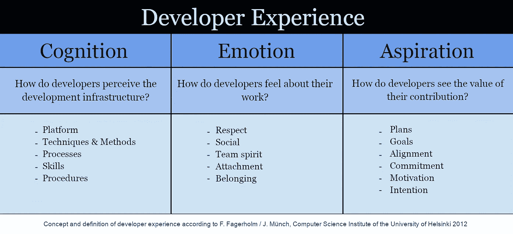
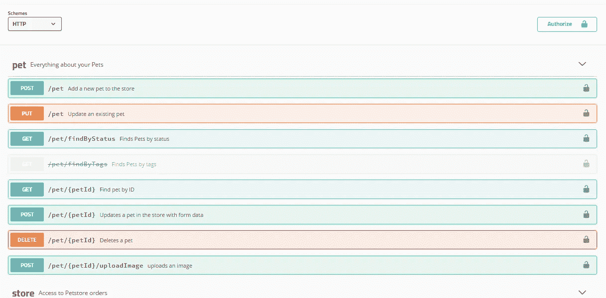

# 改善开发人员体验的 8 种工具

> 原文：<https://betterprogramming.pub/how-to-improve-developer-experience-2d5908d7bbb0>

## [软件工程](https://rakiabensassi.medium.com/list/software-engineering-7a179a23ebfd)

## 快乐的开发者写出更好的代码


图片由[罗兰·施泰因曼](https://pixabay.com/users/rollstein-13853955/?utm_source=link-attribution&utm_medium=referral&utm_campaign=image&utm_content=4709802)从 [Pixabay](https://pixabay.com/?utm_source=link-attribution&utm_medium=referral&utm_campaign=image&utm_content=4709802) 拍摄

```
if (developer.happy == true){ jobTask.enjoy(); jobGoal.achieve(); }
```

用户体验(UX)是一个熟悉的术语，用来描述用户在使用应用程序时的体验，与此不同，开发人员体验(DX)这个术语不太受欢迎，在许多组织中处于次要地位。

这个术语指的是软件开发人员在使用或开发一个产品以达到特定目标时的互动和感受。虽然人们的品味不同，但有一些共同的元素让开发人员更满意，更有效率，更不容易离职。

在本文中，我们将探讨开发人员体验的概念，并看看我们如何改进它。

```
**Table of Contents**[What's a Developer Experience?](#a5e1)
[1\. Software Architecture](#7bdb)
[2\. Selection of the Programming Language](#e7ca)
[3\. Project Setup and Code Formatting](#828a)
   ∘ [Prettier](#add4)
   ∘ [ESLint](#2848)
[4\. Scaffolding Tools](#f45f)
[5\. Live Reload](#eb4c)
   ∘ [Frontend](#2fc3)
   ∘ [Backend](#0ac7)
[6\. Debugging](#9d8a)
[7\. Accelerate the Feedback Loop](#fbf8)
8[. Get a Grip on Time Wasters](#2cfc)
[Final Thought](#df7f)
```

# 什么是开发者体验？

赫尔辛基大学的计算机科学家 Fabian Fagerholm 和 Jürgen Münch 将开发人员的体验分为开发基础设施的体验、对工作的情感态度以及个人贡献的价值:



[来源](https://www.heise.de/hintergrund/Developer-Experience-Glueckliche-Entwickler-schreiben-besseren-Code-6150890.html?seite=all)(作者翻译)

1.  **基础设施**包括开发、管理工具、编程语言、库、平台和方法。
2.  **开发人员对他们工作的感受**取决于尊重、团结、归属感等因素。
3.  **你自己贡献的价值**可以通过考虑你自己的目标、你正在进行的项目的目标和你个人承诺之间的关系来衡量。

开发人员对基础设施的积极体验意味着，作为开发人员，您对工具的日常使用感到愉快和满意。这会给工作带来更多的快乐，并影响你正在开发的软件的质量。

下面是一些有助于良好诊断的元素列表。

# 1.软件体系结构

在设计软件架构时，您需要考虑项目的规模和团队的技能，并记住简单的架构可能在以后会有更多的痛苦，而复杂的架构意味着现在会有更多的痛苦。

一个难以理解或使用的架构会产生挫折感，并导致糟糕的开发体验。如果在你的项目中工作足够痛苦，一个有才华的开发人员会抓住另一个机会离开。但是如果他对你的设计满意，这将会反映在他的结果中。

# 2.编程语言的选择

如果您是一名前端开发人员，并且想让您的生活变得简单一些，请选择使用 TypeScript 而不是 JavaScript。

由 TypeScript 确保的类型安全性和 IDE 支持(如 Visual Studio 代码或 WebStorm)加速了许多错误的检测，如对未定义或空值的属性访问。

但是 [TypeScript 提供了更多 JavaScript 无法使用的特性](/typescript-new-release-19f1238c6a68)，比如模板文字类型、JSX 工厂和递归条件类型。

打字稿`--noUncheckedIndexedAccess`(示例[来源](https://gist.github.com/rakia/4a844b0b8931ef2f813e7ec36bd55704))

# 3.项目设置和代码格式

为了尽可能高效地工作并避免在重复的任务上浪费时间，拥有良好的自动完成功能和其他有用的特性是很重要的，许多现代 ide 都提供了这些功能。

对于一个好的[开发者](https://levelup.gitconnected.com/learning-velocity-and-coding-standards-10952f6c9640)体验来说，最大限度地减少你需要花费在格式化你的源代码上的时间，并通过删除不用的变量或组织导入命令来清理它也是很重要的。

通过调整您的项目设置和配置，您将自动执行这些任务。

linter 会自动确保某些格式和代码样式规则——比如缩进，或者最大线宽，或者用`===`代替`==`——应用到你的项目中。

## 较美丽

Prettier 是 JavaScript 世界中一个流行的代码格式化工具。它附带了标准的预配置规则，但是您可以根据自己的需求进行调整。

## 埃斯林特

`ESLint`分析您的代码的风格和编码错误，并帮助您防止错误，例如，如果您使用一个变量而没有声明它，它会给你一个警告。它有许多标准规则和一组针对不同项目类型的特定于项目的附加规则，您可以根据需要进行更改。

可以使用 [npm](https://www.npmjs.com/package/eslint) 或[纱线](https://yarnpkg.com/)安装`ESLint`:

```
npm install eslint --save-dev

# or

yarn add eslint --dev
```

# 4.脚手架工具

为了在项目设置期间节省时间，您可以使用可用的脚手架工具。他们生成代码并交付一个完全配置好的应用程序，作为进一步开发的框架。

现代框架带来了它们自己奇妙的搭建工具:

*   [Angular](/angular-10-new-features-dbc779061dc8) 、Vue 和 React 框架都有自己的命令行界面(CLI)用于搭建。

```
ng generate library custom-autocomplete
ng generate component components/mat-dynamic-table
ng generate directive directives/click-outside
ng generate pipe pipes/calculate-total
```

*   在服务器端，像 AWS 的 *AWS CDK CLI* 和 NestJS 的 *NestJS CLI* 这样的搭建工具很有帮助。
*   还有`yeoman`，它允许开发者创建自己的脚手架蓝图，并与社区共享。

# 5.实时重装

实时重新加载工具会自动检测源代码的所有更新，并自动重启应用程序，以便您的更改直接反映在正在运行的应用程序中。

## 前端

在前端方面，实时重新加载意味着只要您保存编辑过的文件，浏览器中的 web 应用程序就会自动更新。

许多框架中都有实时重载特性。

## 后端

如果您是后端开发人员，实时重新加载意味着可以使用 API 工具快速测试新添加的端点，如 Swagger、失眠症或 Postman。

Swagger UI 是一个指定 REST API 的工具。它用一个“ *Try It* ”函数显示自动生成的文档，这允许开发人员直接测试 API。



Swagger UI ( [图像源](https://swagger.io/tools/swagger-ui/))

# 6.排除故障

良好的开发人员体验也意味着您可以轻松地试验源代码。为此，应用程序应该在运行时易于调试。

像 Visual Studio Code、IntelliJ Idea 和 WebStorm 这样的 ide 都有一个内置的调试器特性来帮助您完成这一步。所有常见的浏览器，如 Chrome 或 Firefox，都为 web 应用程序提供了内置调试器。

# 7.加速反馈循环

尽早获得关于您所做工作的反馈，可以让您对客户的要求做出响应，并对变化做出快速反应。

假设您被要求实现一个新的 UI，它包含一个带有复杂搜索特性的[自动完成字段。后来发现客户根本不需要这个字段。如果你在完成实施后才开始寻求反馈，你会浪费很多不必要的时间。](/angular-custom-autocomplete-7ffb479477e7)

在技术层面上，短的反馈循环意味着尽可能快地反映正在运行的应用程序中已实现的更改，以便在短时间内检测到 bug。

IDE 中集成的 linter 会在你编译时输入错误时通知你。但是只有在运行时才可见的错误是反馈循环最慢的错误。

# 8.抓住浪费时间的人

在日常工作中，被认为是耗费时间和减慢过程的因素应该是最小的。以下是一些例子:

*   不再适合开发任务的硬件。
*   一些工具可以被提供更方便功能的其他工具代替:例如，用`ESLint`代替`TSLint`。
*   如果您的团队在某些工具或框架方面比其他团队更专业，那么您需要考虑这个因素。

# 最终想法

好的开发者体验让开发者开心，更有效率，更不容易离职。它提高了生产率和产品的质量和可靠性。

虽然我们在这篇文章中只看到了改善这方面的技术技巧，但增加工作中的乐趣和满意度取决于更多的标准，如团队中无毒的工作环境和[心理安全](https://medium.com/swlh/characteristics-of-successful-team-60272e59a2c6)。

我希望你能得到一些见解，这样你就能更多地思考什么对你有一个好的开发者体验是重要的。

# 参考

[开发者体验:概念和定义](https://helda.helsinki.fi//bitstream/handle/10138/37576/icssp2012.pdf)

[良好的开发者体验](https://developerexperience.io/practices/good-developer-experience)

我为一群聪明、好奇的人写关于工程、技术和领导力的文章。 [**加入我的免费电子邮件简讯，独家获取**](https://rakiabensassi.substack.com/) 或在此注册 Medium [。](https://rakiabensassi.medium.com/membership)