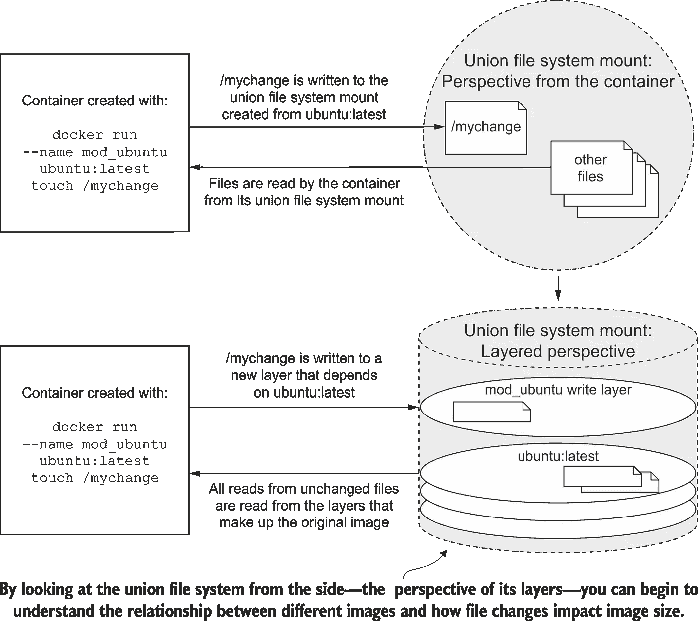
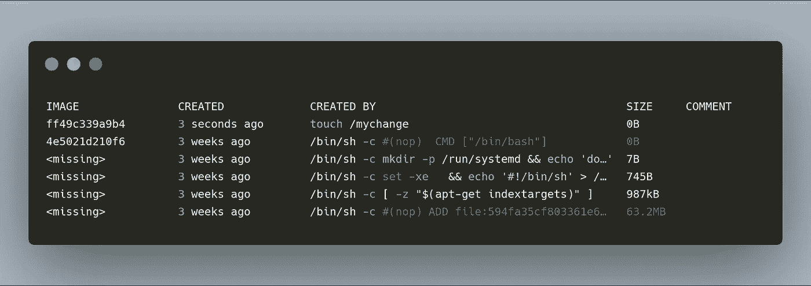
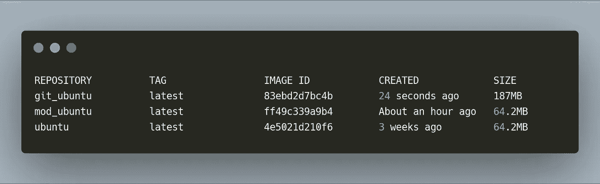
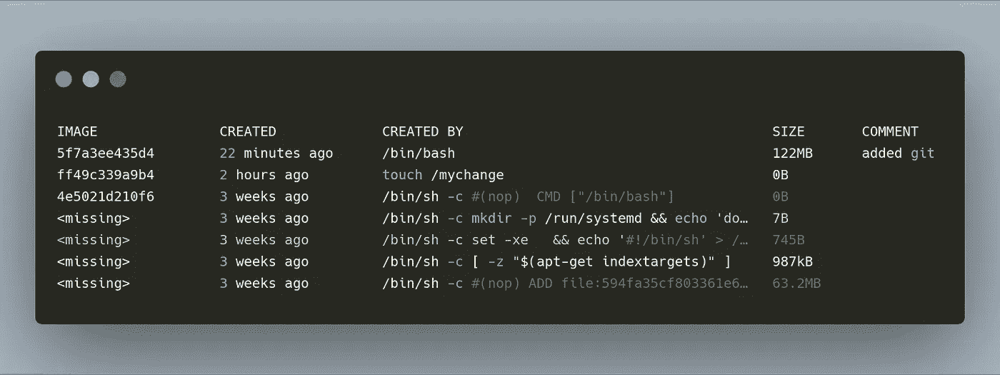
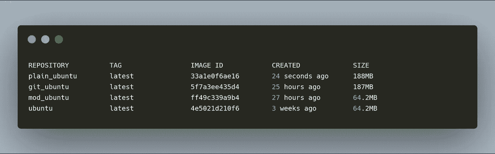
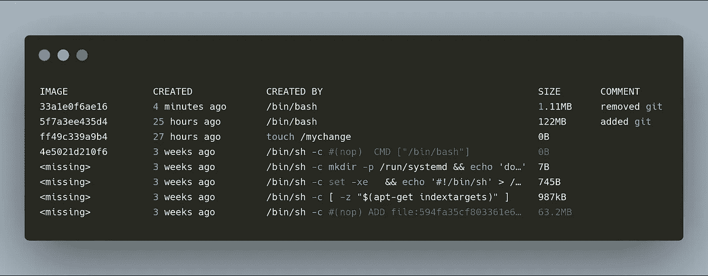
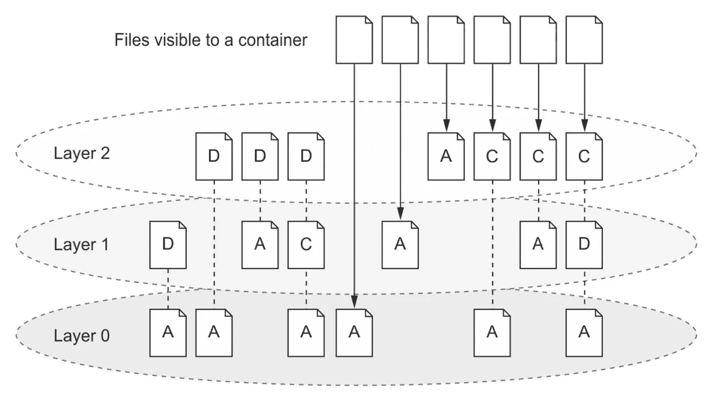
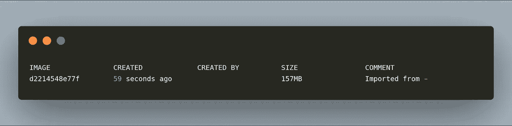
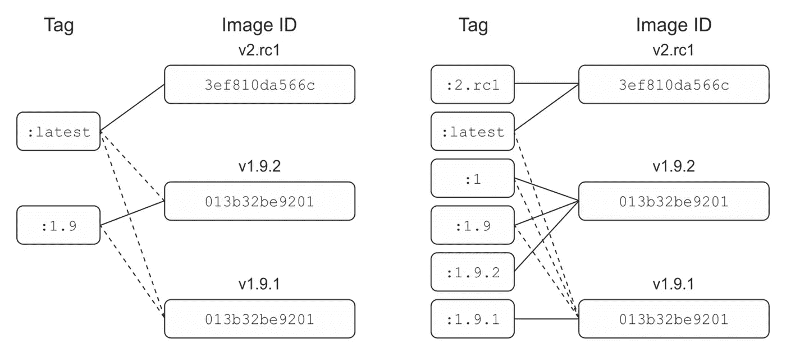

# 如何用图层改善 Docker 图像大小

> 原文：<https://betterprogramming.pub/how-to-improve-docker-image-size-with-layers-3ad62be0da9b>

## 优化您的容器


照片由[哈桑·阿尔马西](https://unsplash.com/@hasanalmasi?utm_source=medium&utm_medium=referral)在 [Unsplash](https://unsplash.com?utm_source=medium&utm_medium=referral) 上拍摄

今天我们将深入探讨 Docker 的联合文件系统(UFS)层。我将试着解释图层是如何工作的，然后如何正确地使用它们来缩小你的图片。

你有没有想过为什么你的 Docker 图片会如此巨大？或者，您可能已经从映像中删除或卸载了一些内容，但大小并未改变。那是因为你在和 UFS 的层作对。一旦你知道了图层是如何工作的，你就可以更容易地创建更小的图像，并且更好地控制所有的变化。让我们从头开始:那些层是什么？

注意:如果你正在寻找一个如何最小化你的图像尺寸的解决方案，只需滚动图层部分。

# 层解释

码头集装箱是由多层构成的。每当我们添加、更改或删除文件时，我们都会在旧层之上添加一个新层。所有这些层的组合或联合是用户或容器所看到的；这是从上到下的视图。另一方面，实际分层视角不同。

先说例子。我们将使用 Ubuntu 映像创建一个新容器，并向其中添加一个新文件。

```
docker run --name mod_ubuntu ubuntu:latest touch /mychange
```

我们可以用`docker diff`和 al 看到文件系统的所有变化。带`docker history`的图层。让我们检查一下。



尼克洛夫，J. (2016) [诉讼中的码头工人](https://www.manning.com/books/docker-in-action-second-edition)

我们可以用`[docker diff](https://docs.docker.com/engine/reference/commandline/diff/)`看到文件系统的所有变化，用`[docker history](https://docs.docker.com/engine/reference/commandline/history/)`看到所有层的变化。让我们检查一下。

```
docker diff mod_ubuntu# output
A /mychange
```

字母`A`表示该文件已被添加。总共有三个选项，它们是:

*   `A` —添加了文件或目录
*   `C` —文件或目录被更改
*   `D` —文件或目录被删除

让我们检查一下新图像中的所有图层。为此，我们首先必须提交它并标记它。

```
docker commit mod_ubuntu mod_ubuntu:latest
```

然后我们可以运行`history`来查看所有的图层。

```
docker history mod_ubuntu
```

输出如下所示:



Docker 历史输出

我们可以看到原始图像的所有图层，然后是我们的图层。

如果我们通过提交不断地添加、删除和更改文件到映像，我们的映像将会变大。重要的一点是，图像的大小是所有图层的总和。

让我们看另一个例子。我们将使用我们的`mod_ubuntu`图像，添加`git`，然后将其命名为`git_ubuntu`。要做到这一点，我们必须运行一个容器并进入它的终端。

```
docker run -it --name git_ubuntu mod_ubuntu /bin/bash#output
root@898d6e1aef74:/#
```

我们在我们的容器中，所以让我们更新工具并安装`git`。

```
apt-get update && apt-get -y install git
```

我们会看到大量的文本。完成后，只需输入`exit`。现在，我们希望将容器提交为一个新的图像，这次使用提交消息，这样我们就知道添加了什么。用`-m`或`--message`添加信息。

```
docker commit -m "added git" git_ubuntu git_ubuntu:latest
```

您应该看到新的图像 id 作为确认。让我们看看我们所有的图像。

```
docker image ls
```

输出应该如下所示:



Docker 图像列表

我们的新形象更大了。我们也可以用`docker history git_ubuntu`检查它的图层。



新图像的 Docker 历史记录

我们有两层，我们从`mod_ubuntu`扩展的旧层和安装了`git`的新层。

现在我们创建另一个图像。这一次，我们将使用`git_ubuntu`，卸载`git`，删除`mychange`文件，然后创建一个新的映像。新图像将被称为`plain_ubuntu`。理论上，我们删除了所有内容，所以我们应该以与`ubuntu:latest`相同的大小结束。让我们看看会发生什么。

再次运行`plain_ubuntu`容器的终端和那里的所有操作。

```
docker run -it --name plain_ubuntu git_ubuntu /bin/bash#output
root@cace613e4176:/##in container's terminal
apt-get uninstall -y git && rm mychange#then
exit#finally commit changes
docker commit -m "removed git" plain_ubuntu plain_ubuntu
```



图像列表

令人惊讶的是，新图像比以前的大。差别不大，但还是应该小一些。现在让我们看看它的层次。



plain_ubuntu 映像的所有提交

这个结果背后的原因是，每次我们提交一些东西，我们就增加了一个新的层。正如我前面提到的，图像的总大小是所有图层的总和。下图显示了发生这种情况的原因。



尼克洛夫，J. (2016) [诉讼中的码头工人](https://www.manning.com/books/docker-in-action-second-edition)

从用户的角度来看，我们只能看到所有操作后留下的文件，但在引擎盖下，一切都还在。我们添加和移除的所有东西仍然在我们的图像中。这通常是有帮助的，因为我们可以访问所有的提交，所以我们知道发生了什么以及什么时候发生的。然而，如果我们想运送小图像，我们必须考虑和处理它。

# 管理尺寸

有两种方法可以缩小图像。一个相当残酷，但简单有效。第二种更乏味，但显然更加敏捷和健壮。

最简单的方法就是用 Docker 导出图片，然后再导入。越复杂的越像做全流程。

## 展平图像

这个过程将创建一个*展平的*图像。顾名思义，所有层将被展平到只有一个。这将显著减小尺寸，但绝不会减到最小。它应该只用于我们不需要跟踪变更、提交等的简单图像。；它只是一个简单的容器。

让我们继续前面的例子。我们有基本上是 T1 的 T0 图像，但是它的大小和 T2 一样。我们能做的就是用`[docker export](https://docs.docker.com/engine/reference/commandline/export/)`在本地导出到一个文件。

```
docker export -o plain_ubuntu.tar plain_ubuntu
```

控制台中有输出，但我们最终得到的是图像的存档。重要的一点是，它只导出容器，不考虑容器体积。

显然，下一步是将图像导入回来。我们和`[docker import](https://docs.docker.com/engine/reference/commandline/import/)`一起做。让我们将新导入的图像标记为`plain_ubuntu:imported`，这样我们以后可以更容易地找到它。

```
docker import plain_ubuntu.tar plain_ubntu:imported
```

控制台将返回新图像的 id 作为确认。现在我们等待的时刻。通过扁平化我们节省了多少空间？
我们来看看`docker images ls`。


顶部带有导入的所有图像的列表

它更小，这是一点，但它甚至没有接近原来的`ubuntu_latest`。现在让我们用`docker_history`检查它的提交。

```
docker history plain_ubntu:imported
```



展平图像的提交历史记录

使用导出和导入，我们丢失了关于提交历史的所有信息，但是我们节省了一些空间。这是一种快速简单的方法，但是正如我提到的，只适用于简单的图像，我们不关心版本和历史。

## 分支

这个想法是分支变更，正确地标记它们，并在需要时重用它们。它增加了更多的手动工作，因为有时我们必须返回并从头开始，但它会缩小图像的大小。此外，它们将只包含必需的文件，没有任何不必要的附加。

每当我们添加、更改或删除某些东西(基本上是可以添加更多层和增加图像大小的任何东西)时，我们都应该提交一个带有适当标签的新图像。想法是将变更标记为次要版本或补丁。我们应该特别关注补丁。



尼克洛夫，J. (2016) [诉讼中的码头工人](https://www.manning.com/books/docker-in-action-second-edition)

根据上面的例子，详细的标签不仅可以帮助我们管理图像的历史和大小，还可以帮助使用我们图像的人。虚线表示图像和标签之间的先前连接，实线表示当前连接。我们可以给图像分配和重新分配标签。一张图片可以有几个标签，所以不要害怕标签。这只会有所帮助。

在我们修改过的 Ubuntu 映像的例子中，从头开始，我们可以将它标记为`1.0.0`。然后我们添加`mychange`并创建一个标签为`1.0.1`的新图像作为补丁。然后我们决定安装`git`，所以让我们现在把`1.1.0`作为一个次要版本。我们做了一些工作，决定给我们的图像增加一点，所以现在我们把它标记为`1.1.1`。现在我们决定卸载`git`；这就是体力劳动发挥作用的地方。

我们应该采取我们的`1.0.1`形象和分支。然后，我们添加我们在`1.1.1`中所做的更改，并将其标记为`1.0.2`，例如。当然，有时这很乏味，但从长远来看，我们最终会得到包装精美的图像和正确标记的回购协议。

# 摘要

让我们总结一下我们所知道的:

*   每当我们提交一些东西，我们就增加一个新的层次。
*   图像是一堆层，用户只能看到最上面的一层。
*   图像大小是所有图层的总和。
*   我们可以通过导出和导入来展平图像，但是我们会丢失提交历史。
*   我们可以给一张图片分配几个标签。
*   我们应该慷慨解囊。
*   不要忘记为实际的最新版本保留`latest`标签。

这篇文章很长，但是了解层是如何工作的对于完全理解如何适当地优化容器大小是非常重要的。希望你安然无恙地度过了难关！谢谢你。