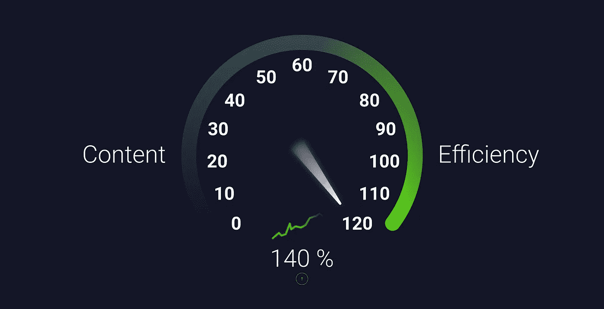
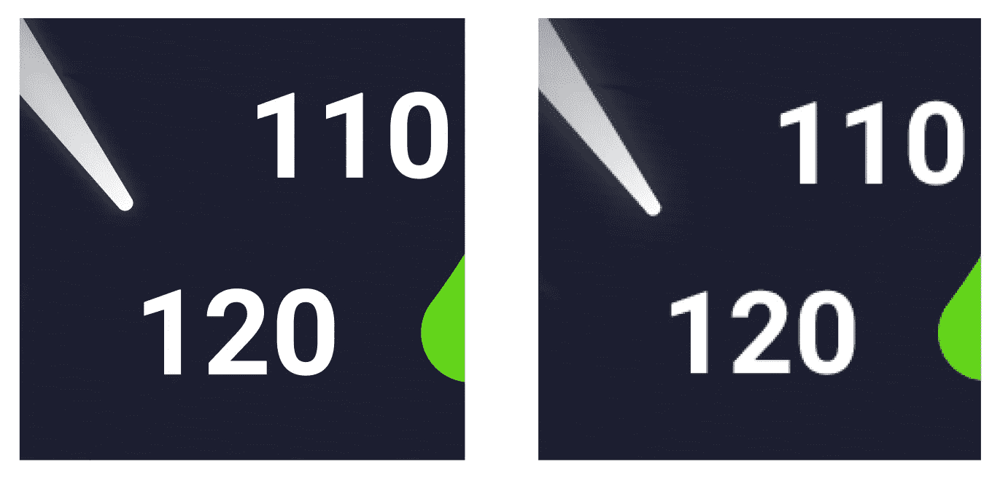
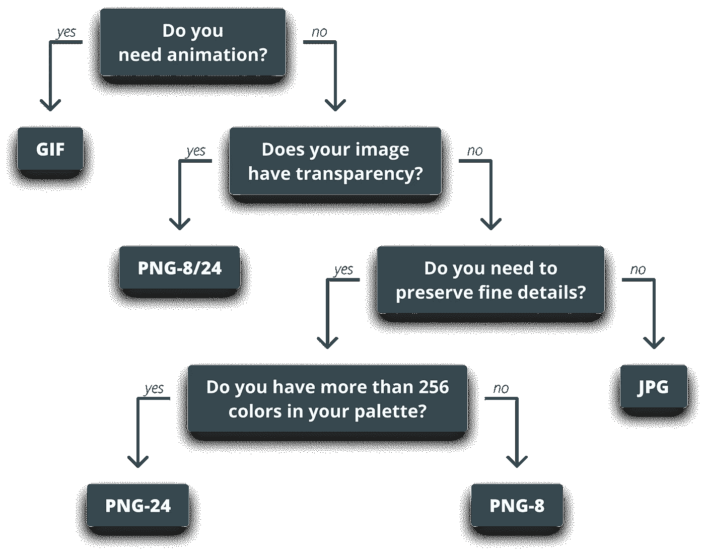
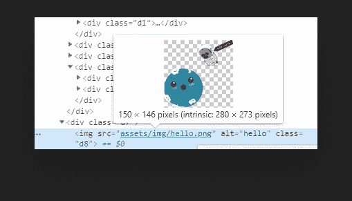
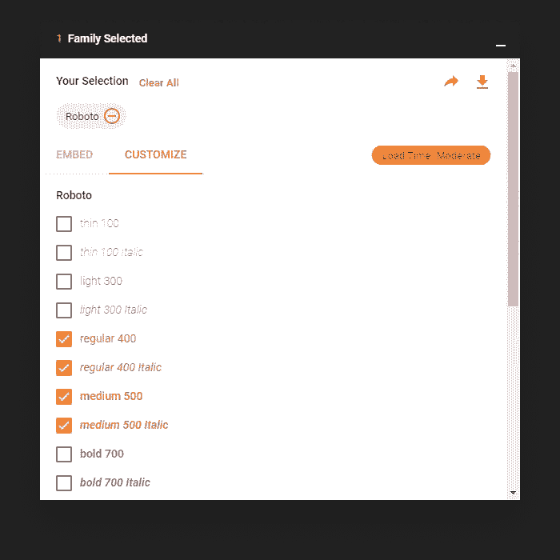
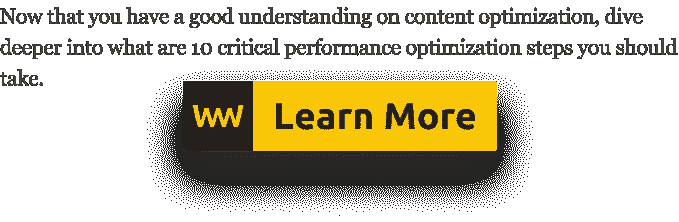

# 如何通过优化内容来提高页面速度

> 原文：<https://betterprogramming.pub/how-to-improve-page-speed-by-optimizing-content-669e17a369cb>

## 图像和字体优化技术

[](https://www.webtips.dev/how-to-improve-page-speed-by-optimizing-content)

Web 应用程序的范围和功能不断增长，这使我们能够离开某些桌面应用程序，在旅途中访问我们的文件。但是让网络更加丰富是有代价的:这类应用程序下载的数据量持续稳定增长。

对于一个内容丰富的站点，网络请求的数量可以从 100 到 500 不等。在撰写本文时，让脸书加载首页导致了超过 **500** 个网络请求和超过 **8 MB** 的传输。

互联网速度越来越快，但不同国家的速度不同，截至 2016 年，移动互联网的使用超过了桌面互联网，其中许多用户仍然使用缓慢的 3G 连接。

有鉴于此，实现流畅的用户体验变得越来越困难，使得内容优化比以往任何时候都更加重要。

优化我们的大部分资产，如 HTML、CSS 和 JavaScript 文件是非常简单的，你缩小和丑化，去掉注释，你基本上就完成了，没有太多其他事情可以做。

但是这些并不是唯一花费我们额外的加载时间的资产。就文件大小而言，我们有占应用程序最大部分的较重资产，这些是图像和字体。

所以，让我们来看看这两者，看看我们如何优化它们，使我们的网站的内容加载更有效。

# 图像优化技术

大多数情况下，图像占传输字节的大多数，这意味着我们可以通过优化它们来获得最大的性能。要开始这样做，我们需要知道我们在哪里使用什么类型的图像。

## 替换图像

利用 CSS 效果可以移除和替换一些图像。考虑使用阴影:不要用图像来代替阴影或文本阴影，而是用 CSS 来代替它们。

通常，我们在工具提示、语音气泡、切换和其他 UI 处理程序中使用三角形箭头，并且我们倾向于使用自定义字形或图像。这些也可以用 CSS [边框](https://css-tricks.com/snippets/css/css-triangle/)代替。下次当你必须实现一个设计时，想想你是否可以只用 CSS 实现同样的效果。

但是，如果我们确实需要使用图像，并且我们碰巧想在图像上显示一些文本，那么就使用 web 字体，而不是在图像本身中编码文本。这也有助于减少资源大小。

## 使用矢量图像

当你在图像中使用不同几何形状的组合时，最好使用矢量而不是光栅。请注意两者之间的区别:



放大矢量与光栅图像

矢量图像与分辨率和比例无关，因此在高分辨率和不同屏幕尺寸设备的世界中，矢量图像是一个很好的选择。

## 缩小 SVG 标记

组成 SVG 的 XML 标记通常包含由生成它们的应用程序添加的不必要的元数据。这些可以安全地删除，以确保我们只交付绝对必要的部分，仅此而已。

## 选择正确的光栅图像格式

选择正确的光栅图像格式对于节省宝贵的字节至关重要。首先，从决定在三种主要类型中使用哪一种开始:JPG、PNG 或 GIF？

我们可以简单地通过提问来排除 GIF:“*我需要动画吗？*“如果答案是肯定的，那就用 GIF，如果不是，我们要么用 JPG，要么用 PNG。

如果我们不需要动画图像，我们只剩下 JPG 和巴布亚新几内亚。如果你的图像是透明的，那就剩下 PNG 了。如果没有，你也不需要保存好的细节，你就剩下 JPG 了。

为了更容易理解选择哪一个，请看下面的决策树:



## 压缩

就像 SVG 一样，许多光栅图像包含元数据，如相机信息甚至地理位置。这些可以安全地移除。

除了删除元信息，我们还可以通过有损压缩进一步减小文件大小。由于我们眼睛的工作方式，我们可以降低分辨率而不会注意到差异。一个使用有损压缩的伟大工具是 [TinyPNG](https://tinypng.com/) 。

## 缩放您的图像

调整图像大小，确保显示尺寸尽可能接近图像的自然尺寸。如果你在你的网站上显示一个 300x150px 的图片，没有必要是 1500x750，把它缩小到显示尺寸。



在 DevTools 中显示为“固有”的图像的自然大小

# 字体优化技术

就像图像一样，为了知道我们可以在哪里进行改进，我们需要首先监控我们的字体使用，尽管这里提到的技术适用于所有字体。

## 最小化字体数量

最简单和最容易实现的方法是最小化页面上使用的字体数量和每个字体系列使用的变体数量。

这不仅在性能方面有所帮助，而且还创建了更一致的设计，为更好的用户体验铺平了道路。

你可以在 fonts.google.com 的[上试验字体加载次数；选择您想要导入的字体，加载时间将根据您的选择进行计算。](https://fonts.google.com/)



## 子集化

许多字体都有各种各样的字形，您可能永远也不会用到。如果你的网站只由拉丁字符组成，那么在你的字体集中保留西里尔符号就没有意义了。

这些字体可以是子集，并且只包括所需的 Unicode 范围，以进一步减小文件大小。有很多在线和离线工具，比如 [glyphhanger](https://www.npmjs.com/package/glyphhanger) 、[trans Font](https://transfonter.org/)和 [Font Subsetter](https://everythingfonts.com/subsetter) 可以帮助你实现这一点。

## 实现自定义字体加载策略

为了进一步优化字体加载，您还可以实现自定义字体加载和呈现策略。

默认情况下，字体请求被搁置，直到渲染树被构建，这意味着我们已经准备好了 DOM 和 CSSOM。这可能会导致文本呈现延迟。

通过在`link`标签上使用`rel="preload"`,我们可以告诉浏览器以高优先级处理资源，这样就可以在早期请求字体，而不必等待 CSSOM 准备就绪。

确保用`as`属性指定资源的类型:

```
<link rel="preload" href="myCustomFont.woff2" as="font" />
```

## 贮藏

字体是静态资源，大多数时候，它们很少改变，这意味着您可以提供一个长的`Cache-Control: max-age`指令来缓存它们，并避免不必要的网络请求。

## 压缩

最后但同样重要的是，一些字体格式，如 EOT 或 TTF，默认情况下是不压缩的，请确保对它们进行某种压缩。

# 还能做什么？

到目前为止，我们主要讨论了前端的优化技术，但是在将内容发送到客户端之前，我们也可以在服务器上进行优化。例如，启动 [Brotli](https://github.com/google/brotli) 或 [gzip](https://www.gzip.org/) 压缩。

我们讨论了字体的缓存，但这同样适用于图像。您可以将这些标记为静态资源( *如徽标和背景图片*)，这样下次用户访问您的网站时，他们会从缓存而不是从服务器获得请求，从而避免不必要的旅行。

这几点都有影响，有些影响很小，有些影响很大。

照顾好每一点真的可以增加和提高你的性能，所以下次当你被要求提高页面速度时，记住上面的几点，你将保证你的内容效率会很高。

[](https://medium.com/@ferencalmasi/membership)[](https://www.webtips.dev/10-critical-performance-optimization-steps-you-should-take)