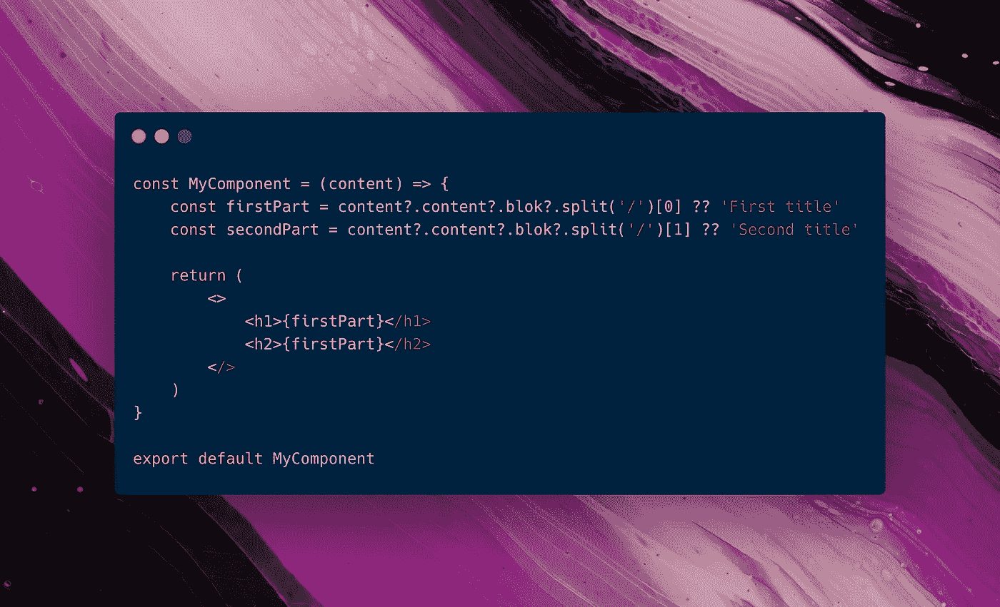

# 如何用可选链接改进 React 组件

> 原文：<https://betterprogramming.pub/how-to-improve-react-components-with-optional-chaining-6081456cccfe>

## 让我们尽量减少网络应用程序中的错误

作者照片。

如果您正在开发一个大型 React (Next.js)应用程序，有时您可能需要深入研究数据结构。很普通。我所说的 React 组件应该是这样的:

如果`content`或`blok`的任何一个属性缺失，我们就有大问题了。页面将会断开，用户将会得到一个错误。🥺

# 改进:可选的链接和无效合并操作符

我们需要两个 JavaScript 特性来防止大规模错误:[可选链接](https://developer.mozilla.org/en-US/docs/Web/JavaScript/Reference/Operators/Optional_chaining)和 [nullish 合并操作符](https://developer.mozilla.org/en-US/docs/Web/JavaScript/Reference/Operators/Nullish_coalescing_operator)。别担心，这听起来比实际情况复杂。

## 可选链接

可选链接是这样的:`content?.content?.blok`。浏览器将首先检查在`content`对象中是否有一个`content`属性，而不是假设这个属性存在。如果不存在，不会显示错误，但会使变量`nullish`。所以它没有价值。

## 零融合算子

既然我们的变量可以是 null，这意味着它可以是`null`或`undefined`。但是我们希望在页面上同时显示两个标题，而不是什么都不显示。

nullish 合并操作符如下所示:`??`。它检查操作者的左值是`null`还是`undefined`。如果是，您可以给它一个回退值。

所以看起来是这样:`content?.content?.blok ?? 'Title'`。如果值为 nullish，它会将`'Title'`赋给变量。如果值不是 nullish，它将从深层嵌套对象中分配标题。

# 改进的 React 组件

如果我们实现我们之前讨论的解决方案，我们的组件看起来像这样:

现在，用户将总是有一个标题，没有错误。最好为错误做好准备，这样用户才能继续他们的应用程序之旅。

是的，用户将会看到一个错误的标题，但是这比显示一个实际的错误或者更糟糕的是，页面不显示要好得多！

# 结论

希望这将帮助您改进 React 组件。如果内容无法加载或不存在，请做好准备！并确保用户拥有良好的用户体验。

*快乐编码*🚀！

# 从我这里读更多

 [## 加速页面加载的 7 个 Web 开发指南

### 为了你的访问者的爱，改善用户体验

better 编程. pub](/7-web-development-guidelines-to-speed-up-page-loading-e8f0e13a53b)  [## 没有 JavaScript 框架的故事书入门

### 将它与普通 HTML 和 CSS 一起使用

better 编程. pub](/getting-started-with-storybook-without-a-javascript-framework-c2968d3f3d9f)  [## JavaScript 中承诺的实际工作方式

### 了解何时以及如何使用它们

better 编程. pub](/how-promises-actually-work-in-javascript-1c80b1af7193)  [## 带有样式化组件的 CSS 变量

### 在 Next.js/React.js 轻松使用它们

devbyrayray.medium.com](https://devbyrayray.medium.com/css-variable-with-styled-components-7e91d89f13f3)