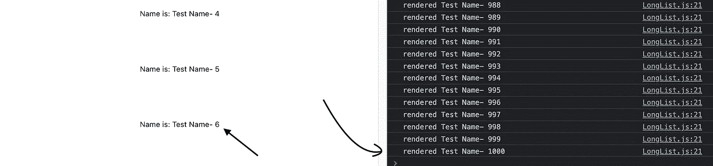

# 如何提高包含 1000 个条目的 React 列表的渲染性能

> 原文：<https://betterprogramming.pub/how-to-improve-rendering-performance-in-a-1-000-item-react-list-85be129b8c0d>

## 让我们确保我们的 web 应用程序能够高效滚动


照片由[像素](https://www.pexels.com/)上的[负空格](https://www.pexels.com/photo/marketing-notebook-office-pen-97076/)拍摄。

假设您正在使用 React 构建某种应用程序，要求您显示一长串项目。比如说 1000 件。你有什么选择？就一次渲染全部？

今天，我的目标是向您展示问题，以便您了解我们正在解决的问题，然后提出解决方案。

我们开始吧！

# 创建项目

至此，你们都应该知道如何使用`create-react-app`从命令行创建一个新的 React 应用程序。只需在您的终端上运行以下命令，即可开始使用全新的 React 应用程序:

```
npx create-react-app long-list-app
```

# 让我们渲染 1000 个项目

好吧，我先给你看看问题。看看下面的组件:

手动列表

在这个组件中，我们将生成 1，000 个名字，并将它们呈现在一个列表中。现在让我们在浏览器中查看一下:



低效渲染

虽然我们的窗口能够显示六个项目，但是从控制台上，我们可以看到有 1000 个项目正在后台呈现！

这种低效的渲染会让你的应用程序非常慢。

# 现在给我看看代码！

我们将使用一个名为`[react-virtualized](https://github.com/bvaughn/react-virtualized)`的很棒的库。这个概念非常简单和优雅:不要渲染你在屏幕上看不到的东西！

首先，安装依赖项:

```
yarn add react-virtualized
```

这个库所做的是导出一些包装组件来包装你的列表。您提供高度、宽度和要呈现的函数，库处理其余的。

让我们更新代码，使用从库中导出的`List`组件:

使用 react-virtualized 更新

我们已经用`List`组件改变了渲染过程。

注意这里的一件事:我们传递了一些额外的道具。`width`、`height`、`rowHeight`和`rowCount`是自解释的，而`rowRender`是每个行项目的渲染函数。

现在让我们看看结果:


优化后

现在我们可以看到屏幕上有 39 个项目，现在正好呈现了 39 个项目。没有不必要的渲染！

# 可变尺寸屏幕

您可能已经注意到，我们给定的容器的高度和宽度是一个常数。但是如果用户的屏幕大小不同呢？你只是不能说，“但它在我的机器上工作！”

react-virtualized 已经解决了这个问题。它还有另一个名为`AutoSizer`的组件，帮助动态查找列表容器的高度和宽度。它遵循一个`render-props`模式。

让我们像这样更新代码:

使用自动筛分机

现在，屏幕的高度和宽度会根据用户的屏幕大小自动更新。

# 可变大小的行

所以我们解决了容器的高度和宽度问题。但是单独的行项目呢？如果它们的大小因内容而异呢？

react-virtualized 对此也有解决方案。为此，您需要使用另一个名为`CellMeasurer`的组件。我们将使用另一个名为`CellMeasurerCache`的组件来缓存组件的大小。

现在看看修改后的渲染过程:

可变高度行示例

# 结论

所以你有它。我只是简单介绍了 react 虚拟化的可能性，以及它如何帮助我们显著改善低性能 React 应用程序。

祝您愉快！

**有什么话要说？通过** [**LinkedIn**](https://www.linkedin.com/in/56faisal/) 联系我

[](/the-7-traits-of-a-rock-star-react-developer-747fbb001c05) [## 摇滚明星 React 开发者的 7 个特质

### 造成差异的习惯

better 编程. pub](/the-7-traits-of-a-rock-star-react-developer-747fbb001c05)