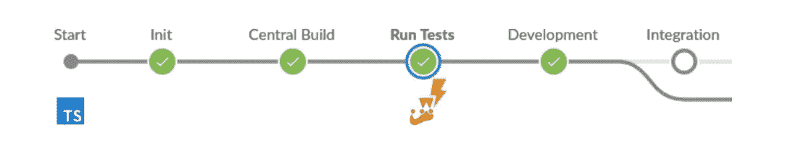
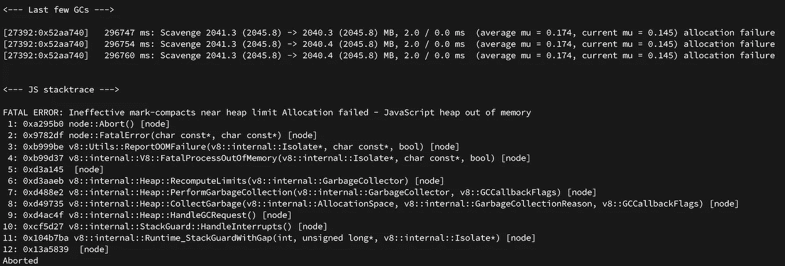
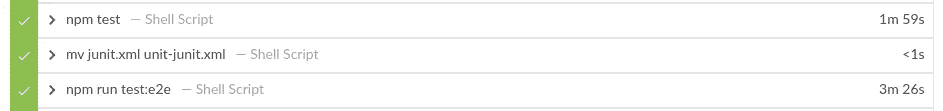
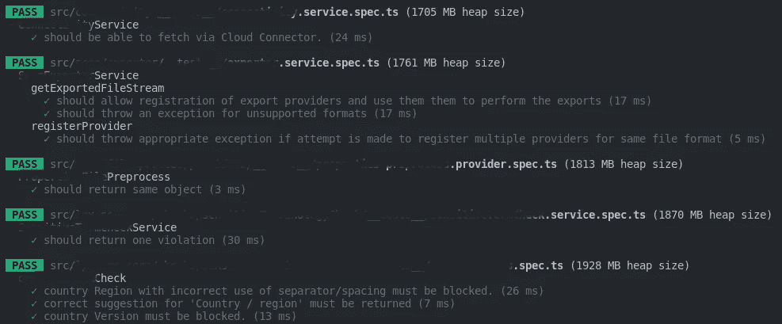
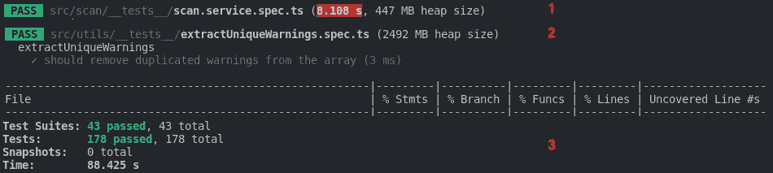
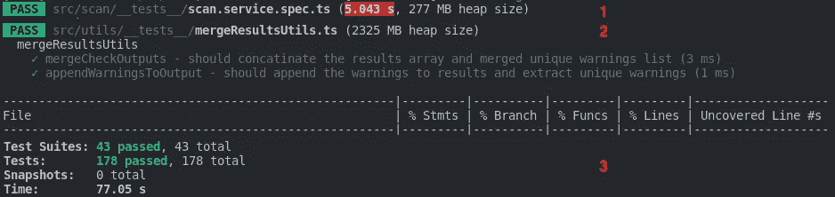
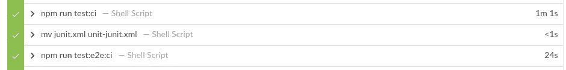

# 如何在 CI 环境中使用 TypeScript 提高 Jest 性能

> 原文：<https://betterprogramming.pub/how-to-improve-the-jest-performance-in-ci-environments-when-using-typescript-66a186cb5cd4>

## 消除项目中停滞的测试用例和内存不足错误的技巧



来自[iconfinder.com](https://www.iconfinder.com/search?q=thunder&price=free)和 [freeicons.io](https://freeicons.io/profile/3) 的图标

每个开发人员或开发团队在构建新项目时都必须做出决策，在这种情况下，我们谈论的是 Node.js 项目。当谈到 JavaScript 开发时，您可以做出的最佳决定之一是使用 TypeScript，因为这将为您提供额外的工具来编写更清晰和可维护的代码。

另一个好的决定是在项目中添加一个测试框架或库，众所周知，Jest 是目前使用最多的框架，也是一个不错的选择，因为它有一个强大的内置断言库。

最后但并非最不重要的是，我们应该添加一个管道，以确保我们不会引入错误，并且在每次合并或发布之前一切正常。让我们用詹金斯来完成这项任务，尽管它也可能是任何其他的选择。

至此，你已经认识了这个故事的三个主角:[打字稿](https://www.typescriptlang.org/)、 [Jest.js](https://jestjs.io/) 、 [Jenkins](https://www.jenkins.io/) 。让我们开始吧。

# 问题是

一切都开始了，因为它被要求更新项目的依赖关系，因为一些漏洞被发现，因为它已经有很长一段时间，因为最后一次更新。在此过程之后，我更新了以下依赖项(仅提及最相关的部分):

```
typescript     from 3.9.7  to 4.7.4
jest           from 26.4.2 to 28.1.1
ts-jest        from 26.3.0 to 28.0.5
```

然后，当我推动更改并且 Jenkins 运行测试时，在两个不同的时刻发现了两个不同的问题:

1.  测试阶段在每次管道执行时都被随机测试用例卡住，并且永远不会结束。
2.  在实现了第一个问题的解决方法，并通过一些额外的代码和测试将更改合并到另一个特性分支之后，在 stage 的日志中显示了以下错误“JavaScript 堆内存不足错误”



JavaScript 堆内存不足错误

除此之外，重要的是要说，在依赖项更新之前，单元测试的测试阶段花费了 1.59 分钟，e2e 测试花费了 3.26 分钟。请记住这些数字，以备后用。



测试阶段的 CI 流水线时间

# “停滞的测试用例”的解决方法

正如您在这个[堆栈溢出问题](https://stackoverflow.com/questions/62885390/my-jests-tests-are-leaking-memory-how-can-i-fix-this)的答案中所看到的，当您寻找如何修复这个问题的信息时，您可以找到的第一个也是最常用的方法与 Jest 运行测试所使用的线程数量有关。您可以使用两种不同的选项来更改默认行为:

*   `[— runInBand](https://jestjs.io/docs/cli#--runinband)`:这将连续运行所有的测试，并使用主进程，而不是创建更多的线程。
*   `[— maxWorkers](https://jestjs.io/docs/cli#--maxworkersnumstring)`:这允许您设置可以使用多少线程来运行测试。这默认为您的计算机上可用的内核数量减去一个主线程。

因此，我在 package.json 测试脚本中添加了选项— `runInBand`,以避免 Jest 一次运行多个测试，这意味着这个过程需要更少的内存。然而，这也意味着需要更长的时间才能完成。这解决了第一个问题，但是我们必须处理 JavaScript 堆内存不足错误。

# 深入挖掘，寻找“内存不足错误”的根本原因

为了更好地理解这个问题，我做的第一件事就是从测试执行中获取更多的概要信息。我通过将`test package.json`脚本更新为以下内容实现了这一点:

带有 jest 分析的测试脚本

这允许我单独运行测试，并获得在运行每个测试后分配了多少内存的信息。



jest-logHeapUsage 选项

在这一点上，我意识到 Jest 消耗的内存比 Jenkins 容器中可用的内存多，并且花了很长时间才开始运行第一个测试。

我的第一个选择是使用 [SWC](https://swc.rs/) 来加速测试，与 [Babel](https://babeljs.io/) 相比，它有望将编译速度提高 20 倍。然而，我在设置它时遇到了几个问题，因为它似乎不能很好地处理循环依赖。

然后，在搜索另一个选项时，我最终选择了一个名为[隔离模块](https://huafu.github.io/ts-jest/user/config/isolatedModules#example)的 [ts-jest](https://huafu.github.io/ts-jest/) 配置选项。简而言之，它禁用了 TypeScript 类型检查，从而减少了内存消耗和执行时间。

# 最终解决方案

我猜想您对类型检查有所顾虑，因为我们一开始并没有使用 TypeScript 来禁用它。但是不用担心，我们只需要在 CI 环境中禁用它。正如您在下面的脚本中看到的，我们需要通过发送一个环境变量来禁用 CI 脚本的类型检查。然后，您只需要确保在配置管道时使用了`test:ci`。

然后，让我向您展示使用普通测试和 CI 测试执行测试的两个图像，以便您可以看到不同之处:



无优化—正常测试脚本(npm 运行测试)



带优化— CI 测试脚本(npm 运行测试:CI)

如果我们查看前面图像中的三个步骤，并对每个步骤进行比较，我们可以看到以下内容:

1.  执行的第一个测试:启动时间和消耗的内存是 3，065 秒，在 CI 脚本中相应地减少了 170MB
2.  执行的最后一个测试:在 CI 脚本中，最终的堆大小减少了 167MB
3.  执行摘要:在 CI 脚本中，执行持续时间少了 11，375 秒

最后，让我向您展示一下，经过改进后，测试在 CI 环境中的运行速度提高了 50%以上。



改进后测试阶段的 CI 流水线时间

感谢阅读！我希望这篇文章对您有所帮助。欢迎所有建设性的反馈。