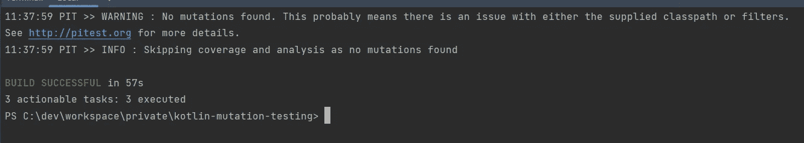
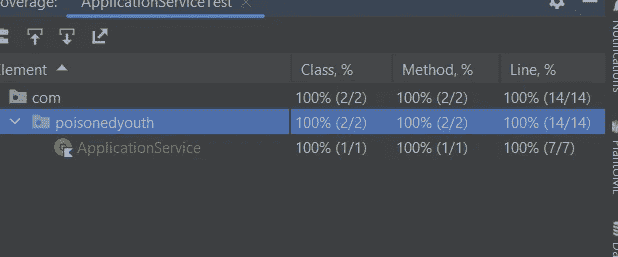
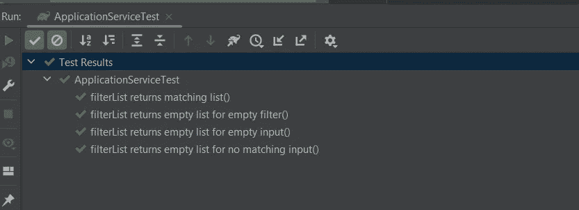
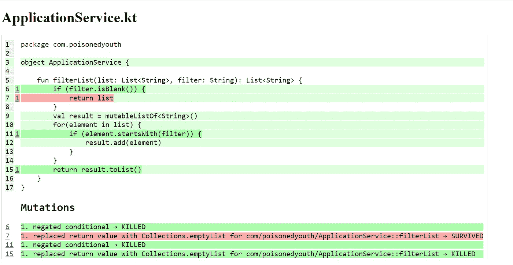
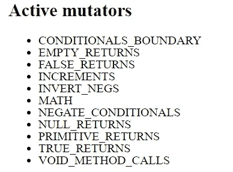
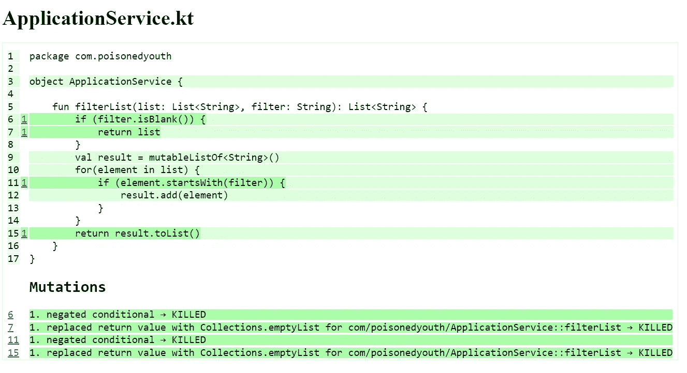
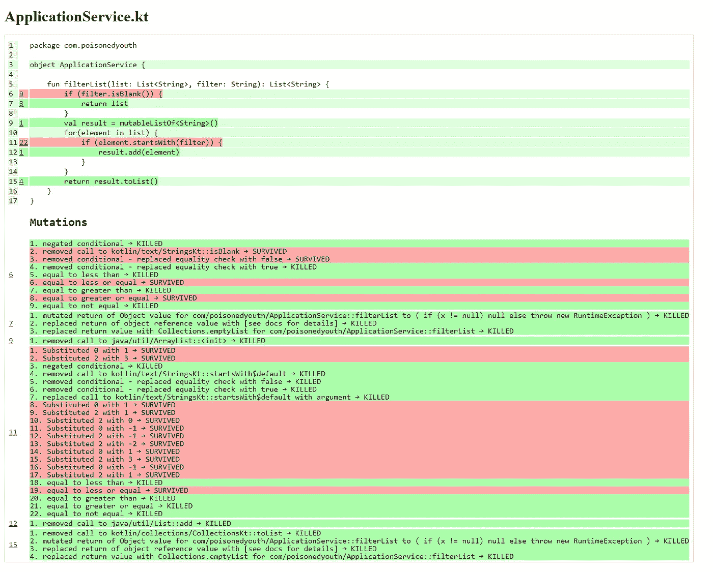
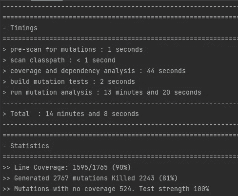

# 如何使用突变测试提高测试质量

> 原文：<https://betterprogramming.pub/how-to-improve-the-quality-of-tests-using-mutation-testing-2346019829f1>

## 在 Kotlin 项目中使用 PITest 进行突变测试


图片: [Pixabay](https://pixabay.com/illustrations/virus-mutation-covid-variant-6006301/)

在今天的文章中，我想介绍突变测试，并展示它如何帮助提高 Kotlin 项目中的测试质量。

作为开发人员，正常的工作流程是编写测试，测试应该验证生产代码是否按预期运行。为此，我根据测试金字塔(你可以在[马丁·福勒](https://martinfowler.com/bliki/TestPyramid.html)的文章中找到一个)编写不同种类的测试，测试被测应用程序的不同方面。

有大量的单元测试验证单个类的内部行为、遵循合群方法的顺序以及相关类的行为，要么嘲弄所有依赖类，要么更好地使用测试替身。较少的组件测试验证了不同组件之间的交互。最后但同样重要的是，有一些测试测试代码与外部组件(如数据库或 Rest API)的集成。有时，有一个额外的测试层来验证与应用程序用户相关的用例是否按预期工作。这些被称为验收测试。

这是一个非常粗略和简短的概述，介绍了不同的测试如何一起工作，以保证生产代码在当前状态下正确工作。

但是你们都知道生产代码被更新了，例如，为了添加特性，现有的行为不再像预期的那样工作。应用程序用户认识到了错误的行为，但是没有一个自动化测试在交付之前检测到错误。这就提出了一个问题，即如何检查测试的质量，检测生产代码中的行为变化。

仍然存在这样一种误解，即通过自动化测试获得高代码覆盖率就等于高质量的测试。我将在后面的例子中展示 100%的测试覆盖率如何仍然不能识别代码变化，从而改变行为。

代码覆盖率只是一个工具，它可以帮助识别测试尚未覆盖的代码部分，但不能识别现有测试写得有多好。对于使用 Mockk 框架(如 Mockito 或 Mockk)的测试来说尤其如此。

那么，对于测试质量的陈述，还有什么其他的选择呢？

# 突变测试

对于这个任务，变异测试正在进入游戏。突变测试是一种软件测试，它改变(突变)生产代码，并检查是否有任何现有测试检测到这种变化。变异测试的目标是确保编写的自动化测试至少能够检测到应用程序行为的变化。它是关于检查测试的健壮性和质量。

让我们一步一步地概述一下突变分析是如何完成的:

*   对源代码的每一部分进行分析，就会产生大量的突变体。突变体是原始代码的一个版本，只有一个单一的变化(例如，反转 if 条件或将循环的计数器加 1)。
*   所有测试都是针对原始代码和变异代码运行的，以检查结果。
*   将结果相互比较。如果针对变异代码运行的测试导致失败，它们足以检测到代码变更。如果测试结果相等，则测试没有检测到源代码的变化，需要改进。

对于突变体的产生，有不同类型的可能:

*   决策变异
*   价值突变
*   语句突变

# 决策变异

if、when 或 for 等控制语句被更改。

```
// before:
if (a >= 5) {
    //...
} else{
    //...
}
// after:
if (a <  5) {
    // ...
} else{ 
    // ...
}
```

# 价值突变

变量值被改变。

```
//before:
val i = 1002
doSomething(i)

//after:
val i = -120
doSomething(i)
```

# 语句突变

一个语句被另一个语句删除或替换。

```
// before:
val list = listOf(1,2,3)
doSomething(list)
doSomethingElse(list)

// after:
val list = listOf(1,2,3)
doSomethingElse(list)
```

既然已经解释了变异测试的基础，让我们看看如何将变异测试添加到现有的 Kotlin 应用程序中。

对于 Kotlin，您可以使用 PIT 测试，这是一个最初为 Java 开发的突变测试系统，但在 JVM 上运行时也适用于 Kotlin。

因此，让我们开始使用 Gradle 向 Kotlin 应用程序添加 PIT 测试。

关于配置可能性的扩展文档可以在 Gradle 插件( [gradle-pitest-plugin](https://gradle-pitest-plugin.solidsoft.info/) )的文档中找到。

有了这种配置，就有可能执行如下的突变测试:

```
gradle pitest
```

结果并不是很壮观，因为没有测试和源代码可用。



既然 PIT 测试的设置已经完成，那么让我们为这个类创建一个示例生产类和现有的测试。

示例生产代码如下所示:

初始测试如下所示:

当在 IntelliJ 中运行现有的覆盖率测试时，我可以看到覆盖率是 100%。测试应该看起来足够好，能够检测出生产代码中的变化。



为了检查这种说法是否正确，让我们更改现有的代码并再次运行测试，看看测试是否检测到生产代码行为的变化。为了简单起见，我返回一个空列表，而不是输入列表。看起来是这样的:

```
fun filterList(list: List<String>, filter: String): List<String> {
    if (filter.isBlank()) {
        return emptyList()
    }
    val result = mutableListOf<String>()
    for(element in list) {
        if (element.startsWith(filter)) {
            result.add(element)
        }
    }
    return result.toList()
}
```

如下所示，测试仍然通过，作为一名开发人员，我没有得到功能改变的提示(可能是错误的)。



让我们看看当前测试运行突变测试的结果是什么:



产生了四个突变，但是现有的测试没有杀死一个。我还可以在测试报告中看到使用了哪些变异子。因为我没有配置任何东西，所以使用默认的。可以配置使用的变异器(见 [PITest](https://pitest.org/quickstart/mutators/) )。



为了在下一步中验证突变测试的行为，我将优化我的测试，以便更好地验证生产方法的行为。

再次运行突变测试，报告如预期所示。



公平地说，我只是优化了测试，以使用默认的变异函数。如果我更新变异测试配置以使用所有可用的变异器，结果看起来会有所不同。

```
pitest {
    setProperty("junit5PluginVersion", "0.15")
    setProperty("testPlugin", "junit5")
    setProperty("targetClasses", listOf("com.poisonedyouth.*"))
    setProperty("outputFormats", listOf("HTML"))
    setProperty("failWhenNoMutations", false)
    setProperty("mutators", listOf("ALL"))
}
```



更多的突变产生了，我不得不再次检查我的测试。

# 摘要

正如您在这个简单的例子中所看到的，突变测试可以帮助我检查我的测试写得有多好，以便可靠地检测生产代码中的变化(也可能是错误发生的)。

但是你应该记住，变异测试是一种工具，可以帮助获得关于代码的提示。没有结果是唯一真理的通用解决方案(与代码覆盖率相同)。

没有必要对 CI/CD 管道上的每一次提交都运行变异测试，因为运行时会随着每一个新的生产代码的编写而快速增加。因此，一次又一次地对项目的部分(例如，重构的或者新实现的)执行突变测试，以获得关于测试质量的提示，会有所帮助。

例如，[*ktor-encryption-server*](https://github.com/PoisonedYouth/ktor-encryption-server)项目的大小如下(当前版本)

```
~ 2500 LOC productive code
~ 100 Tests
```

所有变异器的变异测试运行都在我的本地机器上进行:



如果项目规模增加，这对于每次提交永久运行来说太多了。

你可以在我的 GitHub 账户上找到我为这篇文章使用的知识库:[https://github.com/PoisonedYouth/kotlin-mutation-testing](https://github.com/PoisonedYouth/kotlin-mutation-testing)