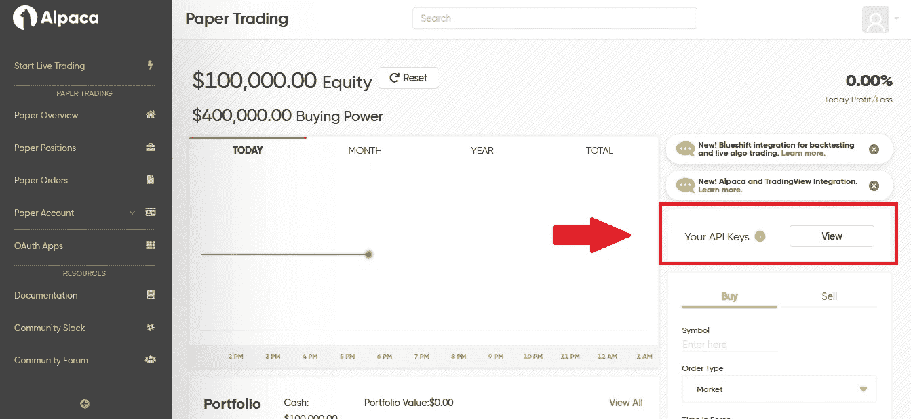

# 如何改进你的基于人工智能的 Python 交易系统:羊驼经纪人

> 原文：<https://betterprogramming.pub/how-to-improve-your-ai-based-python-trading-system-the-alpaca-broker-92c0029bbc45>

## 探索免佣金 API 的可能性

*编者按:本文并非投资建议，仅供娱乐和教育之用。*


由[克里斯·利维拉尼](https://unsplash.com/@chrisliverani?utm_source=medium&utm_medium=referral)在 [Unsplash](https://unsplash.com?utm_source=medium&utm_medium=referral) 上拍摄

本文从一个样板文件开始，[一个完全自动化的基于人工智能的交易系统](https://towardsdatascience.com/how-to-create-a-fully-automated-ai-based-trading-system-with-python-708503c1a907)。然而，这不是第二部分——把它想成一个副产品。

好了，你已经学习了前面的教程，现在你有了一个非常棒的全自动人工智能交易系统，简称 AFAABTS。现在怎么办？现在是时候加强它了，增加更多的资源，更多的复杂性，诸如此类的东西。今天，我们将为羊驼增加更多的风味，羊驼是已经包括在内的两个经纪人之一。

首先让我们简单回顾一下:羊驼是什么？根据[他们的主页面](https://alpaca.markets/)，是一个股票交易的 API:

> 使用算法进行交易、连接应用程序、构建服务—所有这些都使用免佣金的股票交易 API

羊驼是注册证券经纪商，也是 FINRA 和 SIPC 的成员。他们也在这里，在中等！你可以在羊驼的名字下找到它们。在他们的额外津贴中，他们列出了:

*   高级交易:支持许多高级投资和交易策略，如保证金或卖空。
*   测试:我们这里要用的羊驼纸账户，是一个有实时数据但没有真金白银的测试环境。[与真实交易](https://alpaca.markets/docs/trading-on-alpaca/paper-trading/)有一些微小的差异，但无论如何它都是一个很棒的工具。
*   多语言:SDK 在 Python 中可用。NET/C#或 Go 等等。
*   免佣金:羊驼不收取交易佣金。然而，有一个披露:

> 没有最小值。免佣金交易是指通过 API 交易美国上市证券的羊驼自导个人现金经纪账户不收取佣金。[相关 SEC 和 FINRA 费用可能适用。](https://alpaca.markets/learn/regulatory-fees/)

我们将使用`alpaca-trade-api` [库](https://github.com/alpacahq/alpaca-trade-api-python/)，Python SDK，在 GitHub 中有超过 700 颗恒星。要安装:

```
$ pip install alpaca-trade-api
```

让我们快速浏览一下，看看羊驼提供了什么。

## 注册

通过 API 完成的所有事情都需要一个 API 密钥 ID 和一个密钥，可以在仪表板中找到:



作者图片

从这一点来看，所有动作将具有相同的结构:

```
import alpaca_trade_api as alpacaKEY_ID = <<<YOUR KEY ID GOES HERE>>>
SECRET_KEY = <<<YOUR SECRET KEY GOES HERE>>>
BASE_URL = 'https://paper-api.alpaca.markets'api = alpaca.REST(KEY_ID, SECRET_KEY, base_url=BASE_URL)
```

`api`对象是我们将用来访问所有方法的对象。

## 获取帐户信息

使用之前的`api`对象，我们可以访问所有的账户信息:

```
acc = api.get_account()print(
    f'The buying power is {acc.buying_power} {acc.currency} '
    f'and the equity is {acc.equity} {acc.currency}\n'
    f'The account status is {account.status}'
)---------The buying power is 400000 USD and the equity is 100000 USD
The account status is ACTIVE
```

还有呢！看一下使用 API 可以访问的账户的所有属性。

## 获取数据并下订单

> “好吧，鲁本，这一切都很棒，但你能切入正题，告诉我如何使用这个或什么来买卖东西吗？”

好吧，好吧。让我们开始精彩的部分。

我们需要知道的第一件事是市场是否开放:

```
clock = api.get_clock()if clock.is_open:
    print('Market is open')
else:
    print('Market is closed')
```

很简单，对吧？然后我们可以继续检查所有资产的数据。Alpaca 与五家交易所合作:ARCA、NYSE、AMEX、NASDAQ 和 BATS，提供每项资产的以下信息:

```
# Get the list of all active assets
active_assets = api.list_assets(status='active')# Let's check out one of them
print(active_assets[0])---------Asset({
    'class': 'us_equity',
    'easy_to_borrow': True,
    'exchange': 'ARCA',
    'id': '8649a606-050b-42ef-b8ad-8c5060827c29',
    'marginable': True,
    'name': 'AdvisorShares Dorsey Wright ADR ETF',
    'shortable': True,
    'status': 'active',
    'symbol': 'AADR',
    'tradable': True
})
```

`tradable`属性表示资产是否可以在羊驼交易，而`symbol`属性则是一个符号！

知道了这一点，我们就可以检查特定资产的定价信息(注意，下面的代码几乎是从羊驼文档中摘录的！):

```
# Get daily price data for GOOG over the last 5 trading days.
barset = self._api.get_barset('GOOG', 'day', limit=5)
bars = barset['GOOG']# See how much GOOG moved in that timeframe.
week_open = bars[0].o
week_close = bars[-1].c
percent_change = (week_close - week_open) / week_open * 100
print(f'GOOG moved {percent_change}% over the last 5 days')---------GOOG moved -2.5682613899484377% over the last 5 days
```

有了这些信息，我们就可以决定是买入、持有还是卖出。这也很简单——同样，这些例子直接来自羊驼科医生。以市价购买一股谷歌股票的市场订单:

```
api.submit_order(
    symbol='GOOG',
    qty=1,
    side='buy',
    type='market',
    time_in_force='gtc'
)
```

开市时以特定价格(此处为 2000 美元)卖出一股谷歌股票的限价单:

```
api.submit_order(
    symbol='GOOG',
    qty=1,
    side='sell',
    type='limit',
    time_in_force='opg',
    limit_price=2000
)
```

羊驼还允许您下达[空头订单](https://alpaca.markets/docs/api-documentation/how-to/orders/)、[括号订单](https://alpaca.markets/docs/trading-on-alpaca/orders/#bracket-orders)或[追踪止损订单](https://alpaca.markets/docs/trading-on-alpaca/orders/#trailing-stop-orders)等。

## 检查投资组合

为了获得我们拥有的资产的信息，我们需要调用`list_positions`方法。对于特定的方法，我们可以使用`get_position`，但是请记住，如果我们的投资组合中不存在该头寸，它将抛出`APIError`异常。

```
# All positions
portfolio = api.list_positions()# Position in GOOG.
position = api.get_position('GOOG')
```

# 最后的想法

羊驼是开发人员的经纪人——或者更好，是编码人员的经纪人。它提供了一个简单而强大的 API——足以完成我们想做的几乎任何事情。除此之外，纸质账户是一个方便的测试环境，可以在没有风险的情况下测试我们的策略。在使用真钱之前，记得要彻底测试一切，甚至寻求专业建议。交易不容易——如果容易，每个人都会变得富有！

和往常一样，你可以[在 GitHub 里查看代码](https://github.com/ruromgar/python-ai-trading-system/blob/master/ai-trading-system/src/application/clients/alpaca_client.py)。

# 参考

1.  羊驼队， [API 文件](https://alpaca.markets/docs/api-documentation/)，羊驼队。
2.  R.Romero，[如何用 Python 创建一个全自动的基于人工智能的交易系统](https://towardsdatascience.com/how-to-create-a-fully-automated-ai-based-trading-system-with-python-708503c1a907) (2020)，中型