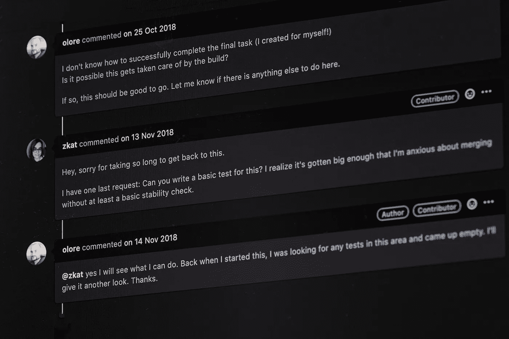

# 如何改进你的代码审查

> 原文：<https://betterprogramming.pub/how-to-improve-your-code-reviews-f5e9d5a6536c>

## 反馈可能很难。这里有一个满足你的拉动式需求的方法

GitHub 上的 Pull 请求评论(图片由作者提供)

大约二十年前，我开始在一家使用代码评审的公司做开发人员。那时，我从未做过代码审查，我的代码也从未被审查过。

对于我的第一个项目，我必须使用 [ATL 框架](https://docs.microsoft.com/en-us/cpp/atl/active-template-library-atl-concepts?view=vs-2019)用 C++创建一个 COM 组件。ATL 使用引用计数来管理对象的生存期。引用计数意味着当你使用完对象时，你必须调用`Release()`。如果您忘记调用它，就会导致内存泄漏。

我记得我第一次代码评审的结果，就好像是昨天一样。太戏剧化了。

我不记得确切的数字，但我肯定有 100 多条评论。评论者提到的每一个`Release()`我都忘了。评论的语气很严厉。我挣扎着。

我是一个如此糟糕的开发者吗？

目前，我已经做了十多年的代码评审工作。执行代码评审是提高代码库质量并创造学习和尊重文化的最好方法。

然而，成功的代码评审有一个特定的方法。

# 为什么代码审查很重要？

打开上一本关于编程或其他技术主题的书，在书的开头找一个标题为“致谢”的段落。

我敢肯定，在这一段，作者感谢他的编辑帮助创造了一个更好的版本。编辑和评论是写书的标准程序。

为什么软件开发不一样呢？

在代码审查期间，另一个开发人员检查您的工作是否有错误。开发人员会指出改进之处，例如:

*   难以理解的代码
*   不清楚的名字
*   注释代码
*   未经测试的代码

除了寻求改进，评审者还从解决方案中学习。您应该将代码审查视为成长的机会，以及安全网——而不是批评的机会。

众所周知，代码审查也可以防止错误。IBM 所做的研究发现，每一个小时的检查妨碍了大约 100 个小时的相关工作(测试和缺陷纠正)。

# 自动化可以自动化的东西

在我们继续看我的成功代码评审的秘诀之前，我们必须谈谈自动化。

不要在检查风格错误的代码评审中浪费时间。相反，在风格指南上达成一致，并使用 linter 或静态分析工具来验证该风格。

此外，确保可以运行一个完整的构建来验证一切仍然正确构建，并且所有单元测试都成功。

自动化所有这些任务将使评审者的贡献更有价值。评审者可以更多地关注其他方面，比如功能错误和可读性。

# 代码审查的方法

我的成功代码审查的方法包括两组成分，一组是给修改的作者，另一组是给审查者。

由 [Jasmin Sessler](https://unsplash.com/@open_photo_js?utm_source=medium&utm_medium=referral) 制作的食谱的配料

# 作者的成分

作为变更的作者，您有责任让评审者容易理解您的代码评审。

## 变更集的大小应该很小

没有人喜欢做包含数千行代码变更的代码评审。这将需要很长时间，并且由于大量的更改，很有可能需要重新审查。研究表明，变更集的大小会影响注释的有用性。随着变更集变得越来越大，有用的注释数量会减少。

因此，请确保变更集的大小较小，比如少于 250 行。审查的质量会更高。

## 校对你的差异

我无法告诉你我通过校对我的拉取请求发现了多少次简单的错误。大多数工具，如 GitHub、Bitbucket 或 Azure DevOps，都包含在发送 pull 请求之前校对 diff 的工具。

作为一名作者，您应该经常校对您的代码更改，以找到常见的错误，以便审阅者可以关注其他点。

# 评论者的成分

## 以改进为目标，而不是追求完美

尝试将代码提高一个档次，而不是使其完美。这有助于我从分数的角度来考虑这个问题。当我收到一个以 D 开头的 pull 请求时，我会帮助作者把它变成 C——虽然不完美，但比原来好了。

这样不会把整个代码库降级为 C 吗？我不这么认为。我发现当我帮助一个开发人员从 D 到 C 时，他们发送的下一个拉请求将从 C 开始，在几个拉请求中，他们发送给我的评审以 Bs 开始，在评审结束时变成 as。

## 尊重审查的范围

简单地说，只审查被改变的代码。如果看到修改后的代码附近有你觉得应该修复的地方，可以好心的请作者修复。但是请记住，这不在审查范围之内。

如果拉请求没有改变一行，那么它就超出了范围。

## 评论的语气

我发现评审的基调是代码评审最重要的方面之一。总是试着问开放式的问题，而不是发表固执己见的声明。提供其他选择或可能的解决方法。但是不要坚持那些替代方案或变通方法。

如果你有不明白的地方，假设你作为一个评审者，遗漏了什么，请求澄清。试着用*这个词来考虑*。比如:“你考虑过把这个重构成一个单一的方法吗？”或者“考虑重命名此方法以提高可读性。”

## 及时审查

尝试尽快查看拉取请求。如果你首先必须完成你的任务，让作者知道你什么时候开始评论。

## 使用审查清单

您应该尝试创建一个清单，在执行代码评审时作为参考。看看下面的几个类别，你会从中获得一些灵感，并把它们放在你的清单上:

*   稳健性
*   正确性
*   设计
*   可维护性
*   REST API 设计
*   全球化
*   表演
*   安全性
*   可量测性
*   易测性

另一个灵感来源是 ISO 25010，一个定义软件系统质量特征的标准。

# 结论

我确信代码审查，如果做得正确，可以改进你的代码库，并创造一种学习和尊重的文化。

这篇文章描述了我对好的代码评审的定义。我为作者和评论者列出了几个要素，以确保你有一个良好的开端。

要获得更多信息，我建议阅读其他人和组织关于他们的代码评审最佳实践的文章。

*   来自[谷歌工程](https://google.github.io/eng-practices/review/reviewer/)的代码审查
*   [如何让好的代码评审变得更好](https://stackoverflow.blog/author/gorosz/)
*   Philipp Hauer 的《人类代码评审指南》
*   来自 SmartBear 的[更好的代码审查流程开发人员指南](https://smartbear.com/learn/code-review/guide-to-code-review-process/)
*   迈克尔·林奇的《如何像人一样进行代码评审》
*   卡尔·e·威格斯[人性化同行评议](https://www.processimpact.com/articles/humanizing_reviews.pdf)

感谢阅读！

[1]:阿房书博苏。(2015 年 5 月)。有用的代码评审的特征:[微软的一项实证研究](https://www.microsoft.com/en-us/research/wp-content/uploads/2016/02/bosu2015useful.pdf)

[2]:荷兰，迪克。(1999 年 12 月)。“作为变革代理的文档检查”，软件质量专家，第 2 卷，第 1 期，第 22-33 页。