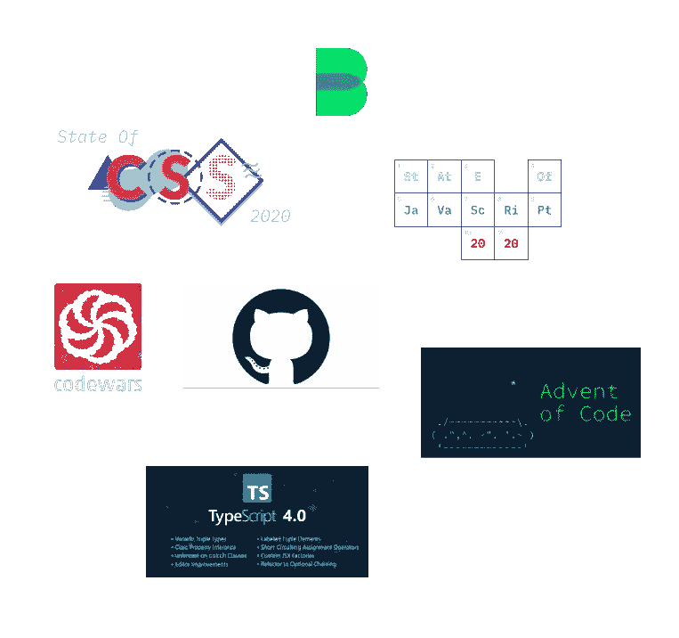
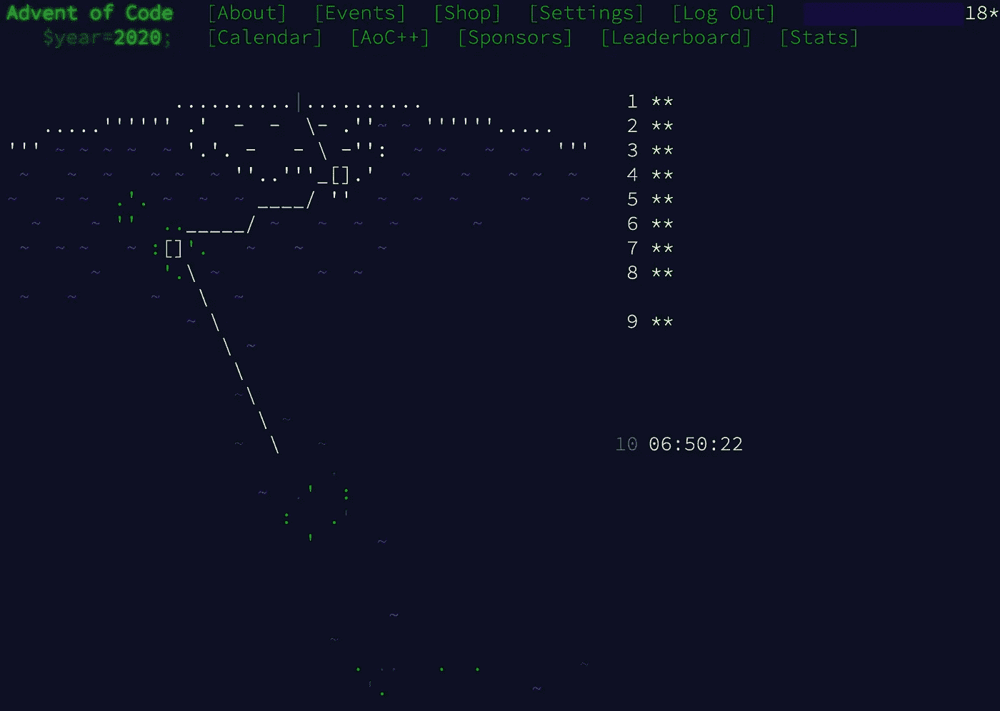
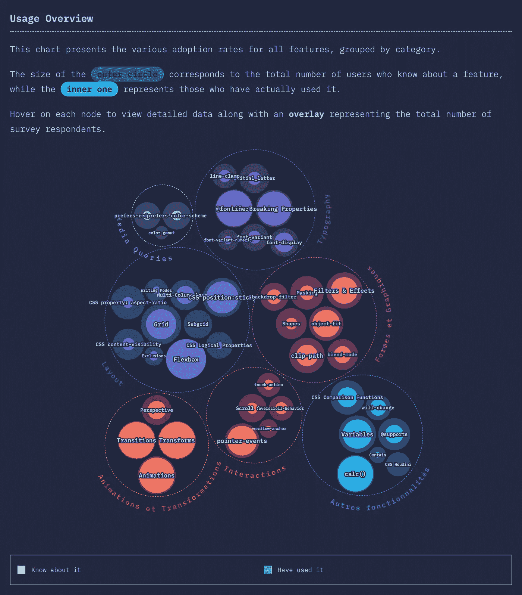
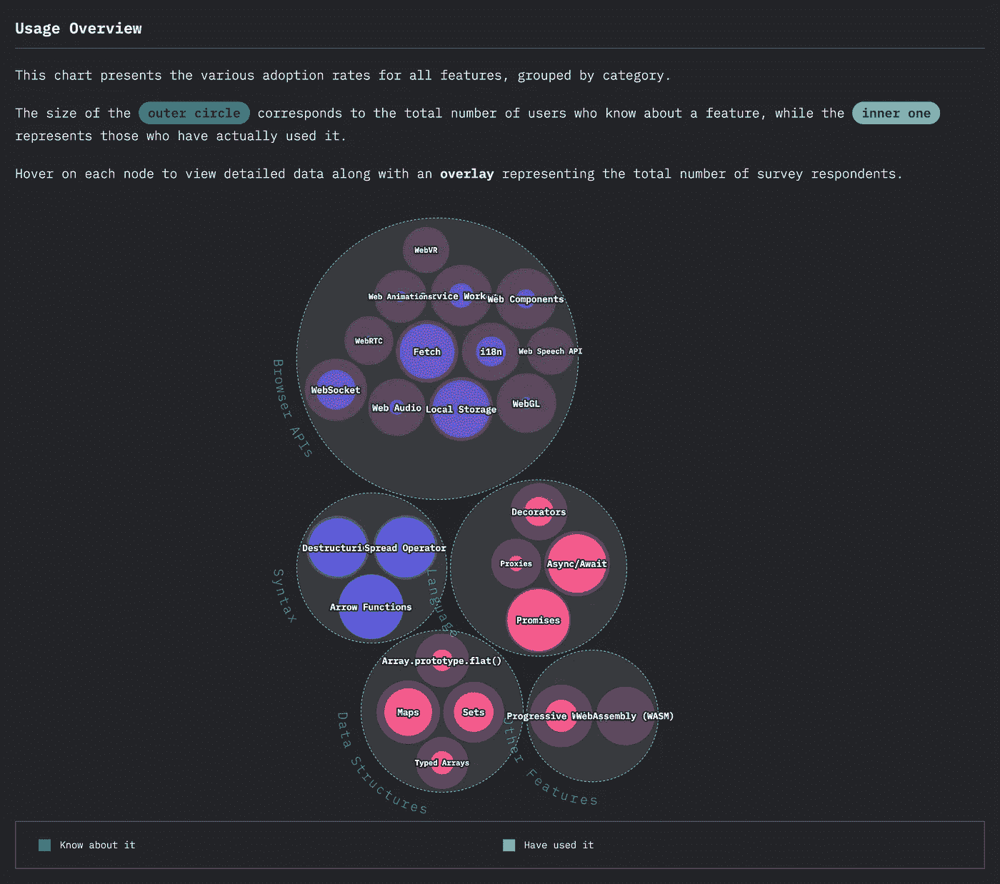
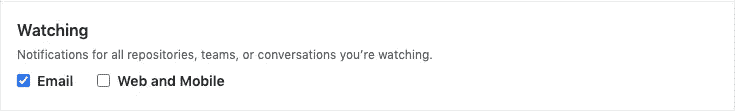
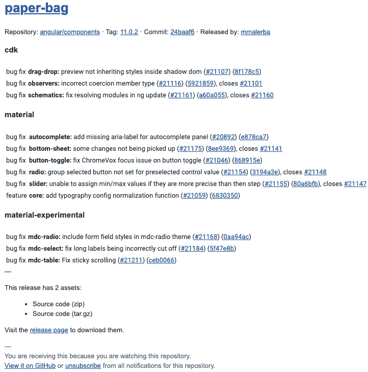
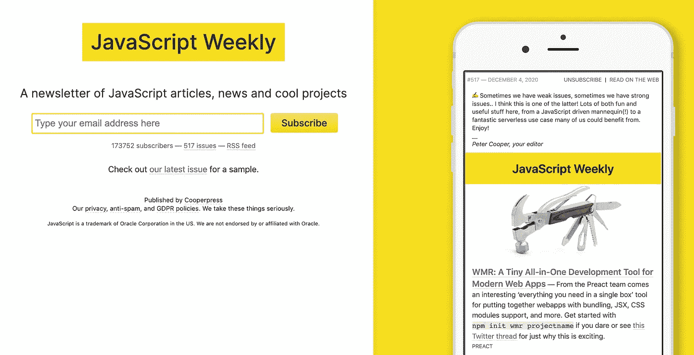
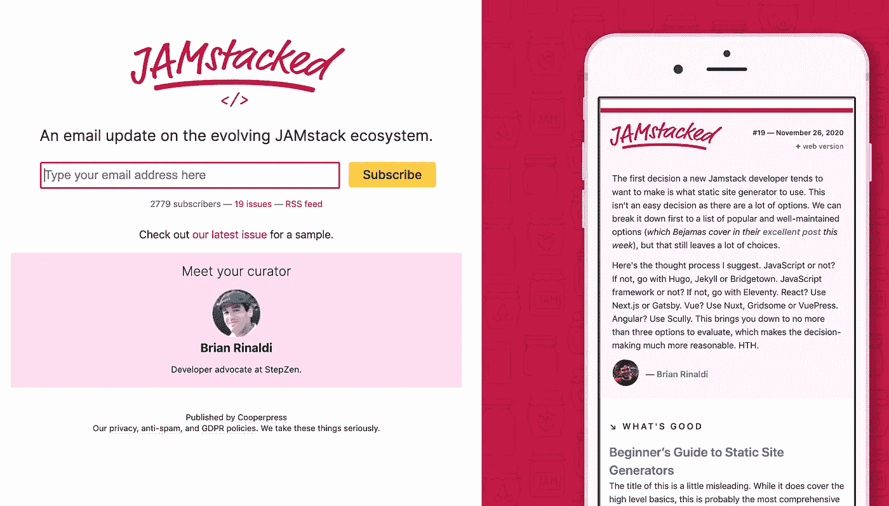

# 如何在 2021 年全年提高你的开发技能

> 原文：<https://betterprogramming.pub/how-to-improve-your-dev-skills-all-year-long-in-2021-bab12d042f6a>

## 你未来 365 天的发展训练

来源:作者

毫无疑问，成为开发人员需要不断更新技能。我们需要尽可能跟上时代。我们知道的越多，我们积累的经验就越多，这将有助于我们面对下一个问题。然而，我们成为有史以来最好的开发人员最缺乏的资源几乎总是相同的:时间。

那么，在这篇文章中，我想给你一些提示和材料，在短时间内更新你的知识。

分配时间让你的技能跟上时代并不容易。这就是为什么需要从少量的时间开始。花费的时间越少，我们就越有机会坚持常规。因为，没错，都是套路。

在这里，我将讨论四种类型的程序，你现在就可以开始成为一个更好的开发人员:

*   参与编码游戏
*   接受编程语言调查
*   及时了解社区通知
*   以下出版物简讯

# 编码游戏

当我们处理开发人员技能时，谈论游戏似乎很奇怪，但它们教授具体的技能，如 React、Python、Go、微服务等等。

事实上，让我们回到基础。首先，我们是工程师——或者接近工程师——我们的主要工作是思考算法，以及如何以优雅和智能的方式管理障碍。

编码游戏对维持这样的逻辑思维很有帮助。无论是使用你知道的某种类型的算法，还是发现一种新的算法，保持好奇心都很重要。如果你这样做了，下次你遇到多余的问题或新问题时，你会有不同的方法——由于你的新知识，这个问题可以很容易地解决。

## 代码战争

web 上存在许多平台，但我个人使用 Codewars，它提供了各种难度级别，并支持几种编程语言。当然，排名是存在的，我希望看到其他开发人员的解决方案，以便改进我的代码并发现使用方法和数据结构的新方式。

 [## 代码战争:通过挑战达到精通

### Codewars 是开发人员通过挑战掌握代码的地方。在道场训练形，达到你的最高境界…

www.codewars.com](https://www.codewars.com/) 

频率:我试着一周做两到三个体式，这取决于难度。

## 代码的出现

多么令人高兴——开发人员的降临节日历！是的，它确实存在:从 12 月 1 日到圣诞节，每天有两个谜。我给你介绍一下:

 [## 代码的出现

### 开发人员的降临节日历，一天两个谜题

adventofcode.com](https://adventofcode.com/) 

每年你都可以在这个比赛中挑战你自己和你的朋友。幸运的是，这都是关于算法和解决逻辑问题，所以由你来决定编程语言和工具，给你正确的答案。

**频率** y:从 12 月 1 日到 12 月 25 日，每天都有两部分的谜题。

来源:作者

# 调查

啊，这是一个和我们的程序员同事比较的好方法。这也是了解新的库、架构、框架或代码布局的一种方式。

## CSS 的状态

CSS 发展得非常快:新的模块出现了(Flexbox，多列)，新的范例也出现了。弃用和浏览器支持也在不断变化。

 [## CSS 调查的现状

### 柔性盒，网格，多列...更不用说像 CSS-in-JS 这样的全新范例了。所以在我们一年一度的成功之后…

stateofcss.com](https://stateofcss.com/) 

CSS 的状态处理各种主题，例如:

*   [人口统计](https://2020.stateofcss.com/en-US/demographics/):被调查者的身份(国籍、性别等。)
*   [CSS 特点](https://2020.stateofcss.com/en-US/features/):知、用、好学
*   [单位和选择器](https://2020.stateofcss.com/en-US/units-and-selectors/)
*   [CSS 框架](https://2020.stateofcss.com/en-US/technologies/css-frameworks/)
*   在我看来，CSS 方法论是最重要的概念之一
*   [开发环境](https://2020.stateofcss.com/en-US/environments/)
*   [资源](https://2020.stateofcss.com/en-US/resources/)、[意见](https://2020.stateofcss.com/en-US/opinions/):你用哪些材料更新技能？你对 CSS 及其发展有何感想？

2020 年 CSS 功能概述(来源:[CSS 状态](https://2020.stateofcss.com/fr-FR/features/#features_overview)

**频率:**每年十月。

## JS 状态

类似地，JS 的状态有助于识别来自 20，000 多个开发人员的关于 JavaScript 的当前和即将到来的趋势。

其实就是 CSS 大佬的状态。它创建于四年前，调查开发者关于 JS 语法、数据结构、T4 和浏览器 API 的情况。还包括[前端框架](https://survey.stateofjs.com/survey/state-of-js/2020/92vXQSC7d2w6HD73T/7)、[测试](https://survey.stateofjs.com/survey/state-of-js/2020/92vXQSC7d2w6HD73T/10)、[构建工具](https://survey.stateofjs.com/survey/state-of-js/2020/92vXQSC7d2w6HD73T/11)、[和响应能力](https://survey.stateofjs.com/survey/state-of-js/2020/92vXQSC7d2w6HD73T/12)。

最后，正如 CSS State 所做的，关于 JS 及其演变，询问了[资料](https://survey.stateofjs.com/survey/state-of-js/2020/92vXQSC7d2w6HD73T/14)和[意见](https://survey.stateofjs.com/survey/state-of-js/2020/92vXQSC7d2w6HD73T/15)。

 [## JavaScript 的现状调查

### 在过去的四年里，这项调查帮助我们做到了这一点，它从 20，000 多名开发人员那里收集数据，以便…

stateofjs.com](https://stateofjs.com/) 

由于 JavaScript 发展得非常快，甚至比 CSS 还快，这是一个抓住新趋势的好方法。如果我们在图书馆或技术之间犹豫不决，它可以给我们一个方向的想法。这是社区驱动的，不是吗？

2019 年 JS 功能概述(来源:[JS 状态](https://2019.stateofjs.com/features/#features_featuresOverview))

T21:每年的十一月。

## Python 的现状

对于更多的后端/全栈开发人员来说， [JetBrains](https://www.jetbrains.com/) 每年都会发布一个关于 Python 编程的调查。它收集关于使用 Python 的计算机领域以及 Python 在哪个生态系统中发生的数据。

 [## Python 编程——2020 年开发者生态系统状况信息图

### JetBrains 是一家尖端软件供应商，专门开发智能开发工具，包括…

www.jetbrains.com](https://www.jetbrains.com/lp/devecosystem-2020/python/) 

我猜还有更多类似的调查存在。由于我是前端开发人员，我把我知道的都贴出来了。我目前也在学习 Python，所以我向您提供了 Python 调查。

我相信你可以找到总结最佳代码实践或生态系统调查的文章，这些文章与你所习惯的语言相对应。

# 社区通知

## GitHub 通知

多亏了 GitHub，每当一个新版本的库发布时，你都可以收到一封电子邮件。更一般地说，如果您观察一个存储库，您可以得到通知。查看您的设置:

来源: [GitHub 设置页面](https://github.com/settings/emails)

这是非常有用的，因为你会自动意识到你跟踪的每个项目的新发布。

Angular Components 11.0.2 的发行说明(来源:作者)

y:每次收到一封电子邮件。

## 发布说明

处理发行说明很好，但是更好的是找到源代码本身！事实上，TypeScript 是一个很好的例子来说明这一点。

TypeScript 团队已经发布了一个公共路线图:

 [## microsoft/TypeScript —路线图

### TypeScript 是 JavaScript 的超集，它通过编译来清理 JavaScript 输出。-微软/TypeScript

github.com](https://github.com/Microsoft/TypeScript/wiki/Roadmap) 

然后每次发布之后，TypeScript 网站上都有一篇博文:

 [## TypeScript —开发博客

### 或者是 TypeScript 编译器的高级工程师

devblogs.microsoft.com](https://devblogs.microsoft.com/typescript/) 

这种帖子非常有帮助，因为它深入解释了每一个变化，以及它如何影响您的编码体验。突破性的变化是详细的，并提供了具体的例子，以充分理解这些修改。

# 时事通讯

当然啦！时事通讯是我们保持好奇心的最佳资产。我们可以依靠我们的开发伙伴来创作有趣的描述性文章。根据你的领域，我确信有专门的时事通讯存在，无论是来自媒体上的出版物还是外部平台。

就我个人而言，我已经订阅了下面所有的时事通讯。这可能看起来很多，但我有一个简单的技巧:

我读了每一篇提到的文章的标题，如果我对其中一篇不感兴趣，我就删除邮件。最多需要两分钟。

否则，我会在以后查看邮件和文章，主要是在周末的一个小时。

## 最明显的一个:中等

 [## 中等——好主意找到你的地方。

### Medium 是一个开放的平台，读者可以在这里找到动态思维，专家和未被发现的声音可以在这里分享…

medium.com](https://medium.com/me/missioncontrol) 

在“控制您的推荐”部分(在右上角的菜单中)，您可以调整您的兴趣中心以及您希望接收媒体简讯的周期。

该简讯基于您在平台上阅读的内容、特色文章以及最新的出版物和作者。

**频率** y:每天或每周。

## 更好的编程

由于 Medium 的时事通讯功能，我们可以在每周五收到一封每周电子邮件，收集过去一周来自 Better Programming 的最佳文章。

 [## 更好的编程

### 给程序员的建议。

medium.com](https://medium.com/better-programming) 

幸运的是，更好的编程几乎涵盖了计算机科学的所有领域。在 Medium 上最受关注的出版物中，其背后的团队帮助作者从出版中获得最大收益，并在社交网络(LinkedIn、Twitter、Quora、脸书等)上传播文章。).

频率:每周五。

## JavaScript 周刊，JAMstacked

对于 JavaScript 爱好者来说，订阅的主要时事通讯当然是:

JavaScript Weekly 的超酷之处在于，它不仅提供了来自社区的各种文章，还提供了最常用库的新版本。此外，我们从社区、开发工具和特色工作中获得突发新闻。

同样，JAMstacked 专注于 JAM 生态系统: **J** avaScript、 **A** PIs 和 **M** arkup。

频率:分别是每周五和周四。

## Netlify 团队总结，哨兵通讯

还有更多的时事通讯，但是你可以根据你的兴趣中心和你正在工作或热衷于工作的生态系统来选择它们。

 [## 宣布 Netlify 团队概述:协作更容易，开发更快

### 虽然 Netlify 以使网站在全球范围内运行变得非常容易而闻名，但该平台的真正力量…

www.netlify.com](https://www.netlify.com/blog/2020/10/22/announcing-team-overview-collaborate-easier-develop-faster/)  [## 主页

### 来自 Sentry 开发人员的产品、工程和营销更新。

blog.sentry.io](https://blog.sentry.io/) 

**频率**:每周。

# 离别赠言

简而言之，坚持这些惯例并不困难，但是需要一些纪律。幸运的是，其中一些不会持续一整年(调查、代码的出现等等)。).但是做这些可以改变我们作为开发人员几周的日常生活。这也是一个回归基础并向我们自己介绍一些新挑战的问题。