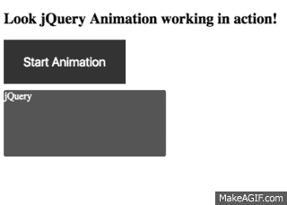

# 如何在 Angular CLI 项目中包含和使用 jQuery

> 原文：<https://betterprogramming.pub/how-to-include-and-use-jquery-in-angular-cli-project-592e0fe63176>

## 一个简单易行的过程


您可以通过几个简单的步骤包含 [jQuery](https://jquery.com/) 。

首先，使用 [npm](https://www.npmjs.com/package/jquery) 安装 jQuery，如下所示:

```
**npm install jquery — save**
```

其次，转到您的 [Angular CLI](https://cli.angular.io/) 项目文件夹根目录下的`./angular-cli.json`文件，找到`scripts: []`属性，并包含 jQuery 的路径，如下所示:

```
"scripts": [ "../node_modules/jquery/dist/jquery.min.js" ]
```

注意:如果您想在您的应用程序中使用 bootstrap，或者如果您的项目中已经有了 bootstrap，请确保在包含 bootstrap [JavaScript](https://www.javascript.com/) 文件之前包含 jQuery。Bootstrap 的 JavaScript 文件需要 jQuery。

```
"scripts": [ "../node_modules/jquery/dist/jquery.min.js","../node_modules/bootstrap/dist/js/bootstrap.js"]
```

包含 jQuery 后，停止运行 Angular CLI 应用程序。然后，使用 [Ng serve](https://angular.io/cli/serve) 重新运行。

现在，要使用 jQuery，您所要做的就是将它导入到您想要使用 jQuery 的任何组件中。

```
import * as $ from 'jquery';(or)declare var $: any;
```

看看下面的代码，它使用 jQuery 来制作点击`div` 的动画，尤其是第二行。我们从 jQuery 中以$的形式导入所有内容。

Angular CLI 项目的这个演示使用了 jQuery。



使用 jQuery 动画演示 Angular Cli

请看一下这个 GitHub 演示。

*暂时就到这里吧！*