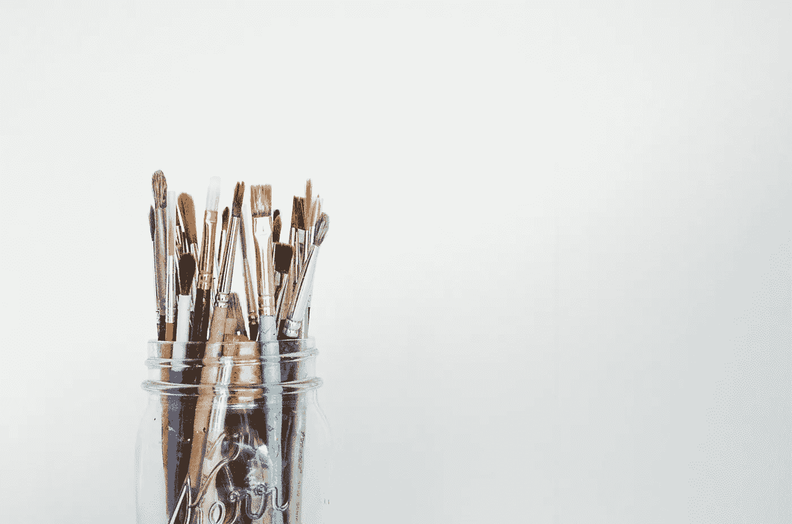

# 如何提高你在工程方面的创造力

> 原文：<https://betterprogramming.pub/how-to-increase-your-creativity-in-engineering-dff33594c3e4>

## 达到灵感新境界的 4 个步骤

照片由[王思然·哈德森](https://unsplash.com/@hudsoncrafted?utm_source=unsplash&utm_medium=referral&utm_content=creditCopyText)在 [Unsplash](https://unsplash.com/s/photos/paint-brushes?utm_source=unsplash&utm_medium=referral&utm_content=creditCopyText) 上拍摄

在许多职业中，追求创造力是一件很平常的事情。套路能让人越陷越深，每天看起来都是另一个样子。在这种情况下，很难保持创造力。仿佛一切都一模一样。当你的思维只有一种方式时，你怎么能发明东西呢？

构建软件是一个创造性的过程，尤其是当我们谈论创新的时候。令人欣慰的是，已经有各种提高创造力的技术。其中一些更通用，可以帮助任何人。而其他人只关注工程师。经常练习它们会帮助你产生和嵌入新的想法。

# 1.定期休息

多项研究证明，定期休息对人类健康有重大影响。在休息期间，大脑关闭并能够恢复。平均来说，人们可以保持注意力集中 90 分钟。这解释了为什么学校的讲座持续时间相同或更短。那么就需要恢复时间。即使是 15 分钟的休息也能创造奇迹。

作为软件开发人员，我们白天有不同的任务:从更新副本到建立新的架构。其中一些任务需要集中注意力。经过两个小时的工作，很难保持和开始时一样的表现。更容易被卡住。

每小时安排 10 分钟的常规休息时间。可以是在外面走一小段路，和你的同事喝杯咖啡，或者做一小段拉伸运动。你必须把你的大脑从分配的任务中“关掉”。没有人能一天八小时保持专注。那些有能力的人在撒谎。

# 2.学习全新的东西

不断参与同一项活动变得令人厌烦。我们写代码，我们讨论工作中的业务问题，我们讨论已解决的错误。它变得如此平常，以至于我们甚至可以在半夜被人叫醒。在这样的生活中，我们完全忘记了尝试新事物。因为我们知道一切是如何运作的，并且我们坚持提倡“*，我们总是这样做*

你还记得小时候第一次去游乐园有多少印象吗？你还记得你第一次骑自行车吗？那些情绪很难忘记。但是为什么会这样呢？

当我们尝试新事物时，它会激发我们的快乐。我们想探索它以及其他可用的选项。这就是如何提升我们创造力的答案。

你想过打高尔夫吗？直排轮滑呢？你好奇一级方程式引擎是如何工作的吗？你有没有尝试过用 Arduino 微控制器构建物联网设备？又或许你梦见了木雕？

保持开放，尝试尽可能多的新事物。大脑开始主动解决新的挑战。你的创造力只会随着每一项新知识和技能而增长。

# 3.找到志同道合的人

在理想的世界里，你的朋友已经是志同道合的人了。不幸的是，情况并非总是如此。然而，你可以和朋友一起度过美好时光，并保持渴望交流思想。

在现代科技世界里，根据你的兴趣找到合适的人更容易。例如，有了像[meetup.com](http://meetup.com)这样的服务，就有可能通过兴趣找到各种圈子。我参加了几次 Android 开发人员、微控制器爱好者和投资新手的定期聚会。每次我遇到有趣的人，交换想法，并参与到有趣的对话中。

我在那里得到的想法帮助我从不同的角度看待许多事情。例如，你可能认为你已经了解了关于区块链和加密货币的一切。一旦你遇到和你一样对这个话题充满热情的人，你会有新的发现。你的思维变得好奇，会产生你从未想过的想法。

# 4.艺术也有影响

软件工程师低估了艺术在他们生活中的力量。他们每天与数字和电脑打交道。他们的大脑专注于不同的方面，创造性的艺术可以很容易地被视为一件不必要的事情。但是艺术的作用已经被证明了。

> “你花在分析一件艺术品上的时间越多，你就越能刺激大脑无意识和有意识的功能。这样做可以提高你在日常生活中的分析和解决问题的能力。”
> ——[亚利桑那大学](https://www.uagc.edu/blog/how-looking-at-art-can-help-your-brain)的研究

观赏艺术和创作艺术会有不同的效果。然而这两者都会影响我们的创造力。观看某人的作品让我们有机会与作者产生共鸣，挖掘他们的思想。

当我们自己制作东西的时候可以释放日常压力。这有助于我们的大脑专注于创作新作品。大脑进入创造性模式，多巴胺水平上升。

这是前面提到的建议的结合:休息一下，尝试新事物。

# 结论

软件开发人员似乎不需要任何灵感。他们主要和机器一起工作。没有空间进行一些创造性的工作。而这是最大的错误。工程师和其他人一样，在日常工作中也需要灵感。上面的建议可以帮助你做到这一点。