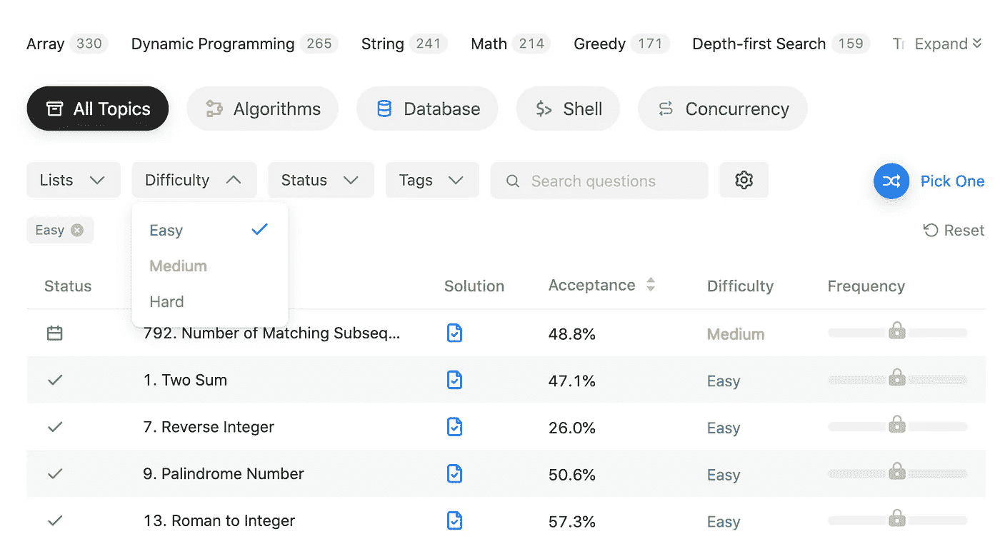

# 如何增加你在白板编码面试中的成功几率

> 原文：<https://betterprogramming.pub/how-to-increase-your-odds-of-success-at-whiteboard-coding-interviews-a9fe8c9329b8>

## 让你的白板编码过程更简单的 9 个技巧


照片由 [ThisisEngineering RAEng](https://unsplash.com/@thisisengineering?utm_source=medium&utm_medium=referral) 在 [Unsplash](https://unsplash.com?utm_source=medium&utm_medium=referral) 上拍摄。

软件工程职位的面试过程通常包括一轮 45 分钟的白板编码。在新冠肺炎疫情之前，如果你申请当地的公司，白板编码实际上是在白板前进行的。如今，编码面试通过交互式编码 web 应用程序进行，如 CoderPad。

即使你是一个中高级开发人员，编码面试总是一个巨大的挑战。它并不真正测试你处理框架和架构的日常工作，但是它测试你在数据结构和算法方面的基础知识。

如果你在编码面试中不能解决一个问题，可能有三个原因:

*   你不幸运。你没有得到一个你以前见过的问题。
*   你没有练习。在这种情况下，你甚至可以把一个简单的问题搞砸。
*   这个问题真的很难。即使再给你几个小时，你也解决不了。

要解决最后一点，你必须是一个出色的程序员，或者长期坚持训练。解决前两点要容易得多。

在这篇文章中，我将分享 9 个技巧来增加你在编码面试中解决问题的几率。这些建议不适合在谷歌、脸书或亚马逊这样的顶级科技公司面试。它们是给你更大成功机会的低层次公司。

# 1.准备至少两个星期

没有准备就投入战斗无异于自杀。不管你过去经历过多少次面试，如果你不每天使用或练习，你的基础就会变得生疏。

你需要一些时间让知识回到你大脑的顶端。根据你对学校和之前面试准备的记忆，你可能需要两周以上的时间来恢复记忆。你应该准备什么？您将在接下来的几节中找到答案。

# 2.查看 Glassdoor 最近的采访

在不了解公司的情况下参加面试比赌博更糟糕，因为你的机会低于 50%。了解一家公司面试问题的最好地方是 Glassdoor。

如果要找知名公司，应该能找到很多面试点评。你应该注意的是最近的面试问题。你很可能会得到完全相同的问题。

您还可以了解难度和常见的数据结构主题，以便可以更专注于这些主题。

# 3.首先申请不太受青睐的公司

不要第一次就申请你喜欢的公司。你不想错过和你梦想中的公司合作的机会。

自己练习和在真正的面试官面前练习是完全不同的。让自己习惯紧张。练习大声思考，同时编写代码。

先申请一两家公司作为热身。如果你得到了提议，你可以拒绝它。如果你失败了，你知道你需要更多的时间来练习真正的交易。

# 4.尝试不同的学习平台

LeetCode 是练习编码面试的最佳平台之一。有 1900 多个问题可供选择。即使没有高级订阅，您也可以在“讨论”选项卡下寻找解决方案。

高级订阅允许您访问带有详细解释的解决方案。你应该在积极找工作的时候订阅一两个月。成本并不重要，因为当你得到这份工作时，它是完全值得的。

您还应该探索其他平台，熟悉不同的 UI、问题陈述、输入约束等。LeetCode 上的问题陈述简洁明了，而其他平台上的问题陈述通常都有一个场景。如果你一眼就能完全掌握问题陈述，你会有更多的时间去思考解决方案。

我建议看一看 HackerRank、HackerEarth 和 CodeWars。如果你根据 Glassdoor 的评论知道公司将使用哪种编码工具，你也应该试着用它来练习。

# 5.只练习简单的问题



来源: [LeetCode](https://leetcode.com/problemset/all?difficulty=EASY)

LeetCode 上这么多问题，最好的办法是什么？答案是只练习简单的问题。为什么？让我们在这里做一些数学。

以我应聘高级或中级软件工程师职位的经验来看，大部分的编码面试问题都是从容易的级别开始的。我偶尔会收到一个中等程度的问题。我从来没有遇到过任何难题。让我们按照难度等级来分配问题出现的几率:

*   简单:80%
*   中等:19%
*   难度:1%

如果你把你的努力平均分配到所有的难度级别，你成功的机会是:

```
(80% x 33%) + (19% x 33%) + (1% x 33%) = 0.33
```

然而，如果你根据难度分配你的努力:

```
(80% x 80%) + (19% x 19%) + (1% x 1%) = 0.6762
```

如果你只关注简单的问题，你成功的机会就变成了:

```
(80% x 100%) + (19% x 0%) + (1% x 0%) = 0.8
```

这不是最精确的数学表示，但你应该明白了。

编码面试中最糟糕的事情是你甚至不能解决一个简单的问题，因为你花了太多时间练习中等或困难的问题。如果你花一个小时试图解决一个难题，你可以用同样的时间解决四个简单的问题。

你解决的问题越多，你在面试中被问到同样问题的几率就越高。即使你没有得到同样的问题，你仍然可以通过面试官的一些暗示来解决它。

# 6.只使用你最熟悉的语言

如果你一生都是 JavaScript 开发人员，不要试图通过选择 Java 进行编码面试来挑战自己或炫耀你在语言方面的多才多艺。

当场已经很难想出解决的办法了。不要花不必要的脑细胞去对抗一门你不熟悉的语言。

坚持使用你最熟悉的语言。你必须非常熟悉如何在不同的数据结构中使用这种语言。

准备好回答内置于语言中的便捷函数的时间和空间复杂性问题。比如`Array.prototype.sort()`和`String.prototype.replace(regex: Regex)`。根据[这篇博文](https://blog.shovonhasan.com/time-space-complexity-of-array-sort-in-v8/):

> “对于包含 **10 个或更少**个元素的数组，`.sort`的时间复杂度为 **O(n^2)** ，空间复杂度为 **O(1)** 。对于**较长的阵列**，时间复杂度为**θ(n log(n))**(平均情况)，空间复杂度为 **O(log(n))** 。

正则表达式的复杂性更难解释。据[本栈溢出回答](https://stackoverflow.com/questions/5892115/whats-the-time-complexity-of-average-regex-algorithms):

> “这是最流行的大纲之一:[正则表达式匹配可以简单快速](http://swtch.com/~rsc/regexp/regexp1.html)。对字符串运行 DFA 编译的正则表达式确实是 O(n)，但是可能需要高达 O(2^m)的构造时间/空间(其中 m =正则表达式大小)。”

# 7.主字符串和数组操作

最基本的编码问题是关于字符串和数组操作的。掌握你所使用语言的所有`String`和`Array`功能。学习最短的语法。你花在语法上的时间越少，你就有越多的时间用于解决方案的其他部分。你应该学会一些技巧和窍门。

例如，通过字符迭代字符串:

```
// Don't
const result = '';
for (const c of string) {
  const num = parseInt(c);
  if (num % 2 === 0) {
    result += num;
  }
}// Do
string.split('')
  .map(c => parseInt(c))
  .filter(i => i % 2 === 0)
  .join(''); 
```

删除重复项:

```
// Don't
const unique = [];
const s = new Set();array.forEach(a => {
  if (!s.has(a)) {
    unique.push(a);
    s.add(a);
  }
});// Do
const unique = Array.of(new Set(array)); 
```

# 8.练习你不熟悉的类别

一旦你熟悉了`String`和`Array`，不要一遍又一遍地解决同类型的问题。用类别来挑战自己，比如链表、双向链表、递归、树等等。这些都是非常热门的话题。

对于最近面试中很少出现的话题(像 Graph，Trie，或者动态编程)，完全不用费心。

# 9.回到传统的 for 循环和 while 循环

传统的`for`循环和`while`循环在算法题中经常使用，因为你可能需要嵌套循环或者指针。

因为您在日常工作中很少使用`for`循环和`while`循环，所以可能会在语法上出错。这些错误将导致运行时错误、数组索引越界、无限循环等。例如:

*   你可能会忘记一个`while`循环末尾的增量。
*   您使用`<=`符号来终止针对数组长度的`for`循环。

```
// Wrong
for (let i = 0; i <= arr.length; i++) { ... }
```

# 外卖食品


[马特·霍华德](https://unsplash.com/@thematthoward?utm_source=medium&utm_medium=referral)在 [Unsplash](https://unsplash.com?utm_source=medium&utm_medium=referral) 上拍照。

所有这些黑客都不能保证 100%成功，但它们会在一定程度上增加你的胜算。没有魔法。这都是关于实践和提高你的机会。

你申请的公司越多，你对编码面试就越得心应手，通过面试的几率就越高。

如果你有更多成功编写面试代码的技巧，请在下面的评论区分享。