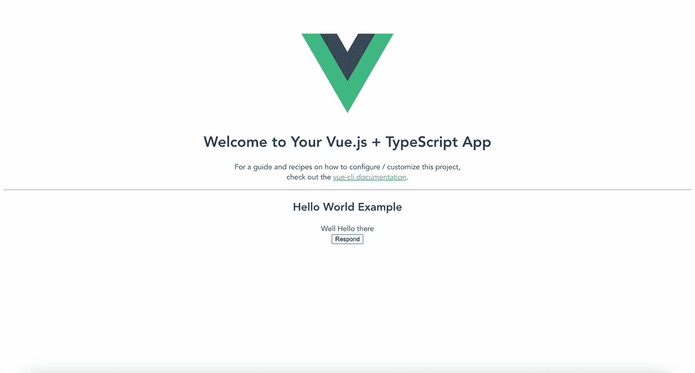
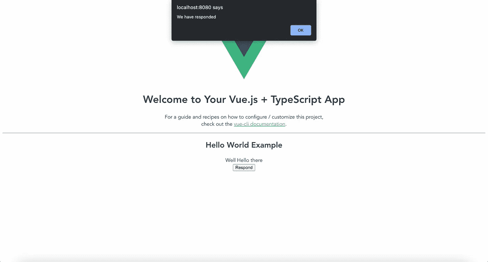

# 如何从 Vue.js 2 增量迁移到 React 18

> 原文：<https://betterprogramming.pub/how-to-incrementally-migrate-from-vue-js-2-to-react-18-part-1-setup-be2cd04458f0>

## 第 1 部分—设置


[来源](https://unsplash.com/photos/5fNmWej4tAA)

随着 [Vue.js 2](https://v2.vuejs.org/) 将于 2023 年底寿终正寝，我相信大多数使用 [Vue.js 2](https://v2.vuejs.org/) 的工程师/开发者正在寻找其他选项的迁移路径。显而易见的选择是升级到 [Vue.js 3](https://vuejs.org/) 然而，由于该框架尚未被社区广泛采用，一些主要的库，如 [Vue Apollo](https://v4.apollo.vuejs.org/) 已经在 Alpha 中使用了 3 年，还有一些库根本没有创建一个 [Vue.js 3](https://vuejs.org/) 兼容版本，所以您可能想要寻找一个使用更广泛的库；喜欢[反应](https://reactjs.org/)。

与所有迁移一样，它们可能是一项艰巨的任务，在我看来，开始迁移时有三个主要选项:

1.  创建一个全新的绿地应用程序，并将流量路由到相关的应用程序。
2.  使用微前端架构。使用像 Webpack 模块联合或 Web 组件这样的工具。
3.  通过在可能的情况下挂载 React，在现有应用程序中增量迁移组件。

我相信大多数工程师会转向绿地应用，但是当您需要确保新功能和错误修复继续推出时，有时间专门将现有和新功能迁移到绿地应用，同时维护现有应用可能会成为影响客户和产品团队最后期限的问题。选项 2 增加了迁移的复杂性，并且有与选项 1 相似的缺点。

考虑到这些，我将演示选项 3——通过在可能的地方挂载 React，在现有应用程序中增量地迁移组件。起初，这个想法听起来可能很糟糕，但是我相信，在本文结束时，您将会看到，这实际上是实现安全迁移的最低风险和最简单的选择，同时还能维护和添加新功能。

# 步骤 1:安装 React 并设置您的应用程序目录:

首先在应用程序目录中安装 React 和 React DOM

```
npm i react react-dom
```

在您的`src`目录中创建一个新文件夹。(我用`react-migration`)。然后运行`cd react-migration`和`npm init`来创建一个新的 package.json。最后，运行`npm i @types/react -D`来添加 React 类型模块。

接下来，我们需要在这个目录下添加一个`tsconfig.json`文件运行`npx tsc --init`。打开新创建的`tsconfig.json`文件:

```
// Change
"jsx": "preserve",
// to
"jsx": "react",
```

如果你正在使用纱线或 PNPM，然后相应地更新命令。

# 步骤 2:创建您的第一个 React 组件

对于本教程，我将创建一个超级基本的`HelloWorld.tsx`组件，它需要一些道具来演示`Vue`和`React`之间的通信。
组件设置如下:

```
import React from "react";type HelloWorldProps = {
 title: string;
 respondFunction: () => void;
};export function HelloWorld({ title, respondFunction }: HelloWorldProps) {
  return (
    <div>
      <h2>Hello World Example</h2>
       {title}
      <br />
      <button onClick={() => respondFunction()}>Respond</button>        
    </div>
  );
}
```

该组件需要两个必需的道具:`title`和`respondFunction`。这些都会从 Vue 传过来反应。

# 步骤 3:创建一个 Vue 组件来挂载 React

接下来，我们想要创建一个 Vue 组件，它将允许我们向它传递任意数量的道具，并且将 React 装载到应用程序中。

这里可以看到这个`ReactWrapper.vue`组件:

```
<template>
   <div ref="container" /> 
</template> <script> 
import { createElement } from "react"; 
import { createRoot } from "react-dom/client";  
export default {
   inheritAttrs: false,
   props: {
     component: {
       type: Function,
       required: true,
     },
   },
   data() {
     return {
       reactRoot: null,
     };
   },
   methods: {
     updateReactComponent() {
       this.reactRoot.render(createElement(this.component, this.$attrs));
     },
   },
   mounted() {
     this.reactRoot = createRoot(this.$refs.container);     
     this.updateReactComponent();
   },
   destroyed() {
     this.reactRoot.unmount();
   },
   watch: {
     $attrs: {
       deep: true,
       handler() {
         this.updateReactComponent();
       },
     },
   },
 };
 </script>
```

为了快速分析这里发生的事情，我们创建了一个 React 根，并将其分配给容器 ref。

我们已经设置了`inheritAttrs: false,`,这样属性就不只是放在容器 ref 上，然后我们在渲染组件时将`$attrs`作为道具传递。我们还观察`$attrs`并在它们改变时重新渲染组件。

最后，当组件为`destroyed`时，我们`unmount`确保我们清理了 React 应用程序。

# 第四步:添加带有`React`组件和所需道具的`ReactWrapper`组件。

我们可以全局注册这个组件，这样它就可以在整个 Vue 应用程序中使用，或者只是将它导入到我们想要安装它的组件中。

要在全球范围内安装，打开`main.ts`并添加:

```
import ReactWrapper from "@/components/ReactWrapper.vue";Vue.component("ReactWrapper", ReactWrapper);
```

要将其本地导入组件:

```
import ReactWrapper from "./ReactWrapper.vue"...components: {
   ReactWrapper,
},
```

接下来，我们想要导入`HelloWorld.tsx`组件，并通过在计算属性中返回它来将其公开给模板:

```
import { HelloWorld } from "../react-migration/src/components/HelloWorld";...computed: {
   HelloWorldComponent() {
     return HelloWorld;
   },   
},
```

最后，我们可以添加组件并得到结果文件:

```
<template>
   <div>
     <h1>{{ msg }}</h1>
     <p>
       For a guide and recipes on how to configure / customize this project,<br />
       check out the
       <a href="[https://cli.vuejs.org](https://cli.vuejs.org)" target="_blank" rel="noopener">vue-cli documentation</a>.
     </p>
     <hr />
      <div>
      ** <react-wrapper
         :component="HelloWorldComponent"
         title="Well Hello there"
         :respondFunction="respondFunction"
       />**
     </div>
   </div>
</template><script lang="ts">
 import Vue from "vue";
 **import { HelloWorld } from "../react-migration/src/components/HelloWorld";**
 export default Vue.extend({
   name: "HelloWorld",
   props: {
     msg: String,
   },
   computed: {
   **  HelloWorldComponent() {
       return HelloWorld;
     },**
   },
   methods: {
 **respondFunction() {
       alert("We have responded");
     },**
   },
 });
</script>
```

好吧，让我们启动应用程序看看我们有什么。在应用程序目录中运行:

```
npm run serve
```

并访问终端中提供的链接。您现在应该会看到:



我们可以看到组件的上半部分是标准入门`HelloWorld.vue`组件，在其中，我们可以看到我们的`React` `HelloWorld.tsx`组件加载，包括标题道具。让我们单击按钮，检查它是否触发了我们传递的 Vue 函数:



太好了，我们启动了 Vue 功能，打开了一个浏览器警告窗口。我们现在在 Vue 中运行 React 没有任何问题，这也允许我们使用 props 在两者之间进行通信。

# 双向通信

如上所述，当使用道具来激发事件时，两者之间的交流确实很容易，但是如果你的应用程序是大规模的，那么道具训练真的会成为你的一个大问题。这时，您将需要开始考虑利用浏览器事件来触发和侦听，或者设置一个全局状态。选择理想的全局状态可能很棘手，因为您需要它能够兼容 Vue 和 React。

我将在另一篇文章中讨论这个问题，以及如何让像 [Valtio](https://github.com/pmndrs/valtio) 这样的普通库与 Vue 2 一起工作。

# 问题

*   如果你正在使用`REST`，那么更新你的查询将会像从 React 而不是 Vue 中更新一样简单。如果你有一个你最喜欢的 HTTP 客户端的定制实例，比如 Axios ，那么最好在一个可以导入并在 React 和 Vue 中使用的文件中初始化 singleton。
*   **GraphQL** — 如果您正在使用 [Apollo](https://www.apollographql.com/) 您可能会发现您的 Vue 应用程序在一个旧版本的库上，您需要为 React 创建一个新的设置。我将在另一篇文章中讨论这个问题。

# 结论

我确信有些人在阅读这篇文章时会想:*“你确定吗？这可能是不必要的缓慢”。*但是，我想指出 React 建议这样开始:

> React 从一开始就被设计为逐步采用，你可以根据需要使用 React 的数量**。也许你只是想给现有的页面增加一些“互动元素”。React 组件是实现这一点的好方法。**
> 
> 大多数网站不是，也不需要成为单页应用。用**几行代码，没有构建工具**，在你网站的一小部分中尝试 React。然后，您可以逐渐扩展它的存在，或者保持它包含在几个动态小部件中。

**来源**:【https://reactjs.org/docs/add-react-to-a-website.html】T2

我还可以向您保证，我知道有公司在使用这种方法，生产版本仍然不到 1MB，客户在使用这种方法的领域没有看到任何性能下降！

我还想重申，这是一个迁移计划，目的是扼杀 Vue，直到我们剩下一个 React 应用程序。

就我个人而言，我认为这种迁移方法是最安全、最简单、最可维护的选择，因为您仍然在一个代码库中工作，并且一步一步地迁移，如果您决定替换整个页面或只是小组件，选项是您的，但这允许您开始。我还想指出的是，如果您正在开发一个大型应用程序，甚至是一个有大量技术债务的应用程序，那么花超过 15 个月的时间来迁移整个应用程序，同时交付特性工作并维护当前的应用程序可能是一个挑战。你需要从某个地方开始，为什么不从这里开始呢？

最后，我单独和 Vue 一起工作了几年，我确实喜欢 Composition API，但是缺乏吸收、第三方库和社区，你真的想冒险在 2 年后再做一次迁移吗？React 不会去任何地方，它有一个巨大的生态系统，任何 JavaScript 开发人员都会爱上它。

另外，如果这还不足以动摇你的话……在你的简历中反应出你的技能也是很棒的。

感谢您花时间阅读我的文章。我希望你已经发现它的知识性和趣味性。我将围绕 Typescript、Node、React、Vue、GraphQL、Performance、Go 等等写更多的文章。

## GitHub 知识库

[](https://github.com/nic-jennings/vue2-to-react) [## GitHub-NIC-Jennings/vue 2-to-react

### 此时您不能执行该操作。您已使用另一个标签页或窗口登录。您已在另一个选项卡中注销，或者…

github.com](https://github.com/nic-jennings/vue2-to-react)