# 如何在 Python Numpy 数组中索引数据

> 原文：<https://betterprogramming.pub/how-to-index-data-in-python-numpy-arrays-1274ce968390>

## 索引和切片


来自 [Pexels](https://www.pexels.com/photo/brown-numbers-cutout-decors-1329295/?utm_content=attributionCopyText&utm_medium=referral&utm_source=pexels) 的[玛格达·埃勒斯](https://www.pexels.com/@magda-ehlers-pexels?utm_content=attributionCopyText&utm_medium=referral&utm_source=pexels)的照片

# 基本索引

可以进行基本的索引来访问`NumPy`数组中的特定元素。

## 1.一维数组

*   **创建一维数组**

```
import numpy as np
one_d=np.array([10,20,30,40])
print (one_d)
#Output:array([10, 20, 30, 40])
```

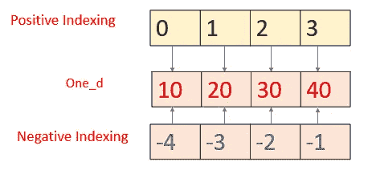

作者图片

*   **通过正索引从数组中访问元素**

在 Python 中，所有索引都是从零开始的。索引 0 表示数组中的第一个元素。

`one_d[2]` → 30

*   **通过负索引从数组中访问元素**

负索引从数组的末尾开始。`-1`代表最后一个元素。

`one_d[-1]` → 40

## 2.二维数组

*   **创建二维数组**

```
two_d=np.array([[0,1],[2,3],[4,5]])
print (two_d)
*#Output:* [[0 1]
 [2 3]
 [4 5]]
```

*   **访问二维数组中的特定元素**

```
x[i,j]
or 
x[(i,j)]
```

i → row_index(从 0 开始)
j → column_index(从 0 开始)

```
print (two_d[(1,2)])
*#Output: 5* print (two_d[1,2])
*#Output: 5*
```

*   **访问二维数组中的特定行**

如果我们提供单个索引，它将被作为 row_index

`x[i]`

i →行索引

```
print (two_d[(1)])
*#Output:[3 4 5]*
```

*   **访问二维数组中的特定列**

`x[:,j]`

:→ **i (row_index)** ，取所有值( **:** 是一个完整的切片，从开始到结束)
j → column_index

```
print (two_d[:,1])
*#Output:[1 4 7]*
```

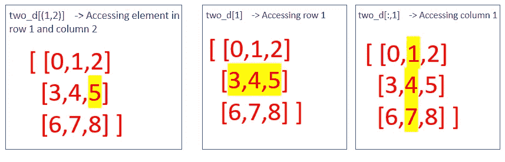

作者图片

## 3.三维阵列

*   **创建三维数组**

```
three_d=np.array([[[0,1],[2,3]],[[4,5],[6,7]]])
print (three_d)
*#Output:* [[[0 1]
  [2 3]]

 [[4 5]
  [6 7]]]
```

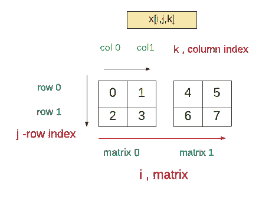

作者图片

*   **访问三维数组中的特定元素**

```
print (three_d[1,0,1])
*#Output: 5* print (three_d[(1,0,1)])
*#Output: 5* print (three_d[(-1,-1,-1)])
*#Output: 7*
```

*   **使用负索引从三维数组中访问特定元素**

```
print (three_d[(-1,-1,-1)])
*#Output: 7*
```

*   **访问三维数组中的特定矩阵(或二维数组)**

x[1] →选择第一个矩阵。

如果我们只指定第一个索引，它将选择特定的矩阵。

```
print (three_d[(1)])
*#Output:* [[4 5]
 [6 7]]
```

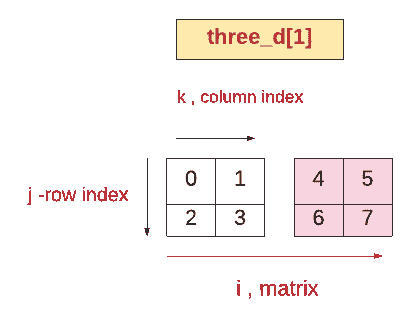

作者图片

*   **访问特定矩阵中的特定行**

`x[i,j]` →如果我们仅指定 I 和 j 值，它将从矩阵(I)中选择行(j)

```
print (three_d[(1,0)])
*#Output:* [4 5]
```

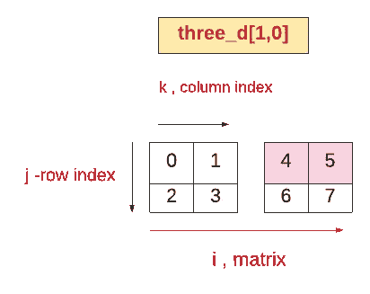

作者图片

*   **访问特定矩阵中的特定列**

`x[i,:,k]` →从**矩阵 i** 中选择**k 列**。

**j** 给定为 `:`表示全切片。[所有行]

```
print (three_d[1,:,1])
*#Output:* [5 7]
```

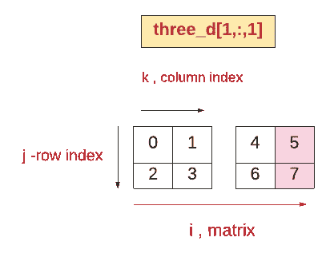

作者图片

*   **从每个矩阵中访问相同位置的元素。**

`x[:,j,k]` →选择所有矩阵中**行 j** 和**列 k** 的元素。
**i** 给定为 `:`，表示全切片。[所有矩阵]

```
print (three_d[:,1,1])
*#Output:[3 7]*
```

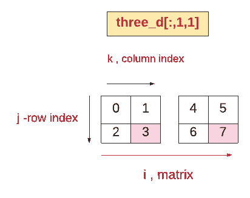

作者图片

## 索引错误

试图使用过大的索引将导致 IndexError。

**例 1:一维数组**

```
print (one_d[5])
*#Output:IndexError: index 5 is out of bounds for axis 0 with size 4*
```

# 基本切片

基本切片将 Python 的切片基本概念扩展到 N 维。

## **1。切片一维数组**

在切片中，我们可以指定一个索引范围

`s[i:j:k] — slice of *s* from *i* to *j* with step *k*`

I→开始索引
j →停止索引
k →步进(k 不应为 0)

```
slice1=one_d[0:3:2]
print (slice1)
#Output: [10, 30]
```

它将在步骤 2 中从第 0 个索引到第 3 个索引(不包括)对元素进行切片。

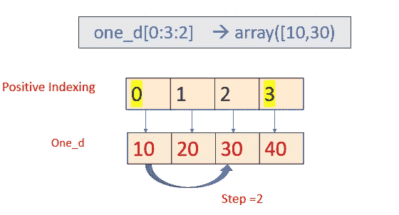

作者图片

基本切片的返回类型将是`ndarray`

```
print (type(slice1))
*#Output:numpy.ndarray*
```

基本切片生成的所有数组总是原始数组的“视图”。
**视图:**不拥有自己数据的数组，而是引用另一个数组的数据。

所以如果我们修改原来的数组，视图也会被修改。同样，如果我们修改视图，原来的数组也修改了。

**例 1:修改 slice1 也会修改原数组** `**one_d**`

```
slice1[0]=99999
*#Modifying slice1 will modify the original array also.* print (slice1)
*#Output:[99999,    30]* print(one_d)
*#Output:[99999,    20,    30,    40]*
```

**例 2:修改原数组也会修改基本切片生成的数组**

```
one_d[0]=77777
print (one_d)
*#Output:[77777    20    30    40]* print (slice1)
*#Output: [77777    30]*
```

**注意:** `NumPy`切片创建的是一个视图，而不是像字符串、元组、列表等内置 Python 序列那样的副本。从一个大数组中提取一小部分时必须小心，因为提取的小部分包含对更大的原始数组的引用，直到从该数组派生的所有数组都被垃圾收集，该数组的内存才会被释放。在这种情况下，建议使用明确的`copy()`。- [Python 文档](https://numpy.org/doc/stable/reference/arrays.indexing.html)

**例 3:省略 start 和 stop 索引默认为数组的第一个索引和最后一个索引。负步长表示相反的方向。**

```
print (one_d[::-2])
*#Output:* array([40, 20])
```

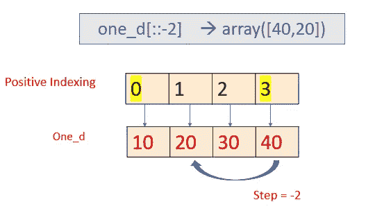

作者图片

## 2.切片二维数组

通过在两个轴上切割二维数组，我们可以得到原始数组的子集。

`x[i:j:k,l:m:n]`

i:j:k →沿 x 轴切片(行)
l:m:n →沿 y 轴切片(列)

**例 1:** `two_d[1:,1:]`→选择第 1 行到最后一行，第 1 列到最后一列的元素。

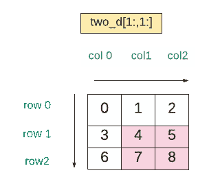

作者图片

```
print (two_d[1:,1:])
*#Output:* [[4 5]
 [7 8]]
```

**例 2:** `two_d[0:2,1:]` →从第 0 行到第 2 行(排除)和第 1 列选择元素，直到最后一列。

0:2→x 轴切片→选择第 0 行到第 2 行(不包括)
1:→y 轴切片→选择第 1 列到最后一列

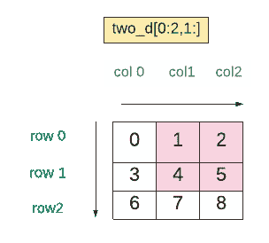

作者图片

```
print (two_d[0:2,1:])
*#Output:* [[1 2]
 [4 5]]
```

**例三:** `**two_d[1:,::2]**`

`1:`→选择第 1 行到最后一行
`::2` →通过步骤 2 从第 1 列到最后一列选择列

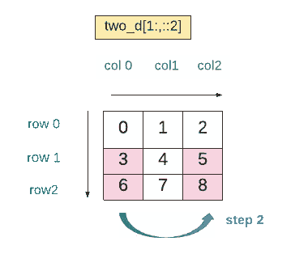

作者图片

```
print (two_d[1:,::2])
*#Output:* [[3 5]
 [6 8]]
```

## 3.切片三维阵列

通过沿三个轴切割三维数组，我们可以选择原始数组的子集

`x[a:b:c,i:j:k,l:m:n]`

a:b:c→切片平面
i:j:k →切片行
l:m:n →切片列

**例 1:** `three_d[:,:,1:]`
: →选择所有平面
: →选择所有行
1: →从第 1 列到最后一列选择列

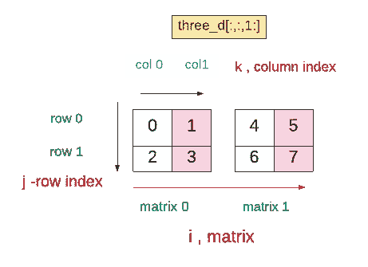

作者图片

```
print (three_d[:,:,1:])
*#Output:* [[[1]
  [3]]

 [[5]
  [7]]]
```

## 超出范围的索引

超出范围的索引可以通过切片得到很好的处理。

```
print (three_d[2:,:,:])
*#Output: []*
```

# 高级索引

## 整数数组索引

整数数组索引允许根据它们的 *N* 维索引选择数组中的任意项。每个整数数组代表该维度的多个索引- [Python docs](https://numpy.org/doc/stable/reference/arrays.indexing.html)

**例 1:二维数组**

`two_d[[0,1,2],[0,1,2]]`

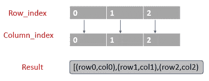

作者图片

对于每一行，选择一个特定的元素。
row_index → [0，1，2] → row index 指定要选择的行
column_index →[0，1，2] → column index 指定要为相应行选择的元素

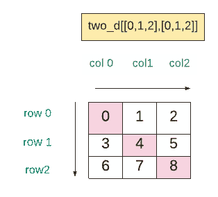

作者图片

```
print (two_d[[0,1,2],[0,1,2]])
*#Output:[0 4 8]*
```

**例 2:三维数组**

`three_d[[0,1],[0,1],[0,1]]`
结果将是它将从(平面 0，行 0，列 0)和(平面 1，行 1，列 1)中选择元素。

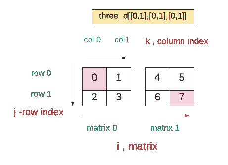

作者图片

```
print (three_d[[0,1],[0,1],[0,1]])
*#Output:[0 4 8]*
```

# Git Hub 链接

这里使用的代码可以从 G [it Hub](https://github.com/IndhumathyChelliah/numpy/blob/master/indexing_slicing/indexing_slicing.ipynb) 上的 Jupyter 笔记本中获得

# 结论

*   在基本索引中，超出范围的索引将产生一个**索引错误**
*   在基本切片中，超出范围的索引被优雅地处理。
*   基本切片生成的所有数组都是原始数组的**视图**。
*   在基本索引中， **x[i，j，k]** 等价于 **x[(i，j，k)]**
*   在基本切片中，我们不应该使用切片对象的元组。
    a[1:，1:] →右
    a[(1:，1:)] →错
*   **全切片**将基于提到的轴选择整个平面/行/列。
    a[:] →它将选择一维数组
    a[1，:]中的**所有行**→它将选择二维数组
    a[:，1，1]中的**所有列**→它将选择三维数组**中的**所有平面**中的【1】行和【1】列**
*   对于尾部索引，省略的索引表示一个完整的切片
    a[1]与二维数组中的 a[1，:]相同
    a[1，1]与三维数组中的 a[1，1，:]相同

# 资源(Python 文档)

[分度和切片](https://numpy.org/doc/stable/reference/arrays.indexing.html)

[查看](https://numpy.org/doc/stable/glossary.html#term-view)

*请关注此空间，获取更多关于 Python 和数据科学的文章。如果你喜欢多看我的教程，就关注我的* [***中***](https://medium.com/@IndhumathyChelliah)[***LinkedIn***](https://www.linkedin.com/in/indhumathy-chelliah/)*[***推特***](https://twitter.com/IndhuChelliah) ***。****

*感谢阅读！*