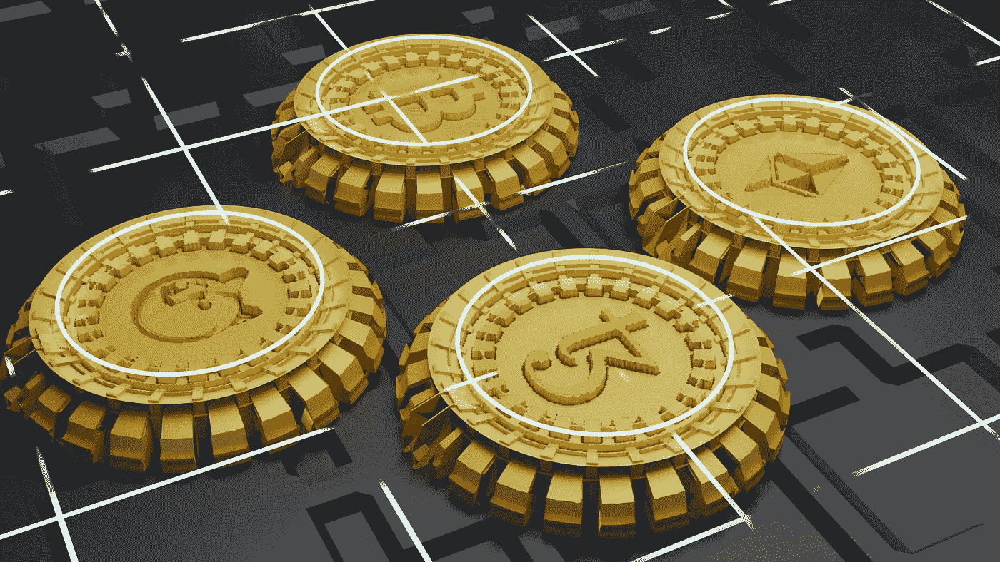

# 如何使用 Anchor 框架初始化 Mint 帐户和 Mint 令牌

> 原文：<https://betterprogramming.pub/how-to-initialize-mint-accounts-and-mint-tokens-using-the-anchor-framework-c989d1ba4f97>

## 该程序实验的简要指南

[shehan levusara](https://unsplash.com/@imagix_eye_studio_13?utm_source=medium&utm_medium=referral) 在 [Unsplash](https://unsplash.com?utm_source=medium&utm_medium=referral) 上拍照

本文将向您展示如何在 Anchor 中使用 derive 宏来初始化 Solana 网络中的 mint 帐户和 mint 令牌。

SOL(SOL)是 sola 网络的本地令牌。但是，如果您需要在 Solana 网络上创建另一个令牌，它会为您提供所需的所有资源。用于编写智能合同(程序)的 anchor 框架使用 derive 宏简化了这一过程。

照片由 [Shubham Dhage](https://unsplash.com/@theshubhamdhage?utm_source=unsplash&utm_medium=referral&utm_content=creditCopyText) 在 [Unsplash](https://unsplash.com/s/photos/tokens?utm_source=unsplash&utm_medium=referral&utm_content=creditCopyText) 上拍摄

派生宏是锚定框架的一个特殊特性，用于简化结构的序列化/反序列化。根据此处找到的[官方文档，派生宏可以通过使用属性和指令提供进一步的功能。](https://docs.rs/anchor-lang/latest/anchor_lang/derive.Accounts.html)

在本文中，让我们来看看 Anchor 框架是如何使初始化 mint 帐户和向特定的关联令牌帐户(ATA)创建令牌的过程变得非常简单的。

# 第一步。先决条件

VS 代码—代码编辑器
锚版本— 0.24.2

之前对锚框架的了解

# 第二步。初始化薄荷账户

这是初始化新的 mint 帐户的 rust 代码:

让我们看看这段代码是如何工作的。结构`InitializeMint`是传递给函数`initailize_mint`的内容。第 17 到 24 行的代码用一个给定的地址初始化一个 mint 帐户。当初始化一个新账户时，我们可以使用字段`payer`指定谁将为该交易付款。除此之外，还可以指定`authority`和`freeze_authority`。

这里我们对所有三个字段都使用了`payer`。但是如果你想用另一个地址作为`authority`或`freeze_authority`，我们非常欢迎你这样做。第 26 行中的`payer`被定义为签名者账户。这是因为在第 19 行，我已经命名了`payer = payer`，付款人必须在交易上签字。

这里提到的`authority`帐号在创建后将被授权铸造和焚烧代币。`freeze_authority`将是可以随时冻结 mint 账户功能的账户。为了完成该事务，需要将一些助手帐户传递给该结构。他们是`system_program,token_program`和`rent.`

让我们看看如何从 JS 端测试这段代码:

这里需要注意的重要一点是，分别作为`payer`和`mint`的`fromwallet`和`mint`都必须签署交易。`fromwallet`必须签名，因为它为交易付款，而`mint`必须签名，以确认我们为初始化 mint 帐户而提供的帐户私钥归我们所有。

# 第三步。向 ATA 铸造代币

这是为 ATA 创建令牌的 rust 代码:

`MintToken`是传递给函数`mint_token`的结构，用于将令牌转换为指定的 ATA。在这个结构中，您需要在字段`mint`中指定造币厂的地址。`token_program`是需要指定的帮助者账户。`token_account`是您将向其中铸造令牌的 ATA。

`authority`字段需要包含初始化薄荷账户时设置的薄荷账户的权限。`token_account`和`mint`被设置为可变的(`#[account(mut)]`)，因为在交易发生后，账户的余额将被改变。

如果你看一下`mint_token`函数，很明显在这个函数调用中发生了跨程序调用(CPI)。这个程序在第 18 行调用了`token_program`帐户。`token_program`是索拉纳所有令牌的管理机构。

因此，Solana 上的任何铸造、燃烧或任何相关令牌都应该通过调用`token_program`函数来执行。

现在，让我们看看铸造令牌的 JS 代码:

需要注意的是，应该给字段`tokeAccount`一个 ATA 作为输入。因此，在第 8 行，我们已经为特定的`mint`导出了`fromWallet`的相关令牌帐户。

这样，您可以从您的 mint 帐户向您的目标 ATA 铸造任意数量的令牌。

感谢阅读！

在这篇教程之后，我将会写另一篇关于如何在 Solana 中烧令牌以及如何用 Anchor 框架来完成的教程。

干杯！

# **资源**

1.  锚郎文档—[https://docs.rs/anchor-lang/latest/anchor_lang/derive.Accounts.html](https://docs.rs/anchor-lang/latest/anchor_lang/derive.Accounts.html)