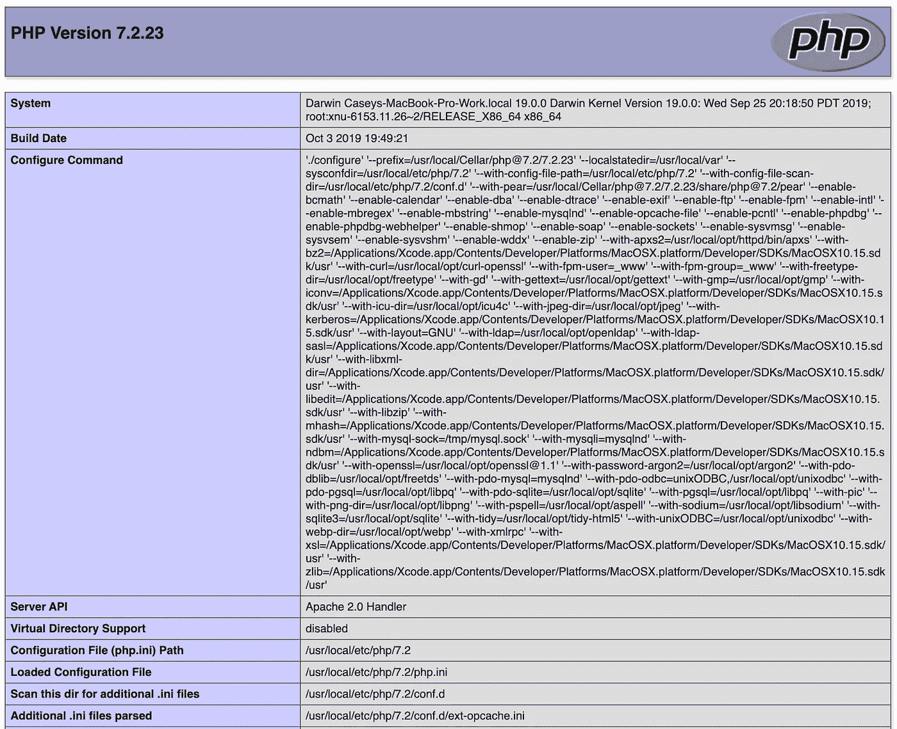

# 如何使用自制软件和 PECL 在 macOS 10.15 Catalina 上安装 PHP 7.2

> 原文：<https://betterprogramming.pub/how-to-install-a-php-7-2-on-macos-10-15-catalina-using-homebrew-and-pecl-ad5b6c9ffb17>

## 更新的两部分系列的第 2 部分，在 macOS Catalina 上设置 Apache/PHP 开发环境


图片来源:凯西·麦克马伦

这篇文章是为那些希望在 Mac 上安装 Apache 和 PHP 作为开发环境的一部分的 web 开发人员准备的。

请务必查看第一部分，[如何使用自制软件](https://medium.com/@crmcmullen/how-to-install-apache-on-macos-10-15-catalina-using-homebrew-78373ad962eb)在 macOS 10.15 Catalina 上安装 Apache，这是本文的先决条件。

过去，我习惯于依赖预装在 MacBook Pro 操作系统中的 Apache 和 PHP 版本。然后我会安装我需要的 PHP 扩展(Xdebug、Redis 等。)来自家酿。

截至 2018 年 4 月 1 日，Homebrew 弃用了 Homebrew/php tap，转而支持新的 Homebrew/core 方法。此外，尽管一些关键的扩展仍然受到支持(例如 MySQLi)，但大多数 PHP 扩展根本不再通过 Homebrew 发布(`php72-xdebug`、`php72-redis`等)。)并要求通过 PECL (PHP 扩展社区库)安装。

随着 macOS 中不断变化的安全规则，以及使用 macOS 预装 PHP 版本和 PECL 的复杂性，我决定改变我的整个方法，而使用完全来自家酿的设置。这种新方法允许更简单的安装，更灵活的版本控制，并将继续在所有 macOS 版本上工作。

这些说明适用于 macOS 的早期版本。此外，您不必从全新的操作系统安装开始使用这一部分，但这些说明从一开始就假设您没有安装任何东西，因为这是最简单的方法。

让我们开始吧。

# 步伐

## 安装自制软件

如果您还没有这样做，那么您需要:

注意:下面的命令是一个单行，由于页面宽度限制，在 Medium 中已经换行。确保复制整行。

```
ruby -e "$(curl -fsSL https://raw.githubusercontent.com/Homebrew/install/master/install)"
```

## 创建 PHP 日志文件目录

PHP 预配置了自己的日志目录，但我们将创建自己的`/usr/local/log/` 文件夹，这样当我们需要时就可以很容易地找到它们。按照以下步骤创建适当的目录并设置它们的权限。忽略您可能收到的任何已经存在的*消息。*

```
sudo mkdir /usr/local/logsudo mkdir /usr/local/log/phpsudo chgrp -R staff /usr/local/log/phpsudo chmod -R ug+w /usr/local/log/php/
```

## 安装和配置 PHP

直到 2018 年 3 月底，所有 PHP 相关的 brews 都是由 Homebrew/php tap 处理的，但这已经被弃用了。所以现在我们使用自制/核心包中的可用内容。这应该得到更好的维护，但它是一个不太完整的包集。

```
brew install php@7.2
```

需要注意的是，要安装其他版本的 PHP，只需更改版本号即可(如 php@7.1)。您还可以同时安装多个版本的 PHP，并在它们之间切换。然而，本文档是专门为安装和配置 PHP 7.2 而设计的。

您的新`php.ini`文件位于以下目录:

```
/usr/local/etc/php/7.2/php.ini
```

## 启用必要的 Apache 模块

现在我们需要配置 Apache 来使用新安装的 PHP 模块。为此，我们需要编辑我们在本系列第一部分中安装的`httpd.conf`文件:

```
open -e /usr/local/etc/httpd/httpd.conf
```

滚动到`LoadModule`条目的底部，在`mod_rewrite`模块行后添加以下行:

注意:下面的命令是一个单行，由于页面宽度限制，在 Medium 中已经换行。确保复制整行。

```
**LoadModule** php7_module /usr/local/opt/php@7.2/lib/httpd/modules/libphp7.so
```

## 设置目录索引和文件处理程序

您还需要显式地设置 PHP 的目录索引，因此搜索以下文本块:

```
<IfModule dir_module>
    DirectoryIndex index.html
</IfModule>
```

…然后选择并替换为以下几行:

```
<IfModule dir_module>
    DirectoryIndex index.php index.html
</IfModule>
<FilesMatch \.php$>
    SetHandler application/x-httpd-php
</FilesMatch>
```

保存并退出文本编辑器。

要启动 PHP 服务并确保它在重启时启动，请在终端中输入以下命令:

```
brew services start php@7.2
```

## 验证 PHP 安装

要测试 PHP 是否如预期的那样安装和运行，在本系列第一部分创建的站点文件夹中创建一个名为`index.php`的文件:

```
echo "<?php phpinfo();" > ~/Sites/index.php
```

重新启动 Apache:

```
sudo apachectl -k restart
```

现在在您的浏览器上进行一次硬刷新(或者关闭并退出您的浏览器，然后再次启动它)。然后浏览到您的本地主机，您应该会看到一个类似下面的 PHP 信息页面:



如果你看到一个类似的 PHP 信息页面，那么恭喜你！现在，Apache 和 PHP 已经成功运行。

如果你有一个问题，PHP 没有正确加载，可能是你的浏览器会话阻止了它的刷新。尝试关闭并完全退出浏览器。再次运行 Apache reset，打开浏览器并尝试导航到您的本地主机。应该能行。

## 安装 PECL 扩展

截至 2018 年 3 月，Homebrew 不再分发大多数 PHP 扩展，它们必须使用 PECL 安装。这包括 Xdebug、igbinary 和 Redis 扩展。

好消息是，PECL 包含在您的 PHP 安装中，您需要做的就是将它的 bin 位置添加到您的系统路径中，使它从您的命令行开始工作。

注意:在运行下面的命令之前，明智的做法是将 cd 放入您的`/usr/local/Cellar/php@7.2/`文件夹，并验证命令中列出的版本号(例如*7 . 2 . 23*)；它可能是不同的东西。

```
export PATH=$PATH:/usr/local/Cellar/php@7.2/7.2.23/bin/
```

这将把您的 PHP 目录添加到您的系统路径中，并重启 bash。你应该可以走了！

打开终端并输入下面的命令。您应该看到一个选项列表，而不是*命令未找到*。如果你看到一个选项列表，你就可以开始了。

```
pecl
```

这将在您的`php.ini`文件的顶部添加一行，我们将在安装完剩余的扩展后修复它。

## 安装 Xdebug

这将安装 Xdebug v2.7.2，这是当前支持 PHP 7.2 的稳定版本(截至本文撰写之时)。

Xdebu g 还有其他版本，只要代入你想要的版本号就可以了。

```
pecl install xdebug-2.7.2
```

## 安装 igbinary

这将安装 igbinary v3.0.1，这是当前的稳定版本(截至本文撰写时)，支持 PHP 7.2。

还有[其他版本的 igbinary](https://pecl.php.net/package/igbinary) 。只需替换你想要的版本号。

注意:在安装 Redis 之前，必须安装 igbinary 扩展。

```
pecl install igbinary-3.0.1
```

这将在您的`php.ini`文件的顶部添加一行，我们将在安装 Redis 及其扩展后修复这一行。

## 安装 Redis

首先，为我们的开发环境安装 Redis 服务器组件。

```
brew install redis
```

一旦完成，启动 Redis 并将其设置为重启时重启。

```
brew services start redis
```

## 安装 Redis PHP 扩展

这将安装 Redis v5.0.2，这是当前的稳定版本(截至本文撰写时)，支持 PHP 7.2。

还有[其他版本的 Redis](https://pecl.php.net/package/redis) 。只需替换你想要的版本号。

注意:在安装 Redis 之前，必须安装 igbinary 扩展。

```
pecl install redis-5.0.2
```

在安装过程中，您会被询问一些问题。回答如下:

*   启用 igbinary 序列化程序支持吗？[否]:是
*   启用 lzf 压缩支持？[否]:否

## 编辑 PHP 配置设置

现在我们已经安装了所有必要的扩展，我们可以为我们的开发环境在`php.ini`文件中添加一些最终条目。

```
open -e /usr/local/etc/php/7.2/php.ini
```

找到并删除在前面步骤中添加到`php.ini`文件顶部的这三行。我们稍后会重新添加它们:

```
extension="redis.so"

extension="igbinary.so"

zend_extension="xdebug.so"
```

滚动到`php.ini`文件的底部，粘贴以下几行:

保存并退出文本编辑器。

重新启动 Apache:

```
sudo apachectl -k restart
```

打开浏览器，导航到您的 [http://localhost](http://localhost/) 。你应该看到你的 PHP 信息页面。向下滚动，您应该看到为 igbinary、Redis 和 Xdebug 显示的所有必要的 PHP 扩展信息，以及您在前面步骤中安装的正确版本号。

恭喜你！现在，Apache 和 PHP 以及相关的扩展已经在您的 Mac 开发环境中运行了。