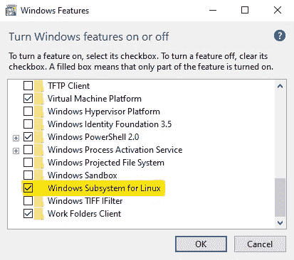

# 如何在 Windows 上不用 Docker 桌面安装 Docker

> 原文：<https://betterprogramming.pub/how-to-install-docker-without-docker-desktop-on-windows-a2bbb65638a1>

## 此外，学习如何使用 Portainer 作为替代 Docker GUI


照片由[阿莱西娅·卡赞特切娃](https://unsplash.com/@alesiaskaz?utm_source=unsplash&utm_medium=referral&utm_content=creditCopyText)在 [Unsplash](https://unsplash.com/s/photos/developer?utm_source=unsplash&utm_medium=referral&utm_content=creditCopyText) 拍摄

作为一个因为很多原因从 Linux 转到 Windows 的开发人员，我已经使用 Docker 桌面几个月了，因为它会自动更新我的 Docker 环境。

不幸的是，这是不可能的了，我不得不删除 Docker 桌面。

幸运的是，除了更新 Docker 引擎之外，我没有使用 Docker Desktop 执行任何命令或功能，因此这一变化不会影响我的工作流程。

# 没有 Docker 桌面为什么要安装 Docker？

Docker 更新了其 [Docker 桌面许可协议](https://docs.docker.com/subscription/#docker-desktop-license-agreement)，允许在大型组织中专业使用 Docker 桌面，而无需订阅 Docker。这意味着，如果你的公司有 250 多名员工或超过 1000 万美元的年收入，你将无法使用 Docker 桌面没有付费订阅。对于小公司、私人使用、开源项目和教育目的，它仍然是免费的。

此许可证更新仅与 Docker 桌面相关，与 Docker 或 Docker 引擎无关。这使得您仍然可以将 Docker 用于开发和所有类型的环境，包括生产环境。通常，如果使用 Docker，此许可证更新不会影响您公司的业务。

# 先决条件

要遵循此操作方法，您需要有一个兼容 WSL2 的工作站，如 Windows 10 version 2004 或更高版本。要检查安装的版本，请按`Windows logo key + R`并按 Enter 显示您的系统设置。如果您不符合要求，请更新您的窗口。

如果安装了 Docker Desktop，您必须卸载它

在 Windows 中，必须启用 Linux 子系统。这可以通过按下 **Windows 日志键**，键入“打开和关闭 Windows 功能”并打开它来完成。


作者拍摄的 Windows 开始菜单截图

滚动到底部，如果该功能被禁用，则将其激活。



作者拍摄的 Windows 功能菜单截图

激活后，按“确定”并重启计算机。

您还可以使用 PowerShell 命令安装 Linux 子系统:

```
Enable-WindowsOptionalFeature -Online -FeatureName Microsoft-Windows-Subsystem-Linux
```

# 在 WSL2 上安装 Ubuntu

设置好先决条件后，您必须使用管理权限打开 PowerShell，并使用以下命令在 WSL2 中安装 Ubuntu:

```
wsl --set-default-version 2
wsl --install -d Ubuntu
```

*您也可以在此步骤中安装不同的 Linux 子模块。*

安装完成后，你应该检查 Ubuntu 是否安装在正确的版本中:

```
wsl -l -v
```

如果一切正常，你应该看到你安装的 Ubuntu 和相应的 WSL 版本。如果版本不正确，您可以使用以下命令进行更改:

```
wsl --set-version Ubuntu-YY.MM 2
```

YY。MM 是你最近安装的 Ubuntu 版本的版本。

# 安装 Docker

要在 Windows 上的 Ubuntu 子模块中安装 Docker，您可以按照官方步骤在 Ubuntu 上安装 Docker:

*   [https://docs.docker.com/engine/install/ubuntu/](https://docs.docker.com/engine/install/ubuntu/)

另一种方法是创建一个新文件，并将下面的脚本复制到其中。这些命令只是从官方教程复制到一个文件中，以便与其他开发人员共享

切换到 PowerShell 中的 Ubuntu 子模块，执行文件来安装 Docker 和所需的依赖项。

现在，您可以使用以下命令启动并检查一切是否正常运行:

```
sudo service docker start   # start the engine
sudo service docker status  # print some nice status information
docker run hello-world      # run a test docker container
```

最后一个命令完成后，您应该会看到运行 Docker 的图像输出:

# Ubuntu WSL2 发行版的常见问题

如果你安装 Ubuntu 作为你的 WSL2 发行版，并且使用至少一个基于 Ubuntu Hirsute Hippo (21.04)的发行版，你的 docker 守护进程可能无法正确启动。

当试图运行`dockerd`时，会产生以下错误日志:

```
...
INFO[2021-09-25T15:06:20.839195000+08:00] Loading containers: start.
INFO[2021-09-25T15:06:20.885624800+08:00] stopping event stream following graceful shutdown  error="<nil>" module=libcontainerd namespace=moby
INFO[2021-09-25T15:06:20.885865900+08:00] stopping healthcheck following graceful shutdown  module=libcontainerd
INFO[2021-09-25T15:06:20.886012400+08:00] stopping event stream following graceful shutdown  error="context canceled" module=libcontainerd namespace=plugins.moby
failed to start daemon: Error initializing network controller: error obtaining controller instance: unable to add return rule in DOCKER-ISOLATION-STAGE-1 chain:  (iptables failed: iptables --wait -A DOCKER-ISOLATION-STAGE-1 -j RETURN: iptables v1.8.7 (nf_tables):  RULE_APPEND failed (No such file or directory): rule in chain DOCKER-ISOLATION-STAGE-1
 (exit status 4))
```

我注意到 docker 正在使用的`iptables`是一个`nftables`版本。这导致了一个错误，因为从 20.10 版本开始，Ubuntu 将防火墙系统切换到了`nftables`(你可以[在这个网站](https://net2.com/ubuntu-20-10-comes-with-nftables-as-firewall/)上读到它)。不幸的是，使用`nftables`本身需要 Linux 内核 5.8，但是 WSL 的最新内核版本是 5.4。

幸运的是，Ubuntu 仍然有可能使用传统版本的`iptables`，只需执行:

```
$ sudo update-alternatives --config iptablesThere are 2 choices for the alternative iptables (providing /usr/sbin/iptables).Selection    Path                       Priority   Status
------------------------------------------------------------
* 0            /usr/sbin/iptables-nft      20        auto mode
  1            /usr/sbin/iptables-legacy   10        manual mode
  2            /usr/sbin/iptables-nft      20        manual modePress <enter> to keep the current choice[*], or type selection number: 1
update-alternatives: using /usr/sbin/iptables-legacy to provide /usr/sbin/iptables (iptables) in manual mode
```

更新完`iptables`后，只需重启 Docker 守护进程，你会注意到 Docker 开始正常工作。

# 安装 Docker 撰写

安装 Docker Compose 可以在 Ubuntu 子模块中完成。打开 PowerShell 窗口，切换到 Ubuntu 子模块。然后从 GitHub 下载最新版本:

```
$ sudo curl -L https://github.com/docker/compose/releases/download/2.4.1/docker-compose-`uname -s`-`uname -m` -o /usr/local/bin/docker-compose
```

接下来，授予 docker-compose 命令执行权限:

```
sudo chmod +x /usr/local/bin/docker-compose
```

之后，您可以通过在 Ubuntu 子模块中执行`docker-compose -version`或者从任何 PowerShell 窗口中执行`wsl docker-compose -version`来测试功能。

# 如何将 Docker 和 Docker Compose 集成到您的 PowerShell 中

如果您遵循教程，您应该:

1.  安装了 WSL2 Linux 子系统
2.  在 Ubuntu 上安装和配置 Docker
3.  已安装的 Docker 合成

您可以在 Ubuntu 子模块和 PowerShell 中使用所有 Docker 命令，方法是在命令前加上`wsl`:

```
wsl docker ps
wsl docker-compose -version
```

为了方便起见，您应该能够使用任何 Docker 命令，而不用在它前面添加`wsl`。为此，您可以为 PowerShell 创建一个别名。[阅读这里](https://docs.microsoft.com/en-us/powershell/module/microsoft.powershell.core/about/about_profiles?view=powershell-7.2)并设置好一切。

然后找到您的 PowerShell 配置文件

```
echo $PROFILE
```

并在编辑器中打开该文件，然后粘贴以下内容:

```
Function Start-WslDocker {
    wsl docker $args
}
Function Start-WslDockerCompose {
    wsl docker $args
}Set-Alias -Name docker -Value Start-WslDocker
Set-Alias -Name docker-compose -Value Start-WslDockerCompose
```

通过键入以下命令，保存文件并重新启动 PowerShell 终端以测试别名是否正常工作:

```
docker ps
docker-compose -version
```

如果你没有得到一个错误，它会像预期的那样工作。

# 安装集装箱

为了更好地取代 Docker 桌面，贵由应该在你的本地环境中安装 Portainer。

> *Portainer 是一个强大的、基于 GUI 的容器即服务解决方案，帮助组织轻松安全地管理和部署云原生应用。*

**使用 Portainer，您可以:**

1.  使用已定义的应用程序模板部署应用程序(单击进行部署)
2.  从合成文件部署和管理堆栈，包括直接从 git 部署
3.  部署和管理容器，包括编辑正在运行的容器的能力
4.  拉/推/构建图像
5.  创建网络
6.  创建/删除卷
7.  查看 Docker 事件的日志
8.  查看 docker 引擎(主机)信息，并根据需要应用安全控制

这个 Docker 合成文件可用于将 Portainer CE 安装为 Docker 服务，如果它没有运行，将自动重新启动。

```
# docker-compose.yml 
version: '3'

services:
  portainer:
    image: portainer/portainer-ce:latest
    container_name: portainer
    restart: unless-stopped
    security_opt:
      - no-new-privileges:true
    volumes:
      - /etc/localtime:/etc/localtime:ro
      - /var/run/docker.sock:/var/run/docker.sock:ro
      - ./portainer-data:/data
    ports:
      - 9000:9000
```

将其保存到任何文件夹，并在 PowerShell 中运行:

```
docker-compose up -d
```

切换到你的浏览器，打开 [http://localhost:9000](http://localhost:9000) 。

**计时注意:**确保在 Portainer 准备好之后立即登录并创建您的凭证，否则出于安全考虑，它会自动关闭。如果您没有及时创建凭据，它会自动关闭，您必须重新启动服务。

# 该解决方案的优点/缺点

## 赞成的意见

与 Docker 桌面版相比，有多项优势:

1.  Docker 引擎是免费的。所以许可证更新对您的开发和生产环境来说不会是一个问题。
2.  Portainer 是一个用于管理 Docker 环境的生产就绪软件，也经常用于服务器集群环境。
3.  您将更快地学习 Docker 基础知识，并获得更多 DevOps 能力。
4.  生产环境通常在 Linux 中运行，因此您的开发环境接近生产环境。

## 骗局

对我来说，唯一的缺点是，如果有新版本，你必须自己手动更新，而不是按“确定”按钮。

# 结束语

感谢阅读这篇文章！

我希望你喜欢阅读它，并且现在能够在你的 Windows 主机上的 Ubuntu 子模块中安装 Docker 环境。另外，我希望你现在可以在 Windows 上使用和安装 Portainer 和 Docker Compose。如果这对你有用，我很乐意在评论区得到你的反馈。另外，如果你有任何问题，请写在下面。如果可能，我会回答他们。

这篇文章发表在我的博客上[https://www . paulsblog . dev/how-to-install-docker-without-docker-desktop-on-windows/](https://www.paulsblog.dev/how-to-install-docker-without-docker-desktop-on-windows/)

```
**Want to Connect?**If interested feel free to connect with me on [my personal website](https://www.paulsblog.dev), [Twitter](https://www.twitter.com/paulknulst), [LinkedIn](https://www.linkedin.com/in/paulknulst/), and [GitHub](https://github.com/paulknulst)!
```