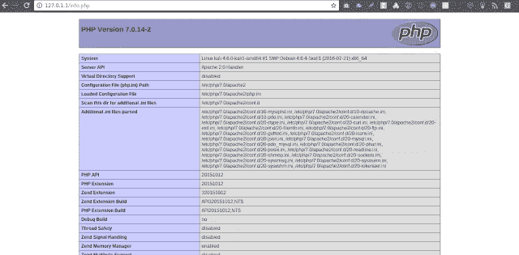

# 如何在 KALI Linux 上安装 LAMP 栈

> 原文：<https://betterprogramming.pub/how-to-install-lamp-stack-on-kali-linux-183fa4f48d16>

LAMP Stack 是一套开源软件，可用于创建网站和 web 应用程序。

LAMP 是一个缩写词，这些堆栈通常包括:

*   **L** inux 操作系统。
*   **一个** pache HTTP 服务器。
*   M ySQL 关系数据库管理系统。
*   **P** 惠普编程语言。

在 Kali Linux 上安装 LAMP 堆栈与 Ubuntu 不同。

要在 KALI Linux 上创建 LAMP 服务器，请执行以下步骤:

1.  更新你的系统。

`sudo apt-get update`

2.安装 Apache2。

`sudo apt-get install apache2`

3.要启动/重新启动/停止 Apache2 服务器:

`$ /etc/init.d/apache2 start/stop/restart`

4.安装 MySQL 并启动服务:

`$ sudo /etc/init.d/mysql start`

`$ sudo mysql_secure_installation`

5.安装 PHP (php7.0 是 PHP 的最新版本)。

`$ sudo apt-get -y install php7.0 libapache2-mod-php7.0`

//重新启动服务器

`$ systemctl restart apache2`

6.检查它是否工作。

`$ cd /var/www/html`

`$ touch info.php`

`$ nano info.php`

在`Info.php`中输入以下代码:

`<?php`

`phpinfo();`

`?>`

保存— `CTRL+O+enter`

退出— `CTRL+X+enter`

7.现在打开浏览器，访问[http://localhost/info . PHP](http://localhost/info.php)。您将看到以下内容:

如果你看到上面的页面，你已经成功地在 KALI linux 上安装了 LAMP 栈。