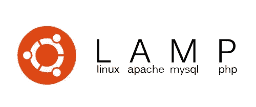

# 如何在 Ubuntu 上安装灯栈

> 原文：<https://betterprogramming.pub/how-to-install-lamp-stack-on-ubuntu-db77ac018116>

## 在你的电脑上安装流行的开源软件

LAMP Stack 是一套开源软件，可用于创建网站和 web 应用程序。LAMP 是一个缩写:这些栈通常由 Linux 操作系统、Apache HTTP 服务器、MySQL 关系数据库管理系统和 PHP 编程语言组成。

要在您的计算机上安装 LAMP，请遵循以下步骤。

## **第一步:更新你的系统**

`sudo apt-get update`

## **第二步:安装 Mysql**

`sudo apt-get install mysql-server mysql-client libmysqlclient-dev`

## **第三步:安装 Apache 服务器**

`sudo [apt](https://www.youtube.com/results?search_query=%23apt)-get install apache2 apache2-doc apache2-npm-prefork apache2-utils libexpat1 ssl-cert`

## **第四步:安装 PHP (php7.0 最新版本的 PHP)**

`*sudo apt-get install libapache2-mod-php7.0 php7.0 php7.0-common php7.0-curl php7.0-dev php7.0-gd php-pear php-imagick php7.0-mcrypt php7.0-mysql php7.0-ps php7.0-xsl*`

## **步骤 5:安装 Phpmyadmin(用于数据库)**

`sudo apt-get install phpmyadmin`